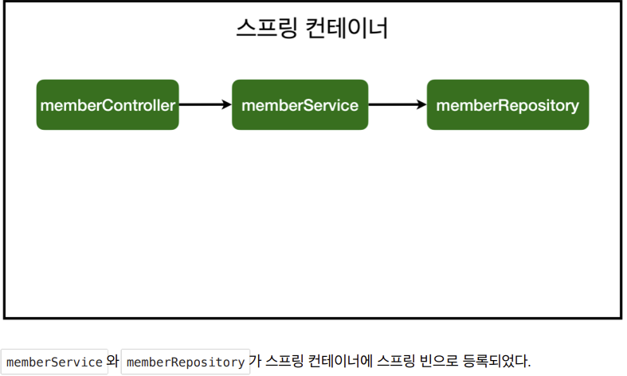

# 1. 컴포넌트 스캔과 자동 의존관계 설정

## MemberController

- Membercontroller 가 MemberService 와  MemoryMemberRepository 를 사용할 수 있게 의존관계 준비

- ```java
  package com.example.hellospring.controller;
  
  import com.example.hellospring.service.MemberService;
  import org.springframework.beans.factory.annotation.Autowired;
  import org.springframework.stereotype.Controller;
  
  @Controller
  public class MemberController {
  
      private final MemberService memberService;
    
      @Autowired
      public MemberController(MemberService memberService) {
          this.memberService = memberService;
      }
  }
  ```

  - 생성자에 @Autowired 가 있으면 스프링이 해당 생성자와 연관된 객체(memberService)를 스프링 컨테이너에서 찾아서 넣어준다. 
  - 이렇게 객체 의존관계를 외부에서 넣어주는 것을 DI (Dependency Injection), 의존성 주입이라 한다. 
  - 이전 테스트에서는 개발자가 직접 주입했고, 여기서는 @Autowired에 의해 스프링이 주입해준다.
  - 싱글톤 패턴으로 딱 하나만 등록된다
    - 따라서 같은 스프링 빈이면 모두 같은 인스턴스다
    - 설정으로 싱글톤이 아니게 설정할 수 있지만, 특별한 경우를 제외하면 대부분 싱글톤을 사용한다.
  - 하지만 이때 MemberService 도 스프링 빈으로 등록되어 있어야 한다.

## MemberService, MemoryMemberRepository

### MemberService

- @Service 어노테이션을 붙여서 스프링 빈으로 관리

### MemoryMemberRepository

- @Repository 어노테이션을 붙여서 스프링 빈으로 관리

## 컴포넌트 스캔원리

- @Component 애노테이션이 있으면 스프링 빈으로 자동 등록된다. 
- @Controller 컨트롤러가 스프링 빈으로 자동 등록된 이유도 컴포넌트 스캔 때문이다.
- @Component 를 포함하는 다음 애노테이션도 스프링 빈으로 자동 등록된다.
  - @Controller @Service @Repository

- 생성자에 @Autowired 를 사용하면 객체 생성 시점에 스프링 컨테이너에서 해당 스프링 빈을 찾아서 주입한다. 
- **생성자가 1개만 있으면 @Autowired 는 생략할 수 있다.**

## 완성된 스프링 빈 등록 이미지

- 


# 2. 자바 코드로 직접 스프링 빈 등록

- 회원 서비스와 회원 리포지토리의 @Service, @Repository, @Autowired 애노테이션을 제거하고 진행한다
- 참고: 실무에서는 주로 정형화된 컨트롤러, 서비스, 리포지토리 같은 코드는 컴포넌트 스캔을 사용한다. 
- 그리고 정형화 되지 않거나, 상황에 따라 구현 클래스를 변경해야 하면 설정을 통해 스프링 빈으로 등록한다.

## SpringConfig

- hello > SpringConfig 클래스 생성

- @Configuration 어노테이션을 붙이고, 스프링 빈으로 등록할 클래스를 @Bean 으로 등

- ```java
  package com.example.hellospring;
  
  import com.example.hellospring.domain.Member;
  import com.example.hellospring.repository.MemberRepository;
  import com.example.hellospring.repository.MemoryMemberRepository;
  import com.example.hellospring.service.MemberService;
  import org.springframework.context.annotation.Bean;
  import org.springframework.context.annotation.Configuration;
  
  @Configuration
  public class SpringConfig {
  
      @Bean
      public MemberService memberService(){
          return new MemberService(memberRepository());
      }
  
      @Bean
      public MemberRepository memberRepository(){
          return new MemoryMemberRepository();
      }
  }
  ```

## DI 주입 방법

### 생성자 주입

- 생성자를 통해 주입
- 의존관계가 실행중에 동적으로 변하는 경우는 거의 없으므로 생성자 주입을 권장한다.

- ```java
  private final MemberService memberService;
  
      //생성자 주입
      @Autowired
      public MemberController(MemberService memberService) {
          this.memberService = memberService;
      }
  ```

### 필드 주입

- 필드에 직접 주입

- ```java
  @Autowired private MemberService memberService;
  ```

### setter 주입

- set 으로 중간에 바꿀 수 있기 때문에 문제가 생길 수 있음

- ```java
  //setter 주입
      private MemberService memberService; //<- final 을 사용하지 않음
  
      @Autowired
      public void setMemberService(MemberService memberService){
          this.memberService = memberService;
      }
  
  ```

  


