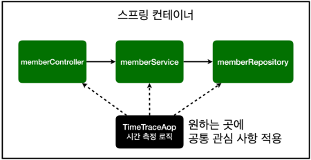
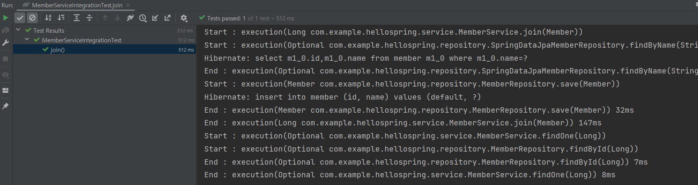
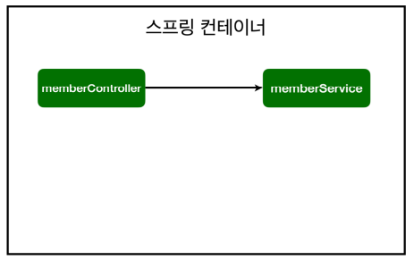
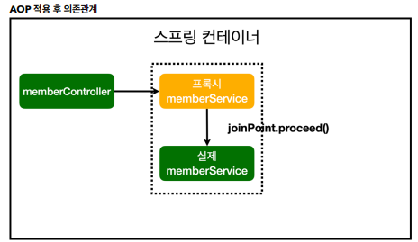
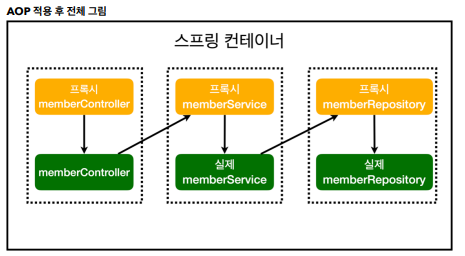

# 1. AOP 가 필요한 상황

- 모든 메소드의 호출 시간을 측정하고 싶다면? 

## 회원 조회 시간 측정 추가

### MemberService 에서 join 메소드 시간측정

```java

public Long join(Member member){
    long start = System.currentTimeMillis();
    try{
        validateDuplicateMember(member);

        memberRepository.save(member);
        return member.getId();
    } finally {
        long finish = System.currentTimeMillis();
        long timeMs = finish - start;
        System.out.println("join = " + timeMs + "ms");
}
```

- start 와 finish 를 각각 메소드 시작과 끝에 System.currentTimeMillis() 로 변수를 설정하여 빼준다.
- 해당 timeMs 를 나타내면 시간이 측정된다.

## 문제점

- 공통 관심 사항(cross-cutting concern) vs 핵심 관심 사항(core concern)
- 회원가입, 회원 조회에 시간을 측정하는 기능은 **핵심 관심 사항이 아니다**.
-  시간을 측정하는 로직은 공통 관심 사항이다. 
- 시간을 측정하는 로직과 핵심 비즈니스의 로직이 섞여서 유지보수가 어렵다. 
- 시간을 측정하는 로직을 별도의 공통 로직으로 만들기 매우 어렵다. 
- 시간을 측정하는 로직을 변경할 때 모든 로직을 찾아가면서 변경해야 한다

# 2. AOP 적용

- AOP: Aspect Oriented Programming 
- 공통 관심 사항(cross-cutting concern) vs 핵심 관심 사항(core concern) 분리
- 

## AOP 예제

- aop.TimeTraceAop.java 생성

- ```java
  package com.example.hellospring.aop;
  
  import org.aspectj.lang.ProceedingJoinPoint;
  import org.aspectj.lang.annotation.Around;
  import org.aspectj.lang.annotation.Aspect;
  import org.springframework.stereotype.Component;
  
  @Aspect
  @Component
  public class TimeTraceAop {
  
      @Around("execution(* com.example.hellospring..*(..))
      public Object execute(ProceedingJoinPoint joinPoint) throws Throwable{
          long start = System.currentTimeMillis();
          System.out.println("Start : " + joinPoint.toString());
  
          try{
              return joinPoint.proceed();
          } finally {
              long finish = System.currentTimeMillis();
              long timeMs = finish - start;
              System.out.println("End : " + joinPoint.toString() + " " + timeMs + "ms");
          }
      }
  }
  ```

  - @Aspect 어노테이션을 등록해야 AOP 로 사용가능하다.
  - @Around 어노테이션을 통해 어디에 적용할 지 설정할 수 있다. 현재는 hellospring 하위 모든 폴더에 적용한다.
  - joinPoint.toString() 을 통해 어떤 메소드가 실행되는지 확인가능하다.

  ### AOP 를 직접 Spring Bean 으로 등록

  - component 스캔을 쓰거나 직접 bean 에 등록해도 되는데, 주로 직접 bean 으로 등록한다.

  - 그 이유는 aop 는 특별하기 때문에 config 에서 aop 가 있는 것을 확인할 수 있게 하는게 좋기 때문이다.

  - SpringConfig 에 Bean 등록

    - ```java
      @Bean
      public TimeTraceAop timeTraceAop(){
          return new TimeTraceAop();
      }
      ```

    - 이 때 순환참조오류가 발생할 수 있다. 왜냐하면 AOP 가 hellospring 하위 모든 폴더에 적용되기 때문에 SpringConfig의 timeTraceAop() 메서드도 AOP로 처리하게 된다.
    - 즉, 바로 자기 자신인 TimeTraceAop를 생성하는 코드가 되어서 순환참조 문제가 발생한다.

  - ```java
    //예외등록
    @Around("execution(* com.example.hellospring..*(..)) && !target(com.example.hellospring.SpringConfig)")
    ```

    - 따라서 hellospring.SpringConfig 는 예외등록이 필요하다.

### 로그

- 

## AOP 장점

- 회원가입, 회원 조회 등 핵심 관심사항과 시간을 측정하는 공통 관심 사항을 분리한다. 
- 시간을 측정하는 로직을 별도의 공통 로직으로 만들었다. 
- 핵심 관심 사항을 깔끔하게 유지할 수 있다. 
- 변경이 필요하면 이 로직만 변경하면 된다. 
- 원하는 적용 대상을 선택할 수 있다.

## 스프링의 AOP 동작 방식 설명

### AOP 적용 전

- 

- AOP 적용전에는 컨트롤러가 바로 memberService 를 호출했다.

### AOP 적용 후

- 

- 컨트롤러가 어디에 적용할 지 지정을 할때 AOP 가 있으면 가짜 memberService (프록시) 를 만든다.
- 가짜 스프링 빈을 앞에 세워놓아 실행한 후 이후 joinPoin.proceed() 을 내부적으로 실행되어 그때 진짜 스프링이 실행된다.

### 전체 적용 큰 그림

- 
