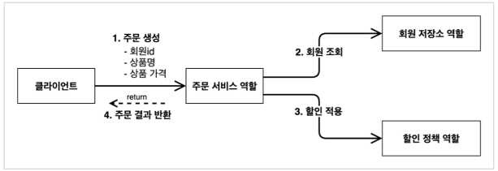
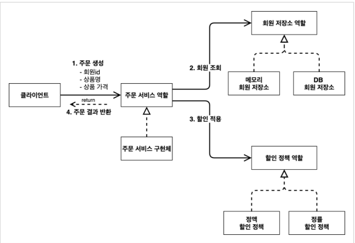
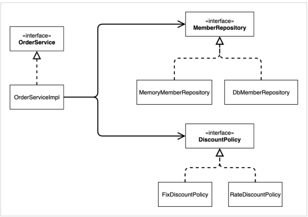

# 1. 주문과 할인 도메인 설계

## 주문과 할인 정책

- 회원은 상품을 주문할 수 있다.
-  회원 등급에 따라 할인 정책을 적용할 수 있다.
-  할인 정책은 모든 VIP는 1000원을 할인해주는 고정 금액 할인을 적용해달라. (나중에 변경 될 수 있다.)
-  할인 정책은 변경 가능성이 높다. 회사의 기본 할인 정책을 아직 정하지 못했고, 오픈 직전까지 고민을 미루고 싶다. 최악의 경우 할인을 적용하지 않을 수 도 있다. (미확정)

## 주문 도메인 협력, 역할, 책임

- 

1. 주문생성 : 클라이언트는 주문 서비스에 주문 생성을 요청한다. 

2. 회원 조회: 할인을 위해서는 회원 등급이 필요하다. 그래서 주문 서비스는 회원 저장소에서 회원을 조회한다.
3. 할인 적용: 주문 서비스는 회원 등급에 따른 할인 여부를 할인 정책에 위임한다.
4. 주문 결과 반환: 주문 서비스는 할인 결과를 포함한 주문 결과를 반환한다.

* 주문 데이터가 DB 에 저장되는거는 미반영

## 주문 도메인 전체

- 

## 주문 도메인 클래스 다이어그램

- 

# 2. 주문과 할인 도메인 개발

## 할인 정책

- 별도 discount 폴더에 넣어둔다.
- 역할의 인터페이스와 구현체 클래스를 따로 만든다.

### DiscountPolicy(할인정책 인터페이스)

- ```java
  package hello.core.discount;
  
  import hello.core.member.Member;
  import hello.core.order.Order;
  
  public interface DiscountPolicy {
      int discount(Member member, int price);
  }
  
  ```

  - 나중에 확장성을 위해 등급이 아니라 Member 전체를 받아둔다.

## FixDiscountPolicy(정액 할인 정책 구현체)

- ```java
  package hello.core.discount;
  
  import hello.core.member.Grade;
  import hello.core.member.Member;
  
  public class FixDiscountPolicy implements DiscountPolicy{
  
      private int discountFixAmount = 1000; //1000원 할인
      @Override
      public int discount(Member member, int price) {
          if(member.getGrade() == Grade.VIP){
              return discountFixAmount;
          }
          return 0;
      }
  }
  ```

  - if 문을 사용하여 member 의 Grade 를 체크한 후 VIP 여부에 따라 discountFixAmount 를 return 한다.

## Order (주문 entity)

- memberId, itemName, itemPrice, discountPrice 를 변수로 가진다.

  - 이는 반환하는 주문결과로써, 변경이 가능하다.

- 할인된 값을 계산하는 calculatePrice() 메소드를 추가한다.

- 보기 편하게 toString() 을 추가한다.

- ```java
  package hello.core.order;
  
  import hello.core.member.Member;
  
  public class Order {
      private Long memberId;
      private String itemName;
      private int itemPrice;
      private int discountPrice;
  
      public Order(Long memberId, String itemName, int itemPrice, int discountPrice) {
          this.memberId = memberId;
          this.itemName = itemName;
          this.itemPrice = itemPrice;
          this.discountPrice = discountPrice;
      }
  
      //계산로직
      public int calculatePrice(){
          return itemPrice - discountPrice;
      }
  
      public Long getMemberId() {
          return memberId;
      }
  
      public void setMemberId(Long memberId) {
          this.memberId = memberId;
      }
  
      public String getItemName() {
          return itemName;
      }
  
      public void setItemName(String itemName) {
          this.itemName = itemName;
      }
  
      public int getItemPrice() {
          return itemPrice;
      }
  
      public void setItemPrice(int itemPrice) {
          this.itemPrice = itemPrice;
      }
  
      public int getDiscountPrice() {
          return discountPrice;
      }
  
      public void setDiscountPrice(int discountPrice) {
          this.discountPrice = discountPrice;
      }
  
      @Override
      public String toString() {
          return "Order{" +
                  "memberId=" + memberId +
                  ", itemName='" + itemName + '\'' +
                  ", itemPrice=" + itemPrice +
                  ", discountPrice=" + discountPrice +
                  '}';
      }
  }
  ```

## OrderService(주문 서비스 인터페이스)

- 설계대로 클라이언트로부터 회원 id, 상품명, 상품 가격을 받아서 주문 결과를 반환한다.

- Service 패키지에 넣었다. (강의에서는 order 패키지에 넣음)

- ```java
  package hello.core.Service;
  
  import hello.core.member.Member;
  import hello.core.order.Order;
  
  public interface OrderService {
      Order createOrder(Long memberId, String itemName, int itemPrice);
  }
  
  ```

## OrderServiceImpl

- 멤버를 호출하기 위한 memberRepository 와 할인정책 구현체은 FixdiscountPolicy 를 사용
- 설계가 잘된 구현체로, 자신이 받은 정보를 그대로 discountPolicy 에 던져준다. 즉, 할인에 관한 것은 다른 구현체에 맡기고, 자신은 Order 를 반환하는 데 집중한다.

- ```java
  package hello.core.Service;
  
  import hello.core.discount.DiscountPolicy;
  import hello.core.discount.FixDiscountPolicy;
  import hello.core.member.Member;
  import hello.core.order.Order;
  import hello.core.repository.MemberRepository;
  import hello.core.repository.MemoryMemberRepository;
  
  public class OrderServiceImpl implements OrderService {
  
      MemberRepository memberRepository = new MemoryMemberRepository();
      DiscountPolicy discountPolicy = new FixDiscountPolicy();
  
      @Override
      public Order createOrder(Long memberId, String itemName, int itemPrice) {
          Member member = memberRepository.findById(memberId);
          int discountPrice = discountPolicy.discount(member, itemPrice);
  
          return new Order(memberId, itemName, itemPrice, discountPrice);
      }
  }
  ```

# 3. 주문과 할인 테스트

## 테스트 케이스

- 서비스 동작을 보기 위해 memberService, orderService 구현

- ```java
  package hello.core.Service;
  
  import hello.core.member.Grade;
  import hello.core.member.Member;
  import hello.core.order.Order;
  import org.junit.jupiter.api.Test;
  import static org.assertj.core.api.Assertions.*;
  
  class OrderServiceImplTest {
  
      MemberService memberService = new MemberServiceImpl();
      OrderService orderService = new OrderServiceImpl();
  
      @Test
      void order() {
          //given
          Member member1 = new Member(1L, "John", Grade.VIP);
          memberService.join(member1);
          Member member2 = new Member(2L, "Bill", Grade.BASIC);
          memberService.join(member2);
  
          //when
          Order order1 = orderService.createOrder(member1.getId(), "Coffee", 10000);
          Order order2 = orderService.createOrder(member2.getId(), "Coffee", 10000);
  
          //then
          assertThat(order1.calculatePrice()).isEqualTo(9000);
          assertThat(order2.calculatePrice()).isEqualTo(10000);
      }
  }
  ```

### 테스트 시 문제점

- 강의 전 혼자 구현해봤을 때,  memberService.join() 으로 DB 에 저장하지 않아서 FixDiscountPolicy 에서 NullPointException 이 떴었다.