# 1. 스프링 컨테이너 생성

- ApplicationContext 를 스프링 컨테이너라 한다. 
- ApplicationContext 는 인터페이스이다. 
- 자바 설정 클래스를 기반으로 스프링 컨테이너( ApplicationContext )를 만들어보자. 
  - new AnnotationConfigApplicationContext(AppConfig.class); 
  - 이 클래스는 ApplicationContext 인터페이스의 구현체이다.

## 스프링 컨테이너 생성

- new AnnotationConfigApplicationContext(AppConfig.class) 생성 시
- 스프링 컨테이너가 생성된다.
- 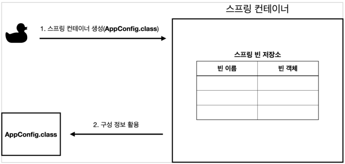

## 스프링 빈 등록

- 스프링 컨테이너는 파라미터로 넘어온 설정 클래스 정보를 사용해서 스프링 빈을 등록한다.
- 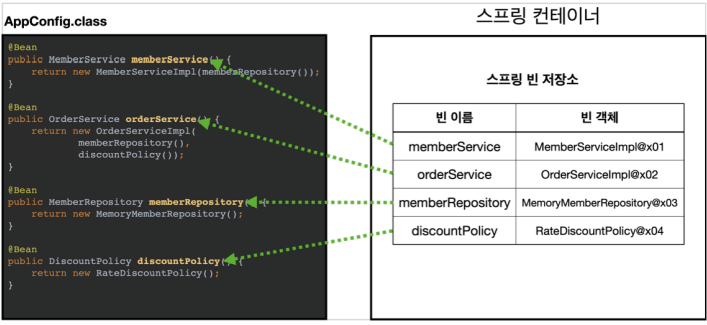

## 스프링 빈 의존관계 설정

- 스프링 컨테이너는 설정 정보를 참고해서 의존관계를 주입(DI)한다.
- 스프링은 빈을 생성하고, 의존관계를 주입하는 단계가 나누어져 있다. 그런데 이렇게 자바 코드로 스프링 빈을 등록하면 생성자를 호출하면서 의존관계 주입도 한번에 처리된다.
- 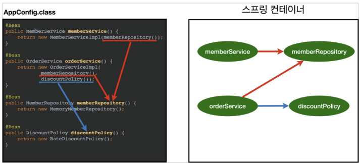

# 2. 컨테이너에 등록된 모든 빈 조회

## 모든 빈 출력하기

- 나중에 getBeanDefinition() 메서드를 사용하야 하는데, 해당 메서드는 GenericApplicationContext가 제공하며 이 클래스를 AnnotationConfigApplicationContext가 상속받아서 사용 가능하므로 AnnotationConfigApplicationContext 는 구현체로 호출한다.

- ```java
  package hello.core.beanFinder;
  
  import hello.core.AppConfig;
  import org.junit.jupiter.api.DisplayName;
  import org.junit.jupiter.api.Test;
  import org.springframework.beans.factory.config.BeanDefinition;
  import org.springframework.context.ApplicationContext;
  import org.springframework.context.annotation.AnnotationConfigApplicationContext;
  
  class ApplicationContextInfoTest {
  
      AnnotationConfigApplicationContext ac = new AnnotationConfigApplicationContext(AppConfig.class);
  
      @Test
      @DisplayName("모든 빈 출력하기")
      void findAllBean(){
          String[] beanDefinitionNames = ac.getBeanDefinitionNames();
          //리스트나 배열이 있으면 iter + tab 하면 for 문이 자동으로 완성됨
          for (String beanDefinitionName : beanDefinitionNames) {
              Object bean = ac.getBean(beanDefinitionName);
              System.out.println("beanDefinitionName = " + beanDefinitionName + " object = " + bean);
          }
      }
  }
  ```

  - ac.getBeanDefinitionNames() : 스프링에 등록된 모든 빈 이름을 조회한다.
  - ac.getBean() : 빈 이름으로 빈 객체(인스턴스)를 조회한다.
  - 조회결과
  - 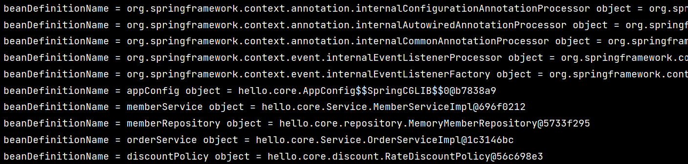

## 애플리케이션 빈 출력하기

- 스프링이 내부에서 사용하는 빈은 제외하고, 등록한 빈만 출력
- 스프링이 내부에서 사용하는 빈은 getRole() 로 구분할 수 있다.
  - ROLE_APPLICATION : 일반적으로 사용자가 정의한 빈
  - ROLE_INFRASTRUCTURE : 스프링이 내부에서 사용하는 빈

- ```JAVA
  class ApplicationContextInfoTest {
  
      AnnotationConfigApplicationContext ac = new AnnotationConfigApplicationContext(AppConfig.class);
  
      @Test
      @DisplayName("앱 빈 출력하기")
      void findApplicationBean(){
          String[] beanDefinitionNames = ac.getBeanDefinitionNames();
          for (String beanDefinitionName : beanDefinitionNames) {
              BeanDefinition beanDefinition = ac.getBeanDefinition(beanDefinitionName);
  
              //내가 등록한 빈
              if(beanDefinition.getRole() == BeanDefinition.ROLE_APPLICATION){
                  Object bean = ac.getBean(beanDefinitionName);
                  System.out.println("beanDefinitionName = " + beanDefinitionName + " object = " + bean);
              }
          }
      }
  }
  ```

  

## TIP ('iter' + tab)

- 리스트나 배열이 변수로 있으면 iter + tab 하면 for 문이 자동으로 완성됨

- ```java
  String[] beanDefinitionNames = ac.getBeanDefinitionNames();
          //리스트나 배열이 있으면 iter + tab 하면 아래와 같은 for 문이 자동으로 완성됨
          for (String beanDefinitionName : beanDefinitionNames) {
           
          }
  
  ```

# 3. 스프링 빈 조회 - 기본

- 스프링 컨테이너에서 스프링 빈을 찾는 가장 기본적인 조회 방법
  - ac.getBean(빈이름, 타입)
  - ac.getBean(타입)
- 조회 대상 스프링 빈이 없으면 예외 발생(NoSuchBeanDefinitionException)

## 빈 이름으로 조회

- ```java
  public class ApplicationConfigApplicationContext {
      AnnotationConfigApplicationContext ac = new AnnotationConfigApplicationContext(AppConfig.class);
  
      @Test
      @DisplayName("빈 이름으로 조회")
      void findBeanByName(){
          MemberService memberService = ac.getBean("memberService", MemberService.class);
          assertThat(memberService).isInstanceOf((MemberServiceImpl.class));
      }
  }
  ```

  - getBean("빈이름", 빈 클래스) 로 조회
  - MemberServiceImpl.class 와 IsInstanceOf 로 비교결과 동일함

## 이름없이 타입으로만 조회

- ```java
  @Test
  @DisplayName("이름 없이 타입으로만 조회")
  //같은 타입이 많을 경우 곤란해짐
  void findBeanByType(){
      MemberService memberService = ac.getBean(MemberService.class);
      assertThat(memberService).isInstanceOf((MemberServiceImpl.class));
  }
  ```

  - getBean(빈 클래스) 로 조회가능하지만, 같은 타입이 많을 경우 곤란

## 구체 타입으로 조회

- ```java
  @Test
  @DisplayName("구체 타입으로 조회")
  void findBeanByName2(){
      //구체적으로 적어도 되지만, 역할과 구현 구분이 되지 않음
      MemberService memberService = ac.getBean("memberService", MemberServiceImpl.class);
      assertThat(memberService).isInstanceOf((MemberServiceImpl.class));
  }
  ```

  - getBean 의 2번째 생성자에 구체적인 클래스로 적어도 되지만, 역할과 구현이 구분되지 않는 문제점이 있다.

## 빈 이름으로 조회(오류)

- ```java
  @Test
  @DisplayName("빈 이름으로 조회")
  void findBeanByNameX(){
      //ac.getBean("xxxx", MemberService.class);
      assertThrows(NoSuchBeanDefinitionException.class, () ->ac.getBean("xxxx", MemberService.class));
  }
  ```

  - junit 의 assertThrows 를 활용하여 람다식으로 NoSuchBeanDefinitionException 오류를 내본다.

# 4. 스프링 빈 조회 - 동일한 타입이 둘 이상

- 스프링 빈을 변경하지 않기 위해 Test 에 임시로 빈 클래스 설정(sameBeanConfig)

## 타입으로 조회 시 같은 타입이 둘 이상 있으면, 중복 오류 발생

- ```java
  AnnotationConfigApplicationContext ac = new AnnotationConfigApplicationContext(SameBeanConfig.class);
  
  @Test
  @DisplayName("타입으로 조회시 같은 타입이 둘 이상 있으면, 중복 오류가 발생한다.")
  void findBeanByTypeDuplicate(){
      assertThrows(NoUniqueBeanDefinitionException.class,
              ()-> ac.getBean(MemberRepository.class));
  }
  
  //임시로 쓰기 위해 만드는 빈 클래스
      @Configuration
      static  class SameBeanConfig{
  
          @Bean
          public MemberRepository memberRepository1(){
              return new MemoryMemberRepository();
          }
          
          @Bean
          public MemberRepository memberRepository2(){
              return new MemoryMemberRepository();
          }
      }
  ```

  - getBean(MemberRepository.class) 사용 시 NoUniqueBeanDefinitionExeption 발생

    

## 빈 이름을 지정하여 타입 중복 해결

- ```java
  @Test
  @DisplayName("타입으로 조회시 같은 타입이 둘 이상 있으면, 빈 이름을 지정하면 된다.")
  void findBeanByName(){
      MemberRepository memberRepository = ac.getBean("memberRepository1", MemberRepository.class);
      assertThat(memberRepository).isInstanceOf(MemberRepository.class);
  }
  ```

  

## 특정 타입 모두 조회

- ```java
  @Test
  @DisplayName("특정 타입을 모두 조회하기")
  void findAllBeanByType() {
      Map<String, MemberRepository> beansOfType = ac.getBeansOfType(MemberRepository.class);
      for (String key : beansOfType.keySet()) {
          System.out.println("key = " + key + "value = " + beansOfType.get(key));
      }
      System.out.println("beansOfType = " + beansOfType);
      assertThat(beansOfType.size()).isEqualTo(2);
  }
  ```

  - ac.getBeansOfType 메서드는 클래스를 생성자로 하여 Map 으로 반환한다.
  - key 는 타입의 이름, value 는 구현체의 스프링 빈 값
    - 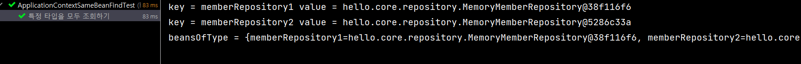

# 5. 스프링 빈 조회 - 상속 관계

- 부모 타입으로 조회하면, 자식 타입도 함께 조회한다. 

- 그래서 모든 자바 객체의 최고 부모인 Object 타입으로 조회하면, 모든 스프링 빈을 조회한다.

- Test 용 config

  - ```java
    public class ApplicationContextExtensFindTest {
    
        AnnotationConfigApplicationContext ac = new AnnotationConfigApplicationContext(TestConfig.class);
        
        @Configuration
        static class TestConfig {
            @Bean
            public DiscountPolicy rateDiscountPolicy() {
                return new RateDiscountPolicy();
            }
    
            @Bean
            public DiscountPolicy fixDiscountPolicy() {
                return new FixDiscountPolicy();
            }
        }
    }
    
    ```

## 부모 타입으로 조회, 자식이 둘 이상 있으면 중복오류

- ```java
  @Test
      @DisplayName("부모 타입으로 조회, 자식이 둘 이상 있으면 중복오류")
      void findBeanByParentTypeDuplicate() {
  //        DiscountPolicy bean = ac.getBean(DiscountPolicy.class);
          assertThrows(NoUniqueBeanDefinitionException.class,
                  () -> ac.getBean(DiscountPolicy.class));
      }
  ```

  - DiscountPolicy 클래스로 조회 시 자식이 둘 이상 있으므로(rateDiscountPolicy, fixDiscountPolicy) NoUniqueBeanDefinitionException 오류가 발생한다.

## 부모 타입으로 조회, 자식이 둘 이상 있으면 빈 이름 지정

- ```java
  @Test
  @DisplayName("부모 타입으로 조회, 자식이 둘 이상 있으면 빈 이름 지정")
  void findBeanByParentTypeBeanName() {
      DiscountPolicy rateDiscountPolicy = ac.getBean("rateDiscountPolicy", DiscountPolicy.class);
      assertThat(rateDiscountPolicy).isInstanceOf(RateDiscountPolicy.class);
  }
  ```


## 특정 하위 타입으로 조회

- ```java
  @Test
  @DisplayName("특정 하위 타입으로 조회")
  void findBeanBySubType(){
      RateDiscountPolicy bean = ac.getBean(RateDiscountPolicy.class);
      assertThat(bean).isInstanceOf(RateDiscountPolicy.class);
  }
  ```

  - 하위타입으로 조회하면 된다

## 부모 타입으로 모두 조회하기

- ```java
  @Test
  @DisplayName("부모 타입으로 모두 조회하기")
  void findAllBeanByParentType() {
      Map<String, DiscountPolicy> beansOfType = ac.getBeansOfType(DiscountPolicy.class);
      assertThat(beansOfType.size()).isEqualTo(2);
      for (String key : beansOfType.keySet()) {
          System.out.println("key = " + key + " value = " + beansOfType.get(key));
      }
  }
  ```

  - getBeanOfType 으로 부모 타입을 가진 자식 모두 조회
  - 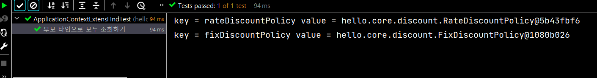

## 부모 타입으로 모두 조회하기 - Object

- 스프링에 등록된 모든 객체 빈이 튀어나온다.

- ```java
  @Test
  @DisplayName("부모 타입으로 모두 조회하기 - Object")
  void findAllBeanByObjectType() {
      Map<String, Object> beansOfType = ac.getBeansOfType(Object.class);
      for (String key : beansOfType.keySet()) {
          System.out.println("key = " + key + " value = " + beansOfType.get(key));
      }
  }
  ```

- 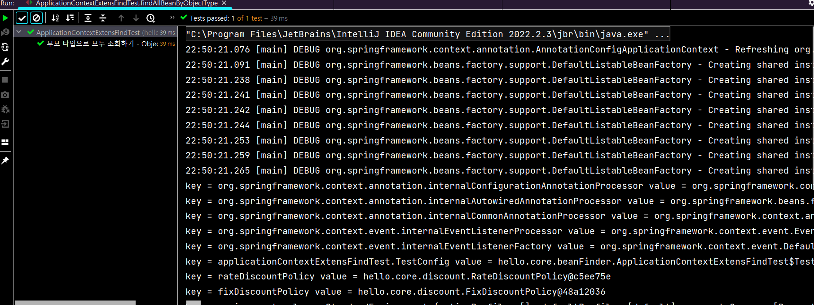

  - 자세히 보면 rateDiscountPolicy 와 fixDiscountPolicy 도 밑에 있음

# 6. BeanFactory 와 ApplicationContext

- 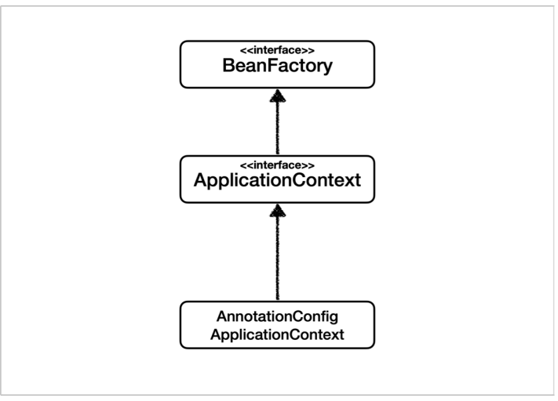

## BeanFactory

- 스프링 컨테이너의 최상위 인터페이스다. 
- 스프링 빈을 관리하고 조회하는 역할을 담당한다. 
- getBean() 을 제공한다. 
- 지금까지 우리가 사용했던 대부분의 기능은 BeanFactory가 제공하는 기능이다.

## ApplicationContext

- BeanFactory 기능을 모두 상속받아서 제공한다. 
- 빈을 관리하고 검색하는 기능을 BeanFactory가 제공하지만 ApplicationContext 는 어플리케이션을 개발할 때 필요한 빈을 관리하고 조회하는 기능은 물론이고, 수 많은 부가기능을 추가로 제공한다

### ApplicationContext 가 제공하는 부가기능

- 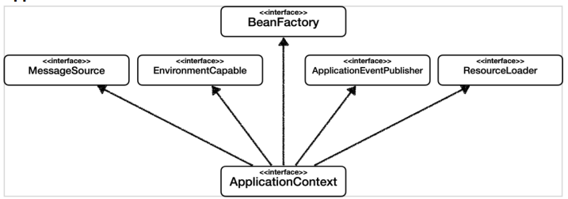

- MessageSource : 메시지소스를 활용한 국제화 기능
  - 예를 들어서 한국에서 들어오면 한국어로, 영어권에서 들어오면 영어로 출력
- EnvironmentCapable : 환경변수
  - 로컬, 개발, 운영등을 구분해서 처리
- ApplicationEventPublisher
  - 이벤트를 발행하고 구독하는 모델을 편리하게 지원
- ResourceLoader
  - 파일, 클래스패스, 외부 등에서 리소스를 편리하게 조회

## 정리

- ApplicationContext는 BeanFactory의 기능을 상속받는다. 
- ApplicationContext는 빈 관리기능 + 편리한 부가 기능을 제공한다. 
- BeanFactory를 직접 사용할 일은 거의 없다. 부가기능이 포함된 ApplicationContext를 사용한다. 
- BeanFactory나 ApplicationContext를 스프링 컨테이너라 한다.

# 7. 다양한 설정 형식 지원 - 자바 코드, XML

- 스프링 컨테이너는 다양한 형식의 설정 정보를 받아드릴 수 있게 유연하게 설계되어 있다. 

  - 자바 코드, XML, Groovy 등등
  - 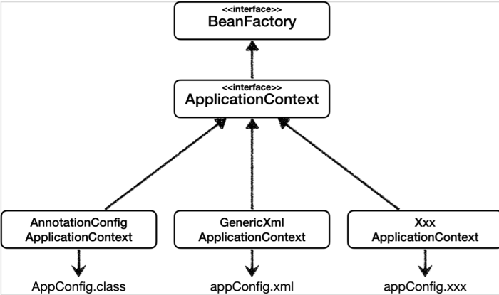

  - 하지만 스프링 부트를 많이 사용하면서 XML 기반의 설정은 잘 사용하지 않는다.
  - GenericXmlApplicationContext 를 사용하면서 xml 설정 파일을 넘기면 된다.

## XmlAppConfig 사용 자바 코드(Test)

- ```java
  package hello.core.xml;
  
  public class XmlAppContext {
  
      @Test
      void xmlAppContext() {
          ApplicationContext ac = new GenericXmlApplicationContext("appConfig.xml");
          MemberService memberService = ac.getBean("memberService", MemberService.class);
          assertThat(memberService).isInstanceOf(MemberService.class);
  
      }
  }
  
  ```

  - GenericXmlApplicationContext 사용

## xml 기반의 스프링 빈 설정 정보

- main.resources.appConfig.xml

- ```java
  <?xml version="1.0" encoding="UTF-8"?>
  <beans xmlns="http://www.springframework.org/schema/beans"
         xmlns:xsi="http://www.w3.org/2001/XMLSchema-instance"
             xsi:schemaLocation="http://www.springframework.org/schema/beans http://www.springframework.org/schema/beans/spring-beans.xsd">
     //memberService 빈, MemberServiceImpl 구현체 사용
      <bean id="memberService" class="hello.core.service.MemberServiceImpl">
          // 생성자로 memberRepository 를 사용
          <constructor-arg name="memberRepository" ref="memberRepository" />
      </bean>
  	//memberRepository 빈, MemoryMemberRepository 구현체 사용
      <bean id="memberRepository"
            class="hello.core.repository.MemoryMemberRepository" />
  
    	//orderServie 빈, OrderServiceImpl 구현체 사용 
      <bean id="orderService" class="hello.core.service.OrderServiceImpl">
          //생성자로 memberRepository, discountPolicy 사용
          <constructor-arg name="memberRepository" ref="memberRepository" />
          <constructor-arg name="discountPolicy" ref="discountPolicy" />
      </bean>
  	//discountPolicy 빈, RateDiscountPolicy 구현체 사용
      <bean id="discountPolicy" class="hello.core.discount.RateDiscountPolicy" />
  </beans>
  ```

# 8. 스프링 빈 설정 메타 정보 - BeanDefinition

- 스프링은 XML, 자바코드 등을 BeanDefinition 으로 만들어진 메타정보를 읽어서 스프링 빈을 만든다.
- BeanDefinition 을 빈 설정 메타정보라 한다. 
  - @Bean , <bean> 당 각각 하나씩 메타 정보가 생성된다

- 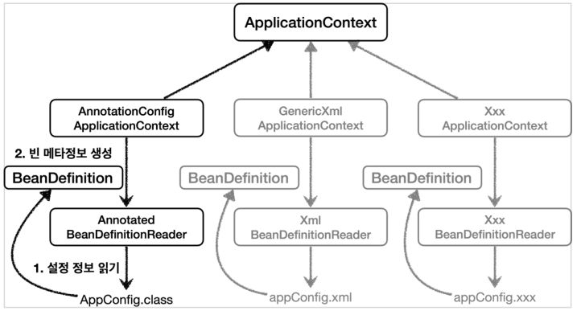

- AnnotationConfigApplicationContext 는 AnnotatedBeanDefinitionReader 를 사용해서 AppConfig.class 를 읽고 BeanDefinition 을 생성한다.
- GenericXmlApplicationContext 는 XmlBeanDefinitionReader 를 사용해서 appConfig.xml 설정 정보를 읽고 BeanDefinition 을 생성한다.
- 새로운 형식의 설정 정보가 추가되면, XxxBeanDefinitionReader를 만들어서 BeanDefinition 을 생성하면 된다.

## BeanDefinition 정보

### 정보 확인을 위한 Test

- ```java
  public class BeanDefinitionTest {
  
      //자바코드를 가지고 빈을 등록하는 방법은 팩토리 메서드를 통해서 등록하는 방법임
      AnnotationConfigApplicationContext ac = new AnnotationConfigApplicationContext(AppConfig.class);
  //    GenericXmlApplicationContext ac = new GenericXmlApplicationContext("appConfig.xml");
  
      @Test
      @DisplayName("빈 설정 메타정보 확인")
      void findApplicationBean() {
          String[] beanDefinitionNames = ac.getBeanDefinitionNames();
          for (String beanDefinitionName : beanDefinitionNames) {
              BeanDefinition beanDefinition = ac.getBeanDefinition(beanDefinitionName);
  
              if (beanDefinition.getRole() == BeanDefinition.ROLE_APPLICATION) {
                  System.out.println("beanDefinitionName = " + beanDefinitionName +
                          " beanDifinition = " + beanDefinition);
              }
  
          }
      }
  }
  
  ```

- 

### BeanDefinition 정보

- BeanClassName: 생성할 빈의 클래스 명(자바 설정 처럼 팩토리 역할의 빈을 사용하면 없음)
- factoryBeanName: 팩토리 역할의 빈을 사용할 경우 이름, 예) appConfig 
- factoryMethodName: 빈을 생성할 팩토리 메서드 지정, 예) memberService 
- Scope: 싱글톤(기본값) 
- lazyInit: 스프링 컨테이너를 생성할 때 빈을 생성하는 것이 아니라, 실제 빈을 사용할 때 까지 최대한 생성을 지연처리 하는지 여부 
- InitMethodName: 빈을 생성하고, 의존관계를 적용한 뒤에 호출되는 초기화 메서드 명 
- DestroyMethodName: 빈의 생명주기가 끝나서 제거하기 직전에 호출되는 메서드 명 
- Constructor arguments, Properties: 의존관계 주입에서 사용한다. (자바 설정 처럼 팩토리 역할의 빈을 사용하면 없음)

