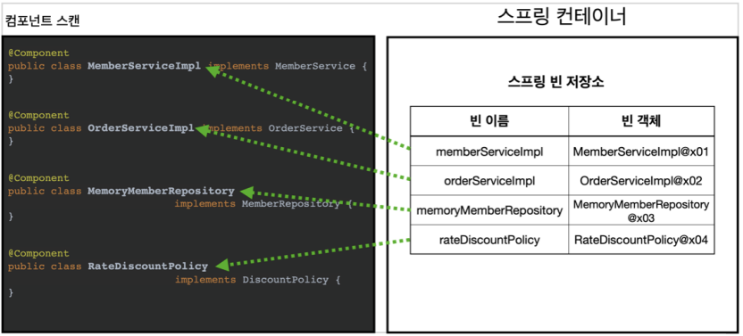
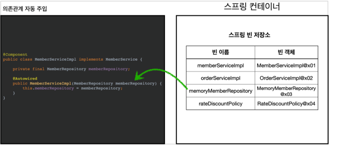

# 1. 컴포넌트 스캔과 의존관계 자동 주입

- 스프링은 설정 정보(AppConfig)가 없어도 자동으로 스프링 빈을 등록하는 컴포넌트 스캔이라는 기능을 제공한다.
- 또 의존관계도 자동으로 주입하는 @Autowired 라는 기능도 제공한다.

## AutoAppConfig.java

- 컴포넌트 스캔 사용하는 Config

- ```java
  package hello.core;
  
  import org.springframework.context.annotation.ComponentScan;
  import org.springframework.context.annotation.Configuration;
  import org.springframework.context.annotation.FilterType;
  
  @Configuration
  @ComponentScan(
          //뺄거 지정 // @Configuration 을 뺀다. // 예제코드를 살리기 위해서임
          excludeFilters = @ComponentScan.Filter(type = FilterType.ANNOTATION, classes = Configuration.class)
  )
  public class AutoAppConfig {
  }
  
  ```

  - excudeFilters 는 원래 안써도 되지만, 다른 예제코드들에 있는 @Configuration 을 빼기 위해 설정한 것이다.
  - 기존의 AppConfig와는 다르게 @Bean으로 등록한 클래스가 하나도 없다.

### @ComponentScan

- 컴포넌트 스캔은 이름 그대로 @Component 애노테이션이 붙은 클래스를 스캔해서 스프링 빈으로 등록한다.
- @Configuration 이 컴포넌트 스캔의 대상이 된 이유도 @Configuration 소스코드를 열어보면 @Component 애노테이션이 붙어있기 때문이다.

### 각 클래스에 @Component 추가

- MemoryMemberRepository, RateDiscountPolicy, MemberServiceImpl, OrderServiceImpl 에 추가

### ComponentScan 설명

- 

- @ComponentScan 은 @Component 가 붙은 모든 클래스를 스프링 빈으로 등록한다.
- 이때 스프링 빈의 기본 이름은 클래스명을 사용하되 맨 앞글자만 소문자를 사용한다. 
- 빈 이름 기본 전략: MemberServiceImpl 클래스 -> memberServiceImpl 
- 빈 이름 직접 지정: 만약 스프링 빈의 이름을 직접 지정하고 싶으면 @Component("memberService2") 이런식으로 이름을 부여하면 된다.

## Autowired (의존관계 자동주입)

- 각 Component 가 가진 의존관계를 자동으로 주입해준다.

### MemberServiceImpl

- 생성자에 @Autowired 를 붙여서 의존관계를 자동주입한다.
- ac.getBean(MemberRepository.class) 와 비슷하게 동작한다고 생각하면 된다.

- ```java
  ackage hello.core.service;
  
  import hello.core.member.Member;
  import hello.core.repository.MemberRepository;
  import org.springframework.beans.factory.annotation.Autowired;
  import org.springframework.stereotype.Component;
  
  @Component
  public class MemberServiceImpl implements MemberService{
  
      private final MemberRepository memberRepository;
  
      @Autowired
      public MemberServiceImpl(MemberRepository memberRepository) {
          this.memberRepository = memberRepository;
      }
  
      @Override
      public void join(Member member) {
          memberRepository.save(member);
      }
  
      @Override
      public Member findMember(Long memberId) {
          return memberRepository.findById(memberId);
      }
  
      //test 용
      public MemberRepository getMemberRepository(){
          return memberRepository;
      }
  }
  ```

- RateDiscountPolicy, OrderServiceImpl 에도 동일하게 적용한다. 즉, 생성자를 주입받아야 하는 모든 스프링 빈에 @Autowired 를 통해 자동주입한다.

### @Autowired 설명

- 

- 생성자에 @Autowired 를 지정하면, 스프링 컨테이너가 자동으로 해당 스프링 빈을 찾아서 주입한다. 
- 이때 기본 조회 전략은 타입이 같은 빈을 찾아서 주입한다.
  -  getBean(MemberRepository.class) 와 동일하다고 이해하면 된다.

# 2. 탐색 위치와 기본스캔대상(basePackages)

## basePackages 사용

- 컴포넌트 스캔을 할 때 사용하면 해당 패키지와 그 하위 패키지를 탐색한다.

- basePackages = {"hello.core", "hello.service"} 이렇게 여러 시작 위치를 지정할 수도 있다.

- ```java
  @Configuration
  @ComponentScan(
          //지정하지 않으면 자신의 패키지와 그 하위 패키지만 확인
          basePackages = "hello.core.service",
          excludeFilters = @ComponentScan.Filter(type = FilterType.ANNOTATION, classes = Configuration.class)
  )
  public class AutoAppConfig {
  }
  ```

- basePackageClasses : 지정한 클래스의 패키지를 탐색 시작 위치로 지정한다.
- 기본적으로 default 값이 현재 패키지가 기준이기 때문에 @ComponentScan 은 프로젝트 시작 루트 위치에 두는 것이 좋다.

## 컴포넌트 스캔 기본 대상

- 컴포넌트 스캔은 @Component 뿐만 아니라 다음과 내용도 추가로 대상에 포함한다.
  - @Component : 컴포넌트 스캔에서 사용 
  - @Controlller : 스프링 MVC 컨트롤러에서 사용 
  - @Service : 스프링 비즈니스 로직에서 사용 
  - @Repository : 스프링 데이터 접근 계층에서 사용 
  - @Configuration : 스프링 설정 정보에서 사용
-  사실 애노테이션에는 상속관계라는 것이 없다. 그래서 이렇게 애노테이션이 특정 애노테이션을 들고 있는 것을 인식할 수 있는 것은 자바 언어가 지원하는 기능은 아니고, 스프링이 지원하는 기능이다.
- 컴포넌트 스캔의 용도 뿐만 아니라 다음 애노테이션이 있으면 스프링은 부가 기능을 수행한다. 
  - @Controller : 스프링 MVC 컨트롤러로 인식 
  - @Repository : 스프링 데이터 접근 계층으로 인식하고, 데이터 계층의 예외를 스프링 예외로 변환해준다. 
  - @Configuration : 앞서 보았듯이 스프링 설정 정보로 인식하고, 스프링 빈이 싱글톤을 유지하도록 추가 처리를 한다. 
  - @Service : 사실 @Service 는 특별한 처리를 하지 않는다. 대신 개발자들이 핵심 비즈니스 로직이 여기에 있겠구나 라고 비즈니스 계층을 인식하는데 도움이 된다.

# 3. 필터

- includeFilters : 컴포넌트 스캔 대상을 추가로 지정한다. 
- excludeFilters : 컴포넌트 스캔에서 제외할 대상을 지정한다.

## 어노테이션 생성

- 모든 클래스는 test 에 hello.core.scan.filter 에 만든다.

### MyIncludeComponent

- ```java
  package hello.core.scan.filter;
  
  import java.lang.annotation.*;
  
  @Target(ElementType.TYPE)
  @Retention(RetentionPolicy.RUNTIME)
  @Documented
  public @interface MyIncludeComponent {
  }
  ```

### MyExcludeComponent

- ```java
  package hello.core.scan.filter;
  
  import java.lang.annotation.*;
  
  @Target(ElementType.TYPE)
  @Retention(RetentionPolicy.RUNTIME)
  @Documented
  public @interface MyExcludeComponent {
  }
  ```

## 예제 클래스 생성

- BeanA 와 BeanB 생성

- ```java
  package hello.core.scan.filter;
  
  @MyIncludeComponent
  public class BeanA {
  }
  ```

- ```java
  package hello.core.scan.filter;
  
  @MyExcludeComponent
  public class BeanB {
  }
  ```

## 컴포넌트 필터 테스트

- ```java
  package hello.core.scan.filter;
  
  import ...;
  
  public class ComponentFilterAppConfigTest {
  
      @Test
      void filterScan() {
          AnnotationConfigApplicationContext ac = new AnnotationConfigApplicationContext(ComponnentFilterConfig.class);
          BeanA beanA = ac.getBean(BeanA.class);
          assertThat(beanA).isNotNull();
  
          assertThrows(NoSuchBeanDefinitionException.class, () -> ac.getBean(BeanB.class));
      }
  
      @Configuration
      @ComponentScan(
              //원래는 @Component.Filter 인데 @Component 는 static import 가능
              includeFilters = @ComponentScan.Filter(type = FilterType.ANNOTATION, classes = MyIncludeComponent.class),
              excludeFilters = @Filter(type = FilterType.ANNOTATION, classes = MyExcludeComponent.class)
      )
      static class ComponnentFilterConfig{
  
      }
  }
  ```

- BeanA 는 includeFilters 로  MyIncludeComponent.class 를 포함시켰기 때문에 컴포넌트 스캔에 탐색이 된다.
- BeanB 는 반대로 excludeFilters 로 제외했기 때문에 안된다.

## FilterType 옵션

- ANNOTATION: 기본값, 애노테이션을 인식해서 동작한다. 

  - ex) org.example.SomeAnnotation

-  ASSIGNABLE_TYPE: 지정한 타입과 자식 타입을 인식해서 동작한다. 

  - ex) org.example.SomeClass

  - 아래와 같이 하면 BeanA도 빠다. 

  - ```java
     excludeFilters = {
     @Filter(type = FilterType.ANNOTATION, classes =
    MyExcludeComponent.class),
     @Filter(type = FilterType.ASSIGNABLE_TYPE, classes = BeanA.class)
     }
    ```

- ASPECTJ: AspectJ 패턴 사용 

  - ex) org.example..*Service+

- *REGEX: 정규 표현식 *

  - *ex) org\.example\.Default.* 

- CUSTOM: TypeFilter 이라는 인터페이스를 구현해서 처리 

  - ex) org.example.MyTypeFilter

# 4. 스프링 빈 중복 등록과 충돌

## 자동 빈 등록 vs 자동 빈 등록

- 스프링은 ConflictingBeanDefinitionException 예외를 발생시킨다.

## 수동 빈 등록 vs 자동 빈 등록

- AutoAppConfig 에 수동 빈 등록(memoryMemberRepository)

- ```java
  public class AutoAppConfig {
      @Bean(name = "memoryMemberRepository")
      public MemberRepository memberRepository() {
      	return new MemoryMemberRepository();
      }
  }
  ```

- 다음과 같은 로그를 남기며 수동 빈이 자동빈을 오버라이딩한다.
  - Overriding bean definition for bean 'memoryMemberRepository' with a different definition: replacing
- 스프링 부트에서는 수동 빈 등록과 자동 빈 등록이 충돌나면 오류가 발생하도록 기본 값을 바꾸었다.
  - 스프링 부트인 CoreApplication 을 실행해보면 오류를 볼 수 있다.
  - 이 때 application .properties 에서 spring.main.allow-bean-definition-overriding=true 으로 설정하면 오류가 발생하지 않는다.

