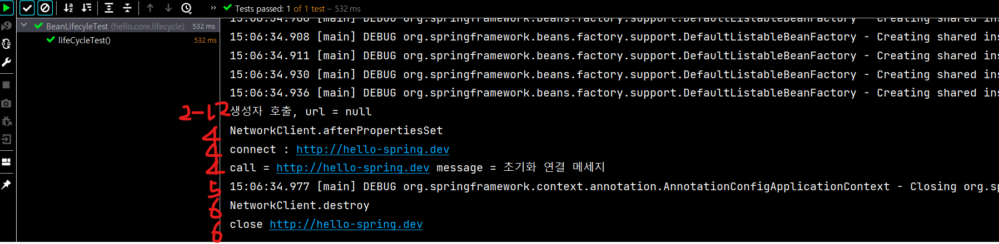
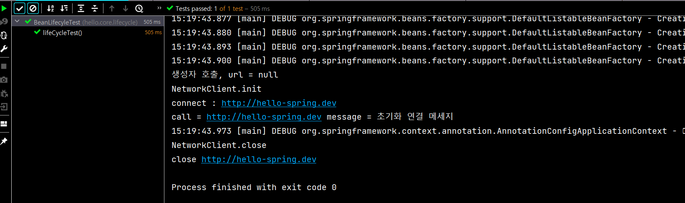

# 1. 빈 생명주기 콜백 시작

- 데이터베이스 커넥션 풀이나, 네트워크 소켓처럼 애플리케이션 시작 시점에 필요한 연결을 미리 해두고, 애플리케이션 종료 시점에 연결을 모두 종료하는 작업을 진행하려면, 객체의 초기화와 종료 작업이 필요하다.
- 스프링 빈은 다음과 같은 이벤트 라이프 사이클을 가진다.
  - **스프링 컨테이너 생성 -> 스프링 빈 생성(생성자 DI 는 이때 발생) -> 의존관계 주입 -> 초기화 콜백 -> 사용 -> 소멸전 콜백 -> 스프링 종료**

## 콜백이 필요한 이유

- 개발자가 의존관계 주입이 모두 완료된 시점을 어떻게 알기 위해서이다.
- 객체의 생성과 초기화를 분리 필요성
  - 생성자는 필수 정보(파라미터)를 받고, 메모리를 할당해서 객체를 생성하는 책임을 가진다. 
  - 반면에 초기화는 이렇게 생성된 값들을 활용해서 외부 커넥션을 연결하는등 무거운 동작을 수행한다. 
  - 따라서 생성자 안에서 무거운 초기화 작업을 함께 하는 것 보다는 객체를 생성하는 부분과 초기화 하는 부분을 명확하게 나누는 것이 유지보수 관점에서 좋다. 
  - 물론 초기화 작업이 내부 값들만 약간 변경하는 정도로 단순한 경우에는 생성자에서 한번에 다 처리하는게 더 나을 수 있다.

## 빈 생명주기 콜백 지원

- 인터페이스(InitializingBean, DisposableBean) 
- 설정 정보에 초기화 메서드, 종료 메서드 지정 
- @PostConstruct, @PreDestroy 애노테이션 지원

# 2.  인터페이스(InitializingBean, DisposableBean) 

- 인터페이스를 사용하는 초기화, 종료 방법은 스프링 초창기에 나온 방법들이고, 지금은 다음의 더 나은 방법들이 있어서 거의 사용하지 않는다.

## 예제

- InitializingBean, DisposableBean 인터페이스를 상속받아 사용한다. (주석 확인)

- ```java
  package hello.core.lifecycle;
  
  import org.springframework.beans.factory.DisposableBean;
  import org.springframework.beans.factory.InitializingBean;
  
  public class NetworkClient implements InitializingBean, DisposableBean {
  
      private String url;
  
      public NetworkClient() {
          System.out.println("생성자 호출, url = " + url);
      }
  
      public void setUrl(String url) {
          this.url = url;
      }
  
      //서비스 시작 시 호출
      public void connect(){
          System.out.println("connect : " + url);
      }
  
      public void call(String message){
          System.out.println("call = " + url + " message = " + message);
      }
  
      //서비스 종료 시 호출
      public void disconnect(){
          System.out.println("close " + url);
      }
  
      @Override
      //의존관계주입(PropertiesSet)이 끝나면 호출해주겠다
      public void afterPropertiesSet() throws Exception {
          System.out.println("NetworkClient.afterPropertiesSet");
          connect();
          call("초기화 연결 메세지");
      }
  
      @Override
      //종료 콜백
      public void destroy() throws Exception {
          System.out.println("NetworkClient.destroy");
          disconnect();
      }
  }
  ```

## 예제 테스트

- ```java
  package hello.core.lifecycle;
  
  import org.junit.jupiter.api.Test;
  import org.springframework.context.ApplicationContext;
  import org.springframework.context.ConfigurableApplicationContext;
  import org.springframework.context.annotation.AnnotationConfigApplicationContext;
  import org.springframework.context.annotation.Bean;
  import org.springframework.context.annotation.Configuration;
  
  public class BeanLifecyleTest {
  
      @Test
      public void lifeCycleTest(){
          ConfigurableApplicationContext ac = new AnnotationConfigApplicationContext(LifecycleConfig.class);
          NetworkClient client = ac.getBean(NetworkClient.class);
          ac.close();
      }
  
      @Configuration
      static class LifecycleConfig{
  
          @Bean
          public NetworkClient networkClient(){
              NetworkClient networkClient = new NetworkClient();
              networkClient.setUrl("http://hello-spring.dev");
              return networkClient;
          }
      }
  }
  ```

  1. 스프링 컨터너 생성
  2. 스프링 빈 생성
     1. 빈 생성자 호출
     2. setUrl
  3. 의존관계 주입
  4. 초기화 콜백 : afterPropertiesSet()
  5. 사용
  6. 소멸 전 콜백 : destroy()
  7. 스프링 종료

- 

## 초기화, 소멸 인터페이스 단점

- 이 인터페이스는 스프링 전용 인터페이스다. 해당 코드가 스프링 전용 인터페이스에 의존한다. 
- 초기화, 소멸 메서드의 이름을 변경할 수 없다. 
- 내가 코드를 고칠 수 없는 외부 라이브러리에 적용할 수 없다.

# 3. 빈 등록 초기화, 소멸 메서드 지정

- 설정 정보에 @Bean(initMethod = "init", destroyMethod = "close") 처럼 초기화, 소멸 메서드를 지정할 수 있다.

## 예제 코드

- NetworkClient 에는 따로 설정할 필요 없다.

- ```java
  ...
  public void init() {
       System.out.println("NetworkClient.init");
       connect();
       call("초기화 연결 메시지");
   }
  
   public void close() {
       System.out.println("NetworkClient.close");
       disConnect();
   }
  }
  ```

## 테스트 코드

- ```java
  ...
  @Configuration
  static class LifecycleConfig{
  
      @Bean(initMethod = "init", destroyMethod = "close")
      public NetworkClient networkClient(){
          NetworkClient networkClient = new NetworkClient();
          networkClient.setUrl("http://hello-spring.dev");
          return networkClient;
      }
  }
  ```

  - @Bean 설정으로 initMethod 와 destroyMethod 를 설정하여 해당 클래스의 동일 메서드를 실행시킬 수 있다.

### 결과

- 

### 종료 메서드 추론

- @Bean의 destroyMethod 는 기본값이 (inferred) (추론)으로 등록되어 있다.
- 이 추론 기능은 close , shutdown 라는 이름의 메서드를 자동으로 호출해준다. 이름 그대로 종료 메서드를 추론해서 호출해준다. 
- 따라서 직접 스프링 빈으로 등록하면 종료 메서드는 따로 적어주지 않아도 잘 동작한다. 
- 추론 기능을 사용하기 싫으면 destroyMethod="" 처럼 빈 공백을 지정하면 된다.

## 특징

- 메서드 이름을 자유롭게 줄 수 있다. 
- 스프링 빈이 스프링 코드에 의존하지 않는다. 
- 코드가 아니라 설정 정보를 사용하기 때문에 코드를 고칠 수 없는 외부 라이브러리에도 초기화, 종료 메서드를 적용할 수 있다

# 4. 어노테이션 @PostConstruct, @PreDestroy

- **위에 2개 필요없이 이것만 쓰면 된다!**

- 초기화 및 소멸 전 콜백에 어노테이션을 붙여서 간단하게 사용이 가능하다.

- ```java
  @PostConstruct
      public void init() {
          System.out.println("NetworkClient.init");
          connect();
          call("초기화 연결 메세지");
      }
  
      @PreDestroy
      public void close() {
          System.out.println("NetworkClient.close");
          disconnect();
      }
  ```

- 테스트 코드 실행결과는 똑같음

## @PostConstruct, @PreDestroy 노테이션 특징

- 최신 스프링에서 가장 권장하는 방법이다. 
- 어노테이션 하나만 붙이면 되므로 매우 편리하다. 
- 패키지를 잘 보면 `javax.annotation.PostConstruct` 이다. 스프링에 종속적인 기술이 아니라 JSR-250 라는 자바 표준이다. 따라서 스프링이 아닌 다른 컨테이너에서도 동작한다. 
- 컴포넌트 스캔과 잘 어울린다. 
- 유일한 단점은 외부 라이브러리에는 적용하지 못한다는 것이다. 외부 라이브러리를 초기화, 종료 해야 하면 @Bean의 기능(initMethod , destroyMethod)을 사용하자.

