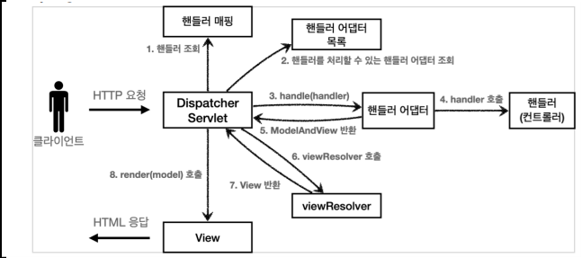
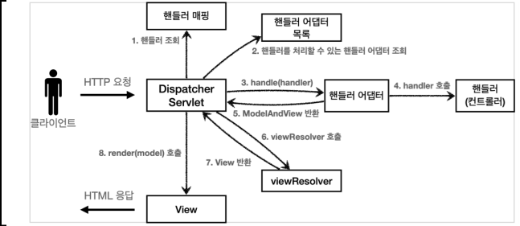
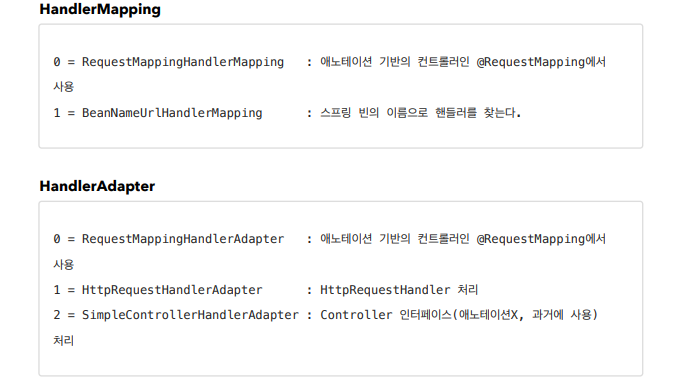
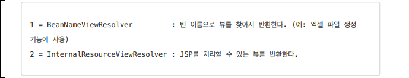

# 0. 스프링 MVC 전체 구조

- 

## 동작 순서 

		1. 핸들러 조회: 핸들러 매핑을 통해 요청 URL에 매핑된 핸들러(컨트롤러)를 조회한다. 
		1. 핸들러 어댑터 조회: 핸들러를 실행할 수 있는 핸들러 어댑터를 조회한다. 
		1. 핸들러 어댑터 실행: 핸들러 어댑터를 실행한다. 
		1. 핸들러 실행: 핸들러 어댑터가 실제 핸들러를 실행한다. 
		1. ModelAndView 반환: 핸들러 어댑터는 핸들러가 반환하는 정보를 ModelAndView로 변환해서 반환한다. 
		1. viewResolver 호출: 뷰 리졸버를 찾고 실행한다. JSP의 경우: InternalResourceViewResolver 가 자동 등록되고, 사용된다. 
		1. View 반환: 뷰 리졸버는 뷰의 논리 이름을 물리 이름으로 바꾸고, 렌더링 역할을 담당하는 뷰 객체를 반환한다. JSP의 경우 InternalResourceView(JstlView) 를 반환하는데, 내부에 forward() 로직이 있다.
		1. 뷰 렌더링: 뷰를 통해서 뷰를 렌더링 한

## 주요 인터페이스 목록

- 핸들러 매핑: org.springframework.web.servlet.HandlerMapping 
- 핸들러 어댑터: org.springframework.web.servlet.HandlerAdapter 
- 뷰 리졸버: org.springframework.web.servlet.ViewResolver 
- 뷰: org.springframework.web.servlet.View


# 1. 핸들러 매핑과 핸들러 어댑터

- 과거에 사용했던 간단한 컨트롤러로 핸들러 매핑과 어댑터를 이해해본다.

## Controller 인터페이스

- 과거 버전 스프링 컨트롤러
- `org.springframework.web.servlet.mvc.Controller`

- ```java
  public interface Controller {
      ModelAndView handleRequest(HttpServletRequest request, HttpServletResponse
      response) throws Exception;
  }
  ```

### OldController

- ```java
  package hello.servlet.web.springmvc.old;
  
  import jakarta.servlet.http.HttpServletRequest;
  import jakarta.servlet.http.HttpServletResponse;
  import org.springframework.stereotype.Component;
  import org.springframework.web.servlet.ModelAndView;
  import org.springframework.web.servlet.mvc.Controller;
  
  //스프링 이름을 url 형식으로 맞추면 호출이 됨
  @Component("/springmvc/old-controller")
  public class OldController implements Controller {
      @Override
      public ModelAndView handleRequest(HttpServletRequest request, HttpServletResponse response) throws Exception {
          System.out.println("OldController.handleRequest");
          return null;
      }
  }
  ```

  - @Component : 이 컨트롤러는 /springmvc/old-controller 라는 이름의 스프링 빈으로 등록되었다. 
  - 빈의 이름으로 URL을 매핑할 것이다.

### 이 컨트롤러는 어떻게 호출될 수 있을까?

#### 스프링 MVC 구조

- 

- 이 핸들러가 호출되려면 핸들러 매핑과 핸들러 어댑터가 필요하다.

#### 스프링 부트가 자동 등록하는 핸들러 매핑과 핸들러 어댑터

- 

- 핸들러 매핑도, 핸들러 어댑터도 모두 순서대로 찾고 만약 없으면 다음 순서로 넘어간다.

#### 호출 순서

1. 핸들러 매핑으로 핸들러 조회

   1. HandlerMapping 을 순서대로 실행해서, 핸들러를 찾는다.
   2. 이 경우 빈 이름으로 핸들러를 찾아야 하기 때문에 이름 그대로 빈 이름으로 핸들러를 찾아주는 BeanNameUrlHandlerMapping 가 실행에 성공하고 핸들러인 OldController 를 반환한다.
   3. BeanNameUrlHandlerMapping 코드를 보면 "/" 로 시작하는 빈을 url 로 찾는다.

2. 핸들러 어댑터 조회

   1. HandlerAdapter 의 supports() 를 순서대로 호출한다. 
   2. SimpleControllerHandlerAdapter 가 Controller 인터페이스를 지원하므로 대상이 된다.
   3. `public boolean supports(Object handler) { return (handler instanceof Controller);}`

3. 핸들러 어댑터 실행

   1. 디스패처 서블릿이 조회한 SimpleControllerHandlerAdapter 를 실행하면서 핸들러 정보도 함께 넘겨준다.
   2. SimpleControllerHandlerAdapter 는 핸들러인 OldController 를 내부에서 실행하고, 그 결과를 반환한다.

   3. ```java
      //SimpleControllerHandlerAdapter 메서드
      public ModelAndView handle(HttpServletRequest request, HttpServletResponse response, Object handler)
            throws Exception {
      
         return ((Controller) handler).handleRequest(request, response);
      }
      ```

## HttpRequestHandler

- HttpRequestHandler 핸들러(컨트롤러)는 서블릿과 가장 유사한 형태의 핸들러이다.

## 구현 코드

- ```java
  package hello.servlet.web.springmvc.old;
  
  import jakarta.servlet.ServletException;
  import jakarta.servlet.http.HttpServletRequest;
  import jakarta.servlet.http.HttpServletResponse;
  import org.springframework.stereotype.Component;
  import org.springframework.web.HttpRequestHandler;
  
  import java.io.IOException;
  
  @Component("/springmvc/request-handler")
  public class MyHttpRequestHandler implements HttpRequestHandler {
      @Override
      public void handleRequest(HttpServletRequest request, HttpServletResponse response) throws ServletException, IOException {
          System.out.println("MyHttpRequestHandler.handleRequest");
      }
  }
  
  ```

### 호출순서

1. 핸들러 매핑으로 핸들러 조회 (OldController 와 동일)

2. 핸들러 어댑터 조회

   1. HandlerAdapter 의 supports() 를 순서대로 호출한다. 
   2. HttpRequestHandlerAdapter 가 HttpRequestHandler 인터페이스를 지원하므로 대상이 된다.
   3. HttpRequestHandlerAdapter : `public boolean supports (Object handler) {return (handler instanceof HttpRequestHandler);}`

3. 핸들러 어댑터 실행

   1. 디스패처 서블릿이 조회한 HttpRequestHandlerAdapter 를 실행하면서 핸들러 정보도 함께 넘겨준다.

   2. HttpRequestHandlerAdapter 는 핸들러인 MyHttpRequestHandler 를 내부에서 실행하고, 그 결과를 반환한다.

   3. ```java
      //HttpRequestHandlerAdapter 내부 HttpRequestHandler 실행 메서드
      @Override
      @Nullable
      public ModelAndView handle(HttpServletRequest request, HttpServletResponse response, Object handler)
              throws Exception {
      
          ((HttpRequestHandler) handler).handleRequest(request, response);
          return null;
      }
      ```

      - 반환 클래스는 ModelAndView 이지만 return 값이 null; 이다.

# 2. 뷰 리졸버

## OldController - View 조회할 수 있도록 변경

- ```java
  package hello.servlet.web.springmvc.old;
  
  import jakarta.servlet.http.HttpServletRequest;
  import jakarta.servlet.http.HttpServletResponse;
  import org.springframework.stereotype.Component;
  import org.springframework.web.servlet.ModelAndView;
  import org.springframework.web.servlet.mvc.Controller;
  
  @Component("/springmvc/old-controller")
  public class OldController implements Controller {
      @Override
      public ModelAndView handleRequest(HttpServletRequest request, HttpServletResponse response) throws Exception {
          System.out.println("OldController.handleRequest");
         
          return new ModelAndView("new-form");
      }
  }
  ```

- return 값으로 ModelAndView
- application.properties 에 다음 코드를 추가해야 한다.
  - spring.mvc.view.prefix=/WEB-INF/views/ 
  - spring.mvc.view.suffix=.jsp

- 스프링 부트는 **InternalResourceViewResolver** 라는 뷰 리졸버를 자동으로 등록하는데, 이때 application.properties 에 등록한 spring.mvc.view.prefix , spring.mvc.view.suffix 설정 정보를 사용해서 등록한다.

## 뷰 리졸버 동작 방식

### 스프링 부트가 자동 등록하는 뷰 리졸버

- 

  1. 핸들러 어댑터 호출
     - 핸들러 어댑터를 통해 `new-form` 이라는 논리 뷰 이름을 획득한다.
  2. ViewResolver 호출
     - new-form 이라는 뷰 이름으로 viewResolver를 순서대로 호출한다. 
     - BeanNameViewResolver 는 new-form 이라는 이름의 스프링 빈으로 등록된 뷰를 찾아야 하는데 없다. 
     - InternalResourceViewResolver 가 호출된다.

  3. InternalResourceViewResolver
     - 이 뷰 리졸버는 InternalResourceView 를 반환한다.

  4. 뷰 - InternalResourceView
     - InternalResourceView 는 JSP처럼 포워드 forward() 를 호출해서 처리할 수 있는 경우에 사용한다.
  5. view.render()
     - view.render() 가 호출되고 InternalResourceView 는 forward() 를 사용해서 JSP를 실행한다.

# 3. 스프링 MVC - 시작하기

## @RequestMapping

- 우선순위가 높은 핸들러 매핑과 어댑터
  - RequestMappingHandlerMapping 
  - RequestMappingHandlerAdapter
- 실무에서는 99.9% 이 방식의 컨트롤러를 사용한다.

## SpringMemberFormControllerV1 - 회원 등록 폼

- ```java
  package hello.servlet.web.springmvc.v1;
  
  import org.springframework.stereotype.Controller;
  import org.springframework.web.bind.annotation.RequestMapping;
  import org.springframework.web.servlet.ModelAndView;
  
  @Controller
  public class SpringMemberFormControllerV1 {
  
      @RequestMapping("/springmvc/v1/members/new-form")
      public ModelAndView process(){
          return new ModelAndView("new-form");
      }
  }
  ```

- ModelAndView : 모델과 뷰 정보를 담아서 반환하면 된다.

## SpringMemberSaveControllerV1 - 회원 저장

- ```java
  package hello.servlet.web.springmvc.v1;
  
  import hello.servlet.domain.member.Member;
  import hello.servlet.domain.member.MemberRepository;
  import hello.servlet.web.frontcontroller.ModelView;
  import jakarta.servlet.http.HttpServletRequest;
  import jakarta.servlet.http.HttpServletResponse;
  import org.springframework.lang.Nullable;
  import org.springframework.stereotype.Controller;
  import org.springframework.web.bind.annotation.RequestMapping;
  import org.springframework.web.bind.annotation.RequestParam;
  import org.springframework.web.bind.annotation.ResponseBody;
  import org.springframework.web.servlet.ModelAndView;
  
  import java.util.HashMap;
  import java.util.Map;
  
  @Controller
  public class SpringMemberSaveControllerV1 {
  
      private final MemberRepository memberRepository = MemberRepository.getInstance();
  
      @RequestMapping("/springmvc/v1/members/save")
      public ModelAndView process(HttpServletRequest request, HttpServletResponse response) {
          String username = request.getParameter("username");
          int age = Integer.parseInt(request.getParameter("age"));
  
          Member member = new Member(username, age);
          memberRepository.save(member);
  
          ModelAndView mv = new ModelAndView("save-result");
          mv.addObject("member", member);
          return mv;
      }
  }
  ```

  - 매개변수로 HttpServletRequest, HttpServletResponse 를 넣어야 한다.
  - addObject() : 스프링이 제공하는 ModelAndView 를 통해 Model 데이터를 추가할 때는 addObject() 를 사용하면 된다. 이 데이터는 이후 뷰를 렌더링 할 때 사용된다

## SpringMemberListControllerV1 - 회원 목록

- ```java
  package hello.servlet.web.springmvc.v1;
  
  import hello.servlet.domain.member.Member;
  import hello.servlet.domain.member.MemberRepository;
  import hello.servlet.web.frontcontroller.ModelView;
  import jakarta.servlet.http.HttpServletRequest;
  import jakarta.servlet.http.HttpServletResponse;
  import org.springframework.stereotype.Controller;
  import org.springframework.web.bind.annotation.RequestMapping;
  import org.springframework.web.bind.annotation.ResponseBody;
  import org.springframework.web.servlet.ModelAndView;
  
  import java.util.List;
  import java.util.Map;
  
  @Controller
  public class SpringMemberListControllerV1 {
  
      private MemberRepository memberRepository = MemberRepository.getInstance();
  
      @RequestMapping("/springmvc/v1/members")
      public ModelAndView process(HttpServletRequest request, HttpServletResponse response) {
          
          List<Member> members = memberRepository.findAll();
  
          ModelAndView mv = new ModelAndView("members");
          mv.addObject("members", members);
          return mv;
      }
  }
  ```

# 4. 스프링 MVC - 컨트롤러 통합

- @RequestMapping 을 잘 보면 클래스 단위가 아니라 메서드 단위에 적용된 것을 확인할 수 있다. 따라서 컨트롤러 클래스를 유연하게 하나로 통합할 수 있다.

- 

- ```java
  package hello.servlet.web.springmvc.v2;
  
  import hello.servlet.domain.member.Member;
  import hello.servlet.domain.member.MemberRepository;
  import jakarta.servlet.http.HttpServletRequest;
  import jakarta.servlet.http.HttpServletResponse;
  import org.springframework.stereotype.Controller;
  import org.springframework.web.bind.annotation.RequestMapping;
  import org.springframework.web.servlet.ModelAndView;
  
  import java.util.List;
  
  @Controller
  @RequestMapping("/springmvc/v2/members")
  public class SpringMemberControllerV2 {
  
      private MemberRepository memberRepository = MemberRepository.getInstance();
  
      @RequestMapping("/new-form")
      public ModelAndView newForm(){
          return new ModelAndView("new-form");
      }
  
      @RequestMapping("/save")
      public ModelAndView save(HttpServletRequest request, HttpServletResponse response) {
          String username = request.getParameter("username");
          int age = Integer.parseInt(request.getParameter("age"));
  
          Member member = new Member(username, age);
          memberRepository.save(member);
  
          ModelAndView mv = new ModelAndView("save-result");
          mv.addObject("member", member);
          return mv;
      }
  
      @RequestMapping
      public ModelAndView members(HttpServletRequest request, HttpServletResponse response) {
          List<Member> members = memberRepository.findAll();
  
          ModelAndView mv = new ModelAndView("members");
          mv.addObject("members", members);
          return mv;
      }
  }
  ```

  - 여기서 클래스 위에 `@RequestMapping("/springmvc/v2/members")` 을 붙여서 메소드에 @RequestMapping 에서 중복을 제거한다.

## 스프링 MVC - 실용적인 방식

- ```java
  package hello.servlet.web.springmvc.v3;
  
  import hello.servlet.domain.member.Member;
  import hello.servlet.domain.member.MemberRepository;
  import jakarta.servlet.http.HttpServletRequest;
  import jakarta.servlet.http.HttpServletResponse;
  import org.springframework.stereotype.Controller;
  import org.springframework.ui.Model;
  import org.springframework.web.bind.annotation.*;
  import org.springframework.web.servlet.ModelAndView;
  
  import java.util.List;
  
  @Controller
  @RequestMapping("/springmvc/v3/members")
  
  public class SpringMemberControllerV3 {
  
      private MemberRepository memberRepository = MemberRepository.getInstance();
  
      @GetMapping("/new-form")
      public String newForm(){
          return "new-form";
      }
  
      @PostMapping("/save")
      public String save(
              @RequestParam("username") String username,
              @RequestParam("age") int age,
              Model model) {
  
          Member member = new Member(username, age);
          memberRepository.save(member);
  
          model.addAttribute("member", member);
          return "save-result";
      }
  
      @GetMapping
      public String members(Model model) {
          List<Member> members = memberRepository.findAll();
  
          ModelAndView mv = new ModelAndView("members");
          model.addAttribute("members", members);
          return "members";
      }
  }
  
  ```

  - Model 파라미터 : save() , members() 를 보면 Model을 파라미터로 받는 것을 확인할 수 있다. 스프링 MVC도 이런 편의 기능을 제공한다.
  - ViewName 직접 반환
    - return 값으로 string 으로 뷰 이름을 직접 반환할 수 있다.
  - @RequestParam 사용
    - 스프링은 HTTP 요청 파라미터를 @RequestParam 으로 받을 수 있다. @RequestParam("username") 은 request.getParameter("username") 와 거의 같은 코드라 생각하면 된다.

  - @RequestMapping @GetMapping, @PostMapping
    - HTTP Method 구분 가능