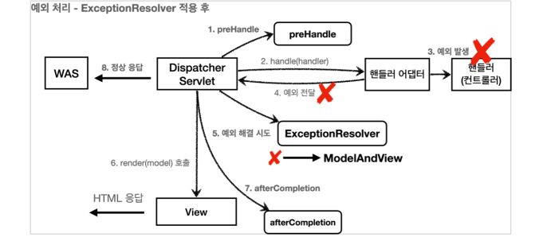

# 1. API 예외 처리 - 시작

**API 예외 처리는 어떻게 해야할까?**

- API의 경우에는 생각할 내용이 더 많다. 오류 페이지는 단순히 고객에게 오류 화면을 보여주고 끝이지만, API는 각 오류 상황에 맞는 오류 응답 스펙을 정하고, JSON으로 데이터를 내려주어야 한다.\
- API도 오류 페이지에서 설명했던 것 처럼 처음으로 돌아가서 서블릿 오류 페이지 방식을 사용해보자.

## WebServerCustomizer 다시 동작

- @Component 주석을 풀고 다시 동작시킨다.

- ```java
  package hello.exception;
  
  import org.springframework.boot.web.server.ConfigurableWebServerFactory;
  import org.springframework.boot.web.server.ErrorPage;
  import org.springframework.boot.web.server.WebServerFactoryCustomizer;
  import org.springframework.http.HttpStatus;
  import org.springframework.stereotype.Component;
  
  @Component
  public class WebServerCustomizer implements WebServerFactoryCustomizer<ConfigurableWebServerFactory> {
      @Override
      public void customize(ConfigurableWebServerFactory factory) {
  
          //WAS 까지 오류값이 넘어와서 다시 여기서 path 로 넘김
          ErrorPage errorPage404 = new ErrorPage(HttpStatus.NOT_FOUND, "/error-page/404");
          ErrorPage errorPage500 = new ErrorPage(HttpStatus.INTERNAL_SERVER_ERROR, "/error-page/500");
  
          //RuntimeException 자식타입까지 예외처리
          ErrorPage errorPageEx = new ErrorPage(RuntimeException.class, "/error-page/500");
  
          factory.addErrorPages(errorPage404, errorPage500, errorPageEx);
      }
  }
  
  ```

## ApiExceptionController - API 예외 컨트롤러

- ```java
  package hello.exception.api;
  
  import lombok.AllArgsConstructor;
  import lombok.Data;
  import lombok.extern.slf4j.Slf4j;
  import org.springframework.beans.factory.annotation.Autowired;
  import org.springframework.web.bind.annotation.GetMapping;
  import org.springframework.web.bind.annotation.PathVariable;
  import org.springframework.web.bind.annotation.RestController;
  
  @Slf4j
  @RestController
  public class ApiExceptionController {
  
      @GetMapping("/api/members/{id}")
      public MemberDto getMember(@PathVariable("id") String id) {
  
          if (id.equals("ex")) {
              throw new RuntimeException("잘못된 사용자");
          }
          return new MemberDto(id, "hello " + id);
      }
  
      @Data
      @AllArgsConstructor
      static class MemberDto {
          private String memberId;
          private String name;
      }
  }
  
  ```

  - 단순히 회원을 조회하는 기능을 하나 만들었다. 예외 테스트를 위해 URL에 전달된 id 의 값이 ex 이면 예외가 발생하도록 코드를 심어두었다.

## Postman으로 테스트

*HTTP Header에 Accept 가 application/json 인 것을 꼭 확인하자.*

### 정상 호출

- `http://localhost:8080/api/members/Spring`

- ```json
  {
   "memberId": "spring",
   "name": "hello spring"
  }
  ```

### 예외 발생 호출

- `http://localhost:8080/api/members/ex`
- **미리 만들어둔 오류 페이지 HTML이 반환된다. -> 기대하는 바가 아니다.**
- 클라이언트는 정상 요청이든, 오류 요청이든 JSON이 반환되기를 기대한다. 웹 브라우저가 아닌 이상 HTML을 직접 받아서 할 수 있는 것은 별로 없다.

*문제를 해결하려면 오류 페이지 컨트롤러도 JSON 응답을 할 수 있도록 수정해야 한다.*

## ErrorPageController - API 응답 추가

- ```java
  @RequestMapping(value = "/error-page/500", produces = MediaType.APPLICATION_JSON_VALUE)
  public ResponseEntity<Map<String, Object>> errorPage500Api(
          HttpServletRequest request, HttpServletResponse response){
  
      log.info("API errorPage 500");
  
      Map<String, Object> result = new HashMap<>();
      
      Exception ex = (Exception) request.getAttribute(ERROR_EXCEPTION);
      result.put("status", request.getAttribute(ERROR_STATUS_CODE));
      //ex.getMessage() ==> RuntimeException 이 발생했을 때 메세지"잘못된 사용자"를 반환(ApiExceptionController 에서 설정함)
      result.put("message", ex.getMessage());
  
      Integer statusCode = (Integer) request.getAttribute(RequestDispatcher.ERROR_STATUS_CODE);
  
      return new ResponseEntity<>(result, HttpStatus.valueOf(statusCode));
  }
  ```

  - @RequestMapping 의 `produces = MediaType.APPLICATION_JSON_VALUE` 의 뜻은 클라이언트가 요청하는 HTTP Header의 Accept 의 값이 application/json 일 때 해당 메서드가 호출된다는 것이다.

    -> 결국 클라어인트가 받고 싶은 미디어타입이 json이면 이 컨트롤러의 메서드가 호출된다.

- 응답 데이터를 위해서 Map 을 만들고 status , message 키에 값을 할당했다. Jackson 라이브러리는 Map 을 JSON 구조로 변환할 수 있다. 

- ResponseEntity 를 사용해서 응답하기 때문에 메시지 컨버터가 동작하면서 클라이언트에 JSON이 반환된다.

### ResponseEntity  (이게 뭐야)

- ```java
  public class ResponseEntity<T> extends HttpEntity<T> {
  
     private final Object status;
     /**
      * Create a {@code ResponseEntity} with a body and status code.
      * @param body the entity body
      * @param status the status code
      */
     public ResponseEntity(@Nullable T body, HttpStatusCode status) {
        this(body, null, status);
  ```

- 클래스 형태는 `ResponseEntity<T>` 이다. 제너럴 타입인데, 여기서는 Map<String, Object> 를 넣어줬다.

  - Jackson 라이브러리가 Map 을 JSON 구조로 변환할 수 있기 때문이다.

-  그리고 생성자를 이렇게 쓰고 반환해준다.

  - `public ResponseEntity(@Nullable T body, HttpStatusCode status)`

### ex.getMessage() 가 아니라 (String) request.getAttribute(ERROR_MESSAGE); 으로 바로 하면 안되나??

- `String ex1 = (String) request.getAttribute(ERROR_MESSAGE);` 으로 했을 때 출력 값이

  - ```json
    {
        "message": "Request processing failed: java.lang.RuntimeException: 잘못된 사용자",
        "status": 500
    }
    ```

- 이렇게 찍힌다.

- 그럼 ex.getMessage() 는 왜 이렇게 안찍히냐?

- Exception 은 Throwable 을 상속받는데, getMessage() 는 String detailMessage 만 반환한다.

- 그럼 `request.getAttribute(ERROR_MESSAGE)` 는 왜 저렇게 찍히냐?

  - 아직 못찾아봄 ㅎ

## 포스트맨을 통해서 다시 테스트

- HTTP Header에 Accept 가 application/json 인 것을 꼭 확인하자.

- `http://localhost:8080/api/members/ex`

- ```json
  {
   "message": "잘못된 사용자",
   "status": 500
  }
  ```

# 2. API 예외 처리 - 스프링 부트 기본 오류 처리

- API 예외 처리도 스프링 부트가 제공하는 기본 오류 방식(BasicErrorController)을 사용할 수 있다.

## BasicErrorController 코드

- ```java
  @RequestMapping(produces = MediaType.TEXT_HTML_VALUE)
  public ModelAndView errorHtml(HttpServletRequest request, HttpServletResponse
  response) {}
  
  @RequestMapping
  public ResponseEntity<Map<String, Object>> error(HttpServletRequest request) {}
  ```

  - /error 동일한 경로를 처리하는 errorHtml() , error() 두 메서드를 확인할 수 있다.

- errorHtml() : produces = MediaType.TEXT_HTML_VALUE : 클라이언트 요청의 Accept 해더 값이 text/html 인 경우에는 errorHtml() 을 호출해서 view를 제공한다.

- error() : 그외 경우에 호출되고 ResponseEntity 로 HTTP Body에 JSON 데이터를 반환한다.

*즉, Accept 해더 값이 text/html 인 경우 제외하고 모두 JSON 데이터로 반환*

## Postman으로 실행 (WebServerCustomizer 는 주석처)

- GET `http://localhost:8080/api/members/ex`

- body 값

- ```json
  {
   "timestamp": "2021-04-28T00:00:00.000+00:00",
   "status": 500,
   "error": "Internal Server Error",
   "exception": "java.lang.RuntimeException",
   "trace": "java.lang.RuntimeException: 잘못된 사용자\n\tat
  hello.exception.web.api.ApiExceptionController.getMember(ApiExceptionController
  .java:19...,
   "message": "잘못된 사용자",
   "path": "/api/members/ex"
  }
  ```

  - 다음 옵션들을 설정하면 더 자세한 오류 정보를 추가할 수 있다. 
    - server.error.include-binding-errors=always 
    - server.error.include-exception=true 
    - server.error.include-message=always
    -  server.error.include-stacktrace=always
  - 물론 오류 메시지는 이렇게 막 추가하면 보안상 위험할 수 있다. 간결한 메시지만 노출하고, 로그를 통해서 확인하자.

## Html 페이지 vs API 오류

- BasicErrorController 를 확장하면 JSON 메시지도 변경할 수 있다. 그런데 API 오류는 조금 뒤에 설명할 @ExceptionHandler 가 제공하는 기능을 사용하는 것이 더 나은 방법이다.
- 스프링 부트가 제공하는 BasicErrorController 는 HTML 페이지를 제공하는 경우에는 매우 편리하다. 4xx, 5xx 등등 모두 잘 처리해준다.
- 그런데 API 오류 처리는 다른 차원의 이야기이다. API 마다, 각각의 컨트롤러나 예외마다 서로 다른 응답 결과를 출력해야 할 수도 있다. 예를 들어서 회원과 관련된 API에서 예외가 발생할 때 응답과, 상품과 관련된 API에서 발생하는 예외에 따라 그 결과가 달라질 수 있다. 결과적으로 매우 세밀하고 복잡하다. 

**따라서 이 방법은 HTML 화면을 처리할 때 사용하고, API 오류 처리는 뒤에서 설명할 @ExceptionHandler 를 사용하자.**

# 3. API 예외 처리 - HandlerExceptionResolver 시작

- 예외가 발생해서 서블릿을 넘어 WAS까지 예외가 전달되면 HTTP 상태코드가 500으로 처리된다.
- 하지만, 발생하는 예외에 따라서 400, 404 등등 다른 상태코드로 처리하고 싶다. 
- 오류 메시지, 형식등을 API마다 다르게 처리하고 싶다.

## 상태코드 변환

- 예를 들어서 IllegalArgumentException 을 처리하지 못해서 컨트롤러 밖으로 넘어가는 일이 발생하면 HTTP 상태코드를 400으로 처리하고 싶다. 

### ApiExceptionController - 수정

- ```java
  package hello.exception.api;
  
  import ...;
  
  @Slf4j
  @RestController
  public class ApiExceptionController {
  
      @GetMapping("/api/members/{id}")
      public MemberDto getMember(@PathVariable("id") String id) {
  
          if (id.equals("ex")) {
              throw new RuntimeException("잘못된 사용자");
          }
          if (id.equals("bad")) {
              throw new IllegalArgumentException("잘못 입력된 값");
          }
          return new MemberDto(id, "hello " + id);
      }
  }
  ```

  - `http://localhost:8080/api/members/bad` 라고 호출하면 IllegalArgumentException 이 발생하도록 했다.

*실행해보면 상태 코드가 500인 것을 확인할 수 있다.*

```json
{
 "status": 500,
 "error": "Internal Server Error",
 "exception": "java.lang.IllegalArgumentException",
 "path": "/api/members/bad"
}
```

**-> 서버에서 발생한 에러이기 때문이다!**

## HandlerExceptionResolver

- 스프링 MVC는 컨트롤러(핸들러) 밖으로 예외가 던져진 경우 예외를 해결하고, 동작을 새로 정의할 수 있는 방법을 제공한다. 
- 컨트롤러 밖으로 던져진 예외를 해결하고, 동작 방식을 변경하고 싶으면 HandlerExceptionResolver 를 사용하면 된다. 줄여서 ExceptionResolver 라 한다.

### ExceptionResolver 적용 전

- 

1. `http://localhost:8080/api/members/bad` 호출
2. 예외 발생 : IllegalArgumentException
3. **WAS 에서는 서버 측에서 예외가 발생했다고 res 를 받으면, 500 에러를 터트리게 된다**

### ExceptionResolver 적용 후

- 

1. `http://localhost:8080/api/members/bad` 호출
2. 예외 발생 : IllegalArgumentException
3. ExceptionResolver 에서 예외 해결 시도 -> 가능 시 res.sendError 로 에러값을 담아주고 ModelAndView 반환 
4. ModelAndView 와 함께 sendError 를 BasicErrorController 로 해결 (Json) 타입으로 응답

### HandlerExceptionResolver - 인터페이스

- ```java
  public interface HandlerExceptionResolver {
      ModelAndView resolveException(
      HttpServletRequest request, HttpServletResponse response,
      Object handler, Exception ex);
  }
  ```

  - handler : 핸들러(컨트롤러) 정보 
  - Exception ex : 핸들러(컨트롤러)에서 발생한 발생한 예외

## MyHandlerExceptionResolver

- ```java
  package hello.exception.resolver;
  
  import jakarta.servlet.http.HttpServletRequest;
  import jakarta.servlet.http.HttpServletResponse;
  import lombok.extern.slf4j.Slf4j;
  import org.springframework.web.servlet.HandlerExceptionResolver;
  import org.springframework.web.servlet.ModelAndView;
  
  import java.io.IOException;
  
  @Slf4j
  public class MyHandlerExceptionResolver implements HandlerExceptionResolver {
      @Override
      public ModelAndView resolveException(HttpServletRequest request, HttpServletResponse response, Object handler, Exception ex) {
  
              log.info("IllegalArgumentException resolver to 400");
              try {
                  if(ex instanceof IllegalArgumentException){
                      response.sendError(HttpServletResponse.SC_BAD_REQUEST, ex.getMessage());
  
                      //예외는 먹어버리고 정상 return
                      return new ModelAndView();
                  }
              } catch (IOException e) {
                 log.error("resolver ex", e);
          }
  
          return null;
      }
  }
  
  ```

  - ExceptionResolver 가 ModelAndView 를 반환하는 이유는 마치 try, catch를 하듯이, Exception 을 처리해서 정상 흐름 처럼 변경하는 것이 목적이다. 이름 그대로 Exception 을 Resolver(해결)하는 것이 목적이다.
  - 여기서는 IllegalArgumentException 이 발생하면 response.sendError(400) 를 호출해서 HTTP 상태 코드를 400으로 지정하고, 빈 ModelAndView 를 반환한다.

### 반환 값에 따른 동작 방식

- **빈 ModelAndView** : new ModelAndView() 처럼 빈 ModelAndView 를 반환하면 뷰를 렌더링 하지 않고, 정상 흐름으로 서블릿이 리턴된다.
- **ModelAndView 지정**: ModelAndView 에 View , Model 등의 정보를 지정해서 반환하면 뷰를 렌더링 한다.
- **null**: null 을 반환하면, 다음 ExceptionResolver 를 찾아서 실행한다. 만약 처리할 수 있는 ExceptionResolver 가 없으면 예외 처리가 안되고, 기존에 발생한 예외를 서블릿 밖으로 던진다.

### ExceptionResolver 활용

- 예외 상태 코드 변환
  - 예외를 response.sendError(xxx) 호출로 변경해서 서블릿에서 상태 코드에 따른 오류를 처리하도록 위임 
  - 이후 WAS는 서블릿 오류 페이지를 찾아서 내부 호출, 예를 들어서 스프링 부트가 기본으로 설정한 /error 가 호출됨
- 뷰 템플릿 처리
  - `ModelAndView` 에 값을 채워서 예외에 따른 새로운 오류 화면 뷰 렌더링 해서 고객에게 제공
- API 응답 처리
  - `response.getWriter().println("hello");` 처럼 HTTP 응답 바디에 직접 데이터를 넣어주는 것도 가능하다. 여기에 JSON 으로 응답하면 API 응답 처리를 할 수 있다.

## WebConfig - 수정

- ```java
  @Override
  public void extendHandlerExceptionResolvers(List<HandlerExceptionResolver> resolvers) {
      resolvers.add(new MyHandlerExceptionResolver());
  }
  ```

# 4. API 예외 처리 - HandlerExceptionResolver 활용 (WAS 까지 에러넘기지 않기)

**예외를 여기서 마무리하기**

- 예외가 발생하면 WAS까지 예외가 던져지고, WAS에서 오류 페이지 정보를 찾아서 다시 /error 를 호출하는 과정은 생각해보면 너무 복잡하다. 
- ExceptionResolver 를 활용하면 예외가 발생했을 때 이런 복잡한 과정 없이 여기에서 문제를 깔끔하게 해결할 수 있다.

## UserException(사용자 정의 예외)

- ```java
  package hello.exception.exception;
  
  public class UserException extends RuntimeException {
      public UserException() {
          super();
      }
  
      public UserException(String message) {
          super(message);
      }
  
      public UserException(String message, Throwable cause) {
          super(message, cause);
      }
  
      public UserException(Throwable cause) {
          super(cause);
      }
  
      protected UserException(String message, Throwable cause, boolean enableSuppression, boolean writableStackTrace) {
          super(message, cause, enableSuppression, writableStackTrace);
      }
  }
  
  ```

## ApiExceptionController - 예외 추가

- `http://localhost:8080/api/members/user-ex` 호출시 UserException 이 발생하도록 해두었다

- ```java
  package hello.exception.api;
  
  import hello.exception.exception.UserException;
  import lombok.AllArgsConstructor;
  import lombok.Data;
  import lombok.extern.slf4j.Slf4j;
  import org.springframework.beans.factory.annotation.Autowired;
  import org.springframework.web.bind.annotation.GetMapping;
  import org.springframework.web.bind.annotation.PathVariable;
  import org.springframework.web.bind.annotation.RestController;
  
  @Slf4j
  @RestController
  public class ApiExceptionController {
  
      @GetMapping("/api/members/{id}")
      public MemberDto getMember(@PathVariable("id") String id) {
  
          if (id.equals("ex")) {
              throw new RuntimeException("잘못된 사용자");
          }
          if (id.equals("bad")) {
              throw new IllegalArgumentException("잘못 입력된 값");
          }
          if (id.equals("user-ex")) {
              throw new UserException("사용자 오류");
          }
          return new MemberDto(id, "hello " + id);
      }
  }
  ```

## UserHandlerExceptionResolver

- 주석 참

- ```java
  package hello.exception.resolver;
  
  @Slf4j
  public class UserHandlerExceptionResolver implements HandlerExceptionResolver {
  
      private final ObjectMapper objectMapper = new ObjectMapper();
  
      @Override
      public ModelAndView resolveException(HttpServletRequest request, HttpServletResponse response, Object handler, Exception ex) {
          try {
              //만약 exception 이 UserException 이면
              if(ex instanceof UserException){
                  log.info("UserException resolver to 400");
                  //"accept" 헤더값 저장
                  String acceptHeader = request.getHeader("accept");
                  //400 에러 res 에 넘김
                  response.setStatus(HttpServletResponse.SC_BAD_REQUEST);
  				//만약 accept 헤더가 application/json 이면
                  if ("application/json".equals(acceptHeader)) {
                      Map<String, Object> errorResult = new HashMap<>();
                      //exception 값을 Map 에 넣어서 json 값으로 변경한 다음에
                      errorResult.put("ex", ex.getClass());
                      errorResult.put("message", ex.getMessage());
                      String result = objectMapper.writeValueAsString(errorResult);
  				  //contentType, encoding 값 넘겨주고
                      response.setContentType("application/json");
                      response.setCharacterEncoding("utf-8");
                      //res 에 result 넘겨서 정상 호출처럼 동작하게 함
                      response.getWriter().write(result);
                      return new ModelAndView();
                  }else{
                      // acceptHeader 가 TEXT/HTML 이면 ModelAndView 로 html 호출
                      return new ModelAndView("error/500");
                  }
              }
          } catch (IOException e) {
              log.error("resolver ex", e);
          }
          return null;
      }
  }
  ```

## WebConfig에 UserHandlerExceptionResolver 추가

- ```java
  @Override
  public void extendHandlerExceptionResolvers(List<HandlerExceptionResolver>
  resolvers) {
      resolvers.add(new MyHandlerExceptionResolver());
      resolvers.add(new UserHandlerExceptionResolver());
  }
  ```

## 실행 / 정리

- POSTMAN 실행 : `http://localhost:8080/api/members/user-ex`

- ```json
  {
   "ex": "hello.exception.exception.UserException",
   "message": "사용자 오류"
  }
  ```

- ExceptionResolver 를 사용하면 컨트롤러에서 예외가 발생해도 ExceptionResolver 에서 예외를 처리해버린다.
- 따라서 예외가 발생해도 서블릿 컨테이너까지 예외가 전달되지 않고, 스프링 MVC에서 예외 처리는 끝이 난다. 

**결과적으로 WAS 입장에서는 정상 처리가 된 것이다. 이렇게 예외를 이곳에서 모두 처리할 수 있다는 것이 핵심이다.**

*서블릿 컨테이너까지 예외가 올라가면 복잡하고 지저분하게 추가 프로세스가 실행된다. 반면에 ExceptionResolver 를 사용하면 예외처리가 상당히 깔끔해진다.*

# 5. API 예외 처리 - 스프링이 제공하는 ExceptionResolver1

**스프링 부트가 기본으로 제공하는 ExceptionResolver 는 다음과 같다.**

- HandlerExceptionResolverComposite 에 다음 순서로 등록
  1. ExceptionHandlerExceptionResolver : @ExceptionHandler 을 처리한다.
  2. ResponseStatusExceptionResolver : HTTP 상태 코드를 지정해준다. 
     - 예) @ResponseStatus(value = HttpStatus.NOT_FOUND
  3. DefaultHandlerExceptionResolver : 스프링 내부 기본 예외를 처리한다.

## ResponseStatusExceptionResolver

*ResponseStatusExceptionResolver 는 예외에 따라서 HTTP 상태 코드를 지정해주는 역할을 한다.*

다음 두 가지 경우를 처리한다. 

- @ResponseStatus 가 달려있는 예외 
- ResponseStatusException 예외

### @ResponseStatus 적용

- 다음과 같이 @ResponseStatus 애노테이션을 적용하면 HTTP 상태 코드를 변경해준다. (400 error)

- ```java
  package hello.exception.exception;
  
  import org.springframework.http.HttpStatus;
  import org.springframework.web.bind.annotation.ResponseStatus;
  
  @ResponseStatus(code = HttpStatus.NOT_FOUND, reason = "잘못된 요청 오류")
  public class BadRequestException extends RuntimeException{
  }
  ```

#### ApiExceptionController - 추가

- ```java
  @GetMapping("/api/response-status-ex1")
  public String responseStatusEx1() {
  	throw new BadRequestException();
  }
  ```

#### 실행 

`http://localhost:8080/api/response-status-ex1`

- ```json
  {
   "status": 400,
   "error": "Bad Request",
   "exception": "hello.exception.exception.BadRequestException",
   "message": "잘못된 요청 오류",
   "path": "/api/response-status-ex1"
  }
  ```

#### 메시지 기능

- @ResponseStatus 의 reason 속성은 reason 을 MessageSource 에서 찾는 기능도 제공한다. 

  - reason = "error.bad" (`@ResponseStatus(code = HttpStatus.NOT_FOUND, reason = "error.bad"`))

-  `messages.properties` -> `error.bad=잘못된 요청 오류입니다. 메시지 사용`

- ```java
  {
   "status": 400,
   "error": "Bad Request",
   "exception": "hello.exception.exception.BadRequestException",
   "message": "잘못된 요청 오류입니다. 메시지 사용",
   "path": "/api/response-status-ex1"
  }
  ```

### ResponseStatusException

- @ResponseStatus 는 개발자가 직접 변경할 수 없는 예외에는 적용할 수 없다. (애노테이션을 직접 넣어야 하는데, 내가 코드를 수정할 수 없는 라이브러리의 예외 코드 같은 곳에는 적용할 수 없다.)
- 추가로 애노테이션을 사용하기 때문에 조건에 따라 동적으로 변경하는 것도 어렵다. 

**이때는 ResponseStatusException 예외를 사용하면 된다.**

#### ApiExceptionController - 추가

- ```java
  @GetMapping("/api/response-status-ex2")
  public String responseStatusEx2() {
  	throw new ResponseStatusException(HttpStatus.NOT_FOUND, "error.bad", new
  IllegalArgumentException());
  }
  ```

#### 결과

- `http://localhost:8080/api/response-status-ex2`

- ```java
  {
      "status": 404,
      "error": "Not Found",
      "exception": "org.springframework.web.server.ResponseStatusException",
      "message": "잘못된 요청 오류입니다. 메시지 사용",
      "path": "/api/response-status-ex2"
  }
  ```

  

# 6. API 예외 처리 - 스프링이 제공하는 ExceptionResolver2 (DefaultHandlerExceptionResolver)

- DefaultHandlerExceptionResolver 는 스프링 내부에서 발생하는 스프링 예외를 해결한다.
- 대표적으로 파라미터 바인딩 시점에 타입이 맞지 않으면 내부에서 TypeMismatchException 이 발생하는데, 이 경우 예외가 발생했기 때문에 그냥 두면 서블릿 컨테이너까지 오류가 올라가고, 결과적으로 500 오류가 발생한다.
- 그런데 파라미터 바인딩은 대부분 클라이언트가 HTTP 요청 정보를 잘못 호출해서 발생하는 문제이다. HTTP 에서는 이런 경우 HTTP 상태 코드 400을 사용하도록 되어 있다. 
- **DefaultHandlerExceptionResolver 는 이것을 500 오류가 아니라 HTTP 상태 코드 400 오류로 변경한다.**

## 코드 확인

- DefaultHandlerExceptionResolver.handleTypeMismatch 를 보면 다음과 같은 코드를 확인할 수 있다.

- ```java
  protected ModelAndView handleTypeMismatch(TypeMismatchException ex,
        HttpServletRequest request, HttpServletResponse response, @Nullable Object handler) throws IOException {
  
     response.sendError(HttpServletResponse.SC_BAD_REQUEST);
     return new ModelAndView();
  }
  ```

- 즉, TypeMisMatch 면 response 에 400 을 넣어서 ModelAndView 로 반환한다.
- sendError(400) 를 호출했기 때문에 WAS에서 다시 오류 페이지( /error )를 내부 요청한다.

## ApiExceptionController - 추가

- ```java
  @GetMapping("/api/default-handler-ex")
  public String defaultException(@RequestParam Integer data) {
  	return "ok";	
  }
  ```

  - Integer data 에 문자를 입력하면 내부에서 `TypeMismatchException` 이 발생한다.

  - 실행 : `http://localhost:8080/api/default-handler-ex?data=hello`

  - ```java
    {
     "status": 400,
     "error": "Bad Request",
     "exception":
    "org.springframework.web.method.annotation.MethodArgumentTypeMismatchException"
    ,
     "message": "Failed to convert value of type 'java.lang.String' to required
    type 'java.lang.Integer'; nested exception is java.lang.NumberFormatException:
    For input string: \"hello\"",
     "path": "/api/default-handler-ex"
    }
    ```

    - 실행 결과를 보면 HTTP 상태 코드가 400인 것을 확인할 수 있다.

## 정리

- 지금까지 HTTP 상태 코드를 변경하고, 스프링 내부 예외의 상태코드를 변경하는 기능도 알아보았다. 
- 그런데 HandlerExceptionResolver 를 직접 사용하기는 복잡하다. API 오류 응답의 경우 response 에 직접 데이터를 넣어야 해서 매우 불편하고 번거롭다. ModelAndView 를 반환해야 하는 것도 API에는 잘 맞지 않는다.

*스프링은 이 문제를 해결하기 위해 @ExceptionHandler 라는 매우 혁신적인 예외 처리 기능을 제공한다.(ExceptionHandlerExceptionResolver)*

