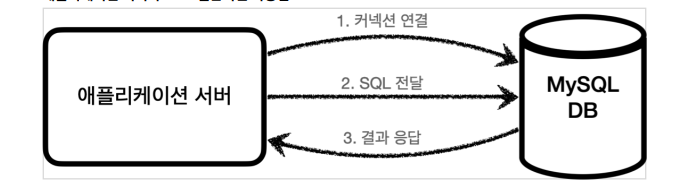
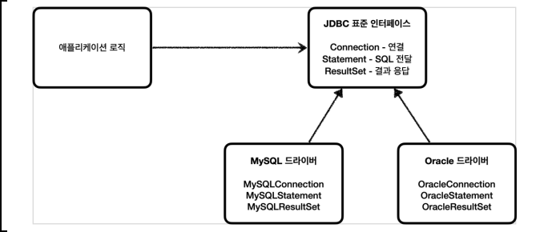
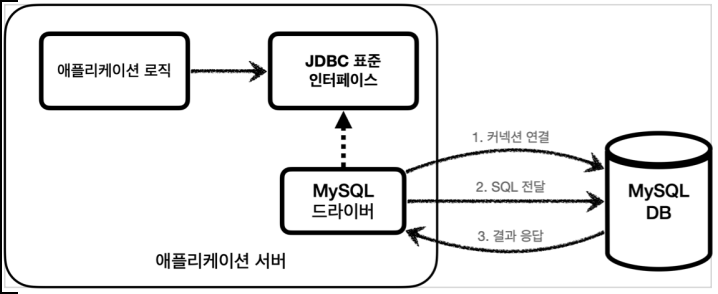
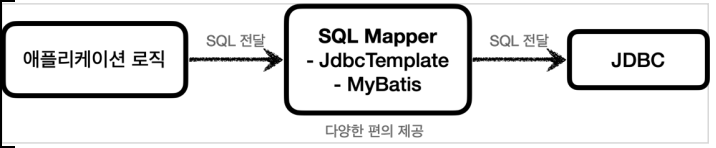
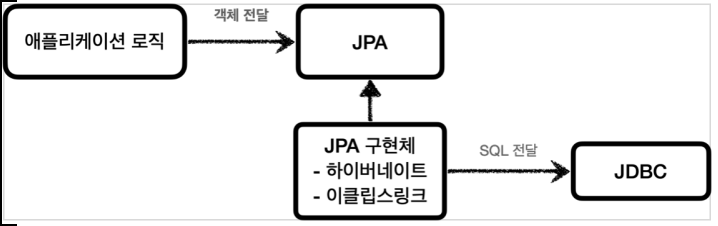
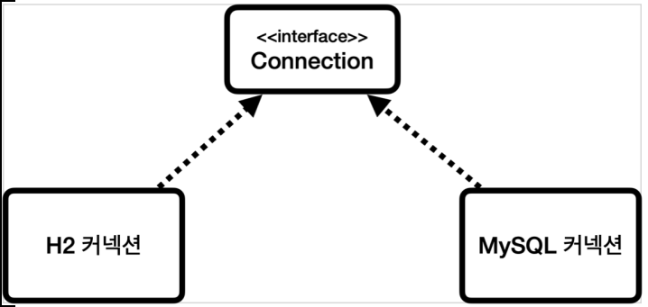
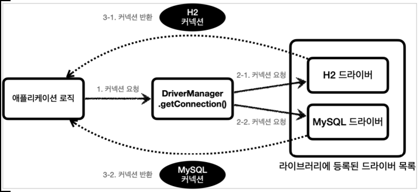
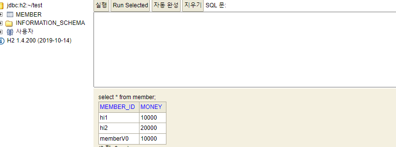
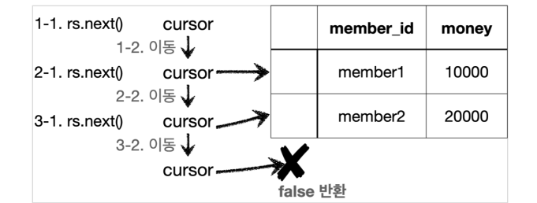

# 0. H2 데이터베이스 설정

- H2 다운 및 설치 

**h2 데이터베이스 버전은 스프링 부트 버전에 맞춘다.**

- 실행: h2.bat
- jdbc:h2:~/test (최초 한번) -> 이후부터는 jdbc:h2:tcp://localhost/~/test 이렇게 접속

**H2 데이터베이스 웹 콘솔에 접근하자. **

- H2 데이터베이스 웹 콘솔 접근 URL: http://localhost:8082/

# 1. JDBC 이해

## JDBC 등장 이유

- 애플리케이션을 개발할 때 중요한 데이터는 대부분 데이터베이스에 보관한다.
- 클라이언트가 애플리케이션 서버를 통해 데이터를 저장하거나 조회하면, 애플리케이션 서버는 다음 과정을 통해서 데이터베이스를 사용한다.
- 

- 문제는 각각의 데이터베이스마다 커넥션을 연결하는 방법, SQL을 전달하는 방법, 그리고 결과를 응답 받는 방법이 모두 다르다는 점이다. (참고로 관계형 데이터베이스는 수십개가 있다.)

### 문제점

1. 데이터베이스를 다른 종류의 데이터베이스로 변경하면 애플리케이션 서버에 개발된 데이터베이스 사용 코드도 함께 변경해야 한다.
2. 개발자가 각각의 데이터베이스마다 커넥션 연결, SQL 전달, 그리고 그 결과를 응답 받는 방법을 새로 학습해야 한다.

**이런 문제를 해결하기 위해 JDBC라는 자바 표준이 등장한다.**

## JDBC 표준 인터페이스

- JDBC(Java Database Connectivity)는 자바에서 데이터베이스에 접속할 수 있도록 하는 자바 API다. JDBC는 데이터베이스에서 자료를 쿼리하거나 업데이트하는 방법을 제공한다.
- 

- 대표적으로 다음 3가지 기능을 표준 인터페이스로 정의해서 제공한다.
  - java.sql.Connection - 연결
  - java.sql.Statement - SQL을 담은 내용
  - java.sql.ResultSet - SQL 요청 응답

- 자바는 이렇게 표준 인터페이스를 정의해두었다. 이제부터 개발자는 이 표준 인터페이스만 사용해서 개발하면 된다.

## MySQL 드라이버 사용

- 인터페이스만 있다고해서 기능이 동작하지는 않는다. 이 JDBC 인터페이스를 각각의 DB 벤더 (회사)에서 자신의 DB에 맞도록 구현해서 라이브러리로 제공하는데, 이것을 JDBC 드라이버라 한다.
-  예를 들어서 MySQL DB에 접근할 수 있는 것은 MySQL JDBC 드라이버라 하고, Oracle DB에 접근할 수 있는 것은 Oracle JDBC 드라이버라 한다.
- 

# 2. JDBC와 최신 데이터 접근 기술

- JDBC는 1997년에 출시될 정도로 오래된 기술이고, 사용하는 방법도 복잡하다. 그래서 최근에는 JDBC를 직접 사용하기 보다는 JDBC를 편리하게 사용하는 다양한 기술이 존재한다. 대표적으로 **SQL Mapper와 ORM 기술**로 나눌 수 있다.

## SQL Mapper

- 
- 장점: JDBC를 편리하게 사용하도록 도와준다. 
  - SQL 응답 결과를 객체로 편리하게 변환해준다. 
  - JDBC의 반복 코드를 제거해준다. 
- 단점: 개발자가 SQL을 직접 작성해야한다. 
- 대표 기술: 스프링 JdbcTemplate, MyBatis

## ORM 기술

- 
- ORM은 객체를 관계형 데이터베이스 테이블과 매핑해주는 기술이다. 이 기술 덕분에 개발자는 반복적인 SQL을 직접 작성하지 않고, ORM 기술이 개발자 대신에 SQL을 동적으로 만들어 실행해준다. 추가로 각각의 데이터베이스마다 다른 SQL을 사용하는 문제도 중간에서 해결해준다.
- 대표 기술: JPA, 하이버네이트, 이클립스링크
- JPA는 자바 진영의 ORM 표준 인터페이스이고, 이것을 구현한 것으로 하이버네이트와 이클립스 링크 등의 구현 기술이 있다.

## SQL Mapper vs ORM 기술

-  SQL Mapper는 SQL만 직접 작성하면 나머지 번거로운 일은 SQL Mapper가 대신 해결해준다. SQL Mapper는 SQL만 작성할 줄 알면 금방 배워서 사용할 수 있다.
- ORM기술은 SQL 자체를 작성하지 않아도 되어서 개발 생산성이 매우 높아진다. 편리한 반면에 쉬운 기술은 아니므로 실무에서 사용하려면 깊이있게 학습해야 한다

# 3. 데이터베이스 연결

- 데이터베이스 서버를 먼저 실행 후 진행

## ConnectionConst

- 데이터베이스에 접속하는데 필요한 기본 정보를 편리하게 사용할 수 있도록 상수로 만들었다.

- ```java
  package hello.jdbc.connection;
  
  public abstract class ConnectionConst {
      public static final String URL = "jdbc:h2:tcp://localhost/~/test";
      public static final String USERNAME = "sa";
      public static final String PASSWORD = "";
  }
  
  ```

## DBConnectionUtil

- ```java
  package hello.jdbc.connection;
  
  import lombok.extern.slf4j.Slf4j;
  
  import java.sql.Connection;
  import java.sql.DriverManager;
  import java.sql.SQLException;
  
  import static hello.jdbc.connection.ConnectionConst.*;
  
  @Slf4j
  public class DBConnectionUtil {
  
      public static Connection getConnection(){
          try {
              //구현체는 org.h2.jdbc.JdbcConnection
              Connection connection = DriverManager.getConnection(URL, USERNAME, PASSWORD);
              log.info("get connection={}, class={}", connection, connection.getClass());
              return connection;
          } catch (SQLException e) {
              throw new IllegalStateException(e);
          }
      }
  }
  ```

  -  데이터베이스에 연결하려면 JDBC가 제공하는 DriverManager.getConnection(..) 를 사용하면 된다.
  - 이렇게 하면 라이브러리에 있는 데이터베이스 드라이버를 찾아서 해당 드라이버가 제공하는 커넥션을 반환해준다. 
  - 여기서는 H2 데이터베이스 드라이버가 작동해서 실제 데이터베이스와 커넥션을 맺고 그 결과를 반환해준다.

## DBConnectionUtilTest

- ```java
  package hello.jdbc.connection;
  
  import;
  
  @Slf4j
  class DBConnectionUtilTest {
  
      @Test
      void connection(){
          Connection connection = DBConnectionUtil.getConnection();
          assertThat(connection).isNotNull();
      }
  }
  ```

  - 실행전에 H2 데이터베이스 서버를 실행해두어야 한다. ( h2.sh , h2.bat )

- 실행 결과

  - 11:13:59.029 [main] INFO hello.jdbc.connection.DBConnectionUtil - get connection=conn0: url=jdbc:h2:tcp://localhost/~/test user=SA, class=class org.h2.jdbc.JdbcConnection
  - 실행 결과를 보면 class=class org.h2.jdbc.JdbcConnection 부분을 확인할 수 있다. 이것이 바로 H2 데이터베이스 드라이버가 제공하는 H2 전용 커넥션이다.
  - 이 커넥션은 JDBC 표준 커넥션 인터페이스인 java.sql.Connection 인터페이스를 구현하고 있다.

## JDBC DriverManager 연결 이해

### JDBC 커넥션 인터페이스와 구현

- 

- JDBC는 java.sql.Connection 표준 커넥션 인터페이스를 정의한다.
- H2 데이터베이스 드라이버는 JDBC Connection 인터페이스를 구현한 org.h2.jdbc.JdbcConnection 구현체를 제공한다.

### DriverManager 커넥션 요청 흐름

*JDBC가 제공하는 DriverManager 는 라이브러리에 등록된 DB 드라이버들을 관리하고, 커넥션을 획득하는 기능을 제공한다.*

- 
  1. 애플리케이션 로직에서 커넥션이 필요하면 DriverManager.getConnection() 을 호출한다.
  2. DriverManager 는 라이브러리에 등록된 드라이버 목록을 자동으로 인식한다. 이 드라이버들에게 순서대로 다음 정보를 넘겨서 커넥션을 획득할 수 있는지 확인한다.
     - URL: 예) jdbc:h2:tcp://localhost/~/test
     - 이름, 비밀번호 등 접속에 필요한 추가 정보
     - 여기서 각각의 드라이버는 URL 정보를 체크해서 본인이 처리할 수 있는 요청인지 확인한다. 예를 들어서 URL이 jdbc:h2 로 시작하면 이것은 h2 데이터베이스에 접근하기 위한 규칙이다. **따라서 H2 드라이버는 본인이 처리할 수 있으므로 실제 데이터베이스에 연결해서 커넥션을 획득하고 이 커넥션을 클라이언트에 반환한다. 반면에 URL이 jdbc:h2 로 시작했는데 MySQL 드라이버가 먼저 실행되면 이 경우 본인이 처리할 수 없다는 결과를 반환하게 되고, 다음 드라이버에게 순서가 넘어간다.**
  3. 이렇게 찾은 커넥션 구현체가 클라이언트에 반환된다.

# 4. JDBC 개발 - 등록

- JDBC를 사용해서 회원( Member ) 데이터를 데이터베이스에 관리하는 기능을 개발해보자

- *주의!* : H2 데이터베이스 설정 마지막에 있는 테이블과 샘플 데이터 만들기를 통해서 member 테이블을 미리 만들어두어야 한다.

- ```sql
  drop table member if exists cascade;
  create table member (
      member_id varchar(10),
      money integer not null default 0,
      primary key (member_id)
  );
  ```

  - H2 데이터베이스에 저장

## Member

- ```java
  package hello.jdbc.domain;
  
  import lombok.Data;
  
  @Data
  public class Member {
  
      private String memberId;
      private int money;
  
      public Member(){}
  
      public Member(String memberId, int money) {
          this.memberId = memberId;
          this.money = money;
      }
  }
  ```

  - 회원의 ID와 해당 회원이 소지한 금액을 표현하는 단순한 클래스이다. 앞서 만들어둔 member 테이블에 데이터를 저장하고 조회할 때 사용한다

## MemberRepositoryV0 - 회원 등록 

### save()

- 주석참고 ..

- ```java
  package hello.jdbc.Repository;
  
  import hello.jdbc.connection.DBConnectionUtil;
  import hello.jdbc.domain.Member;
  import lombok.extern.slf4j.Slf4j;
  
  import java.sql.*;
  
  /**
   * JDBC - DriverManager 사용
   */
  @Slf4j
  public class MemberRepositoryV0 {
  
      public Member save(Member member) throws SQLException {
          //sql : 데이터베이스에 전달할 SQL을 정의한다.
          String sql = "insert into member(member_id, money) values (?,?)";
  
          Connection connection = null;
          PreparedStatement pstmt = null;
  
          try {
              connection = getConnection();
              // 데이터베이스에 전달할 SQL과 파라미터로 전달할 데이터들을 준비한다.
              pstmt = connection.prepareStatement(sql);
              //SQL의 첫번째 ? 에 값을 지정한다. 문자이므로 setString 을 사용한다.
              pstmt.setString(1, member.getMemberId());
              //SQL의 두번째 ? 에 값을 지정한다. Int 형 숫자이므로 setInt 를 지정한다.
              pstmt.setInt(2, member.getMoney());
              //Statement 를 통해 준비된 SQL을 커넥션을 통해 실제 데이터베이스에 전달한다.
              //참고로 executeUpdate() 은 int 를 반환하는데 영향받은 DB row 수를 반환한다.
              //여기서는 하나의 row를 등록했으므로 1을 반환한다.
              pstmt.executeUpdate();
              return member;
          } catch (SQLException e) {
              log.error("db error", e);
              throw e;
          } finally {
              //여기서 닫히지 않고 Exception 이 터지면? connection.close(); 이 호출안된다.
              //따라서 각 연결마다 try, catch 를 해줘야 한다.
              close(connection, pstmt, null);
          }
      }
      
       private static Connection getConnection() {
          return DBConnectionUtil.getConnection();
      }
  }
  ```

###  close(connection, pstmt, null);

- ```java
  private void close(Connection connection, Statement statement, ResultSet resultSet){
  
          if(resultSet != null){
              try {
                  resultSet.close();
              } catch (SQLException e) {
                  log.info("error", e);
              }
          }
  
          if(statement != null){
              try {
                  statement.close();
              } catch (SQLException e) {
                  log.info("error", e);
              }
          }
  
          if(connection != null){
              try {
                  connection.close();
              } catch (SQLException e) {
                  log.info("error", e);
              }
          }
      }
  ```

- Connection, Statement(PreparedStatement 부모 클래스), ResultSet(결과를 조회할 때 사용)이 각각 null 이 아닌지 체크 후 닫아준다. 
- 오류 시에는 딱히 할 수 있는게 없으므로 error 코드를 반환 후 다음거를 계속 닫아준다.

### 리소스 정리

- 쿼리를 실행하고 나면 리소스를 정리해야 한다.
- 여기서는 Connection , PreparedStatement 를 사용했다. 리소스를 정리할 때는 항상 역순으로 해야한다.
- Connection 을 먼저 획득하고 Connection 을 통해 PreparedStatement 를 만들었기 때문에 리소스를 반환할 때는 PreparedStatement 를 먼저 종료하고, 그 다음에 Connection 을 종료하면 된다

**리소스 정리는 꼭! 해주어야 한다. 따라서 예외가 발생하든, 하지 않든 항상 수행되어야 하므로 finally 구문에 주의해서 작성해야한다.**

- 만약 이 부분을 놓치게 되면 커넥션이 끊어지지 않고 계속 유지되는 문제가 발생할 수 있다. 이런 것을 리소스 누수라고 하는데, 결과적으로 커넥션 부족으로 장애가 발생할 수 있다.

### 참고

- PreparedStatement 는 Statement 의 자식 타입인데, ? 를 통한 파라미터 바인딩을 가능하게 해준다.
- 참고로 SQL Injection 공격을 예방하려면 PreparedStatement 를 통한 파라미터 바인딩 방식을 사용해야 한다.

## Test(MemberRepositoryV0Test - 회원 등록)

- ```java
  package hello.jdbc.Repository;
  
  import hello.jdbc.domain.Member;
  import org.junit.jupiter.api.Test;
  
  import java.sql.SQLException;
  
  import static org.junit.jupiter.api.Assertions.*;
  
  class MemberRepositoryV0Test {
  
      MemberRepositoryV0 repository = new MemberRepositoryV0();
  
      @Test
      void crud() throws SQLException {
          Member member = new Member("memberV0", 10000);
          repository.save(member);
      }
  }
  ```

- 데이터베이스에서 select * from member 쿼리를 실행하면 데이터가 저장된 것을 확인할 수 있다

  - 

- 참고로 이 테스트는 2번 실행하면 PK 중복 오류가 발생한다. 이 경우 delete from member 쿼리로 데이터를 삭제한 다음에 다시 실행하자.

# 5. JDBC 개발 - 조회

- 이번에는 JDBC를 통해 이전에 저장한 데이터를 조회하는 기능을 개발해보자.

## MemberRepositoryV0 - 회원 조회 추가

- 주석 참고

- ```java
  public Member findById(String memberId) throws SQLException {
      String sql = "select * from member where member_id = ?";
  
      Connection connection = null;
      PreparedStatement preparedStatement = null;
      ResultSet resultSet = null;
  
      try {
          connection = getConnection();
          //preparedStatement 에 sql 문 투척
          preparedStatement = connection.prepareStatement(sql);
          //첫번째 ? 에 memberId 를 넣는다.
          preparedStatement.setString(1, memberId);
  	   //preparedStatement.executeQuery() 로 쿼리 결과를 반환받을 수 있다. resultSet 에 넣는다.
          resultSet = preparedStatement.executeQuery();
          //resultSet.next() 가 첫번째 값이다.(포인터처럼 동작) 있는지 없는지 확인
          if(resultSet.next()){
         		//있으면 resultSet 에서 getString, getInt 로 key 값으로 value 를 받은 다음 Member 반환
              Member member = new Member();
              member.setMemberId(resultSet.getString("member_id"));
              member.setMoney(resultSet.getInt("money"));
              return member;
              //없으면 NoSuchElementException 로 memberId 가 조회안된다고 반환
          } else {
              throw new NoSuchElementException("member not found memberId = " + memberId);
          }
      } catch (SQLException e) {
          log.error("db error", e);
          throw e;
      } finally {
          //닫아주기
          close(connection, preparedStatement, resultSet);
      }
  }
  ```

## MemberRepositoryV0Test - 회원 조회 추가

- ```java
  package hello.jdbc.Repository;
  
  @Slf4j
  class MemberRepositoryV0Test {
  
      MemberRepositoryV0 repository = new MemberRepositoryV0();
  
      @Test
      void crud() throws SQLException {
          Member member = new Member("memberV3", 10000);
          repository.save(member);
  
          //findById
          Member findMember = repository.findById(member.getMemberId());
          log.info("findMember = {}", findMember);
          assertThat(findMember).isEqualTo(member);
          assertThat(findMember).isNotSameAs(member);
      }
  }
  ```

- 실행 결과

  - 로그 :`findMember = Member(memberId=memberV3, money=10000)`

- `isEqualTo()` : `findMember.equals(member)` 를 비교한다. 결과가 참인 이유는 롬복의 @Data 는 해당 객체의 모든 필드를 사용하도록 equals() 를 오버라이딩 하기 때문이다.

- `isNotSameAs()` : 그러나 참조값은 다르기 때문에 Same 은 아니다.

## ResultSet

### 개요

- ResultSet 은 다음과 같이 생긴 데이터 구조이다. 보통 select 쿼리의 결과가 순서대로 들어간다.
  - 예를 들어서 select member_id, money 라고 지정하면 member_id , money 라는 이름으로 데이터가 저장된다.
  - 참고로 select * 을 사용하면 테이블의 모든 컬럼을 다 지정한다.
- ResultSet 내부에 있는 커서( cursor )를 이동해서 다음 데이터를 조회할 수 있다.
- **rs.next() : 이것을 호출하면 커서가 다음으로 이동한다. 참고로 최초의 커서는 데이터를 가리키고 있지 않기 때문에 rs.next() 를 최초 한번은 호출해야 데이터를 조회할 수 있다.**
  - rs.next() 의 결과가 true 면 커서의 이동 결과 데이터가 있다는 뜻이다.
  -  rs.next() 의 결과가 false 면 더이상 커서가 가리키는 데이터가 없다는 뜻이다.
- rs.getString("member_id") : 현재 커서가 가리키고 있는 위치의 member_id 데이터를 String 타입으로 반환한다.
- rs.getInt("money") : 현재 커서가 가리키고 있는 위치의 money 데이터를 int 타입으로 반환한다

### ResultSet 결과 예시

- member 2개가 저장되어 있다고 가정
- 
- 1-1 에서 rs.next() 를 호출한다
- 1-2 의 결과로 cursor 가 다음으로 이동한다. 이 경우 cursor 가 가리키는 데이터가 있으므로 true 를 반환한다.
  - 이때 rs.getString("member_id") = "member1" / rs.getInt("money") = 10000
- 2-1 에서 rs.next() 를 호출한다.
- 2-2 의 결과로 cursor 가 다음으로 이동한다. 이 경우 cursor 가 가리키는 데이터가 있으므로 true 를 반환한다.
  - 상동
- 3-1 에서 rs.next() 를 호출한다.
- 3-2 의 결과로 cursor 가 다음으로 이동한다. 이 경우 cursor 가 가리키는 데이터가 없으므로 false 를 반환한다.

*findById() 에서는 회원 하나를 조회하는 것이 목적이다. 따라서 조회 결과가 항상 1건이므로 while 대신에 if 를 사용한다. 다음 SQL을 보면 PK인 member_id 를 항상 지정하는 것을 확인할 수 있다.*

# 6. JDBC 개발 - 수정, 삭제

- 수정과 삭제는 등록과 비슷하다. 등록, 수정, 삭제처럼 데이터를 변경하는 쿼리는 executeUpdate() 를 사용하면 된다.

## MemberRepositoryV0 - 회원 수정 추가

- ```java
   public void update(String memberId, int money) throws SQLException{
      String sql = "update member set money=? where member_id=?";
  
      Connection connection = null;
      PreparedStatement preparedStatement = null;
  
      try {
          connection = getConnection();
          preparedStatement = connection.prepareStatement(sql);
          preparedStatement.setInt(1, money);
          preparedStatement.setString(2, memberId);
  
          int resultSize = preparedStatement.executeUpdate();
          log.info("resultSize = {}", resultSize);
  
      } catch (SQLException e) {
          log.error("db error", e);
          throw e;
      } finally {
          //여기서 닫히지 않고 Exception 이 터지면? connection.close(); 이 호출안된다.
          close(connection, preparedStatement, null);
      }
  }
  ```

  - executeUpdate() 는 쿼리를 실행하고 영향받은 row수를 반환한다. 여기서는 하나의 데이터만 변경하기 때문에 결과로 1이 반환된다. 

## Test - 회원 수정 

- ```java
  package hello.jdbc.Repository;
  
  @Slf4j
  class MemberRepositoryV0Test {
  
      MemberRepositoryV0 repository = new MemberRepositoryV0();
  
      @Test
      void crud() throws SQLException {
          
          //save
          Member member = new Member("memberV4", 10000);
          repository.save(member);
  
          //findById
          Member findMember = repository.findById(member.getMemberId());
          log.info("findMember = {}", findMember);
          assertThat(findMember).isEqualTo(member);
          assertThat(findMember).isNotSameAs(member);
          
          //update : money 10000 -> 20000
          repository.update(member.getMemberId(), 20000);
          Member updatedMember = repository.findById(member.getMemberId());
          assertThat(updatedMember.getMoney()).isEqualTo(20000);
  
       
      }
  }
  ```

  - 회원 데이터의 money 를 10000 -> 20000으로 수정하고, DB에서 데이터를 다시 조회해서 20000으로 변경 되었는지 검증한다.

### 실행 로그

- `MemberRepositoryV0 - resultSize=1`

## MemberRepositoryV0 - 회원 삭제 추가

- 등록, 수정과 거의 비슷하다.

- ```java
  public void delete(String memberId) throws SQLException{
      String sql = "delete from member where member_id = ?";
  
      Connection connection = null;
      PreparedStatement preparedStatement = null;
  
      try {
          connection = getConnection();
          preparedStatement = connection.prepareStatement(sql);
          preparedStatement.setString(1, memberId);
  
          int resultSize = preparedStatement.executeUpdate();
          log.info("resultSize = {}", resultSize);
  
      } catch (SQLException e) {
          log.error("db error", e);
          throw e;
      } finally {
          //여기서 닫히지 않고 Exception 이 터지면? connection.close(); 이 호출안된다.
          close(connection, preparedStatement, null);
      }
  ```

## Test - 회원 삭제

- ```java
  package hello.jdbc.Repository;
  
  @Slf4j
  class MemberRepositoryV0Test {
  
      MemberRepositoryV0 repository = new MemberRepositoryV0();
  
      @Test
      void crud() throws SQLException {
          
          //save
          Member member = new Member("memberV4", 10000);
          repository.save(member);
  
          //findById
          Member findMember = repository.findById(member.getMemberId());
          log.info("findMember = {}", findMember);
          assertThat(findMember).isEqualTo(member);
          assertThat(findMember).isNotSameAs(member);
          
          //update : money 10000 -> 20000
          repository.update(member.getMemberId(), 20000);
          Member updatedMember = repository.findById(member.getMemberId());
          assertThat(updatedMember.getMoney()).isEqualTo(20000);
  
          //delete
          repository.delete(member.getMemberId());
          assertThatThrownBy(() -> repository.findById(member.getMemberId()))
                  .isInstanceOf(NoSuchElementException.class);
      }
  }
  ```

  - 회원을 삭제한 다음 findById() 를 통해서 조회한다. 회원이 없기 때문에 NoSuchElementException 이 발생한다. assertThatThrownBy 는 해당 예외가 발생해야 검증에 성공한다.

**마지막에 회원을 삭제하기 때문에 테스트가 정상 수행되면, 이제부터는 같은 테스트를 반복해서 실행할 수 있다. 물론 테스트 중간에 오류가 발생해서 삭제 로직을 수행할 수 없다면 테스트를 반복해서 실행할 수 없다.**