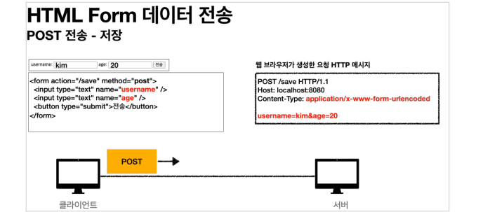
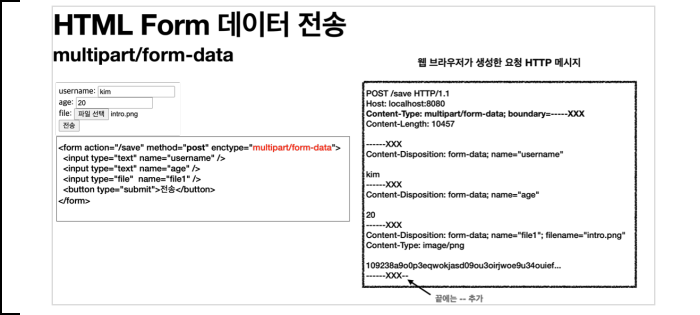
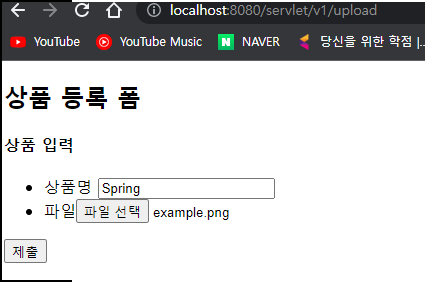

# 1. 파일 업로드 소개

## 폼을 전송하는 다음 두 가지 방식의 차이(HTML 폼 전송 방식)

- application/x-www-form-urlencoded 
- multipart/form-data

### application/x-www-form-urlencoded 방식

- 

- application/x-www-form-urlencoded 방식은 HTML 폼 데이터를 서버로 전송하는 가장 기본적인 방법이다.
- Form 태그에 별도의 enctype 옵션이 없으면 웹 브라우저는 요청 HTTP 메시지의 헤더에 다음 내용을 추가한다.
- 그리고 폼에 입력한 전송할 항목을 HTTP Body에 문자로 username=kim&age=20 와 같이 & 로 구분해서 전송한다

#### 문제점

- 파일을 업로드 하려면 파일은 문자가 아니라 바이너리 데이터를 전송해야 한다. 문자를 전송하는 이 방식으로 파일을 전송하기는 어렵다.
- 보통 폼을 전송할 때 파일만 전송하는 것이 아니라는 점이다. (이름, 나이, 첨부파일 등 **문자와 바이너리를 동시에 전송해야 하는 상황**)

### multipart/form-data

-  위와 같은 문제를 해결하기 위해 HTTP는 multipart/form-data 라는 전송 방식을 제공한다.
- 

- 이 방식을 사용하려면 Form 태그에 별도의 enctype="multipart/form-data" 를 지정해야 한다.
- multipart/form-data 방식은 다른 종류의 여러 파일과 폼의 내용 함께 전송할 수 있다. (그래서 이름이 multipart 이다.)

#### 입력결과 확인

- 폼의 입력 결과로 생성된 HTTP 메시지를 보면 각각의 전송 항목이 구분이 되어있다. ContentDisposition 이라는 항목별 헤더가 추가되어 있고 여기에 부가 정보가 있다.
- 예제에서는 username , age , file1 이 각각 분리되어 있고, 폼의 일반 데이터는 각 항목별로 문자가 전송되고, 파일의 경우 파일 이름과 Content-Type이 추가되고 바이너리 데이터가 전송된다.

#### Part

- multipart/form-data 는 application/x-www-form-urlencoded 와 비교해서 매우 복잡하고 각각의 부분( Part )로 나누어져 있다. 
- 그렇다면 이렇게 복잡한 HTTP 메시지를 서버에서 어떻게 사용할 수 있을까?

# 2. 서블릿과 파일 업로드1

## ServletUploadControllerV1

- ```java
  package hello.upload.controller;
  
  import;
  
  @Slf4j
  @Controller
  @RequestMapping("/servlet/v1")
  public class ServletUploadControllerV1 {
  
      @GetMapping("/upload")
      public String newFile() {
          return "upload-form";
      }
  
      @PostMapping("/upload")
      public String saveFileV1(HttpServletRequest request) throws ServletException, IOException {
          log.info("request={}", request);
  
          String itemName = request.getParameter("itemName");
          log.info("itemName={}", itemName);
  
          Collection<Part> parts = request.getParts();
          log.info("parts={}", parts);
  
          return "upload-form";
      }
  }
  ```

  - request.getParts() : multipart/form-data 전송 방식에서 각각 나누어진 부분을 받아서 확인할 수 있다.

## upload-form.html

- `resources/templates/upload-form.html`

- ```html
  <!DOCTYPE HTML>
  <html xmlns:th="http://www.thymeleaf.org">
  <head>
    <meta charset="utf-8">
  </head>
  <body>
  <div class="container">
    <div class="py-5 text-center">
      <h2>상품 등록 폼</h2>
    </div>
    <h4 class="mb-3">상품 입력</h4>
    <form th:action method="post" enctype="multipart/form-data">
      <ul>
        <li>상품명 <input type="text" name="itemName"></li>
        <li>파일<input type="file" name="file" ></li>
      </ul>
      <input type="submit"/>
    </form>
  </div> <!-- /container -->
  </body>
  </html>
  
  ```

  

## 실행

- application.properties : logging.level.org.apache.coyote.http11=debug 추가

  - 이 옵션을 사용하면 HTTP 요청 메시지를 확인할 수 있다.

- `http://localhost:8080/servlet/v1/upload`

- 

- ```
  Content-Type: multipart/form-data; boundary=----xxxx
  ------xxxx
  Content-Disposition: form-data; name="itemName"
  Spring
  ------xxxx
  Content-Disposition: form-data; name="file"; filename="example.png"
  Content-Type: image/png
  sdklajkljdf...
  ```

## 멀티파트 사용 옵션

### 업로드 사이즈 제한

- ```properties
  spring.servlet.multipart.max-file-size=1MB
  spring.servlet.multipart.max-request-size=10MB
  ```

  - max-file-size : 파일 하나의 최대 사이즈, 기본 1MB 
  - max-request-size : 멀티파트 요청 하나에 여러 파일을 업로드 할 수 있는데, 그 전체 합이다. 기본 10MB

## spring.servlet.multipart.enabled 끄기

- `spring.servlet.multipart.enabled=false`
- 멀티파트는 일반적인 폼 요청인 application/x-www-form-urlencoded 보다 훨씬 복잡하다. spring.servlet.multipart.enabled 옵션을 끄면 서블릿 컨테이너는 멀티파트와 관련된 처리를 하지 않는다.
- 그래서 결과 로그를 보면 request.getParameter("itemName") , request.getParts() 의 결과가 비어있다. 