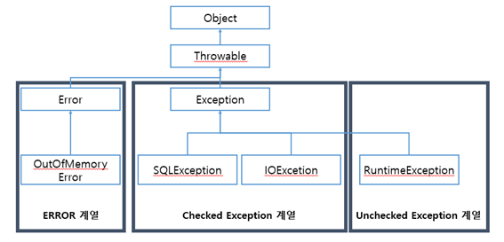

# <a style="color:#00adb5"><b>Exception Handling</b></a>

## Exception Handling 란 무엇일까?

### <a style="color:#00adb5"><b>예외 처리</b></a>
예외처리를 알기 전 에러와 예외의 차이를 알 필요가 있다.<br>

- <b>Error ( 에러 )</b><br>
메모리 부족, stack overflow와 같이 일단 <a style="color:red"><b>발생하면 복구할 수 없는 상황</b></a><br>
프로그램의 비 비정상적 종료를 막을 수 없다 -> 디버깅 필요<br>

- <b>Exception ( 예외 )</b><br>
읽으려는 파일이 없거나 네트워크 연결이 안되는 등 수습될 수 있는 비교적 상태가 약한 것들<br>
<a style="color:red"><b>프로그램 코드에 의해 수습될 수 있는 상황</b></a><br>

- <b>Exception Handling ( 예외 처리 )</b><br>
<a style="color:red"><b>예외 발생 시 프로그램의 비 정상 종료를 막고 정상적인 실행 상태를 유지하는 것 </b></a><br>
예외의 감지 및 예외 발생 시 동작할 코드 작성 필요<br>

### <a style="color:#00adb5"><b>예외 클래스의 계층</b></a>
모든 예외의 최고 조상은 Exception Class이다.<br>
Checked 계열과 Unchecked 계열로 나뉜다.<br><br>
<br><b>예외 클래스 계층</b><br>

- <b>Checked Exception 계열 ( = Exception class )</b><br>
외부적으로 발생할 수 있는 예외<br>
예외에 대한 대처 코드가 없으면 컴파일이 진행되지 않음<br>
FlieNotFoundException : 존재하지 않는 파일의 이름 입력<br>
ClassNotFoundException : 클래스의 이름을 잘못 입력 <br>
DataFormatException : 데이터 형식이 잘못 입력<br>
SQLException : SQL Server에서 경고 또는 오류를 반환<br>
IOException : I/O 오류가 발생 <br><br>

- <b>Unchecked Exception 계열 ( = RuntimeException class)</b><br>
프로그래밍 요소들과 관계가 깊다. <br>
예외에 대한 대처 코드가 없더라도 컴파일은 진행 된다.<br>
RuntimeException의 하위 클래스들<br>
ArithmeticException : 0으로 나누려고 하는 경우<br>
NullPointerException : 값이 null인 참조변수의 멤버를 호출<br>

### <a style="color:#00adb5"><b>Throwable의 주요 메서드</b></a>
- <b>public String getMessage()</b><br>
발생된 에외에 대한 구체적인 메세지를 반환
- <b>public Throwable getCause()</b><br>
예외의 원인이 되는 Throwable 객체 또는 null을 반환
- <b>public void printStackTrace()</b><br>
예외가 발생된 메서드가 호출되기까지의 메서드 호출 스택을 출력.<br>
디버깅의 수단으로 주로 이용<br>

### <a style="color:#00adb5"><b>try ~ catch 문</b></a>
다음은 try ~ catch문이다.<br>
```java
try{
    //예외가 발생할 수 있는 코드
}catch(Exception e){    //던진 예외를 받음
    //예외가 발생했을 때 처리할 코드
}
```
<b>try문에서 예외가 발생 하면</b>
- JVM이 해당 Exception 클래스의 객체 생성 후 던진다(throw)<br>
- 던져진 exception 을 처리할 수 있는 catch 블록에서 받은 후 처리한다.<br>
- 정상적으로 처리되면 try~catch문을 벗어나 다음 문장을 진행한다.<br>
<br>

<b>try문에서 예외가 발생하지 않으면</b><br>
- catch문을 거치지 않고 try ~ catch 블록의 다음 문장을 진행한다.<br>

### <a style="color:#00adb5"><b>다중 Exception Handling</b></a>
<b>try 블록에서 여러 종류의 에러가 발생할 경우</b>
- 하나의 try 블록에 여러 개의 catch 블록 추가 가능
- JVM이 던진 예외는 catch 문장을 찾을 때는 다형성이 적용된다.
- 상위 타입의 예외가 먼저 선언되는 경우 뒤에 등장하는 catch 블록은 동작할 기회가 없다.
- 상속 관계에서는 작은 범위( 자식 )에서 큰 범위( 조상 )순으로 정의
- 상속 관계가 없는 경우 무관
<br>
다중 예외 처리를 이용한 Checked Exception 처리
- 발생하는 예외들을 하나로 처리 (ex) (Exception e) 
- 가급적이면 예외 상황 별로 처리하는 것을 권장
<br>
심각하지 않은 예외를 굳이 세분화해서 처리하는 것도 닝바<br>
- '\|' 를 이용해 catch문에서 상속관계가 없는 여러 개의 exception 처리

### <a style="color:#00adb5"><b>try ~ catch ~ finally 구문</b></a>
finally는 <a style="color:red"><b>예외 발생 여부와 상관 없이 언제나 실행</b></a><br>
중간에 return 문을 만나도 finally 블록을 먼저 수행 후 리턴 실행<br>

```java
try{
    //예외가 발생할 수 있는 코드
}catch(Exception e){    //던진 예외를 받음
    //예외가 발생했을 때 처리할 코드
}finally{
    // try block에서 접근했던 System 자원의 안전한 원상복구
}
```

try ~ catch ~ finally 의 주요 목적은 <a style="color:red"><b>try블록에서 사용한 리소스 반납</b></a>이다.<br>
생성한 시스템 자원을 반납하지 않으면 장래 resource leak 발생 가능<br>
-> close 처리<br>


### <a style="color:#00adb5"><b>throw 키워드</b></a>
throw 키워드를 통한 처리 위임<br>
- <a style="color:red"><b>예외가 없어지는게 아니라 단순히 전달</b></a> <br>
- 예외를 전달받은 메서드는 다시 예외 처리의 책임 발생<br>
- 처리하려는 예외의 조상 타입으로 throws 처리 가능<br>
- Checked exception은 반드시 try ~ catch 나 throws 필요<br>
- Unchecked exception은 throws 안해도 전달되지만 결국은 try ~ catch로 처리해야함<br>

### <a style="color:#00adb5"><b>try ~ with ~ resources</b></a>
JDK 1.7 이상에서 <a style="color:red"><b>리소스의 자동 close 처리</b></a><br>
객체들이 AutoCloseable interface가 구현해 있으면 finally 역할을 해준다.

### <a style="color:#00adb5"><b>사용자 정의 예외</b></a>
<a style="color:red"><b>API에 정의된 예외 이외에 필요에 따라 사용자 정의 예외 클래스 작성</b></a><br>
대부분 Exception 또는 RuntimeException 클래스 상속받아 작성<br><br>
- <b>Checked exception 활용 </b><br>
코드는 복잡해지지만 오류 발생 가능성 줄어듦<br>
명시적 예외 처리 또는 throws 필요<br>
- <b>Unchecked exception 활용</b><br>
묵시적 예외 처리 가능<br>
코드는 간결해지지만 예외 처리 누락 가능성 발생<br>

사용자 정의 장점<br>
객체의 활용 - 추가정보, 기능 활용 가능<br>
코드의 재사용 - 동일한 상황에서 예외 객체 재사용 가능<br>
throws 메커니즘의 이용 - 중간 호출 단계에서 return 불필요<br>

## Exception Handling 를 사용하는 이유?
<a style="color:red"><b>프로그램의 비정상 종료를 막고 정상적인 실행상태를 유지하는 것 !!</b></a><br>
그리고 후에 디버깅 시에도 많은 도움을 얻을 수 있다.<br>
Throwable의 printStackTrace는 메서드 호출 스택 정보 조회까지 가능하여 디버깅 시 활용 가능<br>

## Exception Handling 실습 해보즈아 !

### <a style="color:#00adb5"><b>try ~ catch문</b></a>


```java
public class Exception {
	public static void main(String[] args) {

		int[] arr = { 1 };        // 배열 선언 , 크기 = 1

		try {
			System.out.println(arr[1]);    // 2번째 배열 호출 -> 오류
		} catch (ArrayIndexOutOfBoundsException e) {    
			System.out.println("배열 크기 확인 !!");    // 오류시 출력
		}
		System.out.println("프로그램 종료");
	}
}
```

<a style="color:#00adb5"><b>출력 결과</b></a><br>
배열 크기 확인 !!<br>
프로그램 종료<br>

<hr>
크기가 1인 배열을 선언하고 2번째 배열을 호출 했을 때 배열의 크기보다 큰 인덱스를 호출하였으므로 예외가 발생. 그래서 catch 블록에서 ArrayIndexOutOfBoundsException를 받아 예외 처리를 진행 하였다.<br>

<hr>

### <a style="color:#00adb5"><b>try ~ catch ~ finally</b></a>

```java
public class Exception_finally {
	public static void main(String[] args) {
		int[] arr = { 1 };

		try {
			System.out.println(arr[1]);
		} catch (ArrayIndexOutOfBoundsException e) {
			System.out.println("배열 크기 확인 !!");
		}finally {      // finally문 무조건 실행
			System.out.println("무조건 실행");
		}
		} 
}
```
<a style="color:#00adb5"><b>출력 결과</b></a><br>
1<br>
무조건 실행

<hr>

try ~ catch 문에 finally를 붙였다.<br>
예외가 발생하든 안하든 무조건 finally문을 실행한다.<br>
<hr>

### <a style="color:#00adb5"><b>사용자 정의 예외</b></a>

```java
class FruitNotFoundException extends Throwable {
	public FruitNotFoundException(String name) {
		System.out.println(name + "에 해당하는 과일은 없습니다.");
	}
}

public class Test {
	public static String[] arr = {"사과", "오렌지", "포도"};
	public static void main(String[] args) {
		try {
			String name = "토마토";
			for(int i=0; i<arr.length; i++) {
				if(arr[i].equals(name)) {
					arr[i] = null;
				}
			}
			throw new FruitNotFoundException(name);
		}catch(FruitNotFoundException e) {
			e.getMessage();
		}
	}
}
```
<a style="color:#00adb5"><b>출력 결과</b></a><br>
토마토에 해당하는 과일은 없습니다.

<hr>
FruitNotFoundException 이라는 사용자 정의 예외 클래스를 만들었다.<br>
<hr>

## Exception Handling 마무리
기존에 try ~ catch 문을 가지고 예외 처리 한다는 것을 알고는 있었지만<br>
더욱 예외 처리의 중요성과 필요성에 대해 알게 되었고, 프로젝트 개발 때는 더 신중하게 예외처리를 해야겠다고 생각하게 되었다.<br>
좋은 프로그램은 예외 처리가 잘 되어있어야 한다 😏

<br><br><br><br>
참조<br>
<a href="https://rebeccacho.gitbooks.io/java-study-group/content/chapter8.html" target=_blank>https://rebeccacho.gitbooks.io/java-study-group/content/chapter8.html</a>