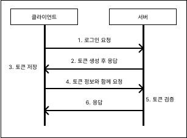
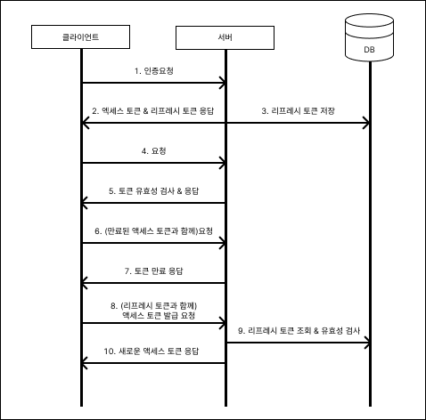

# JWT를 이용한 로그인 유지

---

> 서버에서 올바른 사용자 인지를 식별하는 방법은 크게 두가지로 나눌 수 있다.  
> 서버 기반 인증과 토큰 기반 인증으로 나눌 수 있으며 Spring Security는 Session기반의 인증을 제공해 준다.
> 이 포스팅에서는 토큰 기반 인증방식을 JWT를 이용하여 설명해 보겠다.

---

### 동작 원리
1. 사용자는 서버로 ID, Password 등 사용자를 식별할 수 있는 값들을 서버로 보냄
2. 서버는 사용자가 보내온 값들을 서버에 저장되어 있는 값들과 비교하여 올바른 요청이 맞는지 판단
3. 올바른 요청이 맞다 면 사용자에게 인가 되었다는 정보가 담긴 JWT토큰을 발행해 사용자에게 보냄
4. 사용자는 인가 된 정보가 담긴 JWT 토큰을 받아 두었다가 서버에 요청을 보낼 때 마다 토큰을 같이 보냄
5. 서버는 사용자가 보내온 요청과 함께 토큰을 검증하여 토큰에 유효성 검사가 통과되면 사용자의 요청을 수행함

### 사진 참고


---

### 특징
1. 무상태성
	- 사용자의 인증 정보가 담겨 있는 토큰이 서버가 아닌 클라이언트에 있으므로 서버에 저장할 필요가 없다.
	- 서버에 요청을 보낼 수 있는 사용자 명단을 서버가 관리하지 않아 서버 리소스를 아낄 수 있다.
	- 사용자의 인증 상태를 유지하면서 이후 요청을 처리하는 것을 상태 관리라고 하는데 토큰을 이용하면 서버에서 상태 관리를 하지 않게 되어 무상태성이 된다.
2. 확장성
	- 서버를 증설하거나 다른 서버의 서비스랑 연계해야 할 때 각각의 서버마다 상태 연동이 필요하지 않아 확장에도 용이하다.
3. 무결성
	- 토큰 방식은 HMAC(hash-dased message authentication) 기법이라고도 부르는데 이는 토큰 발급 이후에는 토큰 정보를 변경하지 못한다는 것을 의미한다.
	- 토큰이 발행된 이후에 수정할 수 없기 때문에 무결성이 보장된다.


---

### JWT( Json Web Token)

토큰 기반의 인증을 수행하기 위해서는 사용자에게 여러 방법으로 토큰을 보내줄 수 있다.
토큰을 쿠키에 담아 전송도 가능하며 HTTP 요청 헤더 중에 Authorization의 키 값으로 사용자에게 전달하는 등의 방법들이 있다.

여기서는 HTTP 요청 헤더에 Authorization의 키 값을 이용하는 방법으로 설명할 것이다.

#### JWT 사용 예시
- HTTP 요청 헤더에 Authorization의 키 값을 입력할 때 "bearer" + "JWT 토큰값"을 넣어 보내야 한다.

> 객체 상태 예시
```json
// Request Headers
{
	...생략
	Authorization:"bearer 헤더.내용.서명"
}
```

---

#### JWT 구조
> JWT는 헤더(header).내용(payload).서명(signature) 구조를 갖는다.

1. 헤더(header)
	- 헤더에는 토큰 타입과 해싱 알고리즘을 지정하는 정보를 담고 있다.
2. 페이로드(payload) = 내용
	- 페이로드에는 토큰과 관련된 정보를 담는다.
	- 내용의 한 덩어리를 **클레임**이라고 부른다.
	- 클레임은 키값의 한 쌍을 이룬다.
	- 클레임은 등록된 클레임, 공개 클레임, 비공개 클레임으로 나눌 수 있다.
	- 등록된 클레임 : 토큰에 대한 정보를 담는 데 사용한다.
	- 공개 클레임 : 
		- 공개되어도 상관없는 크레임을 의미한다.
		- 충돌을 방지할 수 있는 이름을 가져야 한다.
		- 보통 클레임 이름을 URI로 짓는다.
	- 비공개 클레임 : 
		- 공개되면 안 되는 클레임을 의미한다. 
		- 클라이언트와 서버 간의 통신에 사용된다.	
		```json
		{
			"iss" : "email@naver.com", //등록된 클레임
			"iat" : 1234238402, //등록된 클레임
			"exp" : 123124235235, //등록된 클레임
			//공개 클레임
			"https://mydomainaddress.com/jwt_claims/is_admin": true,
			"email" : "email@naver.com", //비공개 클레임
			"hello" : "안녕하세요!" //비공개 클레임
		}
		```
	- iss, iat, exp는 JWT 자체에서 등록된 클레임이다.
	- 이 외의 등록된 클레임도, 공개 클레임도 아닌 클레임들은 비공개 클레임이다.
1. 시그니처(signature) = 서명
	- 서명은 해당 토큰이 조작되었거나 변경되지 않았음을 확인하는 용도로 사용함.
	- 헤더의 인코딩 값과 내용의 인코딩값을 합친 후에 주어진 비밀키를 사용해 해시값을 생성한다.

---

### 리프레시 토큰
> 토큰에는 유효 기간이 존재한다.

#### 리프레시 토큰이 필요한 이유
토큰은 서버에서 관리되는 것이 아니기 때문에 토큰이 탈취되면 탈취된 토큰을 무력화 시키는 것은 매우 어려운 일이다. 토큰 기반의 인증은 이러한 문제점들을 해결하고자 유효 기간이라는 것을 명시하여 유효 기간이 지나면 토큰이 폐기될 수 있도록 하였다.
유효 기간이 너무 길면 탈취당한 토큰이 오래 살아있게 되어 보안에 취약해지고 너무 짧은 유효기간을 설정하면 그만큼 많은 양의 토큰을 다시 발행해야 하기 때문에 사용자들은 짧은 시간마다 로그인을 다시 요청하게 되는 번거로움이 발생 된다.
위 문제를 해결하기 위해 리프레시 토큰이란 것이 존재한다.

#### 동작순서


