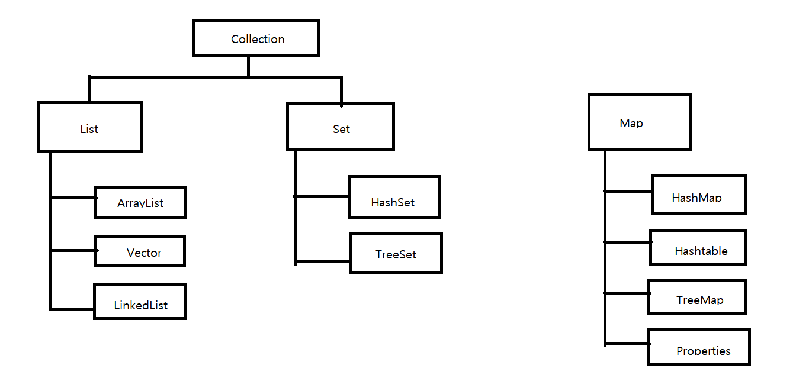

> ### 컬렉션 프레임워크

- 컬렉션이란 요소를 수집해서 저장하는 것을 뜻함
- 객체를 수집해서 저장하는 역할
- 프레임워크란 사용방법을 미리 정해 놓은 라이브러리
- 주요 인터페이스 List, Set, Map

- 인터페이스의 아래 있는 것들은 인터페이스를 구현한 클래스이다

> ##### List 컬렉션

~~~java
List<String> list = ...;
// 맨끝에 객체 추가
list.add("홍길동");
// 지정된 인덱스에 객체 삽입
list.add(1, "신용권");
// 인덱스로 객체 찾기
String str = list.get(1);
// 인덱스로 객체 삭제
list.remove(0);
// 객체 삭제
list.remove("신용권");
~~~

> ArrayList 구현 클래스

- 일반 배열과 다르게 저장용량을 초과한 객체들이 들어오면 자동적으로 저장 용량이 늘어난다
- 기본생성자로 생성하면 내부에 10개의 객체를 저장할 수 있는 초기 용량을 가지게 된다
- 객체를 추가하면 0부터 차례대로 저장되고, 중간에 특정 인덱스를 삭제하면 모두 당겨진다
- 그래서 빈번한 객체 삭제와 삽입이 일어나느 ㄴ곳에서는 LinkedList가 더 좋다.
- 그러나 인덱스 검색이나, 맨 마지막에 객체를 추가하는 경우에는 ArrayList가 더 좋다

> Vector

- ArrayList와 다른점은 Vector는 동기화된 메소드로 구성되어 있기 때문에 멀티 스레드가 동시에 이 메소드들을 실행할 수 없고,

  하나의 스레드가 실행을 완료해야만 다른 스레드를 실행 할 수 있다

- 멀티 스레드 환경에서 안전하게 객체를 추가, 삭제할 수 있다

> LinkedList

- ArrayList는 내부 배열에 객체를 저장해서 인덱스로 관리하지만,

  LinkedList는 인접 참조를 링크해서 체인처럼 관리한다

- LinkedList에서 특정 인덱스의 객체를 제거하면 앞뒤 링크만 변경되고 나머지 링크는 변경되지 않는다

- 그래서 중간에 추가/삭제가 많은 작업이면 속도가 빠르단

- 삽입도 마찬가지

- 처음 생성시 링크가 없기 때문에 비어 있다

> ##### Set 컬렉션

- 저장 순서가 유지되지 않는다

- 또한, 객체를 중복해서 저장할 수 없고, 하나의 null만 저장할 수 있다

- 수학의 집합과 비슷한 형태, 원안에 들어가 있다고 보면 된다

- Set 컬렉션은 인덱스로 객체를 검색해서 가져오는 메서드가 없다.

  대신, 전체 객체를 대상으로 한번씩 반복해서 가져오는 반복자(Iterator)를 제공한다

~~~java
Set<String> set = ...;
Iterator<String> iterator = set.iterator();
// hasNext() 메소드는 객체 있으면 true, 없으면 false
while(iterator.hasNext()) {
    // String 객체 하나를 가져옴
    // next() 메소드는 하나의 객체를 가져옴
    String str = iterator.next();
}
~~~

- Iterator을 사용하지 않아도 향샹된 for문을 이용해서 전체 객체를 반복할 수 있다

~~~java
Set<String> set = ...;
for(String str : set) {
    
}
~~~

> HashSet

- HashSet은 객체들을 순서 없이 저장하고 동일한 객체는 중복 저장하지 않는다
- 동일한 객체 판단은 hashCode() 메소드를 호출해서 해시코드를 비교하고, 해시코드가 같다면 equals() 메소드로 비교한다

~~~java
Set<Member> set = new HashSet<Member>();

// 두개가 인스턴스는 다르지만 내부 데이터가 동일하므로 객체 1개만 저장
set.add(new Member("홍길동", 30));
set.add(new Member("홍길동", 30));

System.out.println(set.size()); // 저장된 객체 수 1개
~~~

> ##### Map 컬렉션

- Map 컬렉션은 키(Key)와 값(Value)으로 구성된 Entry 객체를 저장하는 구조
- 키와 값 모두 객체이다
- 키는 중복 저장이 안되지만, 값은 중복 저장 가능하다
- 기존의 키와 동일한 키로 값을 저장하면 기존의 값은 없어진다

~~~java
Map<String, Integer> map = ...;
// 객체 추가
map.put("홍길동", 30);
// 객체 찾기
int score = map.get("홍길동");
// 객체 삭제
map.remove("홍길동");
~~~

- 저장된 전체 객체를 대상으로 하나씩 얻고 싶을 경우에는 두가지 방법

  1. keySet() 메소드로 모든 키를 Set 컬렉션으로 얻은 다음, 반복자를 통해 키를 하나씩 얻고 get() 메소드를 통해 값을 얻는다

     ~~~java
     Map<K, V> map = ...;
     Set<K> keySet = map.keySet();
     Iterator<K> keyIterator = keySet.iterator();
     while(keyIterator.hasNext()) {
         K key = keyIterator.next();
         V value = map.get(key);
     }
     ~~~

  2. entrySet() 메소드로 모든 Map.Entry를 Set 컬렉션으로 얻은 다음,

     반복자를 통해 Map.Entry를 하나씩 얻고 getKey() 와 getVale() 메소드를 이용해 키와 값을 얻으면 된다

     ~~~java
     Map<K, V> map = ...;
     // 키와 값을 쌍을 이루고 있는 Map.Entry 객체를 Set에 담아서 리턴
     Set<Map.Entry<K, V>> entrySet = map.entrySet();
     Iterator<Map.Entry<K, V>> entryIterator = entrySet.iterator();
     while(entryIterator.hashNext()) {
         Map.Entry<K, V> entry = entryIterator.next();
         K key = entry.getKey();
         V value = entry.getValue();
     }
     ~~~

> HashMap

- HashMap은 Map 인터페이스를 구현한 대표적인 Map 컬렉션이다
- 동일한 키 조건은 hashCode()의 리턴값이 같아야 하고, equal() 메소드가 true를 리턴해야 한다
- 키의 값의 타입은 기본 타입은 사용할 수 없고 클래스 및 인터페이스 타입만 가능하다

~~~java
Map<Stirng, Object> map = new HashMap<Stirng, Object>();
~~~

> Hashtable

- Hashtable은 HashMap과 동일한 내부 구조

- Hashtable은 동기화 메소드로 구성되어 있기 때문에 멀티 스레드가 동시에 이 메소드들을 실행할 수는 없고,

  하나의 스레드가 실행을 완료해야만 다른 스레드로 실행할 수 있다

> ##### 검색 기능을 강화시킨 컬렉션

- TreeSet와 TreeMap을 제공한다
- 이 컬렉션들은 이진 트리를 이용해서 계층적 구조를 가지면서 객체를 저장한다
- 계층적 구조로 루드 노드라는 하나의 노드에서 시작해서 각 노드당 최대 2개의 노드를 연결할 수 있는 구조

> TreeSet

- TreeSet은 이진 트리를 기반으로 한 Set 컬렉션이다
- 하나의 노드에는 노드값인 value와 왼쪽과 오른쪽 노드를 참조하기 위한 두개의 변수로 구성된다
- 부모의 값과 비교해서 낮으면 왼쪽 자식 노드, 높은 것은 오른쪽 자식 노드에 저장

> TreeMap

- TreeSet과의 차이점은 키와 값이

