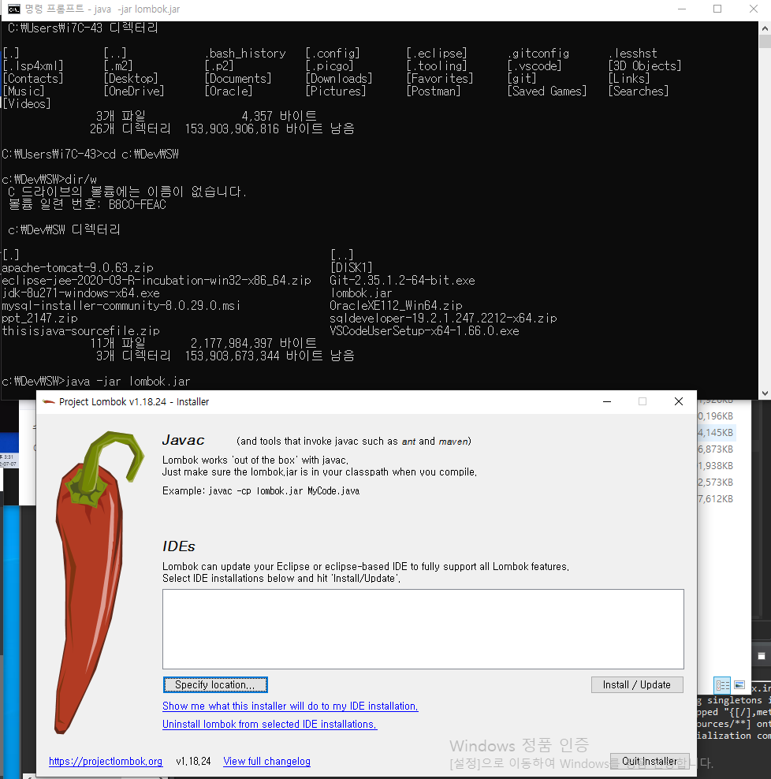
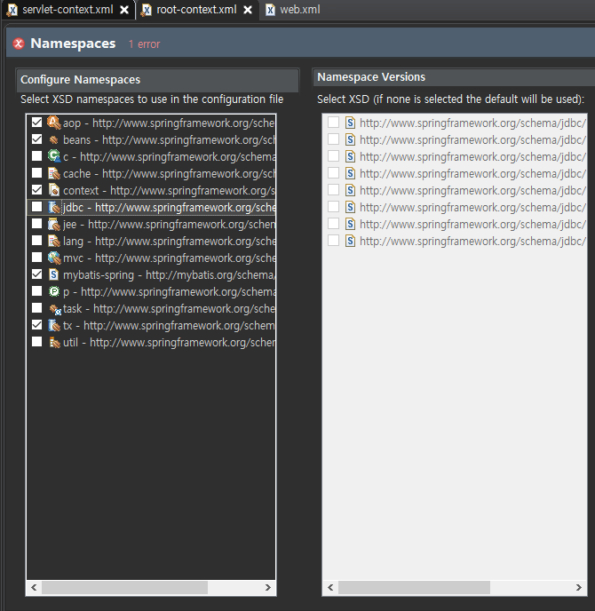

> ### STS 설치

해당 경로에 들어가서 아래 링크를 추가로 설치한다

이클립스 새로 설치해서 다시 연결했더니 정상 작동됨

https://download.springsource.com/release/TOOLS/update/3.9.15.RELEASE/e4.18/

이클립스 실행파일 선택하고 실행

톰캣 및 인코딩 설정

root-context.xml 설정

