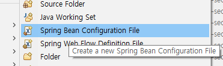

> ### 스프링시큐리티 라이브러리 추가

~~~xml
	    <!--스프링시큐리티 web 라이브러리-->                          
        <dependency>
            <groupId>org.springframework.security</groupId>
            <artifactId>spring-security-web</artifactId>
            <version>4.1.0.RELEASE</version>
        </dependency>
        <!--스프링시큐리티 core 라이브러리-->
        <dependency>
            <groupId>org.springframework.security</groupId>
            <artifactId>spring-security-core</artifactId>
            <version>4.1.0.RELEASE</version>
        </dependency>
        <!--스프링시큐리티 config 라이브러리-->
        <dependency>
            <groupId>org.springframework.security</groupId>
            <artifactId>spring-security-config</artifactId>
            <version>4.1.0.RELEASE</version>
        </dependency>
~~~

spirng 폴더에 spring-security 파일생성

그리고 web.xml에도 새로운 파일을 쓰기 위해서 추가를 해줘야 한다

~~~xml
<!-- The definition of the Root Spring Container shared by all Servlets and Filters -->
<context-param>
	<param-name>contextConfigLocation</param-name>
	<param-value>
		/WEB-INF/spring/root-context.xml
		/WEB-INF/spring/spring-security.xml
	</param-value>
</context-param>
~~~

spring-security 파일에 bean 생성

~~~xml
<?xml version="1.0" encoding="UTF-8"?>
<beans xmlns="http://www.springframework.org/schema/beans"
	xmlns:xsi="http://www.w3.org/2001/XMLSchema-instance"
	xmlns:security="http://www.springframework.org/schema/security"
	xsi:schemaLocation="http://www.springframework.org/schema/security http://www.springframework.org/schema/security/spring-security-4.1.xsd
		http://www.springframework.org/schema/beans http://www.springframework.org/schema/beans/spring-beans.xsd">

	<bean id="bCryptPasswordEncoder" class="org.springframework.security.crypto.bcrypt.BCryptPasswordEncoder">
	</bean>

</beans>
~~~

bean에 생성된 클래스 컨트롤러에 주입

~~~java
// 스프링시큐리티 암호화 라이브러리 클래스 주입
@Autowired
private BCryptPasswordEncoder bCryptPasswordEncoder;
~~~

회원가입 내용이 저장되는 곳에서 일반 비밀번호를 인코더 작업

~~~java
// 회원가입
@PostMapping("/join") //MemberVO vo = new MemberVO(); -> 스프링이 객체생성을 자동으로 해줌
public String join(MemberVO vo, RedirectAttributes rttr) throws Exception {

    // vo.getMem_pw(); : 평문텍스트 비밀번호

    String cryptEncoderPW = bCryptPasswordEncoder.encode(vo.getMem_pw());

    log.info("평문텍스트 비밀번호 : " + vo.getMem_pw());
    log.info("암호화 된 텍스트 비밀번호 : " + cryptEncoderPW);
    log.info("암호화 된 텍스트 비밀번호 길이 : " + cryptEncoderPW.length());

    if(vo.getMem_accept_e().equals("on")) {
        vo.setMem_accept_e("Y");
    }

    log.info(vo); // vo.toString()

    service.join(vo);

    return ""; // 회원가입 후 이동할 주소
}
~~~

그리고 로그인 하는 컨트롤러에서 입력한 비밀번호와 데이터베이스의 비밀번호를 일치하는 작업에서 아래처럼 변경을 한다

> ***bCryptPasswordEncoder.matches(passwd, db_passwd)***

bCryptPasswordEncoder는 라이브러리를 통해서 주입된 변수

