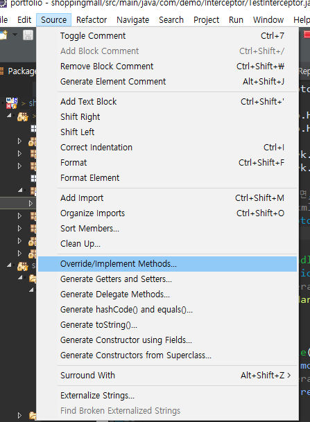
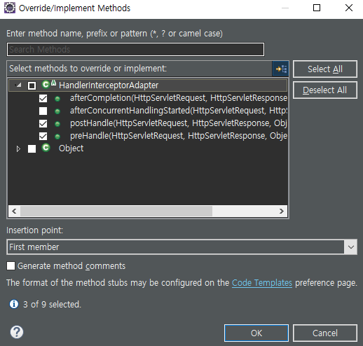

> ## Interceptor 인터셉터

Interceptor 패키지 및 클래스 생성

에서 이용할 것들 선택해서 Override

***이후 servlet-context.xml에서 bean 및 interceptors 설정하기***

~~~xml
<!-- 인터셉터 클래스 bean 설정 -->
<beans:beans id="testInterceptor" class="com.demo.Interceptor.TestInterceptor"></beans:beans>

<!-- 인터셉터에 제어를 받을 매핑주소 설정 -->
<interceptors>
    <interceptor>
        <!-- 인터셉터에 영향을 받을 주소 넣기 -->
        <mapping path=""/>
        <!-- 인터셉터에 영향을 받지 않는 주소 넣기 -->
        <exclude-mapping path=""/>
        <!-- 인터셉터 클래스의 bean id를 가져와서 넣기 -->
        <beans:ref bean="testInterceptor"/>
    </interceptor>
</interceptors>
~~~

Sample Interceptor class

> ### Interceptor 클래스

- doA 주소요청 : DispatcherServlet 객체담당
  1) 인터셉터가 존재 할 경우
     preHandle -> doA주소에 매핑된 메서드 -> postHandle -> doA주소에 매핑된 메서드 리턴된 뷰(jsp) 작업 -> afterCompletion
  2) 인터셉터가 존재 안할 경우
     doA주소에 매핑된 메서드 -> doA주소에 매핑된 메서드 리턴된 뷰(jsp) 작업

~~~java
package com.demo.Interceptor;

import javax.servlet.http.HttpServletRequest;
import javax.servlet.http.HttpServletResponse;

import org.springframework.web.servlet.ModelAndView;
import org.springframework.web.servlet.handler.HandlerInterceptorAdapter;

// 클래스가 인터셉터 기능을 갖게 하려면, HandlerInterceptorAdapter 추상클래스를 상속 및 메서드 구현
// 설정 : servlet-context.xml에 클래스정보를 등록해야 한다
public class TestInterceptor extends HandlerInterceptorAdapter {

	@Override
	public boolean preHandle(HttpServletRequest request, HttpServletResponse response, Object handler)
			throws Exception {
		// TODO Auto-generated method stub
		return super.preHandle(request, response, handler);
	}

	@Override
	public void postHandle(HttpServletRequest request, HttpServletResponse response, Object handler,
			ModelAndView modelAndView) throws Exception {
		// TODO Auto-generated method stub
		super.postHandle(request, response, handler, modelAndView);
	}

	@Override
	public void afterCompletion(HttpServletRequest request, HttpServletResponse response, Object handler, Exception ex)
			throws Exception {
		// TODO Auto-generated method stub
		super.afterCompletion(request, response, handler, ex);
	}

	
}
~~~

> ### Interceptor에서 작업하기

클래스가 인터셉터 기능을 갖게 하려면, HandlerInterceptorAdapter 추상클래스를 상속 및 메서드 구현
설정 : servlet-context.xml에 클래스정보를 등록해야 한다

~~~java
package com.demo.Interceptor;

import javax.servlet.http.HttpServletRequest;
import javax.servlet.http.HttpServletResponse;
import javax.servlet.http.HttpSession;

import org.springframework.web.servlet.ModelAndView;
import org.springframework.web.servlet.handler.HandlerInterceptorAdapter;

import com.demo.domain.MemberVO;

//클래스가 인터셉터 기능을 갖게 하려면, HandlerInterceptorAdapter 추상클래스를 상속 및 메서드 구현
//설정 : servlet-context.xml에 클래스정보를 등록해야 한다
public class LoginInterceptor extends HandlerInterceptorAdapter {

	@Override
	public boolean preHandle(HttpServletRequest request, HttpServletResponse response, Object handler)
			throws Exception {
		
		boolean result = false;
		
		// 인증된 사용자인지 여부를 체크. 세션객체를 확인
		HttpSession session = request.getSession();
		MemberVO user = (MemberVO) session.getAttribute("loginStatus");
		
		if(user == null) { // 로그인 인증안됨
			result = false;
			getDestination(request); // 원래 요청한 주소 저장
			response.sendRedirect("/member/login");
		} else { // 로그인 인증됨
			result = true;
		}
		
		return result; // true 면, 다음진행은 컨트롤러로 제어가 넘어간다
	}

	// 로그인 하지 않은 상태에서 웹페이지 이동중 마지막 세션을 저장해서 로그인 시 마지막세션으로 이동하게 해준다
	private void getDestination(HttpServletRequest request) {
		// TODO Auto-generated method stub
		String uri = request.getRequestURI(); // 브라우저에서 요청된 값의 주소. /product/cart
		String query = request.getQueryString(); // /product/cart?pdt_num=10의 주소 뒤에 있는 변수값
		
		if(query == null || query.equals("null")) {
			query = "";
		} else {
			query = "?" + query;
		}
		
		String destination = uri + query; // /product/cart?pdt_num10 or /product/cart
		
		if(request.getMethod().equals("GET")) {
			// 사용자가 비로그인 상태에서 요청한 원래 주소를 세션으로 저장해둔다
			request.getSession().setAttribute("dest", destination);
		}
	}

	@Override
	public void postHandle(HttpServletRequest request, HttpServletResponse response, Object handler,
			ModelAndView modelAndView) throws Exception {
		// TODO Auto-generated method stub
		super.postHandle(request, response, handler, modelAndView);
	}

	@Override
	public void afterCompletion(HttpServletRequest request, HttpServletResponse response, Object handler, Exception ex)
			throws Exception {
		// TODO Auto-generated method stub
		super.afterCompletion(request, response, handler, ex);
	}

}

~~~

위처럼 만들고

다시 servlet-context.xml에서 bean 설정 해준다

~~~xml
<!-- 로그인 인터셉터 -->
<beans:bean id="loginInterceptor" class="com.demo.Interceptor.LoginInterceptor"></beans:bean>
<interceptors>
    <interceptor>
        <!-- 인터셉터에 영향을 받을 주소 넣기 -->
        <mapping path="/member/modify"/>
        <mapping path="/member/confirmPW"/>
        <mapping path="/user/cart/*"/>
        <mapping path="/user/order/*"/>

        <!-- 인터셉터에 영향을 받지 않는 주소 넣기 -->
        <exclude-mapping path=""/>
        <!-- 인터셉터 클래스의 bean id를 가져와서 넣기 -->
        <beans:ref bean="loginInterceptor"/>
    </interceptor>
</interceptors>
~~~

로그인 해야 진행 할 수 있는 (보통은) GET 주소를 넣어준다

그래서 로그인 진행 성공할 때의 컨트롤러로 이동한다

~~~java
// preHandle() 메서드에서 세션형태로 저장한 것을 사용 로그인 전 마지막 보고 있던 주소
String dest = (String) session.getAttribute("dest");
// ()의 값이 true면 dest
// ()의 값이 false면 "/"
url = (dest != null) ? dest : "/";
~~~

마지막 세션을 불러와서 입력하고 그 값이 있다면 로그인 하자마자 해당 url로 가도록 연결해준다

> ### AJAX 요청인지 체크

추가로 ajax에 의한 요청인지 아닌지도 체크하는 작업을 진행 해야한다

먼저, ajax에서 보낸 header 정보와 일치하는지를 생성한다

~~~java
// ajax요청을 체크한다
private boolean isAjaxRequest(HttpServletRequest request) {

    boolean isAjax = false;

    // ajax구문에서 요청시 헤더에 AJAX : "true" 를 작업해 두어야 한다
    String header = request.getHeader("AJAX");
    if("true".equals(header)) { // ajax인 경우
        isAjax = true;
    } else {
        isAjax = false;
    }

    return isAjax;
}
~~~

그리고 이것을 가져와서 로그인단에서 다시 true이면 ajax요청이라는 것이고 이걸 이용해 다시 작업한다

~~~java
if(user == null) { // 로그인 인증안됨
    result = false;

    // Ajax요청인지 아닌지 체크
    if(isAjaxRequest(request)) { // true로 넘어오면 ajax요청
        response.sendError(400); // ajax요청시 에러 400 리턴

    } else {
        getDestination(request); // 원래 요청한 주소 저장
        response.sendRedirect("/member/login");
    }

} else { // 로그인 인증됨
    result = true;
}
~~~

이후 jsp에서 ajax작업 전에 Header을 보내줘서 ajax이면

success가 아니라 error로 받도록 작업한다

~~~javascript
$.ajax({
    url: '/user/cart/cart_add',
    data: { pdt_num :$("div#Modal_productDetail input#pdt_num").val(), cart_amount : $("div#Modal_productDetail input#pdt_amount").val() },
    dataType: 'text',
    beforeSend : function(xmlHttpRequest) {
        xmlHttpRequest.setRequestHeader("AJAX", "true");
    },
    success: function(result){

        if(result == "success"){
            alert("장바구니에 추가되었습니다");
            if(confirm("장바구니로 이동하시겠습니까?")){
                location.href="/user/cart/cart_list";
            }
        }

    },
    error: function(xhr, status, error){
        
        // 에러 났을 시 추가작업
        // ajax이면 인터셉터에서 400번 에러를 보내고 ajax에서 400번에러를 받으면 로그인 페이지로 연결
        if(xhr.status == 400){
            location.href = "/member/login";
        }
        
    }
});

~~~

> ### 관리자 인터셉터 주의사항

관리자(Admin)에서 인터셉터를 관리할 때 주소를 전체를 걸어버리고 로그인 화면만 제외 시키는 방법을 이용한다

servlet-context.xml 파일

~~~xml
<!-- 어드민 인터셉터 -->
<beans:bean id="adminInterceptor" class="com.demo.Interceptor.AdminInterceptor"></beans:bean>
<interceptors>
    <interceptor>
        <!-- 인터셉터에 영향을 받을 주소 넣기 -->
        <mapping path="/admin/**"/>
        <!-- 인터셉터에 영향을 받지 않는 주소 넣기 -->
        <exclude-mapping path="/admin/adLogin"/>
        <!-- 인터셉터 클래스의 bean id를 가져와서 넣기 -->
        <beans:ref bean="adminInterceptor"/>
    </interceptor>
</interceptors>
~~~

