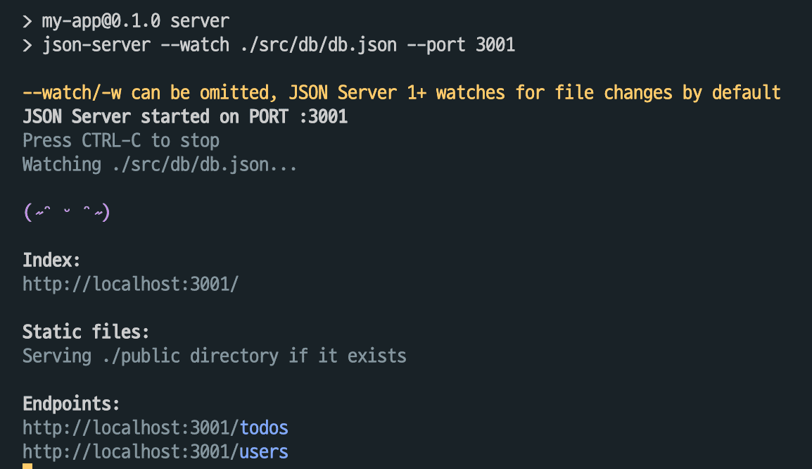
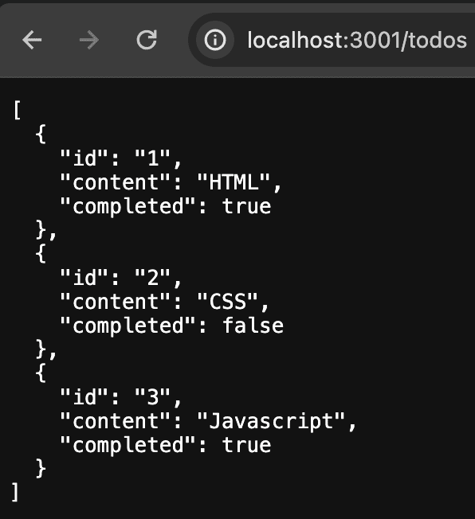
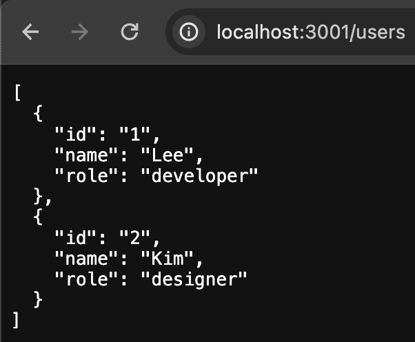

## json-server란?

json server 는 아주 짧은 시간에 REST API 를 구축해주는 라이브러리다. 빠르고 쉽게 REST API를 구축할 수 있지만, 프로덕션 전용은 아니기 때문에 소규모의 프로젝트나 공부 목적으로 사용하기 적합하다.

## 설치 및 시작

### 1. json server 설치

```
npm install json-server
```

### 2. db.json 파일 생성

리액트 app 을 사용하고 있어, src / db / db.json 파일을 생성한다. db.json 파일은 데이터베이스 역할을 한다.

**db.json**

```jsx
{
  "todos": [
    {
      "id": 1,
      "content": "HTML",
      "completed": true
    },
    {
      "id": 2,
      "content": "CSS",
      "completed": false
    },
    {
      "id": 3,
      "content": "Javascript",
      "completed": true
    }
  ],
  "users": [
    {
      "id": 1,
      "name": "Lee",
      "role": "developer"
    },
    {
      "id": 2,
      "name": "Kim",
      "role": "designer"
    }
  ]
}
```

### 3. json-server 실행

json-server가 db.json 파일을 watching하도록 실행한다.

📌 **json-server를 실행하는 두가지 방법**

1. **명령어를 바로 실행한다.**

```
//./src/db/db.json 부분은 자신의 파일 경로를 넣어주면 된다.
json-server --watch ./src/db/db.json --port 3001
```

> 3000 포트는 리액트 개발서버가 사용하는 기본 포트이기 때문에 포트를 3001으로 지정한다.

2. **package.json안에는 실행시킬 수 있는 script안에 명령어를 추가한다.**

```
"scripts": {
    "server": "json-server --watch ./src/db/db.json --port 3001"
  },
```

```
npm run server //명령어로 실행
```

### 4. 실행 결과 확인

json-server 를 실행하시면 터미널에 다음과 같이 결과물이 뜬다.



그러면 우리의 가짜 API 서버가 3001 포트로 열리고 링크를 통해 들어가 데이터를 확인할 수 있다.

- http://localhost:3001/todos
- http://localhost:3001/users

<p align="center" width="80%">
  
  
</p>

## API 요청하기

서버가 준비 완료되면, 실제 API 를 요청하게 구현할 수 있다.

### 1. axios 설치

Axios는 자바스크립트에서 HTTP 통신을 쉽게 처리할 수 있도록 만든 라이브러리다.

```
npm install axios
```

### 2. API를 요청하는 파일

```jsx
import axios from 'axios'

export const getPosts = async () => {
  const response = await axios.get('http://localhost:3001/todos')
  return response.data
}

export const getPostById = async (id) => {
  const response = await axios.get(`http://localhost:3001/users/${id}`)
  return response.data
}
```

> `get` 을 통해서 데이터를 불러온다.

참조  
https://redux-advanced.vlpt.us/3/01.html  
https://poiemaweb.com/json-server
