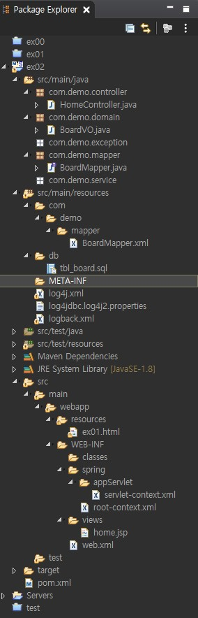

> ### 앞으로 사용할 게시판 환경구축

CONSTRAINT PK_BOARD 인덱스 설정해서

배열이 order을 사용하지 않아도 정렬될 수 있도록 한다

~~~sql
-- sql ezen에 테이블 및 시퀀스 생성 작업
CREATE TABLE TBL_BOARD(
    BNO     NUMBER CONSTRAINT PK_BOARD PRIMARY KEY, -- 글번호
    TITLE   VARCHAR2(100)   NOT NULL, -- 제목
    CONTENT VARCHAR2(4000)  NOT NULL, -- 내용
    WRITER  VARCHAR2(100)   NOT NULL, -- 작성자
    REGDATE DATE    DEFAULT SYSDATE -- 등록일
);

CREATE SEQUENCE SEQ_BOARD;
~~~

~~~xml
<!-- pom.xml 설정 -->

<?xml version="1.0" encoding="UTF-8"?>
<project xmlns="http://maven.apache.org/POM/4.0.0" xmlns:xsi="http://www.w3.org/2001/XMLSchema-instance"
	xsi:schemaLocation="http://maven.apache.org/POM/4.0.0 https://maven.apache.org/maven-v4_0_0.xsd">
	<modelVersion>4.0.0</modelVersion>
	<groupId>com.demo</groupId>
	<artifactId>controller</artifactId>
	<name>ex02</name>
	<packaging>war</packaging>
	<version>1.0.0-BUILD-SNAPSHOT</version>
	<properties>
		<java-version>1.8</java-version>
		<org.springframework-version>5.0.7.RELEASE</org.springframework-version>
		<org.aspectj-version>1.6.10</org.aspectj-version>
		<org.slf4j-version>1.6.6</org.slf4j-version>
	</properties>
	<dependencies>
	
		<!-- Spring -->
		<dependency>
			<groupId>org.springframework</groupId>
			<artifactId>spring-context</artifactId>
			<version>${org.springframework-version}</version>
			<exclusions>
				<!-- Exclude Commons Logging in favor of SLF4j -->
				<exclusion>
					<groupId>commons-logging</groupId>
					<artifactId>commons-logging</artifactId>
				 </exclusion>
			</exclusions>
		</dependency>
		<dependency>
			<groupId>org.springframework</groupId>
			<artifactId>spring-webmvc</artifactId>
			<version>${org.springframework-version}</version>
		</dependency>
				
		<!-- AspectJ -->
		<dependency>
			<groupId>org.aspectj</groupId>
			<artifactId>aspectjrt</artifactId>
			<version>${org.aspectj-version}</version>
		</dependency>	
		
		<!-- Logging -->
		<dependency>
			<groupId>org.slf4j</groupId>
			<artifactId>slf4j-api</artifactId>
			<version>${org.slf4j-version}</version>
		</dependency>
		<dependency>
			<groupId>org.slf4j</groupId>
			<artifactId>jcl-over-slf4j</artifactId>
			<version>${org.slf4j-version}</version>
			<scope>runtime</scope>
		</dependency>
		<dependency>
			<groupId>org.slf4j</groupId>
			<artifactId>slf4j-log4j12</artifactId>
			<version>${org.slf4j-version}</version>
			<scope>runtime</scope>
		</dependency>
		<dependency>
			<groupId>log4j</groupId>
			<artifactId>log4j</artifactId>
			<version>1.2.15</version>
			<exclusions>
				<exclusion>
					<groupId>javax.mail</groupId>
					<artifactId>mail</artifactId>
				</exclusion>
				<exclusion>
					<groupId>javax.jms</groupId>
					<artifactId>jms</artifactId>
				</exclusion>
				<exclusion>
					<groupId>com.sun.jdmk</groupId>
					<artifactId>jmxtools</artifactId>
				</exclusion>
				<exclusion>
					<groupId>com.sun.jmx</groupId>
					<artifactId>jmxri</artifactId>
				</exclusion>
			</exclusions>
			<!-- <scope>runtime</scope>  -->
		</dependency>

		<!-- @Inject -->
		<dependency>
			<groupId>javax.inject</groupId>
			<artifactId>javax.inject</artifactId>
			<version>1</version>
		</dependency>
				
		<!-- Servlet -->
		<dependency>
			<groupId>javax.servlet</groupId>
			<artifactId>javax.servlet-api</artifactId>
			<version>3.1.0</version>
			<scope>provided</scope>
		</dependency>
		<dependency>
			<groupId>javax.servlet.jsp</groupId>
			<artifactId>jsp-api</artifactId>
			<version>2.1</version>
			<scope>provided</scope>
		</dependency>
		<dependency>
			<groupId>javax.servlet</groupId>
			<artifactId>jstl</artifactId>
			<version>1.2</version>
		</dependency>
		
		
		<!-- https://mvnrepository.com/artifact/com.fasterxml.jackson.core/jackson-databind -->
		<!-- JSON 기능지원목적 -->
		<!-- 의존하고 있는 다른 라이브러리를 함께 다운받는다. jackson-annotations, jackson-core -->
		<dependency>
		    <groupId>com.fasterxml.jackson.core</groupId>
		    <artifactId>jackson-databind</artifactId>
		    <version>2.13.3</version>
		</dependency>
		
		
		<!-- https://mvnrepository.com/artifact/com.oracle.database.jdbc/ojdbc8 -->
		<!-- 오라클 데이터베이스 드라이버 -->
		<dependency>
		    <groupId>com.oracle.database.jdbc</groupId>
		    <artifactId>ojdbc8</artifactId>
		    <version>21.5.0.0</version>
		</dependency>
			
			
		<!-- https://mvnrepository.com/artifact/com.zaxxer/HikariCP -->
		<!-- Connection Pool기능지원 -->
		<dependency>
			<groupId>com.zaxxer</groupId>
			<artifactId>HikariCP</artifactId>
			<version>2.7.4</version>
		</dependency>
		
		<!-- mybatis를 사용시 sql구문에 대한 상세로그를 출력 -->
		<!-- 1)log4jdbc.log4j2.properties 2)logback.xml 2개의 파일을 src/main/resource 폴더에 복사 -->
		<!-- 로그 level 제어설정 : log4j.xml -->
		<dependency>
		    <groupId>org.bgee.log4jdbc-log4j2</groupId>
		    <artifactId>log4jdbc-log4j2-jdbc4</artifactId>
		    <version>1.16</version>
		</dependency>
		
			
			
		<!-- mybatis 사용하기위한 아래 5가지 라이브러리(With spring-test). -->
		<!-- 1)mybatis 2)mybatis-spring 3)spring-jdbc 4)spring-tx 5)spring-test -->
		<!-- 1)https://mvnrepository.com/artifact/org.mybatis/mybatis -->
		<!-- xml문서에 sql구문을 관리하는 형태의 특징 -->
		<dependency>
		    <groupId>org.mybatis</groupId>
		    <artifactId>mybatis</artifactId>
		    <version>3.4.6</version>
		</dependency>
		<!-- 2)https://mvnrepository.com/artifact/org.mybatis/mybatis-spring -->
		<!-- 스프링과 마이바티를 중계(연결) -->
		<dependency>
		    <groupId>org.mybatis</groupId>
		    <artifactId>mybatis-spring</artifactId>
		    <version>1.3.2</version>
		</dependency>
		<!-- 3)https://mvnrepository.com/artifact/org.springframework/spring-jdbc -->
		<!-- 자바의 jdbc를 스프링버전으로 만든 의미 -->
		<dependency>
		    <groupId>org.springframework</groupId>
		    <artifactId>spring-jdbc</artifactId>
		    <version>${org.springframework-version}</version>
		</dependency>
		<!-- 4)https://mvnrepository.com/artifact/org.springframework/spring-tx -->
		<!-- 트랜잭션 기능제공 -->
		<dependency>
		    <groupId>org.springframework</groupId>
		    <artifactId>spring-tx</artifactId>
		    <version>${org.springframework-version}</version>
		</dependency>
		<!-- 5)JUnit와 함께 테스트를 위한 관련 라이브러리 -->
		<!-- 테스트 기능제공 -->
		<dependency>
			<groupId>org.springframework</groupId>
			<artifactId>spring-test</artifactId>
			<version>${org.springframework-version}</version>
		</dependency>
	
		<!-- https://mvnrepository.com/artifact/commons-fileupload/commons-fileupload -->
		<!-- 파일 업로드 기능지원 라이브러리 -->
		<dependency>
		    <groupId>commons-fileupload</groupId>
		    <artifactId>commons-fileupload</artifactId>
		    <version>1.3.3</version>
		</dependency>
		
		<!-- https://mvnrepository.com/artifact/org.projectlombok/lombok -->
		<dependency>
		    <groupId>org.projectlombok</groupId>
		    <artifactId>lombok</artifactId>
		    <version>1.18.22</version>
		    <scope>provided</scope>
		</dependency>
	
		<!-- Test -->
		<dependency>
			<groupId>junit</groupId>
			<artifactId>junit</artifactId>
			
			<!-- 4.7에서 4.12 변경 -->
			<version>4.12</version>
			<scope>test</scope>
		</dependency>           
	</dependencies>
    <build>
        <plugins>
            <plugin>
                <artifactId>maven-eclipse-plugin</artifactId>
                <version>2.9</version>
                <configuration>
                    <additionalProjectnatures>
                        <projectnature>org.springframework.ide.eclipse.core.springnature</projectnature>
                    </additionalProjectnatures>
                    <additionalBuildcommands>
                        <buildcommand>org.springframework.ide.eclipse.core.springbuilder</buildcommand>
                    </additionalBuildcommands>
                    <downloadSources>true</downloadSources>
                    <downloadJavadocs>true</downloadJavadocs>
                </configuration>
            </plugin>
            <plugin>
                <groupId>org.apache.maven.plugins</groupId>
                <artifactId>maven-compiler-plugin</artifactId>
                <version>2.5.1</version>
                <configuration>
                    <source>1.8</source>
                    <target>1.8</target>
                    <compilerArgument>-Xlint:all</compilerArgument>
                    <showWarnings>true</showWarnings>
                    <showDeprecation>true</showDeprecation>
                </configuration>
            </plugin>
            <plugin>
                <groupId>org.codehaus.mojo</groupId>
                <artifactId>exec-maven-plugin</artifactId>
                <version>1.2.1</version>
                <configuration>
                    <mainClass>org.test.int1.Main</mainClass>
                </configuration>
            </plugin>
        </plugins>
    </build>
</project>
~~~

~~~xml
<!-- web.xml 설정 -->

<?xml version="1.0" encoding="UTF-8"?>
<web-app xmlns:xsi="http://www.w3.org/2001/XMLSchema-instance"
	xmlns="http://xmlns.jcp.org/xml/ns/javaee"
	xsi:schemaLocation="http://xmlns.jcp.org/xml/ns/javaee http://xmlns.jcp.org/xml/ns/javaee/web-app_3_1.xsd"
	id="WebApp_ID" version="3.1">

	<!-- The definition of the Root Spring Container shared by all Servlets and Filters -->
	<context-param>
		<param-name>contextConfigLocation</param-name>
		<param-value>/WEB-INF/spring/root-context.xml</param-value>
	</context-param>
	
	<!-- Creates the Spring Container shared by all Servlets and Filters -->
	<listener>
		<listener-class>org.springframework.web.context.ContextLoaderListener</listener-class>
	</listener>

	<!-- Processes application requests -->
	<servlet>
		<servlet-name>appServlet</servlet-name>
		<servlet-class>org.springframework.web.servlet.DispatcherServlet</servlet-class>
		<init-param>
			<param-name>contextConfigLocation</param-name>
			<param-value>/WEB-INF/spring/appServlet/servlet-context.xml</param-value>
		</init-param>
		<init-param>
	<!-- 404에러  -->
			<param-name>throwExceptionIfNoHandlerFound</param-name>
			<param-value>true</param-value>
		</init-param>
		
		
		<load-on-startup>1</load-on-startup>
	</servlet>
	
	
	
		
	<servlet-mapping>
		<servlet-name>appServlet</servlet-name>
		<url-pattern>/</url-pattern>
	</servlet-mapping>
	
	
	<!-- 한글깨짐방지. -->
	<filter>
		<filter-name>encodingFilter</filter-name>
		<filter-class>
			org.springframework.web.filter.CharacterEncodingFilter
		</filter-class>
		<init-param>
			<param-name>encoding</param-name>
			<param-value>UTF-8</param-value>
		</init-param>
		<init-param>
			<param-name>forceEncoding</param-name>
			<param-value>true</param-value>
		</init-param>
	</filter>
	<filter-mapping>
		<filter-name>encodingFilter</filter-name>
		<url-pattern>/*</url-pattern>
	</filter-mapping>

	
</web-app>
~~~

- 맨아래 위치는 다를수 있으니 조정해야됨

~~~xml
<!-- root-context.xml 설정 -->

<?xml version="1.0" encoding="UTF-8"?>

<beans xmlns="http://www.springframework.org/schema/beans"
	xmlns:xsi="http://www.w3.org/2001/XMLSchema-instance"
	xmlns:aop="http://www.springframework.org/schema/aop"
	xmlns:context="http://www.springframework.org/schema/context"
	xmlns:jdbc="http://www.springframework.org/schema/jdbc"
	xmlns:mybatis-spring="http://mybatis.org/schema/mybatis-spring"
	xsi:schemaLocation="http://www.springframework.org/schema/jdbc http://www.springframework.org/schema/jdbc/spring-jdbc-4.1.xsd
		http://mybatis.org/schema/mybatis-spring http://mybatis.org/schema/mybatis-spring-1.2.xsd
		http://www.springframework.org/schema/beans http://www.springframework.org/schema/beans/spring-beans.xsd
		http://www.springframework.org/schema/context http://www.springframework.org/schema/context/spring-context-4.1.xsd
		http://www.springframework.org/schema/aop http://www.springframework.org/schema/aop/spring-aop-4.1.xsd">
	
	<!-- Root Context: defines shared resources visible to all other web components -->
	<!-- pom.xml의 dependency태그로 참조되는 라이브러리를 스프링에서 사용할 떄는
		 servlet-context.xml, root-context.xml 에서 설정하여, bean으로 사용하게 된다 -->
	<bean id="hikariConfig" class="com.zaxxer.hikari.HikariConfig">
		<property name="driverClassName" value="oracle.jdbc.OracleDriver" />
		<property name="jdbcUrl" value="jdbc:oracle:thin:@localhost:1521:xe" />
		<property name="username" value="ora_user" />
		<property name="password" value="1234" />
	</bean>
	
	<bean id="dataSource" class="com.zaxxer.hikari.HikariDataSource" destroy-method="close">
		<constructor-arg ref="hikariConfig" />
	</bean>
	
	<!-- 데이터베이스 연결과 SQL 구문 실행에 대한 모든기능을 가진 객체 -->
	<bean id="sqlSessionFactory" class="org.mybatis.spring.SqlSessionFactoryBean">
		<property name="dataSource" ref="dataSource" />
	</bean>
	
	<!-- com.demo.mapper 패키지에 존재하는 Interface를 Mapper Interface로 만들어주는 설정구문 -->
	<!-- 위치 조정 해야됨 -->
	<mybatis-spring:scan base-package="com.demo.mapper"/>
	
	<context:component-scan base-package="com.demo.service" />
	
</beans>
~~~

- 맨아래 위치는 다를수 있으니 조정해야됨

~~~xml
<!-- servlet-context.xml 설정 -->

<?xml version="1.0" encoding="UTF-8"?>
<beans:beans xmlns="http://www.springframework.org/schema/mvc"
	xmlns:xsi="http://www.w3.org/2001/XMLSchema-instance"
	xmlns:beans="http://www.springframework.org/schema/beans"
	xmlns:context="http://www.springframework.org/schema/context"
	xsi:schemaLocation="http://www.springframework.org/schema/mvc https://www.springframework.org/schema/mvc/spring-mvc.xsd
		http://www.springframework.org/schema/beans https://www.springframework.org/schema/beans/spring-beans.xsd
		http://www.springframework.org/schema/context https://www.springframework.org/schema/context/spring-context.xsd">

	<!-- DispatcherServlet Context: defines this servlet's request-processing infrastructure -->
	
	<!-- Enables the Spring MVC @Controller programming model -->
	<annotation-driven />

	<!-- Handles HTTP GET requests for /resources/** by efficiently serving up static resources in the ${webappRoot}/resources directory -->
	<resources mapping="/resources/**" location="/resources/" />

	<!-- Resolves views selected for rendering by @Controllers to .jsp resources in the /WEB-INF/views directory -->
	<beans:bean class="org.springframework.web.servlet.view.InternalResourceViewResolver">
		<beans:property name="prefix" value="/WEB-INF/views/" />
		<beans:property name="suffix" value=".jsp" />
	</beans:bean>
	
    <!-- 필요에 따라 위치 수정 필요 -->
	<context:component-scan base-package="com.demo.controller" />
	
	<context:component-scan base-package="com.demo.exception" />
	
</beans:beans>
~~~

~~~xml
<!-- log4j.xml 설정 -->

<?xml version="1.0" encoding="UTF-8"?>
<!DOCTYPE log4j:configuration PUBLIC "-//APACHE//DTD LOG4J 1.2//EN" "log4j.dtd">
<log4j:configuration xmlns:log4j="http://jakarta.apache.org/log4j/">

	<!-- Appenders -->
	<appender name="console" class="org.apache.log4j.ConsoleAppender">
		<param name="Target" value="System.out" />
		<layout class="org.apache.log4j.PatternLayout">
			<param name="ConversionPattern" value="%-5p: %c - %m%n" />
		</layout>
	</appender>
	
	
	
	<!-- Application Loggers -->
	<logger name="com.demo.controller">
		<level value="info" />
	</logger>
	
	<!-- 3rdparty Loggers -->
	<logger name="org.springframework.core">
		<level value="info" />
	</logger>
	
	<logger name="org.springframework.beans">
		<level value="info" />
	</logger>
	
	<logger name="org.springframework.context">
		<level value="info" />
	</logger>

	<logger name="org.springframework.web">
		<level value="info" />
	</logger>
	
	<!-- sql log -->
	<logger name="jdbc.adult">
		<level value="warn" />
	</logger>
	
	<!-- resultset을 포함한 모든 JDBc호출정보를 로그로 기록. 매우 많은 양의 로그가 발생 -->
	<logger name="jdbc.resultset">
		<level value="warn" />
	</logger>
	
	<!-- 열려있는 모든 번호와 연결수립, 해제 이벤트를 기록. 즉, 연결문제를 찾아내는데 매우 유용.(Connection Pool설정) -->
	<logger name="jdbc.connection">
		<level value="warn" />
	</logger>

	<!-- Root Logger -->
	<root>
		<priority value="warn" />
		<appender-ref ref="console" />
	</root>
	
</log4j:configuration>
~~~

- 파일생성 해서 작성

~~~xml
<!-- logback.xml 설정 -->

<?xml version="1.0" encoding="UTF-8"?>
<configuration>
    <include resource="org/springframework/boot/logging/logback/base.xml"/>

    <!-- log4jdbc-log4j2 -->
	<logger name="jdbc.sqlonly"        level="DEBUG"/>
    <logger name="jdbc.sqltiming"      level="INFO"/>
    <logger name="jdbc.audit"          level="WARN"/>
    <logger name="jdbc.resultset"      level="ERROR"/>
    <logger name="jdbc.resultsettable" level="ERROR"/>
    <logger name="jdbc.connection"     level="INFO"/>
</configuration>
~~~

- 파일생성해서 작성

~~~properties
# log4jdbc.log4j2.properties 설정

log4jdbc.spylogdelegator.name=net.sf.log4jdbc.log.slf4j.Slf4jSpyLogDelegator
~~~

- 경로 이미지

