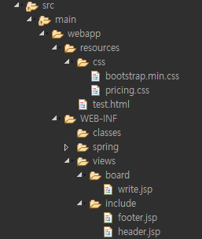

> ### 부트스트랩 활용 (v4.6 사용)

- 부트스트랩(v4.6)에서 폼을 가져와서 어느정도 css를 만든 후 서버 연결을 중점으로 실습
- **BoardController 컨트롤러 생성**

~~~java
package com.demo.controller;

import org.springframework.stereotype.Controller;
import org.springframework.web.bind.annotation.GetMapping;
import org.springframework.web.bind.annotation.RequestMapping;

import lombok.extern.log4j.Log4j;

// board와 views에 폴더 board 같은이름으로 생성
@RequestMapping("/board/*")
@Controller
@Log4j
public class BoardController {

	// 글쓰기 폼
	@GetMapping("/write")
	public void write() {
		log.info("write called...");
	}
	
	// 글쓰기 저장
	
	// 목록(리스트)
	
	// 수정폼
	
	// 수정하기
	
	// 삭제하기
	
}
~~~

- views 폴더에 board 폴더를 만들고 기본폼을 만든다

~~~jsp
<!-- write.jsp -->

<%@ page language="java" contentType="text/html; charset=UTF-8"
    pageEncoding="UTF-8"%>
<%@ taglib uri="http://java.sun.com/jsp/jstl/core" prefix="c" %>

<!doctype html>
<html lang="en">
  <head>
    <meta charset="utf-8">
    <meta name="viewport" content="width=device-width, initial-scale=1, shrink-to-fit=no">
    <meta name="description" content="">
    <meta name="author" content="Mark Otto, Jacob Thornton, and Bootstrap contributors">
    <meta name="generator" content="Hugo 0.88.1">
    <title>Pricing example · Bootstrap v4.6</title>

    <link rel="canonical" href="https://getbootstrap.com/docs/4.6/examples/pricing/">

    

    <!-- Bootstrap core CSS -->
<link href="/resources/css/bootstrap.min.css" rel="stylesheet">

    

    
    <!-- Custom styles for this template -->
    <link href="/resources/css/pricing.css" rel="stylesheet">
  </head>
  <body>

<!-- header -->
<%@ include file="/WEB-INF/views/include/header.jsp" %>

<%@ include file="/WEB-INF/views/include/carousel.jsp" %>

	<h3>게시판 글쓰기</h3>
	<form method="post" action="write">
	  

	    <label for="title">제목</label>
	    <input type="text" class="form-control" id="title" name="title">
	  

	  

	    <label for="exampleFormControlTextarea1">내용</label>
	    <textarea class="form-control" id="exampleFormControlTextarea1" rows="3" name="content"></textarea>
	  

	  

	    <label for="writer">작성자</label>
	    <input type="text" class="form-control" id="writer" name="writer">
	  

	  <button type="submit" class="btn btn-primary">Submit</button>
	</form>

<!-- footer -->
<%@ include file="/WEB-INF/views/include/footer.jsp" %>

  </body>
</html>
~~~

- header와 footer는 다른데에도 계속 가져다 쓸수 있도록 직접 넣기 않고 따로 파일을 만들어 링크로 가져온다
- include 폴더를 views에 만들어 jsp파일 생성
- <%@include file="파일위치"%> 링크생성으로 가져온다

> ##### 생성되는지 확인

- 주기적으로 연결되어 있는지 확인