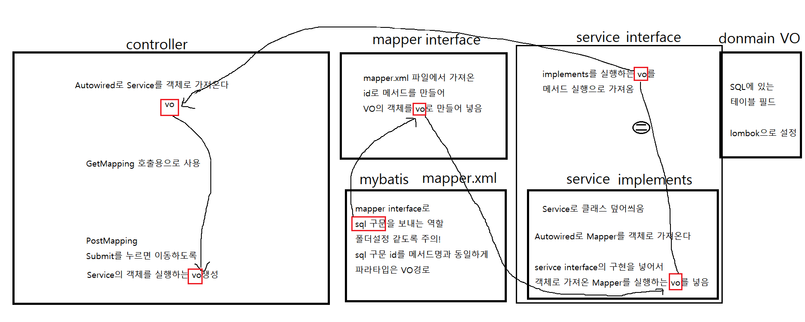

> ### SQL 구문 interface 연결작업

> ##### BoardMapper.xml SQL 구문생성

~~~xml
<?xml version="1.0" encoding="UTF-8"?>
<!DOCTYPE mapper PUBLIC "-//mybatis.org//DTD Mapper 3.0//EN" "http://mybatis.org/dtd/mybatis-3-mapper.dtd">
<mapper namespace="com.demo.mapper.BoardMapper">

<!-- 해당 파일에 BoardMapper와 같은 MyBatis xml 파일을 생성
 	 SQL 구문 삽입
	 SQL 구문 삽입시 id는 BoardMapper 인터페이스의 추상메서드와 동일해야 한다
-->

	<insert id="insert" parameterType="com.demo.domain.BoardVO">
		insert into tbl_board(bno, title, content, writer) values(seq_board.nextval, #{title}, #{content}, #{writer})
	</insert>

</mapper>
~~~

> ##### BoardMapper 인터페이스 생성

~~~java
package com.demo.mapper;

import com.demo.domain.BoardVO;

// Mapper Interface : 내부적으로 Proxy클래스로 동작 되어진다
// resources에 com.demo.mapper의 경로와 같게 설정
// 해당 파일에 BoardMapper와 같은 MyBatis xml 파일을 생성
public interface BoardMapper {

	// 기능목적의 추상메서드 정의
	public void insert(BoardVO vo);
	
}
~~~

> ##### BoardService 인터페이스 생성

~~~java
package com.demo.service;

import com.demo.domain.BoardVO;

public interface BoardService {
	void insert(BoardVO vo);
	
}
~~~

> ##### BoardServiceImpl 구현 프로그램 생성

~~~java
package com.demo.service;

import org.springframework.beans.factory.annotation.Autowired;
import org.springframework.stereotype.Service;

import com.demo.domain.BoardVO;
import com.demo.mapper.BoardMapper;

@Service
public class BoardServiceImpl implements BoardService {

	// mapper interface 객체 선언
	@Autowired
	private BoardMapper mapper;
	
	@Override
	public void insert(BoardVO vo) {
		mapper.insert(vo);
		
	}
}
~~~

> ##### BoardController 컨트롤러 생성

~~~java
package com.demo.controller;

import org.springframework.beans.factory.annotation.Autowired;
import org.springframework.stereotype.Controller;
import org.springframework.web.bind.annotation.GetMapping;
import org.springframework.web.bind.annotation.PostMapping;
import org.springframework.web.bind.annotation.RequestMapping;

import com.demo.domain.BoardVO;
import com.demo.service.BoardService;

import lombok.extern.log4j.Log4j;

@Controller
@Log4j
@RequestMapping("/board/*")
public class BoardController {
	
	@Autowired
	private BoardService service;
	
	@GetMapping("/write")
	public void write() {
		log.info("write called...");
	}

	@PostMapping("/write")
	public String write(BoardVO vo) {
		
		service.insert(vo);
		
		log.info("insert called...");
		
		return "redirect:/board/list";
	}
	
	@GetMapping("/list")
	public void list() {
		
		log.info("list called...");
		
	}
	
}
~~~

