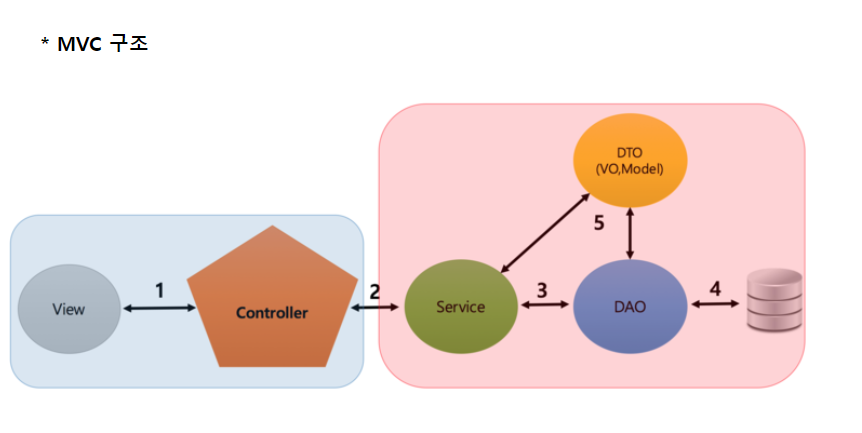

> ### 9번에서 했던 것들 다시 정리

> #### Annotation 정리 먼저

Annotation은 주석이라는 의미

자바 소스코드에 추가하여 사용하는 메타데이터의 일종

메타 데이터(Meta-Data) : 데이터를 위한 데이터를 의미하며, 풀어 이야기하면

​										 한 데이터에 대한 설명을 의미하는 데이터

***코드량이 감소하고 유지보수하기 쉬우며, 생산성 증가***

> #### Annotation을 알려면 Bean까지 확인해야 한다

기존에는 Class를 생성하고 new로 객체를 생성했다

하지만 Spring에서는 Spring에서 관리당하는 자바 객체를 사용

**Spring에 의하여 생성되고 관리되는 자바 객체를 Bean이라고 한다**

그러면 Annotation과 Bean이 무슨 관련이 있냐하면, 예를 들어

Controller Annotation을 사용하면 Spring에서 그에 해당하는

Bean을 생성하는 작업을 자동으로 한다

---

> ##### @Autowired Annotation

@Autowired를 사용하면 Bean을 자동으로 주입

~~~java
private LoginMapper mapper;
private LoginService service;
~~~

위와 같이 전편에서 인터페이스를 가져오기 위해서

사용한 구문에서 @Autowired를 사용하지 않는다면

~~~java
<bean id="mapper"
    class="com.keesun.spring.LoginMapper" />
  
<bean id="LoginServiceImpl" class="com.keesun.spring.LoginServiceImpl">
    <constructor-arg name="mapper" ref="mapper" />
</bean>
~~~

위와 같은 구문을 xml에 추가해야 한다

**보통 인터페이스 선언시 사용**

@Autowired는 스프링에서 지원, @Inject는 자바에서 지원

---

> ##### @Service Annotation

비즈니스 로직을 처리하는 Annotation이다

views에서는 Controller의 요청사항을 보고 호출되면 된다

Controller는 Service 객체를 호출하는 역할만 수행한다

그리고 Service는 **순수하게 자바 객체**만 사용하므로써 어떤 컨트롤러가 호출하든 상관없이

구현되어 있는 매개변수를 처리하기만 하면된다

즉, 모듈화를 통해 어디서든 **재사용 가능한 클래스파일**

또한, 추가적인 요청사항에 대해 Service 인터페이스에 구현한 클래스를 사용하가 용이

---

> ##### interface, implements

interface에는 메서드 

---

