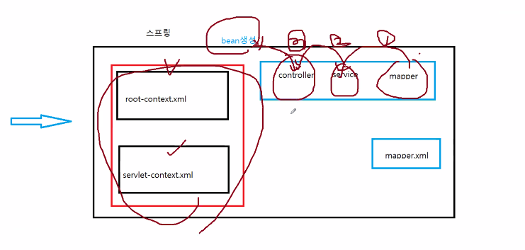

> ### 트랜잭션 기능 추가

> ##### SQL 테이블 설정

~~~sql
CREATE TABLE TBL_SAMPLE1(
    COL1    VARCHAR2(500)
);

CREATE TABLE TBL_SAMPLE2(
    COL1    VARCHAR2(50)
);
~~~

> ##### Mapper interface 2개 생성

xml 연결하지 않고 바로 어노테이션으로 넣는다

1, 2 두개의 샘플 생성

~~~java
package com.demo.mapper;

import org.apache.ibatis.annotations.Insert;

// 스프링이 시작하면서, SampleMapper 인터페이스를 대신하는 프록시클래스가 bean생성
public interface Sample1Mapper {

	@Insert("insert into tbl_sample1(col1) values (#{data})")
	public int insertCol1(String data); // mapper xml 파일 사용안함
}
~~~

> ##### Service 메서드 생성 및 ServiceImpl 구현

~~~java
package com.demo.service;

public interface SampleTxService {

	public void addData(String value);
}
~~~

주입 Annotation

1. @Autowired : 스프링프레임웍

2. @Inject : 자바

3. 롬복 기능 주입
   - @Setter(onMethod_ = {@Autowired}) // jdk 1.8

~~~java
import org.springframework.stereotype.Service;

import com.demo.mapper.Sample1Mapper;
import com.demo.mapper.Sample2Mapper;

import lombok.Setter;
import lombok.extern.log4j.Log4j;

@Service
@Log4j
public class SampleTxServiceImpl implements SampleTxService {

//	주입 Annotation
//	1. @Autowired : 스프링프레임웍
//	2. @Inject : 자바
	
	// 롬복 기능 주입
	@Setter(onMethod_ = {@Autowired}) // jdk 1.8
	private Sample1Mapper mapper1;
	
	@Setter(onMethod_ = {@Autowired})
	private Sample2Mapper mapper2;
	
	@Override
	public void addData(String value) {
		
         log.info("mapper1...");
		// 작업 1
		mapper1.insertCol1(value); // 500byte
		
		log.info("mapper1...");
		// 작업 2
		mapper2.insertCol2(value); // 50byte
		
		log.info("end...");

	}

}
~~~

> ##### JUnit를 이용해서 테스트

~~~java
package com.demo.service;

import static org.junit.Assert.*;

import org.junit.Test;
import org.junit.runner.RunWith;
import org.springframework.test.context.ContextConfiguration;
import org.springframework.test.context.junit4.SpringJUnit4ClassRunner;

// 스프링 환경개선
@RunWith(SpringJUnit4ClassRunner.class)

// root-context.xml에 있는 각종 bean을 가져온다
@ContextConfiguration(locations = {"file:src/main/webapp/WEB-INF/spring/**/root-context.xml"})
public class SampleTxServiceTests {

	// 주입 어노테이션 사용하기 전 해당 클래스의 bean은 생성 되었어야 한다
	@Setter(onMethod_ = {@Autowired})
	private SampleTxService service;
    
    @Test
	public void testLong() {
		
		String str = "012345678901234567890123456789012345678901234567890123456789"; // 60byte
		
		service.addData(str);
	}

}
~~~

이렇게 60byte를 넣는 것을 진행해보면 500byte인 Sample1은 데이터가 들어가고 50byte인 Sample2는 에러가 발생한다

그래서, 들어갈거면 다같이 들어가고 하나가 에러나면 다른 데이터도 들어가지 않도록 해본다

- pom.xml에 들어가는 dependency

~~~xml
<!-- 4)https://mvnrepository.com/artifact/org.springframework/spring-tx -->
<!-- 트랜잭션 기능제공 -->
<dependency>
    <groupId>org.springframework</groupId>
    <artifactId>spring-tx</artifactId>
    <version>${org.springframework-version}</version>
</dependency>
~~~

- root-context.xml에 tx부분 추가

~~~xml
<beans xmlns="http://www.springframework.org/schema/beans"
	xmlns:xsi="http://www.w3.org/2001/XMLSchema-instance"
	xmlns:aop="http://www.springframework.org/schema/aop"
	xmlns:context="http://www.springframework.org/schema/context"
	xmlns:tx="http://www.springframework.org/schema/tx"
	xmlns:mybatis-spring="http://mybatis.org/schema/mybatis-spring"
	xsi:schemaLocation="http://mybatis.org/schema/mybatis-spring http://mybatis.org/schema/mybatis-spring-1.2.xsd
		http://www.springframework.org/schema/beans http://www.springframework.org/schema/beans/spring-beans.xsd
		http://www.springframework.org/schema/context http://www.springframework.org/schema/context/spring-context-4.3.xsd
		http://www.springframework.org/schema/aop http://www.springframework.org/schema/aop/spring-aop-4.3.xsd
		http://www.springframework.org/schema/tx http://www.springframework.org/schema/tx/spring-tx-4.3.xsd">
    
    
    
	<!-- 트랜잭션 설정구문 -->
	<bean id="transactionManager" class="org.springframework.jdbc.datasource.DataSourceTransactionManager">
		<property name="dataSource" ref="dataSource"></property>
	</bean>
	
	<tx:annotation-driven/>
~~~

- ServiceImpl에서 @Transactional 추가로 인해 메서드 안에 둘다 실행이 안됨

~~~java
	@Transactional // 트랜잭션 어노테이션
	@Override
	public void addData(String value) {
		
		log.info("mapper1...");
		// 작업 1
		mapper1.insertCol1(value); // 500byte
		
		log.info("mapper1...");
		// 작업 2
		mapper2.insertCol2(value); // 50byte
		
		log.info("end...");

	}
~~~

