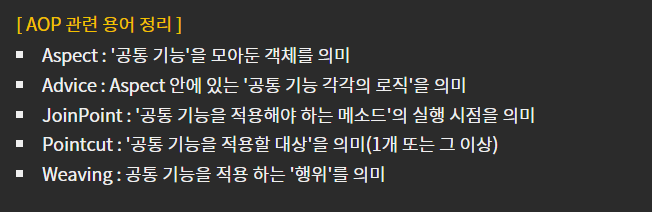

> ### AOP : Aspect Oriented Programming 관점 지향 프로그래밍

공통 기능과 핵심기능을 분리시켜 공통 기능을 계속 재활용해 사용하는방식

> ##### Aspect : 공통기능을 모아둔 객체를 의미

- pom.xml에서 버전 정보 변경

~~~xml
<org.aspectj-version>1.9.0</org.aspectj-version> <!-- AOP 기능 구현시 사용할 보조적인 문법버전 -->

		<!-- AspectJ : AOP기능 구현시 사용하는 문법을 지원해주는 라이브러리 -->
		<dependency>
			<groupId>org.aspectj</groupId>
			<artifactId>aspectjrt</artifactId>
			<version>${org.aspectj-version}</version>
		</dependency>	
		
		<!-- https://mvnrepository.com/artifact/org.springframework/spring-aop -->
		<dependency>
		    <groupId>org.aspectj</groupId>
		    <artifactId>aspectjweaver</artifactId>
		    <version>${org.aspectj-version}</version>
		</dependency>
~~~

- root-context.xml에 aop bean 추가

~~~xml
<?xml version="1.0" encoding="UTF-8"?>
<beans xmlns="http://www.springframework.org/schema/beans"
	xmlns:xsi="http://www.w3.org/2001/XMLSchema-instance"
	xmlns:aop="http://www.springframework.org/schema/aop"
	xmlns:context="http://www.springframework.org/schema/context"
	xmlns:tx="http://www.springframework.org/schema/tx"
	xmlns:mybatis-spring="http://mybatis.org/schema/mybatis-spring"
	xsi:schemaLocation="http://mybatis.org/schema/mybatis-spring http://mybatis.org/schema/mybatis-spring-1.2.xsd
		http://www.springframework.org/schema/beans http://www.springframework.org/schema/beans/spring-beans.xsd
		http://www.springframework.org/schema/context http://www.springframework.org/schema/context/spring-context-4.3.xsd
		http://www.springframework.org/schema/aop http://www.springframework.org/schema/aop/spring-aop-4.3.xsd
		http://www.springframework.org/schema/tx http://www.springframework.org/schema/tx/spring-tx-4.3.xsd">
    
    
    
    <context:component-scan base-package="com.demo.aop" />
    <context:annotation-config></context:annotation-config>
    <aop:aspectj-autoproxy></aop:aspectj-autoproxy>
~~~

> ##### AOP 패키지에 생성, @Before

~~~java
package com.demo.aop;

import org.aspectj.lang.annotation.Aspect;
import org.aspectj.lang.annotation.Before;
import org.springframework.stereotype.Component;

import lombok.extern.log4j.Log4j;

// AOP기능 구현클래스 : 핵심로직이 아닌 부가적인 작업내용 클래스

@Log4j
@Aspect
@Component // 일반 클래스를 bean생성시 선언하는 어노테이션. logAdvice bean 생성
public class LogAdvice {

	// 메서드가 어떤 경우에 작동되게 할 것인지 설정 작업
	// SampleService로 시작하는 파일에 (..) 0개이상의 메서드 실행
	@Before("execution(* com.demo.service.SampleService*.*(..))")
	public void logBefore() {
		log.info("=============================");
	}
	
	
}
~~~

- SampleService로 시작하는 Service와 ServiceImpl 생성

~~~java
package com.demo.service;

public interface SampleService {

	public Integer doAdd(String str1, String str2) throws Exception;
}
~~~

~~~java
package com.demo.service;

import org.springframework.stereotype.Service;

import lombok.extern.log4j.Log4j;

@Log4j
@Service
public class SampleServiceImpl implements SampleService {

	@Override
	public Integer doAdd(String str1, String str2) throws Exception {
		
		log.info("doAdd called...");
		
		Integer result = Integer.parseInt(str1) + Integer.parseInt(str2);
		
		return result;
	}

}
~~~

- JUnit 테스트

~~~java
package com.demo.service;

import static org.junit.Assert.*;

import org.junit.Test;
import org.junit.runner.RunWith;
import org.springframework.beans.factory.annotation.Autowired;
import org.springframework.test.context.ContextConfiguration;
import org.springframework.test.context.junit4.SpringJUnit4ClassRunner;

import lombok.Setter;
import lombok.extern.log4j.Log4j;

@Log4j
@RunWith(SpringJUnit4ClassRunner.class)
@ContextConfiguration(locations = {"file:src/main/webapp/WEB-INF/spring/**/root-context.xml"})
public class SampleServiceTests {

	@Setter(onMethod_ = {@Autowired})
	private SampleService service;
	
	@Test
	public void testAdd() throws Exception {
		
		log.info(service.doAdd("123", "456"));
	}

}
~~~

결과로 아래 콘솔내용 처럼 AOP클래스의 @Before에 따라 먼저 호출 이후에 순서대로 작동한다

INFO : com.demo.aop.LogAdvice - =============================
INFO : com.demo.service.SampleServiceImpl - doAdd called...
INFO : com.demo.service.SampleServiceTests - 579

유지보수를 위해서 어떤 값이 들어가있는지 미리 확인해 볼 수 있다