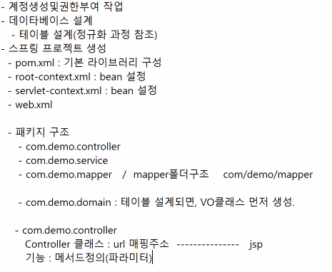

> ### 파일업로드4

- 파일업로드

  - 테이블에 직접저장 : 파일
  - 테이블의 컬럼 : 파일이름저장, 업로드폴더(권장)

- 파일기능첨부

  - 회원테이블 : 사진이미지(1개) 파일첨부 -> 회원테이블에 컬럼추가

  - 게시판 : 파일첨부(파일이 여러개) -> 게시판테이블에 컬럼을 추가하지 않는다

    ***게시판의 경우 파일첨부 테이블 독립적으로 생성***

> ##### 테이블 생성

~~~sql
-- 파일첨부
CREATE TABLE TBL_ATTACH(
    UUID        VARCHAR2(100)   CONSTRAINT PK_ATTACH PRIMARY KEY,
    UPLOADPATH  VARCHAR2(200)   NOT NULL,
    FILENAME    VARCHAR2(100)   NOT NULL,
    FILETYPE    CHAR(1) DEFAULT 'I',
    BNO         NUMBER,
    FOREIGN KEY (BNO) REFERENCES TBL_BOARD(BNO)
);
~~~

> ##### BoardAttachVO 생성

~~~java
package com.demo.domain;

import lombok.Data;

@Data
public class BoardAttachVO {

	// uuid, uploadPath, fileName, fileType, bno
	
	private String uuid;
	private String uploadPath;
	private String fileName;
	private String fileType;
	private Long bno;
	
}
~~~

> ##### BoardVO에 추가

~~~java
	//파일첨부 클래스
	private List<BoardAttachVO> attachList;
~~~

> ##### write.jsp에 넣기

~~~jsp
<%@ page language="java" contentType="text/html; charset=UTF-8"
    pageEncoding="UTF-8"%>
<%@ taglib uri="http://java.sun.com/jsp/jstl/core" prefix="c" %>

<!doctype html>
<html lang="en">
  <head>
    <meta charset="utf-8">
    <meta name="viewport" content="width=device-width, initial-scale=1, shrink-to-fit=no">
    <meta name="description" content="">
    <meta name="author" content="Mark Otto, Jacob Thornton, and Bootstrap contributors">
    <meta name="generator" content="Hugo 0.88.1">
    <title>Pricing example · Bootstrap v4.6</title>

    
    

    <link rel="canonical" href="https://getbootstrap.com/docs/4.6/examples/pricing/">

    
	  

    <!-- Bootstrap core CSS -->
    <link href="/resources/css/bootstrap.min.css" rel="stylesheet">

    

    
    <!-- Custom styles for this template -->
    <link href="/resources/css/pricing.css" rel="stylesheet">
  </head>
  <body>
    
<%@ include file="/WEB-INF/views/include/header.jsp" %>

<%@ include file="/WEB-INF/views/include/carousel.jsp" %>

  

    

      <h3>게시판 글쓰기</h3>
      <form id="boardForm" method="post" action="write">
        

          <label for="title">제목</label>
          <input type="text" class="form-control" id="title" name="title">
        

        

          <label for="content">내용</label>
          <textarea class="form-control" id="content" rows="3" name="content"></textarea>
          

        

          <label for="writer">작성자</label>
          <input type="text" class="form-control" id="writer" name="writer">
        

        <button type="submit" class="btn btn-primary">Submit</button>
      </form>
    

  

  

    

      <h6>File Attach</h6>
      

        <input type="file" name="uploadfile" multiple>
      

    
      <!-- 업로드된 파일정보를 출력 -->
      

          <ul></ul>
      

    

  

  <%@ include file="/WEB-INF/views/include/footer.jsp" %>

    
  </body>
</html>
~~~

