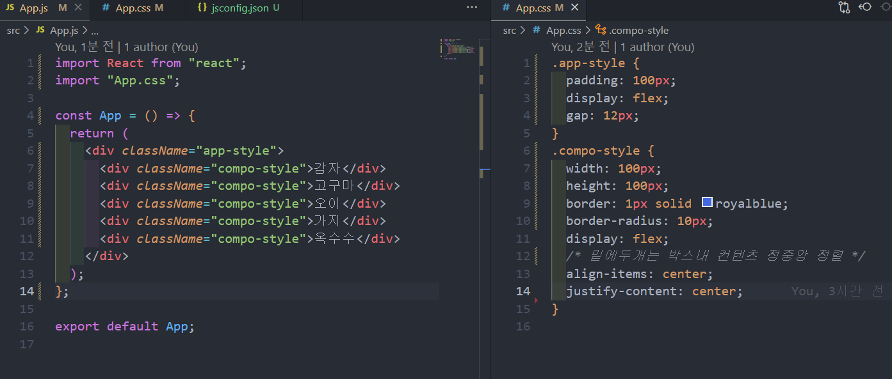

# styling, map

### 박스생성



여기서 중복되는 compo-style 부분을 map, filter 함수로 없앨것


## Map, filter 간단개념

```react
const testArr=[1,2,3]
testArr.map(function(){
return item*2
   //[2,4,6] 배출
});
//즉, map함수는 testArr(기존의 것)을 가공하여 배출하는 함수


//filter는 조건을 만족하는 애만 필터링 걸어 배출하는 함수
testArr.filter(function(){
  return item === 1  
    // [1]배출
    )}              
```

## Map,filter  컴포넌트 활용맛보기

### app.css

```css
.app-style {
  padding: 100px;
  display: flex;
  gap: 12px;
}
.compo-style {
  width: 100px;
  height: 100px;
  border: 1px solid royalblue;
  border-radius: 10px;
  display: flex;
  /* 밑에두개는 박스내 컨텐츠 정중앙 정렬 */
  align-items: center;
  justify-content: center;
}

```

### app.js

```react
import React from "react";
import "App.css";

const App = () => {
  const testArr = ["감자", "고구마", "오이", "가지", "옥수수"];

  return (
    <div className="app-style">
      {/* filter로 조건가공 */}

      {testArr
        .filter((item) => {
          return item !== "오이";
          // 여기서 출력은 다시 배열로 비교됨
        })
        .map((item) => {
          return <div className="compo-style">{item}</div>;
        })}

      {/* <>
     {testArr.map(function (item) {
      return <div className="compo-style">{item}</div>;
    })}
    <div className="app-style">
      <div className="compo-style">감자</div>
      <div className="compo-style">고구마</div>
      <div className="compo-style">오이</div>
      <div className="compo-style">가지</div>
      <div className="compo-style">옥수수</div>
      </div>
      </> */}
    </div>
  );
};

export default App;

```


# 갖고놀아보기

```react
xz
```


