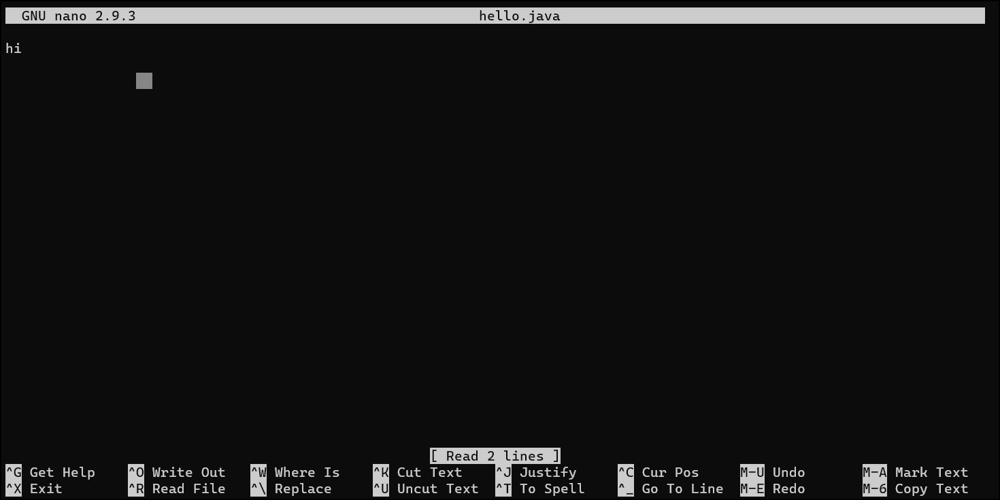
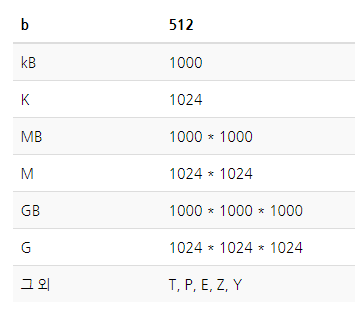
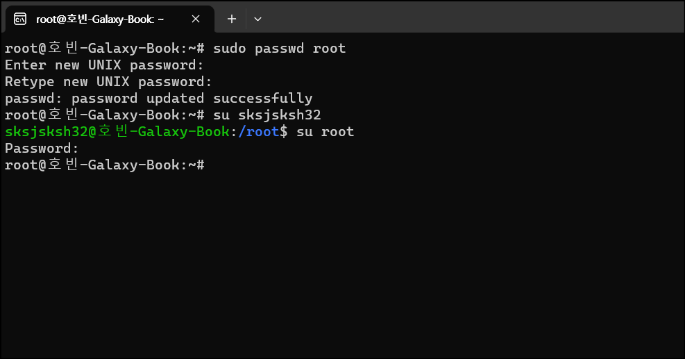
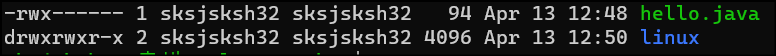
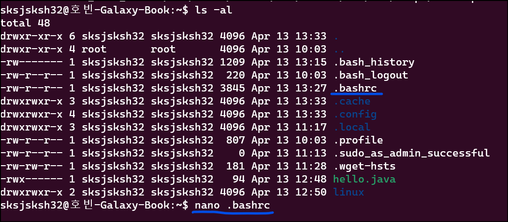
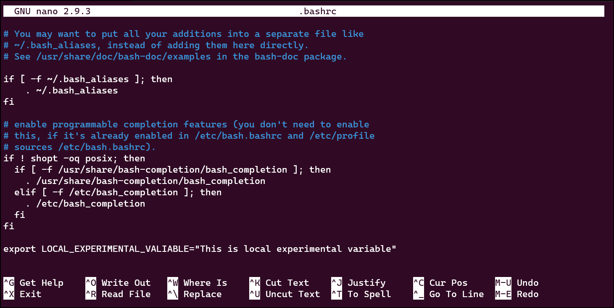
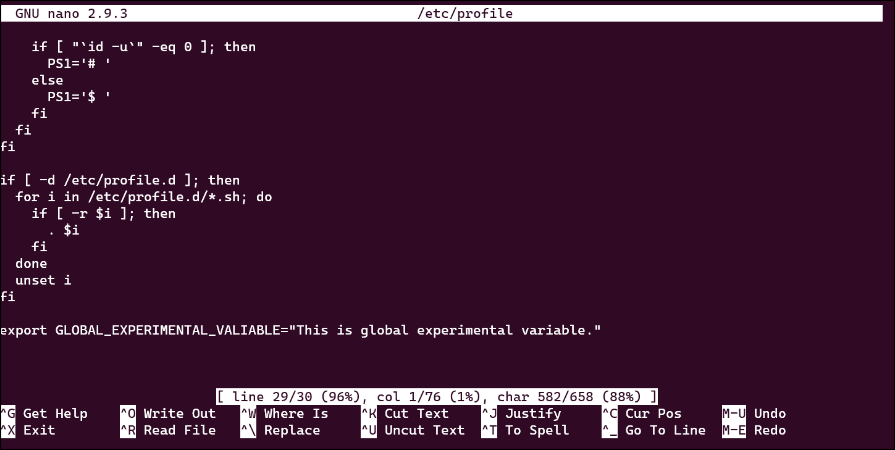
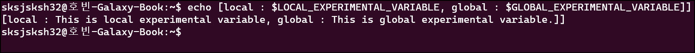

# 리눅스

리눅스는 CLI 환경입니다. 즉, 마우스, 모니터 등 GUI 요소가 없습니다.

서버와 통신하기 위해 리눅스 명령어 공부는 필수입니다.

# 리눅스 설치

### 1. cmd 명령 프롬프트에 다음과 같이 입력합니다.

`dism.exe /online /enable-feature /featurename:Microsoft-Windows-Subsystem-Linux /all /norestart`

- "/featurename:Microsoft-Windows-Subsystem-Linux" 매개 변수를 사용하여 Windows 서브시스템 for Linux(WSL)을 활성화합니다. 이를 통해 Windows에서 Linux 응용 프로그램을 실행할 수 있으며, 이를 통해 Linux 명령줄 도구 및 유틸리티를 사용할 수 있습니다.

`dism.exe /online /enable-feature /featurename:VirtualMachinePlatform /all /norestart`

- /featurename:VirtualMachinePlatform" 매개 변수를 사용하여 가상 머신 플랫폼(Virtual Machine Platform)을 활성화합니다. 이를 통해 Windows에서 Linux 가상 머신(VM)을 실행할 수 있으며, 이를 통해 Windows와 Linux 간의 호환성 문제를 해결할 수 있습니다. 

설정을 저장하기 위해 컴퓨터를 재부팅합니다.

### 2. 리눅스 커널 업데이트 패키지 다운로드.

[리눅스 커널 업데이트 패키지 다운로드](https://learn.microsoft.com/ko-kr/windows/wsl/install-manual)

여기서 4단계의 최신패키지를 다운로드 후 실행 해줍니다. (다른 건 볼 필요없습니다.)

### 3. Windows Subsystem for Linux(WSL) 2 버전 설정

명령 프롬프트에 `wsl --set-default-version 2` 을 입력하여 Windows Subsystem for Linux(WSL) 2 버전을 기본으로 사용하도록 설정합니다.

### 4. 우분투 리눅스 설치

Microsoft Store에서 ubuntu lts를 검색한 후, 18.04.x 버전을 다운로드합니다.

우분투 프롬프트가 실행면 사용자 이름과 비밀번호를 입력합니다.

# CLI 기본 명령어

**pwd** : 현재 위치를 확인합니다. (Printing Working Directory)

**mkdir** : 새로운 폴더를 만듭니다. (Make Directory)

**ls** : 특정 폴더에 포함된 파일이나 폴더를 확인합니다. (List)

- ls -a : 숨어있는 폴더나 파일을 포함해 모든 항목을 출력합니다. (List All)
- ls -l : 파일의 포맷을 전부 표현합니다. (List Long format)
  - `-rw-r--r-- 1 root root 21 Apr 13 10:05 hi.txt` : 파일일 때 `-rw ~` 로 시작합니다.
  - `drwxr-xr-x 2 root root 4096 Apr 13 10:04 helloworld` : 폴더는 -dr ~ 로 시작합니다.

**touch** :파일을 생성합니다. `touch hi.txt` 

- touch 는 파일 생성뿐만 아니라, 파일이 이미 존재하는 경우 "touch" 명령어는 파일의 내용을 변경하지 않고 수정 시간만 변경합니다. 이것은 일반적으로 파일을 갱신하거나, 파일이 최근에 사용되었는지 확인할 때 사용됩니다.
- 따라서, "touch"라는 이름은 파일을 생성하는 것보다는 파일의 수정 시간을 변경하는 데 더 초점을 맞춘 것이고, "touch"라는 이름은 "파일을 '손대다'(touch)는 것과 같은 느낌"을 주기 때문에 이러한 이름이 지어졌다고 합니다.

**echo** : 뒤의 내용을 화면에 출력해줍니다. (echo 는 echo!)

- echo helloworld : `helloworld` 를 터미널에 출력

**`>`** : 실행결과를 파일로 저장합니다.

- echo 와 결합하여 사용할 수 있습니다. `echo helloworld > hi.txt` 는 helloworld 를 출력하여 hi.txt 에 저장합니다.
- `ls > hi.txt` 는  디렉토리 내 파일 및 폴더를 출력하여 hi.txt 에 저장합니다.

**cat** : 파일 내용을 터미널에 출력합니다. `cat hi.txt` (conCATenate, 둘 이상의 문자열을 이어 붙이는 것을 의미)

- `cat file.txt file2.txt` 와 같이 여러 파일을 결합할 수도 있습니다.

**rm** : 폴더나 파일을 삭제합니다. `rm hi.txt` (remove)

- `rm hi.txt` : hi.txt 파일을 삭제합니다.
- `rm -rf hi` : hi 디렉토리를 삭제합니다.
  - `r` : Recursive, 디렉토리 내의 모든 하위 디렉토리와 파일을 삭제합니다.
  - `f` : Force, 삭제할 파일이나 디렉토리에 대해 경고 없이 강제로 삭제하도록 지시합니다. "f" 옵션이 없으면 삭제할 파일이나 디렉토리에 대해 삭제 여부를 물어봅니다.
- `rm -d hi` : "-d" 옵션은 지정된 디렉토리를 삭제하며, 디렉토리가 비어있지 않은 경우에는 삭제되지 않습니다.
  - 비어있지 않으면 다음과 같은 오류가 발생합니다. `rm: cannot remove 'hi': Directory not empty`

**mv** : 폴더나 파일의 이름을 변경하거나 위치를 옮깁니다. (move)

- `mv hi.txt hi/` : hi.txt 파일을 hi 폴더로 옮깁니다. (hi 폴더가 같은 위치에 있어야 합니다.)
- `mv hi.txt ../` : hi.txt 파일을 상위 폴더로 옮깁니다.
- `mv hi.txt bye.txt` : hi.txt 파일을 bye.txt 파일로 이름을 변경합니다.
- `mv hi bye` hi 디렉토리를 bye 디렉토리로 이름을 변경합니다.
  - 만약 폴더에 hi 와 bye 폴더가 있는데 hi 폴더 이름을 bye 로 변경하려고 한다면?
    - `mv hi bye` 실행 -> 이름이 변경되지 않고 hi 폴더가 bye 폴더로 들어가게 됩니다.

**cp** : 폴더나 파일을 복사합니다. (copy)

- `cp hi.txt bye.txt`  : 현재 디렉토리에서 hi.txt 를 복사하여 bye.txt 를 저장합니다.
- `cp hi.txt ./hi/hi.txt` : 현재 디렉토리에 있는 hi 폴더에 hi.txt 를 복사하여 저장합니다.
  - 만약 hi 폴더에 hi.txt 가 이미 있다면? 강제로 덮어쓰기가 됩니다. 
  - 덮어쓰기가 되지 않으려면 `-n` 옵션을 사용해야 합니다. `cp -n hi.txt ./hi/hi.txt` 
- `cp -rf bye hi` : 현재 디렉토리에서 bye 폴더를 `rf` 옵션으로 복사하여 hi 폴더를 만듭니다.

## 텍스트 에티터 nano 사용

`nano hello.java` 를 통해서 java 파일을 열 수 있습니다.

다음과 같은 편집기입니다. 내용을 보여주는 영역과 단축키를 보여주는 영역이 나눠져 있습니다.

파일 저장은 ctrl O 입니다.

# CLI 명령어 추가

cat 은 파일 전체를 출력하기 때문에 내용이 많으면 여러가지 문제가 생깁니다. 따라서 파일을 원하는 내용을 출력할 수 있도록 하는 명령어를 살펴보겠습니다.

**head** 

head 명령어는 텍스트로된 파일의 앞부분을 지정한 만큼 출력하는 명령어입니다. 반대의 명령어는 tail입니다. 

- `head [파일명]` : 앞에서부터 10행까지만 출력합니다.

- `head -n 100 [파일명]` : 앞에서부터 100행까지를 보여줍니다. `head -100 [파일명]` 과 같이 -n 옵션은 생략가능합니다.

- `head -n 100 [파일명] > [저장 파일]` : 출력되는 100행을 저장 파일에 저장합니다.

- `head -c 100` 바이트 단위로 100byte 내용 만큼 출력합니다.

  - 100  에 들어갈 숫자는 **multiplier suffix** 를 입력할 수 있습니다.
  - 
  - 즉, 10MB 를 출력하기 위해 `head -c 10000000 test.txt` 라고 작성하는 대신 `head -c 10MB test.txt` 라고 작성할 수 있습니다.

  - [head 설명](http://www.incodom.kr/Linux/%EA%B8%B0%EB%B3%B8%EB%AA%85%EB%A0%B9%EC%96%B4/head)

**tail**

tail 은 head 와 반대로 마지막행을 기준으로 지정한 행까지의 파일 내용을 출력합니다. 오류나 파일 로그를 확인할 때 유용합니다.

- `tail [파일명]`, `tail -100 [파일명]`, `tail -c 10MB test.txt` 와 같이 사용법은 head 와 똑같습니다.
- `tail +20 test.txt` 와 같이 사용하는 경우, 특정행부터 마지막 행까지 출력됩니다. 즉, 마지막에서부터 20개 행이 출력되는 게 아니라 20번째 행부터 마지막 행까지 출력됩니다.
- [tail 설명](http://www.incodom.kr/Linux/%EA%B8%B0%EB%B3%B8%EB%AA%85%EB%A0%B9%EC%96%B4/tail)

**more**

파일을 읽어 화면에 화면 단위로 끊어서 출력하는 명령어입니다. 지나간 내용은 다시 볼 수 없는 단점이 있습니다.

- `more [파일명]` : 파일을 읽습니다. enter 를 입력하면 한 줄씩, space bar 를 입력하면 한 화면씩 출력됩니다.
- `more -n [파일명]` : -n 옵션을 사용할 경우 n줄만큼 끊어서 출력합니다.
- `more +n [파일명]` : +n 옵션을 사용할 경우 n번째 줄부터 화면에 출력합니다.
- [more 설명](http://www.incodom.kr/Linux/%EA%B8%B0%EB%B3%B8%EB%AA%85%EB%A0%B9%EC%96%B4/more)

**less**

파일을 읽어 화면에 출력하는 명령어입니다. less 는 more 과 다르게 자나간 내용을 다시 볼 수 있습니다. 

- 위아래 방향키 (행 이동), pageUp/Down (페이지 이동) 으로 이동이 가능합니다.
- [less 설명](http://www.incodom.kr/Linux/%EA%B8%B0%EB%B3%B8%EB%AA%85%EB%A0%B9%EC%96%B4/less)

# 패키지와 패키지 매니저

우분투는 apt 명령어를 통해서 패키지 매니저를 실행합니다.

apt 명령어는 다음과 같습니다. 관리자 권한이 필요한 명령어는 [sudo] 붙였습니다.

- apt update : [sudo] 패키지 목록 갱신 (neofetch 설치 시 해당 패키지가 패키지 목록에 없어서 먼저 갱신해줘야 했습니다.)
- apt list --upgradable : 업그레이드 가능한 패키지 목록 출력합니다.
- apt upgrade : [sudo] 패키지를 모두 업그레이지 합니다.
- apt --only-upgrade install [패키지명] : [sudo] 특정 패키지를 업그레이드 합니다.
- apt install [패키지명] : [sudo] 패키지를 설치합니다.
- apt list --installed : 설치된 패키지를 봅니다.
  - apt list --installed | grep [단어] : 특정 단어를 포함한 설치된 패키지를 봅니다.
- apt search [단어] : 특정 단어를 포함한 설치 가능 패키지를 찾습니다. 
- apt show [패키지명] : 패키지 정보를 확인합니다.
- apt remove [패키지명] : [sudo] 패키지를 삭제합니다.

**사용자 변경하기 / 비밀번호 변경하기**

처음에 ubuntu 프롬프트에 들어가면 root 로 되어있더군요. 그래서 su [사용자명] 으로 사용자를 변경했습니다.

다시 su root 로 접속하려는데 이번에는 root 비밀번호를 몰랐습니다. 다행히 프롬프트를 껐다가 키니까 root 로 접속되어있습니다. 

sudo passwd root 를 통해서 패스워드를 변경해줍시다. 새 비밀번호와 비밀번호 확인을 입력하고 엔터를 눌러줍니다. 그리고 su sksjsksh32 로 사용자를 저로 변경합니다.

# Read, Write, Execute 권한

리눅스 파일 시스템에서 각 파일과 디렉토리는 소유자, 소유자 그룹, 그리고 다른 사용자들에 대해 읽기(read), 쓰기(write), 실행(execute) 권한을 가질 수 있습니다.

1. 읽기(read) 권한: 해당 파일이나 디렉토리를 읽을 수 있는 권한입니다. 파일의 경우 읽기 권한이 있으면 파일 내용을 읽거나 복사할 수 있습니다. 디렉토리의 경우 디렉토리 내의 파일 및 디렉토리 목록을 볼 수 있습니다.
2. 쓰기(write) 권한: 해당 파일이나 디렉토리에 쓸 수 있는 권한입니다. 파일의 경우 쓰기 권한이 있으면 파일 내용을 수정하거나 새로운 파일을 만들 수 있습니다. 디렉토리의 경우 새로운 파일이나 디렉토리를 만들거나 기존 파일이나 디렉토리를 삭제할 수 있습니다.
3. 실행(execute) 권한: 해당 파일이나 디렉토리를 실행할 수 있는 권한입니다. 파일의 경우 실행 권한이 있으면 해당 파일을 실행할 수 있습니다. 디렉토리의 경우 해당 디렉토리로 이동할 수 있습니다.

`ls -l` 커맨드를 실행하여 파일 권한을 조회할 수 있습니다.

여기서 제일 앞에는 `-rwx------` 와 `drwxrwxr-x` 가 있습니다. 해당 부분이 User, Group, Other 이 가진 권한을 나타냅니다.

- 총 10글자로, 제일 처음은 파일인지 폴더인지 나타냅니다. (파일은 `-`, 폴더는 `d`)
- 9글자 중 3개씩 끊어서 각각 User, Group, Other 의 Read, Write, eXecute 권한을 나타냅니다.
- `drwx-rw-r--` : 디렉토리, User(read, write, execute), Group(read, wrtie), Other(read) 권한

## chmod

chmod (change mode) 는 권한을 변경하는 명령어입니다. 다음은 권한을 변경하기 위해 알아야 할 Symbolic method 입니다.

| Access class     | Operator             | Access Type |
| ---------------- | -------------------- | ----------- |
| u (user)         | + (add access)       | r (read)    |
| g (group)        | - (remove access)    | w (write)   |
| o (other)        | = (set exact access) | x (execute) |
| a (all: u, g, o) |                      |             |

사용 요령은 다음과 같습니다. (hello.java 파일에서 권한 변경 사용)

- user 에게 w 권한을 부여 : chmod u+w hello.java
- group 으로부터 wx 권한 박탈 : chmod u-wx hello.java
- user 의 권한을 rw 로 변경 : chmod u=rw hello.java
- other 과 group 으로부터 x 권한 부여 : chmod go+x hello.java
- user 에게 rwx 권한을 부여 : chmod u+rwx hello.java

 rwx를 3 bit로 해석하여, 숫자 3자리로 권한을 표기해서 변경하는 Absolute form 도 있습니다.

| Permission  | Number |
| ----------- | ------ |
| Read (r)    | 4      |
| Write (w)   | 2      |
| Execute (x) | 1      |

각각의 숫자를 조합해서 사용합니다.

- user 에게는 rwx 권한, group 과 other 에게는 rw 권한만 부여 : chmod 766 hello.java
- user 에게 rw 권한, group 과 other 에게는 r 권한만 부여 : chmod 644 hello.java

# 환경 변수 설정

## 환경 변수 설정 방법

- 지역변수 : hello=codestates 로 설정하면 `echo $hello` 명령어로 실행 시 codestates 가 출력됩니다.
- 전역변수 : export hello=codestates 를 설정하면 모든 사용자가 해당 변수를 사용할 수 있습니다.

하지만 재부팅 시 저장되지 않는다는 단점이 있습니다. 따라서 아래에서 살펴볼 영구적용 방법으로 적용합니다.

## 지역 환경변수 설정 (영구)

지역변수는 ~ 루트에서 `.bashrc` 또는 `.zshrc` 파일을 nano 편집기로 엽니다. 저는  .bashrc 가 있으므로 다음과 같이 실행합니다.

제일 아래 줄에 다음과 같이 LOCAL_EXPERIMENTAL_VARIABLE 지역변수를 설정합니다.

저장 후 `source .bashrc` 명령어로 설정을 반영합니다.

## 전역 환경변수 설정

지역 환경변수와 파일 위치만 다를 뿐 똑같습니다.

1. `/` 에서 `/etc/profile` 에 먼저 권한을 부여합니다. -> `sudo chmod 777 /etc/profile`
2. nano /etc/profile 로 입력창을 엽니다.
3. GLOBAL_EXPERIMENTAL_VARIABLE 환경변수를 다음과 같이 설정합니다. 

저장 후 `source /etc/profile` 명령어로 설정을 반영합니다.

## 실행결과

echo 를 통한 실행결과는 다음과 같이 잘 출력됩니다.

변경 이후에는 etc/profile 권한 설정을 원래대로 돌려놓는 게 좋겠습니다. 혹시 모르니까요

`sudo chmod 444 /etc/profile`

