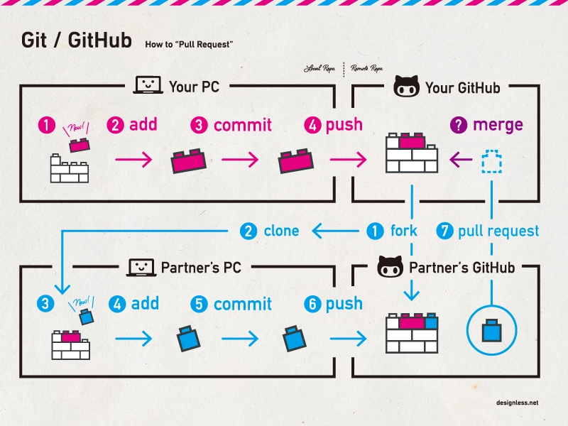
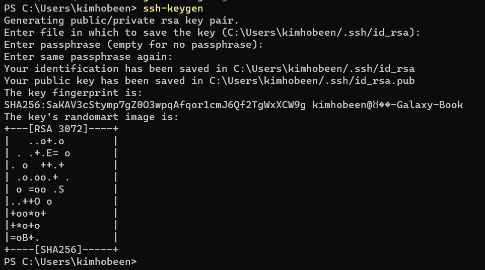
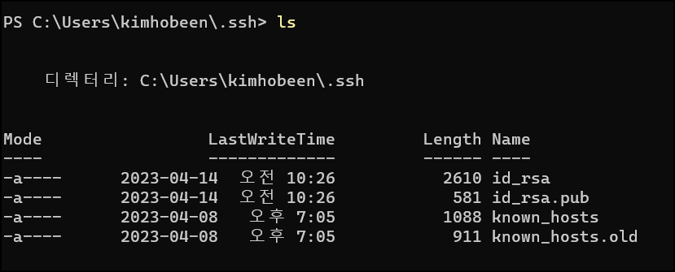
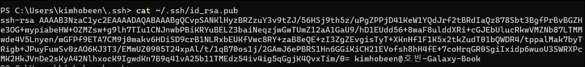
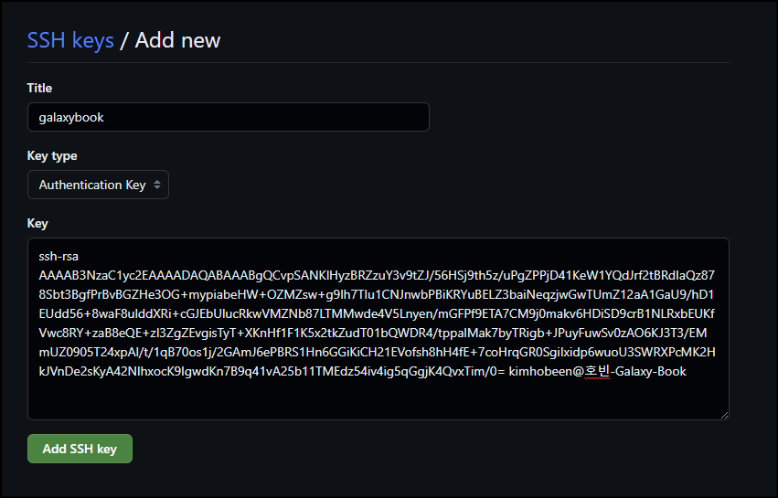
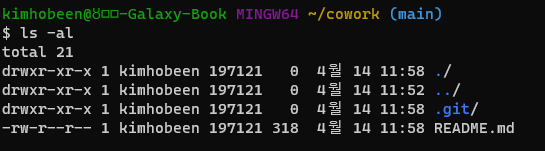
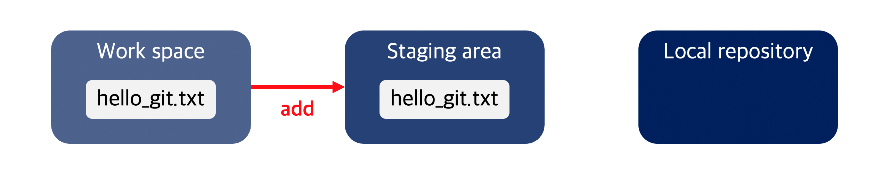
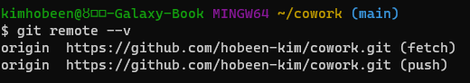
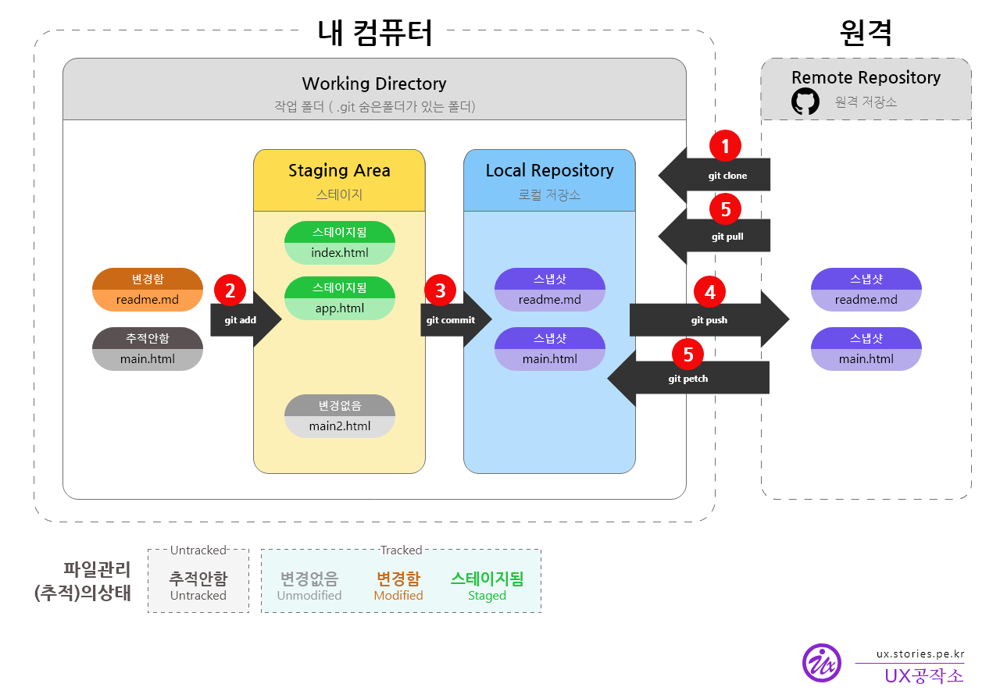

# Git 이란

Git이란 개발자의 코드를 효율적으로 관리하기 위해서 개발된 ‘분산형 버전 관리 시스템’ 입니다. 

저는 지금까지 git 과 github 를 혼동해왔었는데요. gitbub는 Git Repository를 관리할 수 있는 클라우드 기반 서비스입니다. 즉, 저장소를 제공해주는 서비스인거죠.

깃은 다음과 같은 기능을 제공합니다.

- 버전관리
- 파일 백업
- 협업



# 깃 설치 및 환경 설정

**설치** : git for windows 로 설치합니다. (간단합니다.)

**환경설정**

다음과 같이 이름, 이메일을 입력합니다.

```
$ git config --global user.name "kimhobeen"
$ git config --global user.email "sksjsksh32@anver.com"
```

커밋 메시지를 기록할 때 열리는 텍스트 에디터를 nano 로 선택합니다.

```
$ git config --global core.editor nano
```

# SSH 등록 (option)

ssh 는 Secure SHell 로, 보안이 강화된 shell 접속을 의미합니다. 

**SSH 키 생성**

명령어에 `ssh-keygen` 를 입력하여 SSH 키를 생성합니다.

그 다음 저장 위치를 선택하는데, 바로 Enter 를 눌러줍니다.

그 다음은 password 인데, 공백으로 놔두도록 하겠습니다.

이까지 하면 SSH 키가 생성됩니다.



**공개키 복사**

키 페어는 공개가 되는 공개키(public key) 와 개인키(private key, secret key) 로 나뉩니다. 폴더에서 확인할 수 있습니다.



id_rsa.pub 는 공개키, id_rsa 는 비밀키입니다. 이중 공개키를 복사합니다.



**GitHub 에 공개키 등록**

github `settings` > `SSH and GPG keys` 에서 SSHkeys 를 등록해줍니다.



이제 repository 를 clone 할 때 Code 에서 SSH 의 문자열을 복사하고 로컬에서 사용합니다.

`git clone git@github.com:codestates-seb/be-simple-git-workflow.git`

# git 명령어

**git init**

- 디렉토리 내 .git 디렉토리가 생성됩니다. 해당 위치의 모든 파일들이 Git 의 관리를 받게 됩니다.



**git add .** 

- 디렉토리 내 파일 전체는 Staging area 로 이동시킵니다. 
- 

**git commit -m "message"**

- Staging area 에서 Local repository 로 옮깁니다.

**git remote add [원격 저장소 별칭] [원격 저장소 URL]** 

- github 의 원격 저장소 URL 을 넣어서 로컬과 리모트를 연결시킵니다.
- `git remode add origin https://github.com/hobeen-kim/cowork.git` 와 같이 사용됩니다.
- 원격저장소 별칭에는 주로 origin 이라는 단어를 관례로 사용합니다
- `git remote --v` 를 통해 잘 연결되었는지 확인 가능합니다.
  - 
  - 뒤에 fetch 는 remote repository 에서 파일을 내려받을 때 사용하는 별칭이며, push 는 파일을 업로드할 때 사용합니다.

**git remote rm [원격 저장소 별칭]**

- 이 명령은 로컬 저장소에서 원격 저장소에 대한 참조를 제거합니다. 원격 저장소 자체는 변경되지 않습니다.

**git push [원격 저장소 별칭] [브랜치 이름]**

- 작업물을 Remote repository에 업로드하는 행위를 Push라고 합니다.
- `git push origin main` 으로 하면 되겠습니다.

**git clone [받아올 URL]** 

- Remote repository의 코드를 로컬로 복사해오면서 해당 Remote repository와 자동으로 연결을 맺어주는 명령어입니다. 
- github 에서 code 를 누르고 Remote repository 의 url 을 복사해서 붙여넣습니다.
- `git clone https://github.com/hobeen-kim/cowork.git` 와 같이 사용할 수 있습니다.

**git restore [파일명]**

- commit 되지 않은 Local Repository 의 변경사항을 취소할 수 있습니다. 

**git reset HEAD^**

- Remote Repository 에 올리기 전에 가장 최신의 commit 을 취소합니다.
- `git reset HEAD^^^` 과 같이 3개를 취소할 수도 있습니다.

- 

**git pull [원격 저장소 별칭] [브랜치 이름]**

- `git pull pair main` : 페어의 Remote Repository 를 Local Repository 로 가져옵니다.

**git branch** 

- 현재 Git 저장소에서 사용 가능한 브랜치 목록과 현재 작업 중인 브랜치를 확인니다.

**git checkout -b [브랜치 이름]**

- 새로운 브랜치가 만들어지고, 새로운 브랜치로 전환됩니다.
- **git checkout [브랜치 이름]** : 이미 존재하는 브랜치로 전환합니다.

**git switch -c [브랜치 이름]**

- 새로운 브랜치가 생성되고, 해당 브랜치로 전환됩니다.
- **git switch [브랜치 이름]** : 이미 존재하는 브랜치로 전환합니다.

**git merge [브랜치 이름]**

- 현재 브랜치에 [브랜치] 에 병합합니다.

**git stash save "작업 중인 내용을 잠시 저장합니다."**

- 현재 변경 내용을 저장합니다.

**git stash apply**

-  가장 최근에 저장한 작업 내용을 불러옵니다. 만약, 여러 개의 작업 내용을 저장했다면, `git stash list` 명령어를 사용하여 저장한 작업 내용을 확인할 수 있습니다.

# git workflow

 

*<출처 : https://ux.stories.pe.kr/182>*

이게 제일 눈에 잘 들어오네요. 이때 주의해야 할 점은 git pull 과 git commit 에서 같은 파일 같은 내용이 수정되었을 때 conflict 가 발생한다는 점입니다.

Git 충돌은 다음과 같은 상황에서 발생할 수 있습니다.

1. 동일한 파일을 동시에 수정하는 경우

   두 명 이상의 개발자가 동일한 파일의 동일한 부분을 수정하는 경우 충돌이 발생할 수 있습니다. 이 경우 Git은 두 버전의 변경 내용을 병합하려고 하지만, 병합할 수 없는 충돌이 발생합니다.

2. 서로 다른 브랜치에서 동일한 파일을 수정하는 경우

   서로 다른 브랜치에서 같은 파일의 동일한 부분을 수정한 경우, Git은 두 버전의 변경 내용을 병합하려고 하지만, 병합할 수 없는 충돌이 발생합니다.

3. 삭제된 파일을 수정하는 경우

   다른 개발자가 파일을 삭제한 후, 삭제된 파일을 수정하는 경우 충돌이 발생합니다.

4. 원격 저장소의 브랜치를 로컬 브랜치에 병합하는 경우

   원격 저장소에서 다른 개발자가 브랜치를 업데이트하고, 이를 로컬 브랜치에 병합하려는 경우 충돌이 발생할 수 있습니다.

이러한 충돌 상황에서는 충돌이 발생한 파일을 수정하여 충돌을 해결해야 합니다. 충돌 해결 방법은 충돌 상황에 따라 다르며, 일반적으로 Git의 병합 도구를 사용하여 충돌을 해결합니다.