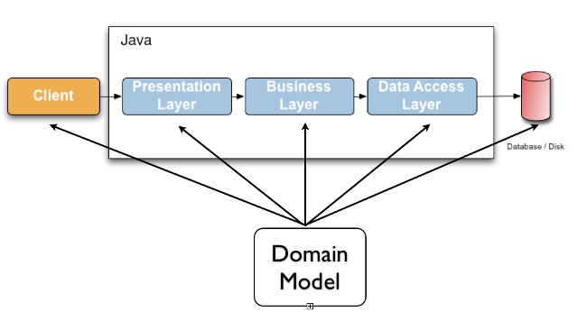
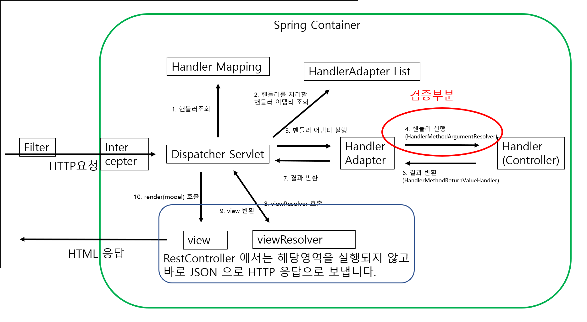
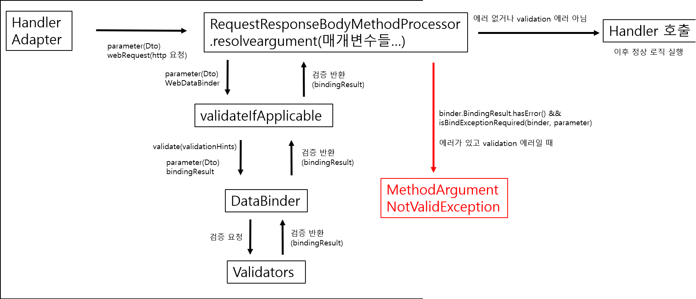

# Validation

토이프로젝트에 validation 을 적용하기 전에 validation 에 대해서 정리하고 공부하는 시간을 가져야겠다고 생각했습니다. 전에 김영한님이 가르쳐준 것도 잘 기억나지 않구요 ㅠㅠ 이번 포스팅을 통해,

**@Valid 와 @Validated 의 차이, 사용, 던지는 예외 등을 알아보겠습니다.**

# @Valid

## @Valid 를 사용하는 이유



@Valid 를 사용하는 이유는 간단히 말해 검증로직을 분리하여 통합관리하고 위함입니다.즉 SRP(단일책임원칙) 때문이라고 할 수도 있습니다. 

Layer 에서의 코드가 간단해져서 유지보수하기 편하다는 겁니다. 그게 아니라면 다음과 같이 복잡한 검증 로직을 추가해야 합니다.

```java
//앗 코드가 너무 복잡하다!!

@PostMapping("/add")
    public String addItem(@ModelAttribute Item item, RedirectAttributes redirectAttributes, Model model) {
  
    //검증 오류 결과를 보관
    Map<String, String> errors = new HashMap<>();
  
    //검증 로직
    //item.getItemName() 에 text 가 없으면 errors 에 담아둔다.
    if (!StringUtils.hasText(item.getItemName())) {
        errors.put("itemName", "상품 이름은 필수입니다.");
    }
    //price 범위 설정 후 error 보관
    if (item.getPrice() == null || item.getPrice() < 1000 || item.getPrice() > 1000000){
        errors.put("price", "가격은 1,000 ~ 1,000,000 까지 허용합니다.");
    }
    //quantity 범위 설정 후 error 보관
    if(item.getQuantity() == null || item.getQuantity() >= 9999){
        errors.put("quantity", "수량은 최대 9,999 까지 허용합니다.");
    }
  
    //특정 필드가 아닌 복합 룰 검증
    if(item.getPrice() != null && item.getQuantity() != null){
        int resultPrice = item.getPrice() * item.getQuantity();
        if(resultPrice < 10000){
            errors.put("globalError", "가격 * 수량의 합은 10,000원 이상이어야 합니다. 현재 값 = " + resultPrice);
        }
    }
  
    //검증에 실패하면 다시 입력 폼으로
    if(!errors.isEmpty()){
        log.info("errors code = {}", errors.values());
        //model 에 attribute 로 담는다.
        model.addAttribute("errors", errors);
        return "validation/v1/addForm";
    }
  
    //성공 로직
    Item savedItem = itemRepository.save(item);
    redirectAttributes.addAttribute("itemId", savedItem.getId());
    redirectAttributes.addAttribute("status", true);
    return "redirect:/validation/v1/items/{itemId}";
}
```

제 inflearn 강의에서 발췌했습니다.


## @Valid 사용

1. gradle 은 해당 의존성을 추가합니다.

`implementation 'org.springframework.boot:spring-boot-starter-validation' `

2. 적용은 다음과 같이 합니다.

```java
package org.hibernate.validator.referenceguide.chapter01;

import jakarta.validation.constraints.Min;
import jakarta.validation.constraints.NotNull;
import jakarta.validation.constraints.Size;

public class Car {

    @NotNull
    private String manufacturer;

    @NotNull
    @Size(min = 2, max = 14)
    private String licensePlate;

    @Min(2)
    private int seatCount;

    public Car(String manufacturer, String licencePlate, int seatCount) {
        this.manufacturer = manufacturer;
        this.licensePlate = licencePlate;
        this.seatCount = seatCount;
    }

    //getters and setters ...
}
```

- 이런 적용은 필드뿐만 아니라  property, 파라미터 타입(Iterable, List, Map, Optional 내에서), 클래스 등등 많은 곳에 사용할 수 있습니다. [공식문서](https://docs.jboss.org/hibernate/validator/8.0/reference/en-US/html_single/#preface)

## 어디서 어떻게 검증하는가??



스프링 컨테이너의 구조에 대해 큰 그림을 그려봤습니다. 여기서 빨간색 동그라미를 친 ArgumentResolver 에서 @Valid 검증이 실행됩니다. 한번 자세히 보겠습니다. [스프링 mvc 구조이해](https://hobeen-kim.github.io/learning/spring-MVC1-%EC%8A%A4%ED%94%84%EB%A7%81-MVC-%EA%B5%AC%EC%A1%B0%EC%9D%B4%ED%95%B4/)

### HandlerMethodArgumentResolver 인터페이스

ArgumentResolver 가 아니라 정확히는 HandlerMethodArgumentResolver 에 전달받은 데이터가 핸들러에 맞게 변환되어 전달되게 됩니다. **이때 데이터를 받는 어노테이션에 따라 어떤 구현체가 사용되는지 다름니다.** 다음과 같은 컨트롤러와 DTO가 있다고 생각해봅시다.

```java
//컨트롤러
@RestController
@RequestMapping("/test")
public class TestController {

	@PostMapping("/")
	public ResponseEntity<String> test(@RequestBody @Valid Dto dto){
		String testData = Dto.getData();
		return ResponseEntity.ok(testData);
	}
}

//Dto
public class Dto{
    @NotNull
    private String name;
    //getter, setter
}
```

이 때 컨트롤러에서 @RequestBody 를 사용하게 되면 핸들러어댑터인  HandlerMethodArgumentResolver 의 구현체는 **RequestResponseBodyMethodProcessor** 가 됩니다.

즉, data 는 Controller 를 들어오기 전에 RequestResponseBodyMethodProcessor 에서 controller 가 받을 수 있는 데이터로 가공된다는 겁니다. 바로 그 안에 검증로직이 있습니다.  


### RequestResponseBodyMethodProcessor

위에서 설명했던 @RequestBody 의 ArgumentResolver 입니다. 하나하나 주석을 달아보겠습니다. 매개변수는 바로 설명하겠습니다.

- **parameter** : 핸들러에서 처리할 메서드의 매개변수입니다. 이 경우에는 Dto 입니다. 매개변수의 타입, 이름, 어노테이션 등과 같은 메타데이터를 가져옵니다. (String name, @NotNull 등 Dto 의 정보)
- **mavContainer** : 컨트롤러에서 반환되는 `ModelAndView` 객체의 정보를 저장하는 컨테이너입니다. @RestController 에서는 ModelAndView 가 사용되지 않으니 `null` 입니다.
- **webRequest** : HTTP 요청 데이터입니다. NativeWebRequest 는 인터페이스로, 서블릿 기반 웹앱에서의 구현체는 ServletWebRequest 입니다. 이 객체는 내부적으로 `HttpServletRequest`와 `HttpServletResponse`를 포함하고 있으며, 이를 추상화하여 사용합니다. 따라서 이 객체를 사용하면 웹 요청의 헤더, 파라미터, 속성 등에 액세스할 수 있습니다.
- **binderFactory** : `WebDataBinder` 인스턴스를 생성하는데 사용되는 팩토리입니다. `WebDataBinder`는 데이터 바인딩 및 유효성 검사를 처리하는데 사용됩니다. `HandlerMethodArgumentResolver`가 데이터 바인딩이나 유효성 검사를 처리하지 않는 경우에는 `null`일 수 있습니다. 일반적으로 `DefaultDataBinderFactory` 구현체가 자동주입됩니다.

```java
@Override
public Object resolveArgument(MethodParameter parameter, @Nullable ModelAndViewContainer mavContainer,
        NativeWebRequest webRequest, @Nullable WebDataBinderFactory binderFactory) throws Exception {

	//마찬가지로 매개변수입니다.
    parameter = parameter.nestedIfOptional();
    //readWithMessageConverters 를 사용하여 webRequest 에서 파라미터에 맞게 객체를 읽어옵니다. 여기에서 HTTP 요청이 Java 객체로 변환됩니다. readWithMessageConverters 를 세부적으로 들어가진 않겠습니다.
    Object arg = readWithMessageConverters(webRequest, parameter, parameter.getNestedGenericParameterType());
    //주어진 매개변수(Dto) 에 대한 변수 이름을 생성합니다. 클래스 이름에서 첫번째 문자를 소문자로 변환하여 변수 이름을 만듭니다. (name = "dto")
    String name = Conventions.getVariableNameForParameter(parameter);

    if (binderFactory != null) {
        //createBinder 를 통해 데이터 변환(json 의 string 을숫자, 날짜 등의 타입으로 변환), 유효성 검사 적용, 바인딩 및 유효성 검사 결과 관리가 가능합니다.
        WebDataBinder binder = binderFactory.createBinder(webRequest, arg, name);
        if (arg != null) {
            //validateIfApplicable 를 사용하여 binder 와 parameter 를 매개변수로 해서 유효성 검사를 수행합니다. 핵심로직으로 아래에서 다시 설명하겠습니다.
            validateIfApplicable(binder, parameter);
            //위에서 validateIfApplicable 를 통해 에러가 있는 경우 binder 의 BindingResult 에 에러를 추가시켰습니다. 
            //따라서 binder.getBindingResult().hasErrors() = true 가 됩니다.
            //isBindExceptionRequired() 은 @Valid 어노테이션이 있는 매개변수에 대해서만 유효성 검사를 수행하고, 오류가 있을 경우 MethodArgumentNotValidException을 발생시키기 위함입니다.
            //왜냐하면 @Valid 에 의한 오류가 아닌 것도 있을 수 있기 때문입니다.
            if (binder.getBindingResult().hasErrors() && isBindExceptionRequired(binder, parameter)) {
                //결론적으로 유효성검증 실패시 MethodArgumentNotValidException 에러를 던집니다.
                throw new MethodArgumentNotValidException(parameter, binder.getBindingResult());
            }
        }
        if (mavContainer != null) {
            mavContainer.addAttribute(BindingResult.MODEL_KEY_PREFIX + name, binder.getBindingResult());
        }
    }
        return adaptArgumentIfNecessary(arg, parameter);
}
```

` validateIfApplicable(binder, parameter);` 추가 설명입니다. 해당 로직에서 `@Valid` 어노테이션이 적용되었는지와 해당 객체의 타입이 Bean Validation이 적용될 수 있는지를 확인합니다. 만약 검증이 필요하다면, `binder.validate()`를 호출하여 실제 유효성 검사를 수행합니다.

```java
protected void validateIfApplicable(WebDataBinder binder, MethodParameter parameter) {
    //prameter 의 어노테이션을 받습니다.
    Annotation[] annotations = parameter.getParameterAnnotations();
    for (Annotation ann : annotations) {
        Object[] validationHints = ValidationAnnotationUtils.determineValidationHints(ann);
        //검증이 필요한 경우, validate 로 검증을 합니다.
        //validate 는 validationHints 를 통해 Validator 로 검증을 실시합니다.
        if (validationHints != null) {
            binder.validate(validationHints);
            break;
        }
    }
}
```

그림으로 그려봤습니다.



1. 핸들러 어댑터에서 resolveArgument 호출
2. resolveArgument 내부에서 validateIfApplicable 호출
3. validateIfApplicable 에서 어노테이션을 돌면서 validationHints 가 있으면 DataBinder 의 validate 메서드 호출
4. validators 에 검증 요청
5. WebDataBinder 의 bindingResult 에 검증결과가 담김
6. 검증 실시
   1. bindingResult 에 에러가 있고 validation 에러일 때 MethodArgumentNotValidException 반환
   2. 아니면 Handler(Controller) 실행

솔직히 validateIfApplicable 부분부터 헷갈립니다만 이러한 흐름으로 진행되고 결국은 MethodArgumentNotValidException 를 반환한다고 할 수 있겠습니다.


# @Validated

다음은 @Validated 입니다. 앞서 배운 @Valid 는 ArgumentResolver 에서 실행되기 때문에 컨트롤러에만 적용할 수 있습니다. 하지만 서비스를 개발하다 보면 서비스, 리파지토리 등에도 유효성 검증을 해야 할 수도 있습니다. 

이를 위해서 @Validated 는 AOP 기반으로 프록시를 생성하여 메서드의 요청을 가로채서 유효성 검증을 합니다.

스프링에서는 ***ValidationAutoConfiguration*** 을 통해서 ***MethodValidationPostProcessor*** 을 자동으로 빈 등록을 합니다.

이 ***MethodValidationPostProcessor*** 에서 @Validated 검증을 하게 됩니다.

## 적용

클래스에 @Validated를 붙여주고, 유효성을 검증할 메소드의 파라미터에 @Valid를 붙여주면 검증이 됩니다.

```java
//컨트롤러
@RestController
@RequestMapping("/test")
@Validated
public class TestController {

	@PostMapping("/")
	public ResponseEntity<String> test(@RequestBody @Valid Dto dto){
		String testData = Dto.getData();
		return ResponseEntity.ok(testData);
	}
}

//Dto
public class Dto{
    @NotNull
    private String name;
    //getter, setter
}
```


## 동작 원리

### MethodValidationPostProcessor

중요한 부분만 보도록 하겠습니다.

```java
public class MethodValidationPostProcessor extends AbstractBeanFactoryAwareAdvisingPostProcessor
		implements InitializingBean {

	private Class<? extends Annotation> validatedAnnotationType = Validated.class;

	... 
	
	@Override
	public void afterPropertiesSet() {
		Pointcut pointcut = new AnnotationMatchingPointcut(this.validatedAnnotationType, true);
		this.advisor = new DefaultPointcutAdvisor(pointcut, createMethodValidationAdvice(this.validator));
	}

	protected Advice createMethodValidationAdvice(Supplier<Validator> validator) {
		return new MethodValidationInterceptor(validator);
	}
```

- 먼저 validatedAnnotationType 은 Validated.class 입니다. 해당 값은 setValidatedAnnotationType() 메서드를 변경할 수 있지만 넘어가겠습니다.
- afterPropertiesSet() : Spring의 `InitializingBean` 인터페이스에서 구현되는 메서드입니다. 이 메서드는 빈이 생성된 후, `BeanFactory`가 해당 빈에 모든 속성값을 설정한 후에 자동으로 호출됩니다.
  - `afterPropertiesSet()` 메서드는 `Advisor` 객체를 생성하며, 이 객체는 AOP에서 `Advice`와 `Pointcut`를 결합시켜서 적용할 수 있게 해줍니다. 
  - `AnnotationMatchingPointcut` 클래스는 특정 어노테이션(Validated  혹은 커정한 커스텀 어노테이션)을 가진 메서드만을 대상으로 하는 Pointcut 객체를 생성합니다. `DefaultPointcutAdvisor`는 `Pointcut`과 `Advice`를 결합해서 `Advisor` 객체를 생성합니다. 
- createMethodValidationAdvice() : `MethodValidationInterceptor` 객체를 반환합니다. 따라서 이 메서드가 생성한 `MethodValidationInterceptor` 객체와 `AnnotationMatchingPointcut` 객체를 결합해서 afterPropertiesSet()의  `Advisor` 객체를 생성합니다.

결국 검증은 Advice 인 MethodValidationInterceptor 가 하게 됩니다. MethodValidationInterceptor 를 살펴보도록 하겠습니다.

### MethodValidationInterceptor 

해당 AOP 클래스의 핵심로직인 invoke()  메서드를 보겠습니다. 

```java
@Override
@Nullable
public Object invoke(MethodInvocation invocation) throws Throwable {
    // Avoid Validator invocation on FactoryBean.getObjectType/isSingleton
    if (isFactoryBeanMetadataMethod(invocation.getMethod())) {
        return invocation.proceed();
    }

    //@Validated 가 붙은 클래스를 모두 찾습니다.
    Class<?>[] groups = determineValidationGroups(invocation);

    // Standard Bean Validation 1.1 API
    ExecutableValidator execVal = this.validator.get().forExecutables();
    Method methodToValidate = invocation.getMethod();
    Set<ConstraintViolation<Object>> result;

    Object target = invocation.getThis();
    if (target == null && invocation instanceof ProxyMethodInvocation methodInvocation) {
        // Allow validation for AOP proxy without a target
        target = methodInvocation.getProxy();
    }
    Assert.state(target != null, "Target must not be null");

    try {
        result = execVal.validateParameters(target, methodToValidate, invocation.getArguments(), groups);
    }
    catch (IllegalArgumentException ex) {
        // Probably a generic type mismatch between interface and impl as reported in SPR-12237 / HV-1011
        // Let's try to find the bridged method on the implementation class...
        methodToValidate = BridgeMethodResolver.findBridgedMethod(
                ClassUtils.getMostSpecificMethod(invocation.getMethod(), target.getClass()));
        result = execVal.validateParameters(target, methodToValidate, invocation.getArguments(), groups);
    }
    if (!result.isEmpty()) {
        throw new ConstraintViolationException(result);
    }

    Object returnValue = invocation.proceed();

    result = execVal.validateReturnValue(target, methodToValidate, returnValue, groups);
    if (!result.isEmpty()) {
        throw new ConstraintViolationException(result);
    }

    return returnValue;
}
```

`result = execVal.validateParameters(target, methodToValidate, invocation.getArguments(), groups);` 가 계속 반복되는 걸 볼 수 있습니다. 해당 메서드가 검증 코드이며, !result.isEmpty 일 때(validation 결과 오류가 있을 때) **ConstraintViolationException** 을 반환하게 됩니다.

<u>*참고로 ConstraintViolationException 는 RuntimeException 입니다.*</u> 


> @Validated 에는 제약 조건이 적용될 검증 그룹을 지정할 수 있는 그룹 기능이 있지만 코드가 복잡해져서 거의 사용되지 않으므로 이러한 기능이 있음을 참고하고 넘어가도록 합시다. [그룹 기능 참고](https://mangkyu.tistory.com/174)


# 두 어노테이션의 차이점

**@Valid** 

- 자바 표준 스펙으로, 컨트롤러에만 적용이 됩니다.
- 주로 DTO(Data Transfer Object)나 도메인 객체에서 사용하며, 스프링 MVC 컨트롤러 메서드 파라미터에 적용됩니다. 
-  단순한 데이터 유효성 검증을 위한 어노테이션입니다. 

**@Validated**

- 스프링 프레임워크에서 제공하는 추가적인 검증 기능을 제공합니다. AOP 로 검증이 진행됩니다. 
- 주로 서비스 계층에서 사용하며, 스프링 빈 메서드 파라미터나 클래스 레벨에서 적용됩니다.
- 스프링 프레임워크에서 제공하는 추가적인 유효성 검증을 위한 어노테이션으로, Bean Validation API를 확장하여 유연한 검증을 할 수 있도록 지원합니다.

# 결론

이건 제 토이프로젝트에 validation 을 적용하기 위해 공부하려고 포스팅한건데요. validation 은 지금은 컨트롤러 에서 @Valid 를 사용해야 겠다고 생각했습니다.

근데 적용하는 것보다 동작 원리 파헤치는 게 훨씬 힘드네요. 이거 작성하는데 여기저기 찾아보느라 이틀이나 걸렸습니다 .. ㅎㅎ 일단 제가 제일 궁금했던 건 **어떤 원리로 각각 MethodArgumentNotValidException, ConstraintViolationException 이 반환되는지였습니다.** 이제 알았으니 적용해보도록 합시다. 

[토이프로젝트에 validation 적용](https://hobeen-kim.github.io/socceranalyst/validation-%EC%84%A4%EC%A0%95/)
