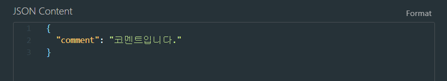
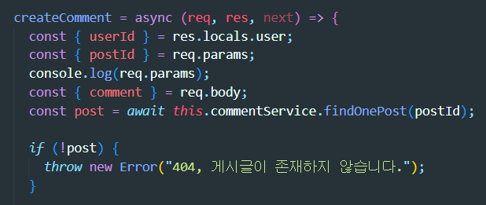
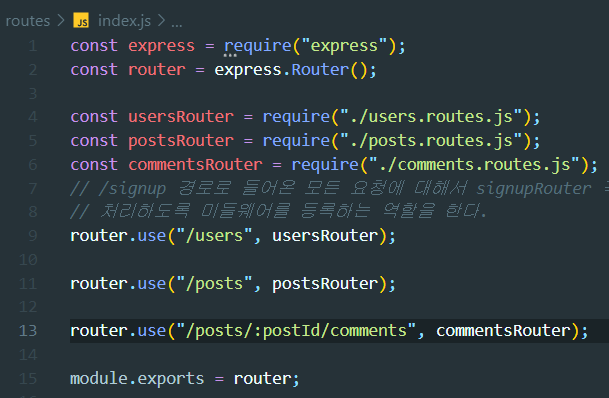
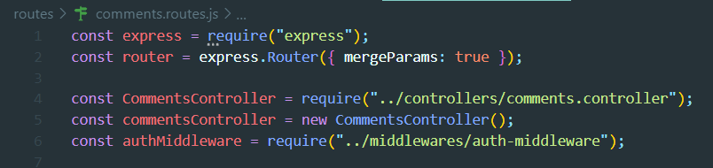

## TIL - NodeJS Lv5 트러블 슈팅

### 문제 사항

#### 게시글이 존재하지 않습니다.

{: width="100%"}

게시글에 코멘트를 남기는 API를 만들어서 Thunder Client를 이용하여 comment를 보냈는데

{: width="100%"}

위와 같이 게시글이 존재하지 않는다고 에러가 발생하였다.

{: width="100%"}

req.params 부분을 console.log로 확인해보니 {}이처럼 빈 객체가 나왔다.

### 문제 해결

#### index.js
{: width="100%"}

router.use("/posts/:postId/comments", commentsRouter)를 보면 /posts/:postId/comments라는 경로에 요청이 들어오면,  commentsRouter로 향하도록 하는 코드인데, 문제는 commentsRouter에서는 postId 파라미터를 사용할 수 없다는 것이다. 
즉, index.js라는 상위 라우터에서 "postId" 파라미터를 commentRouter라는 하위 라우터에서 받아서 사용하기 위해서는 mergeParams: true라는 옵션을 추가하여야 한다.

#### commentRouter
{: width="100%"}

위의 express.Router()에서 mergeParams는 defalut값이 false인데, true로 변경함으로써 상위 라우터의 파라미터를 하위 라우터에서 가져와서 사용할 수 있게 된다.

#### Reference

<https://expressjs.com/en/4x/api.html#express.router>