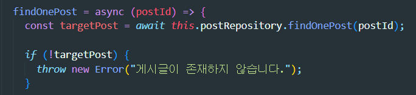

## Layered Architecture Pattern 트러블슈팅

### 문제 사항

#### TypeError: Cannot read properties of null  (reading 'postId') at PostService.findOnePost

##### posts.service.js
{: width="100%"}

해석해보자면 PostService 클래스 내부의 findOnePost 메소드에서 'postId'를 읽었을때 null인 경우 발생한 오류이다. 삭제한 게시글을 조회하는 과정에서 발생하였는데, 게시글을 삭제하면 데이터베이스에서  postId의 컬럼에 값이 존재하지 않기 때문에 service부분에서 오류가 발생하여 controller로 보내지 못하는 상황이 발생하였다.

### 문제 해결

##### posts.service.js

{: width="100%"}

위와 같이 throw문을 이용하여 postId에 해당하는 게시글이 존재하지 않을 경우 함수를 중단시키고 함수를 호출한 PostsController로 보낸다.

#### posts.controller.js

{: width="100%"}

PostsController에서는 try-catch문을 사용하고 있음으로, catch 블록에서 이 에러를 처리하게 된다.

### 고민할 사항

throw new Error()를 이용하면 에러 메시지를 전달할 수 있지만, 에러 코드는 전달할 수 없다. 에러 코드까지 전달하게 할 수 있는 방법은 어떠한게 있을까? 좀 더 고민해봐야 할 것 같다.

