## Github Label을 활용하여 Issue와 Commit을 Pull Request로 연결하기


- Github Label을 활용하여 Issue와 Commit을 Pull Request로 연결하는 방법을 소개하고자 합니다.특정 이슈와 커밋들을 연결하여 프로젝트 기록들을 이슈별로 명확하게 구분할 수 있습니다. 
<br>

### Github Template을 활용하여 Issue 만들기

- Github에서 같은 형식의 Issue를 여러번 생성하기 위해서 Template을 활용하였습니다.
<br>

#### 1. Label 생성하기

- repository의 Issue를 클릭하고 Labels 버튼을 눌러 Label을 생성합니다


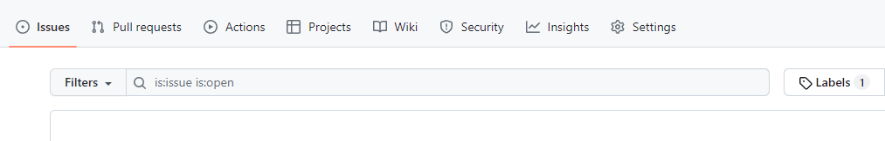
{: width="100%"}
<br>


- 특정 이슈를 지정하여 이름을 변경해주세요


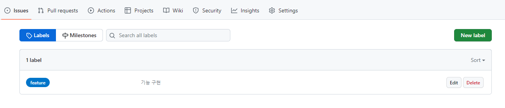
{: width="100%"}
<br>


#### 2. Template 만들기

 - repository의 setting으로 들어가주세요

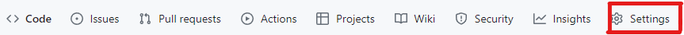{: width="100%"}
<br>


- Set up template을 눌러주세요

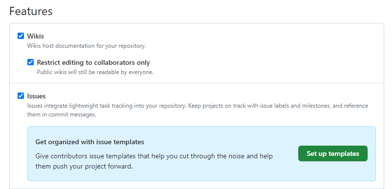{: width="100%"}
<br>


- Custom template을 눌러주세요

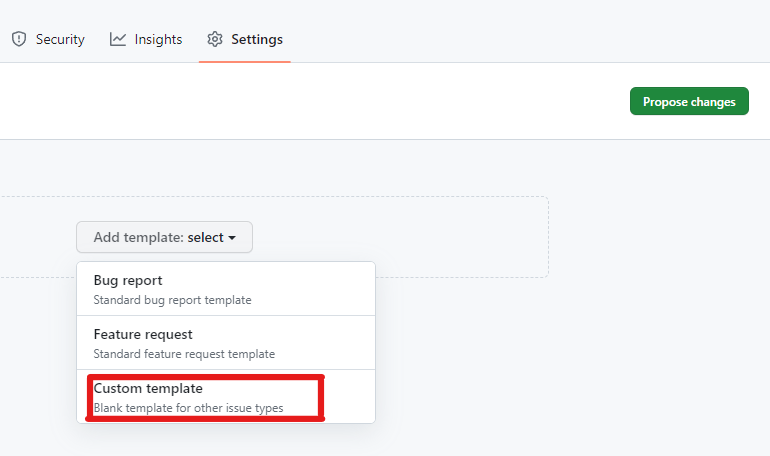{: width="100%"}
<br>


- 템플릿 이름, 설명, 내용을 수정하고 Labels를 등록해주세요
- 그 후 Propose changes를 누른 후 Commit Changes를 눌러주세요
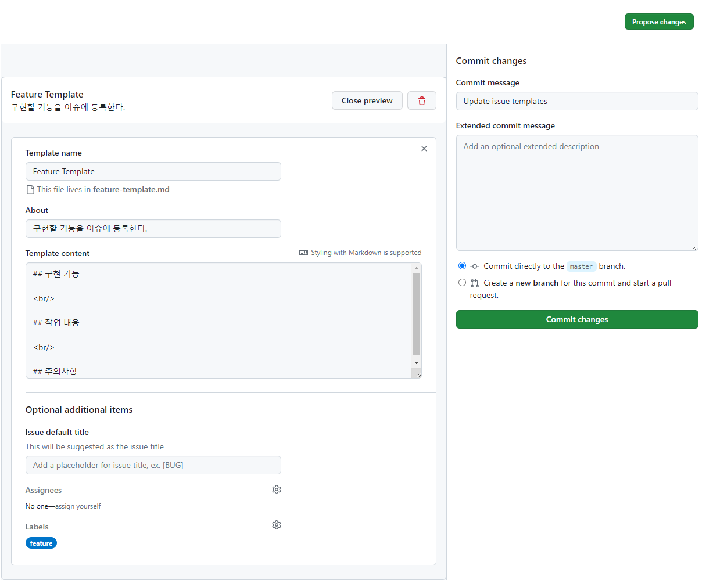{: width="100%"}


<br>
#### 2. Template으로 Issue 생성하기

- Issue에서 New issue 눌러주세요
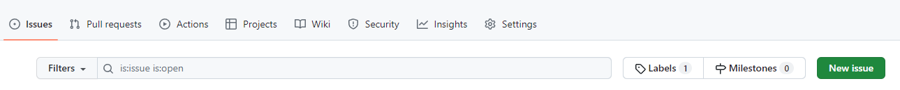{: width="100%"}
<br>


- Get started 눌러주세요
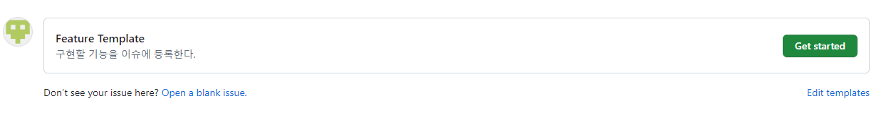{: width="100%"}
<br>


- 제목과 내용을 작성한 후 Assignees를 설정해주세요
  (Assignees: 이슈나 풀 리퀘스트 담당자)
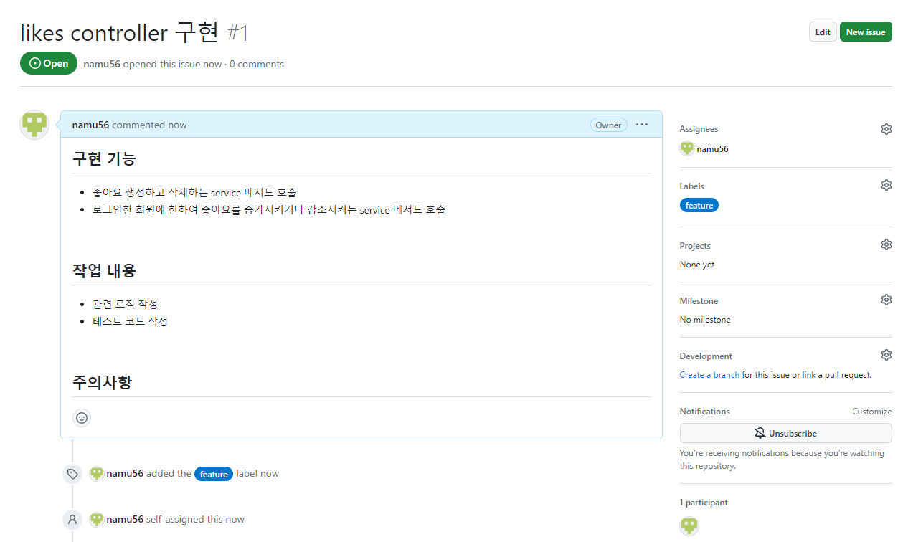{: width="100%"}
<br>


### Label과Branch, Issue의 고유번호를 활용하여 <br>자동연결하기


- Issue Template의 Label과 고유번호를 참조하는 branch를 생성하고 작업한 commit을 push한 후, Github에서 Pull Request를 진행했을때 자동으로 Issue와 연결됩니다.이 기능을 활용하면 효율적으로 기능을 구분지을 수 있습니다.(고유번호는 #옆에 적혀있는 숫자입니다)
<br>


#### 1. Branch 생성하기

```jsx
git checkout -b feature/고유번호
```
<br>

#### 2. 코드 작업 후 Commit & Push 하기

```jsx
git add .
git commit -m"commit message"
git push --set-upstream origin feature/고유번호
```
<br>

#### 3. Pull Request 생성하기


- Compare & pull request를 눌러주세요
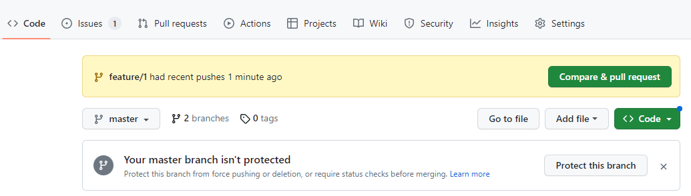{: width="100%"}
<br>


- Create pull request를 눌러주세요
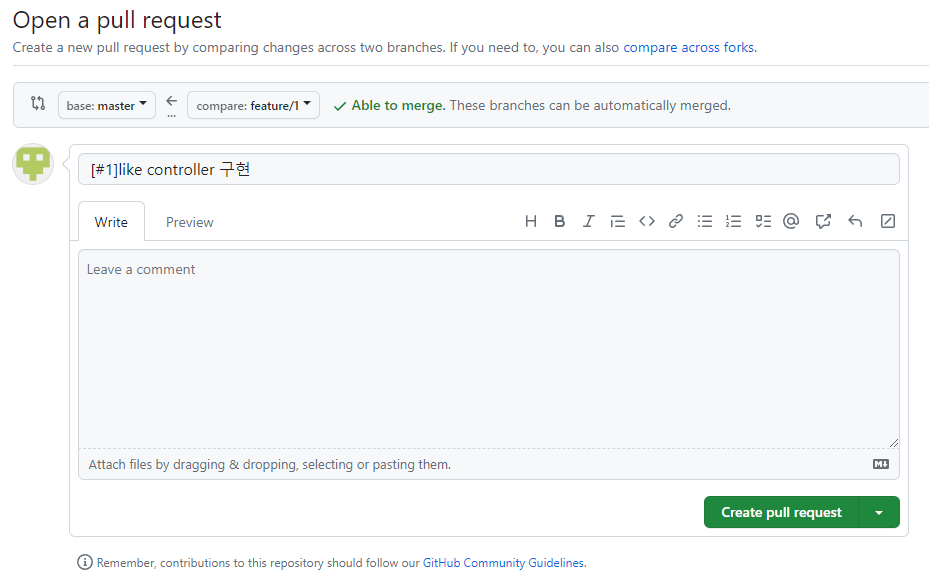{: width="100%"}
<br>


- Squash and merge를 눌러주세요
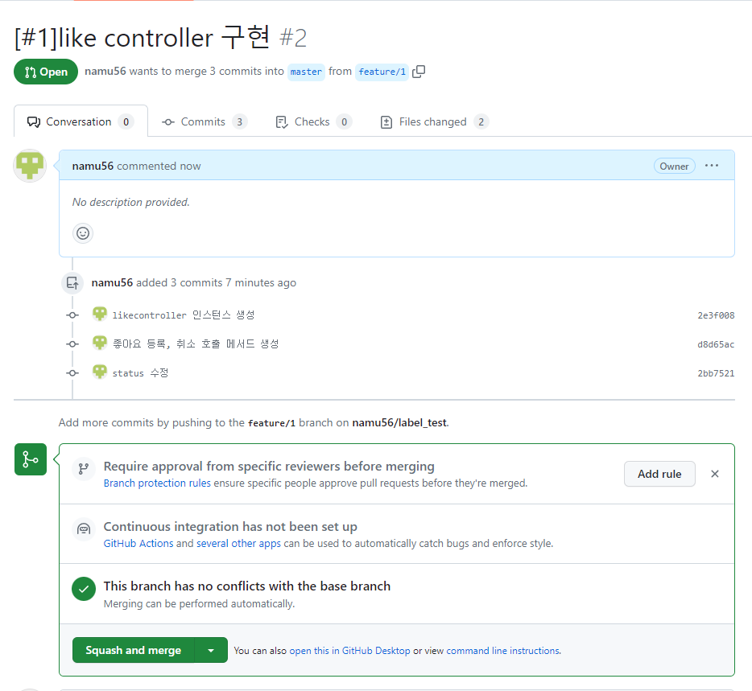{: width="100%"}
<br>


### Squash and merge하는 이유

{: width="100%"}

여러 개의 커밋을 하나의 커밋으로 합쳐서 히스토리를 정리하는 방법입니다. 기존의 머지 방식과 달리 Squash and merge는 작업 내용을 단일 커밋으로 합쳐서 머지합니다. 
<br>


### Result
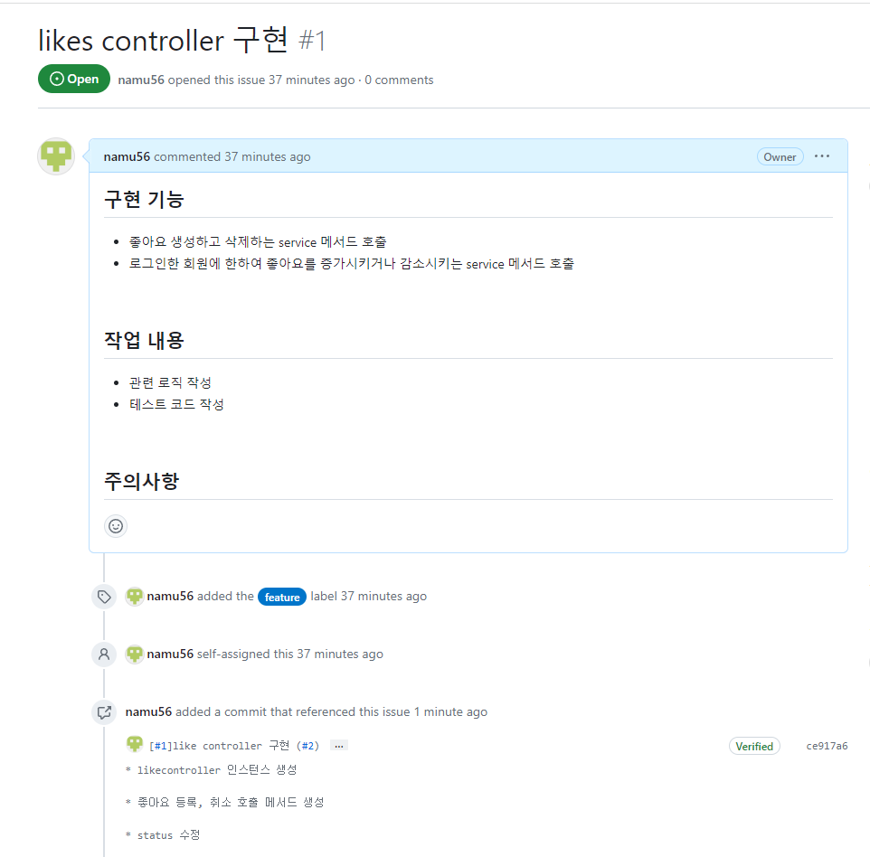{: width="100%"}

이렇게 Label을 활용하여 issue와 commit을 연결해 보았습니다.이런식으로 작성한다면 프로젝트 관리와 협업에서 매우 유용하며, 프로젝트의 전반적인 이력과 상태를 한눈에 파악할 수 있습니다.특히 개발자들이 작업하는 내용을 효율적으로 공유하고, 문제가 발생했을 때 빠르게 대처할 수 있습니다.
<br>


### 주의할 점


Branch를 생성하기 전에 변경사항들을 최신으로 동기화 해주는 것이 좋습니다. 다른 개발자들과 공동 작업하는 경우 각자가 수정한 내용들이 충돌할 가능성이 있기 때문입니다.

- 동기화 방법

```jsx
git switch master // master로 바꾼 후,

git pull origin master // master repository에서 가져온다
```


#### Reference

<https://computer-science-student.tistory.com/644>
<https://im-developer.tistory.com/182>