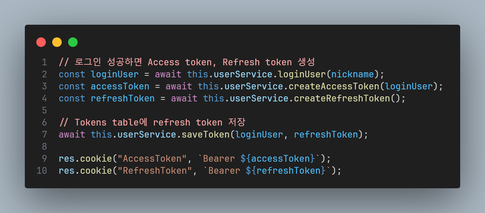
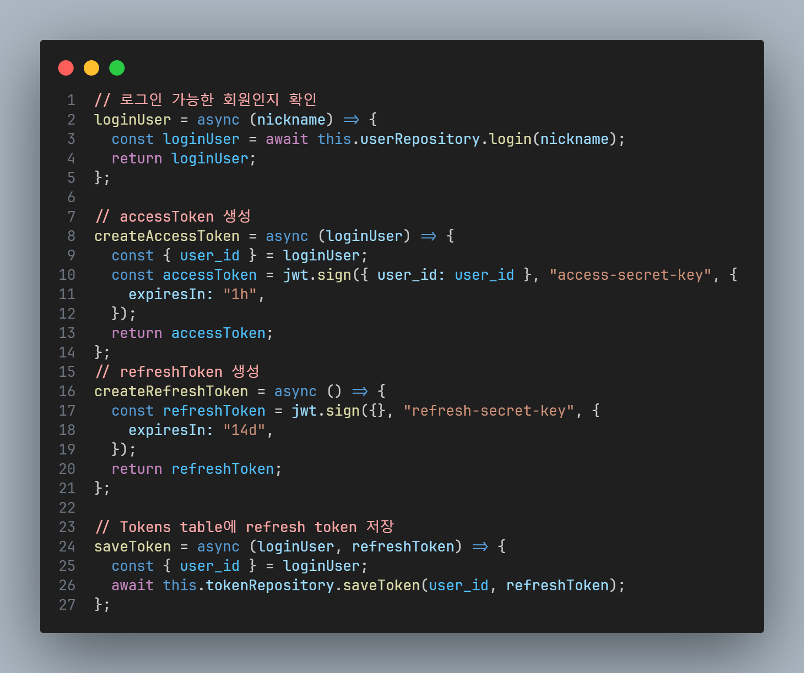
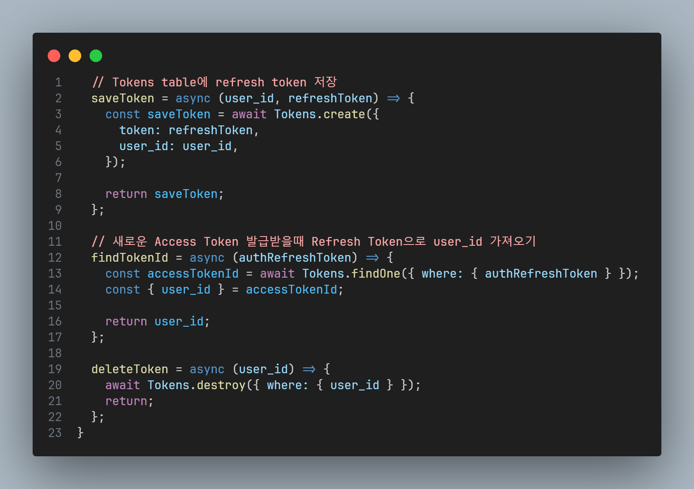
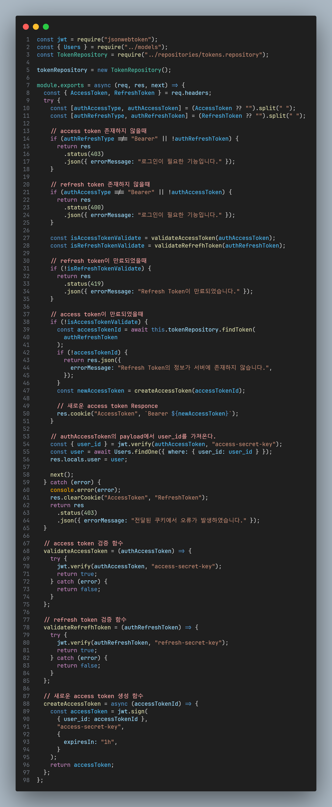

## Access Token과 Refresh Token 인증 구현
 

기존에 access token만을 이용했었는데, 이번에 refresh token을 함께 사용했다. refresh token 사용 방법에 대해서 검색하면서 깨달은 점은 너무나도 많은 방식이 존재한다는 것이다. 나의 refresh token 사용 방법은 그 중의 하나라고 생각주면 좋을 것 같다.
 

### 왜 Refresh Token을 사용할까?
 

token은 **stateless**하다. **Access Token**만 사용한다면, 해커에게 Token을 탈취당했을 때, 사용자는 계정의 제어권을 해커에게 내줄 수 밖에 없고, 서버가 Token에 대한 제어권이 없기 때문에 Token이 만료될때까지 기다릴 수 밖에 없다.
 

그래서 Access Token의 유효 기간을 짧게 하고, 자주 재발급 하도록 보안을 강화하면서 사용자의 잦은 로그아웃을 막아야하는데 여기서 사용하는 것이 **Refresh Token**이다.
 

**Refresh Token**은 클라이언트가 가지고 있던 **Access Token이 만료**되었을 때, **재발급** 받기 위해서 사용한다.
 

### Node.js로 구현하기

#### Access Token과 Refresh Token 발급 후 DB 저장

##### 1. users.controller

{:with:"100%"}

##### 2. users.service
{:with:"100%"}

##### 3. tokens.repository
{:with:"100%"}
 

#### Access Token or Refresh Token 검증하기

##### 시나리오

1. 인증이 필요한 API에 접근 => 인증 미들웨어로
2. Access Token과 Refresh Token이 존재 X => 다시 로그인
3. Refresh Token이 만료 => Refresh Token 재발급
4. Refresh Token은 유효 O,Access Token이 만료  
   => Access Token 재발급
5. Access Token과 Refresh Token 모두 유효  
   => 다음 미들웨어로

{:with:"100%"}

#### Reference

###### <https://hudi.blog/refresh-token/>
###### <https://cotak.tistory.com/102>