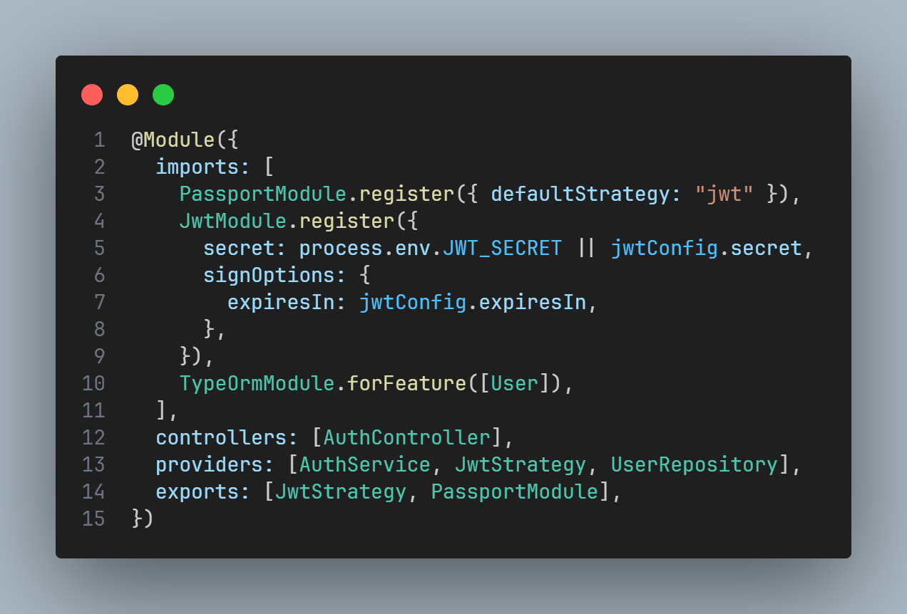

## TypeORM - Custom Repository
 

### 문제 사항

#### 1. typeORM 0.3.x 버전 오류
typeORM 0.3.x 버전에서 @EntityRepository가 deprecated 돼서 발생한 오류였다.
 
### 문제 해결

#### 1. Custom Repository 구현

TypeORM이 제공하는 Repository를 상속받아 Custom Repository를 구현하였다.

##### user.repository.ts

typeORM 0.3.x버전에서는 @EntityRepository를 사용하지 않고 Repository 생성자의 인자로 EntityManager를 전달해야한다. 

##### auth.module.ts

UserRepository는 TypeOrmModule을 통해 데이터베이스와의 연결을 설정하고, AuthModule 내에서 필요한 곳에서 UserRepository를 주입받아 데이터베이스 작업을 처리할 수 있다.
 

#### Reference
##### <https://hou27.tistory.com/entry/TypeORM-Custom-Repository-%EA%B0%9C%EC%84%A0%EC%95%88>