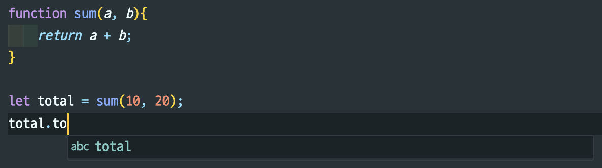
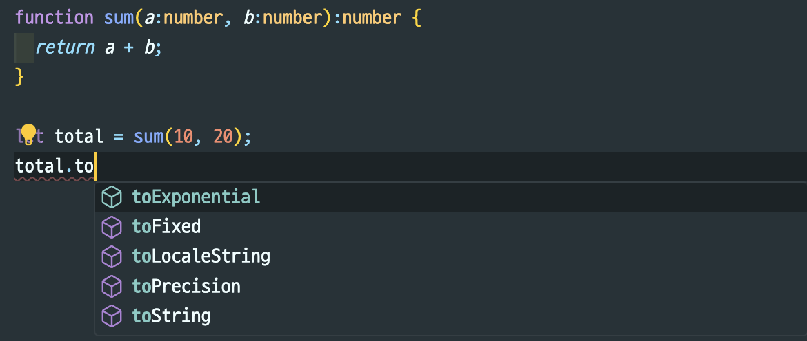

## TypeScript란?

타입스크립트는 자바스크립트에 타입을 부여한 언어입니다. 자바스크립트의 확장된 언어라고 볼 수 있습니다. 타입스크립트는 자바스크립트와 달리 브라우저에서 실행하려면 파일을 한번 변환해주어야 합니다. 이 변환 과정을 우리는 **컴파일(complile)** 이라고 부릅니다.

즉, 타입스크립트에서 자신이 원하는 타입을 정의하고 프로그래밍을 하면 자바스크립트로 컴파일되어 실행할 수 있다.

## 왜 타입스크립트를 써야할까?

### 1. 에러의 사전 방지

자바스크립트는 실수가 있거나 형식에 맞지 않는 코드도 어떠한 경고도 주지 않고 실행한다.

타입스크립트는 타입을 부여하기 때문에 코드 작성 시 알맞지 않은 타입을 넣거나, 혹은 타입을 넣지 않았을 경우 사전에 오류라고 경고를 준다.

사전에 오류를 디버깅 할 수 있고 이것은 나중에 디버깅 하는 시간을 줄여주어서 생산적은 측면에서 효과적이다.

### 📍JavaScript 와 TypeScript 비교 1.

- JavaScript

```jsx
function add(num1, num2) {
  console.log(num1 + num2)
}

add() // NaN
add(1) // NaN
add(1, 2) // 3
add(3, 4, 5) // 7
add('Hello', 'world') //"Helloworld"
```

- TypeScript

```jsx
function add(num1: number, num2: number) {
  console.log(num1 + num2)
}

add() //Expected 2 arguments, but got 0.
add(1) //Expected 2 arguments, but got 1.
add(1, 2)
add(3, 4, 5) //Expected 2 arguments, but got 3.
add('Hello', 'world') //Argument of type 'string' is not assignable to parameter of type 'number'.
```

### 📍JavaScript 와 TypeScript 비교 2.

- JavaScript

```jsx
function showItems(arr){
    arr.forEach((item) => {
        console.log(item);
    });
}

showItems([1, 2, 3]); //배열은 forEach 메서드 사용가능
> 1
  2
	3

showItems(1,2,3); //숫자 1은 forEach라는 메서드를 가지고 있지 않으므로 에러발생
> Uncaught TypeError: arr.forEach is not a function
```

- TypeScript

```jsx
function showItems(arr: number[]) {
  arr.forEach((item) => {
    console.log(item)
  })
}

showItems([1, 2, 3])
showItems(1, 2, 3) //Expected 1 arguments, but got 3.
```

> JavaScript(동적언어) : 런타임에 타입이 결정되고 오류가 있으면 그때 발생된다
>
> Java, TypeScript(정적언어) : 컴파일 타임에 타입이 결정되고 오류를 발견할 수 있다.

### 2. **코드 자동 완성과 가이드**

### 📍`toLocaleString()`라는 API 코드를 작성할 때의 차이

- JavaScript



위에서 볼 수 있듯이 `total`이라는 값이 정해져 있지 않기 때문에 자바스크립트 Number에서 제공하는 API인 `toLocaleString()`을 일일이 작성했습니다. 만약에 오타자라도 나서 `toLocalString()`이라고 했다면 이 파일을 브라우저에서 실행했을 때만 오류를 확인할 수 있다.

- TypeScript



변수 `total`에 대한 타입이 지정되어 있기 때문에 VSCode에서 해당 타입에 대한 API를 미리 보기로 띄워줄 수 있고 따라서, API를 다 일일이 치는 것이 아니라 tab으로 빠르고 정확하게 작성해나갈 수 있다.

## 정리

'Typescript'를 사용하게 되면 빠르게 개발을 하는데에 있어서 구조를 구성해야 하기 때문에 시간이 오래 걸릴 수 있고, 추가적인 문법을 이해해야 하는데 시간이 소요된다. 하지만, 'Javacript'의 가장 큰 단점으로 꼽히는 문제로 타입의 불안정성에 대해서 보장해주는 점과 추후 발생할 수 있는 오류에 대해서 줄여준다는 점에서 높게 평가되고 있다.

### 참조

---

[코딩앙마](https://www.youtube.com/watch?v=5oGAkQsGWkc&list=PLZKTXPmaJk8KhKQ_BILr1JKCJbR0EGlx0)  
[https://joshua1988.github.io/ts/why-ts.html#타입스크립트란](https://joshua1988.github.io/ts/why-ts.html#%ED%83%80%EC%9E%85%EC%8A%A4%ED%81%AC%EB%A6%BD%ED%8A%B8%EB%9E%80)  
[https://fomaios.tistory.com/entry/TS-타입스크립트TypeScript란#recentEntries](https://fomaios.tistory.com/entry/TS-%ED%83%80%EC%9E%85%EC%8A%A4%ED%81%AC%EB%A6%BD%ED%8A%B8TypeScript%EB%9E%80#recentEntries)
