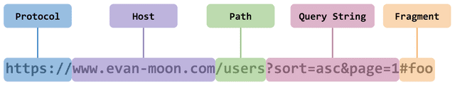
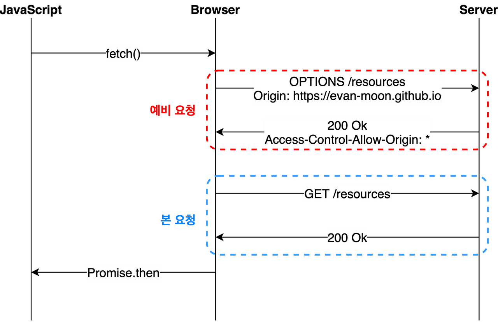
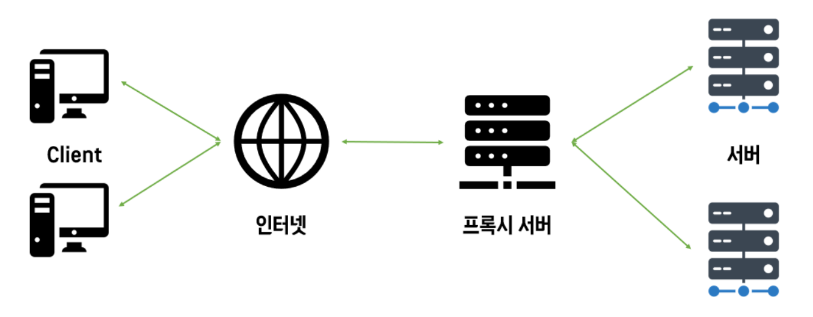

### CORS에 대해 알아보자
 
#### 사전 지식
 
##### Origin(출처)
- `Protocol`, `Host`, `Port`까지 합친 URL
  

{:with:"100%"}
 

##### SOP(Same-OriginPolicy)

- 동일한 출처에서만 리소스를 공유한다.  
 

#### 왜 동일한 출처에서만 공유해?

- 다른 출처에서 리소스를 공유하면 해커가 개인정보를 가로챌 위험성이 있다. 
- `Protocol`, `Host`, `Port` 이 3가지만 동일하면 동일 출처로 판단한다.
 
#### 그렇다면 다른 출처의 리소스가 필요하면 어떻게 해야할까?

- 해결책으로 나온 것이 CORS(Cross-Origin-Resource-Sharign)
 
#### CORS가 뭐야?

- 다른 출처의 리소스에 대한 허용/비허용 정책이다.
- 즉, CORS 정책을 허용하는 리소스라면 다른 출처의 요청이라도  받아들인다.
 

#### CORS의 동작 방식

- ##### Preflight Request
  가장 자주 마주치게 되는 시나리오

  CORS를 모른 서버를 위한 것
   
{:with:"100%"}

브라우저가 본 요청을 보내기 전에 **안전**을 확인하기 위해 **예비 요청**과 **본 요청**으로 나누어 보낸다.

- ##### 동작 과정
  
  1. 브라우저에게 데이터 가져오라고 명령 ex fetch()
  2. 브라우저는 서버에게 **예비 요청** 보냄
  3. 서버는 자신이 **허용**하고 **금지**하는 것에 대한 **정보**를 응답 헤더에 담아서 브라우저에게 보냄
  4. **예비 요청**과 서버의 응답에 담긴 **허용** 정책 비교
  5. 안전하면 **본 요청** 보냄
  6. 서버가 **본 요청**에 대한 응답을 JavaScript에 보냄
 

- ##### Simple Request
  
    - 예비요청 없이 본 요청만으로 CORS 위반 여부 검사
 

### CORS 해결방법
 

#### 1. Access-Control-Allow-Origin 헤더 세팅

- 가장 전통적인 방법
- 서버에서 응답 헤더에 Access-Control-Allow-Origin값을 넣어준다
- 요청을 보낸 클라이언트 OR 와일드카드*(모든 도메인 접근 허용이라는 의미)를 넣어준다.

#### 2. Proxy Server 도입
 

{:with:"100%"}

- 클라이언트와 서버 사이의 서버 대리점 역할
- 모든 출처를 허용한 **서버 대리점** 프록시(Proxy)서버를 통해 요청하면 된다. 악용될 여지가 있어 **직접 구축**해야한다

#### Reference

<https://velog.io/@hye_rin/Web-%EC%96%B4%EC%A9%8C%EB%8B%A4-%EB%A7%88%EC%A3%BC%EC%B9%9C-CORS%EC%97%90%EB%9F%AC>
<https://www.youtube.com/watch?v=-2TgkKYmJt4>
<https://inpa.tistory.com/entry/WEB-%F0%9F%93%9A-CORS-%F0%9F%92%AF-%EC%A0%95%EB%A6%AC-%ED%95%B4%EA%B2%B0-%EB%B0%A9%EB%B2%95-%F0%9F%91%8F>
<https://veritas-crystal.tistory.com/39>