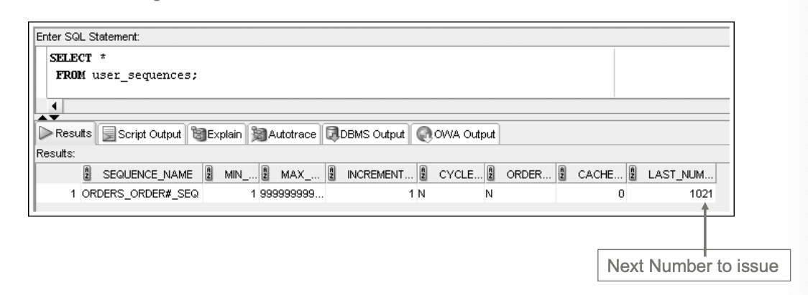



📋 This is my note-taking from what I learned in the class "Advanced Database Concepts"


<div class="notice--danger">{{ notice-2 | markdownify }}</div>

<!-- 📋 This is my note-taking from what I learned in the LinkedIn Learning course "Explore a Career in SQL Development"
{: .notice--danger} -->

<br>

# Objective

- Define the purpose of a sequence and state how it can be used in a database
- Explain why gaps may appear in the integers generated by a sequence
- Use the CREATE SEQUENCE command to create a sequence
- Call and use sequence values
- Identify which options cannot be changed by the ALTER SEQUENCE command
- Delete a sequence
- Create indexes with the CREATE INDEX command
- Explain the main index structures: B-tree and bitmap
- Verify index use with the explain plan
- Introduce variations on conventional indexes, including a function-based index and an index organized table
- Verify index existence via the data dictionary
- Rename an index with the ALTER INDEX command
- Remove an index using the DELETE INDEX command
- Create and remove a public synonym

<br>

# Database Objects

- An object is anything that has a name and defined structure
  : - Table: Stores data
  : - Sequence: Generates sequential integers
  : - Index: Allows users to quickly locate specific records
  : - Synonym: Alias for other database objects

<br>

# Sequences

- Used for internal control purposes by providing sequential integers for auditing
- Used to generate unique value for primary key column
  : Surrogate key = No correlation with actual row contents

<br>

# Creating a Sequence

- Use the `CREATE SEQUENCE` command
- Various intervals are allowed
  : Default: 1
- You can specify the starting number
  : Default: 1

```
CREATE SEQUENCE sequencename
[INCREMENT BY value]
[START WITH value]
[{MAXVALUE value | NOMAXVALUE}]
[{MINVALUE value | NOMINVALUE}]
[{CYCLE | NOCYCLE}]
[{ORDER | NOORDER}]
[{CACHE value | NOCACHE}];
```

- Can specify `MINVALUE` for decreasing sequence and `MAXVALUE` for increasing sequence
- Numbers can be reused if `CYCLE` is specified
- `ORDER` clause is used in application cluster environment
  : The order clause guarantees that the sequence's next value is the next one in line, no matter the instance that received the request
- Use `CACHE` to pregenerate integers - Default: 20

```
CREATE SEQUENCE orders_order#_seq
  INCREMENT BY 1
  START WITH 1021
  NOCACHE
  NOCYCLE;

-- CREATE SEQUENCE succeeded
```

- To verify the settings for options of a sequence, query `USER_SEQUENCES` data dictionary view

```
SELECT * FROM user_sequences;
```



<br>

---

<br>

    🖋️ This is my self-taught blog! Feel free to let me know
    if there are some errors or wrong parts 😆

[Back to Top](#){: .btn .btn--primary }{: .align-right}
