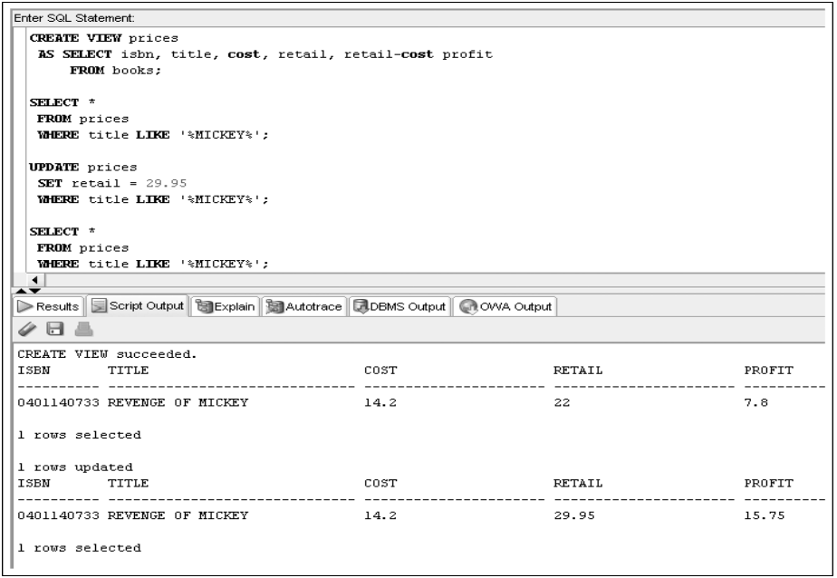
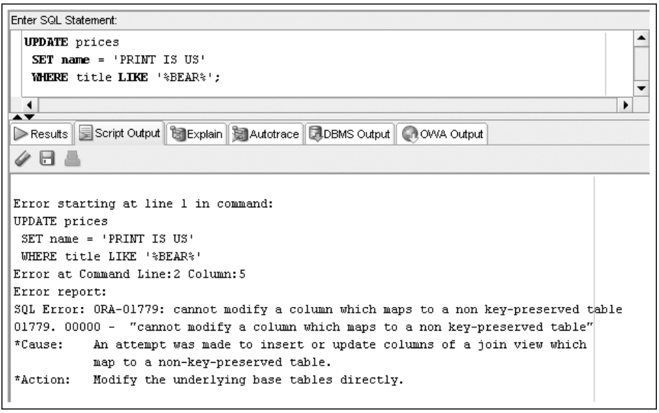
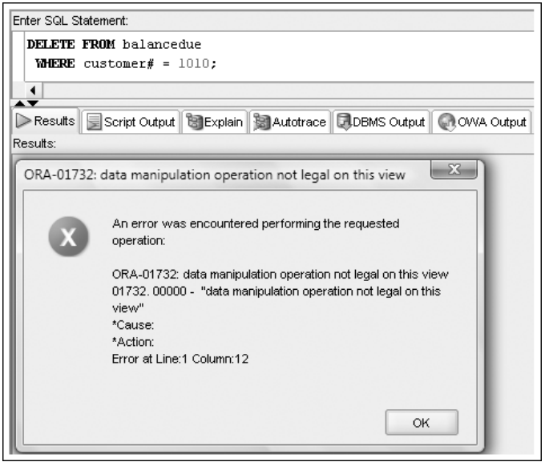
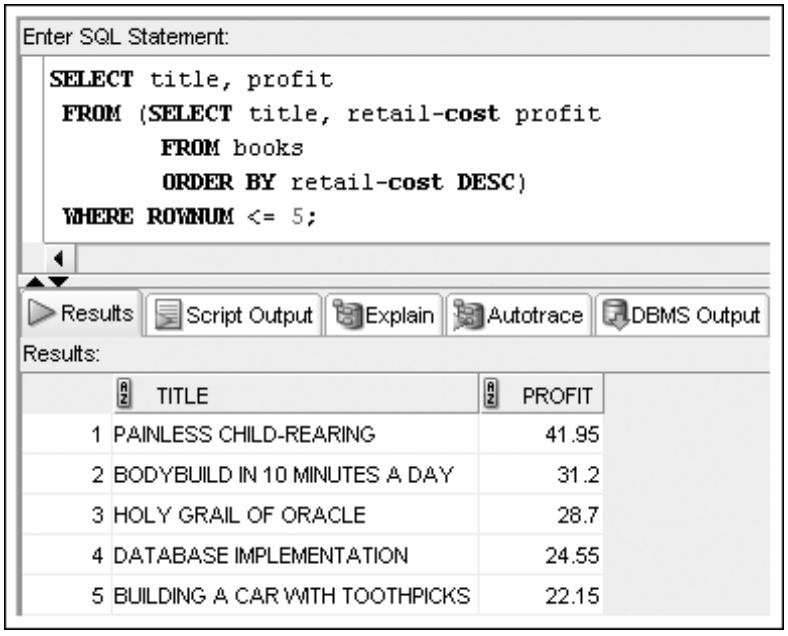
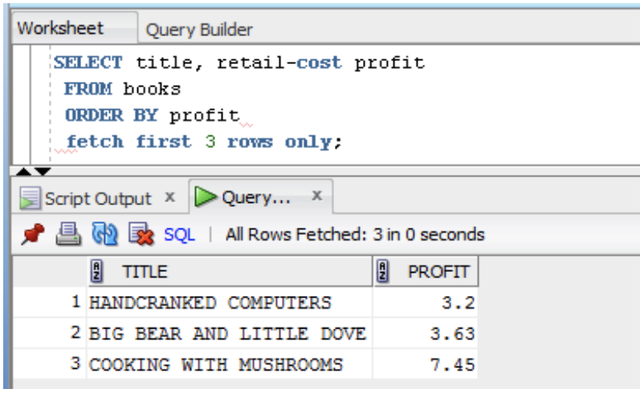
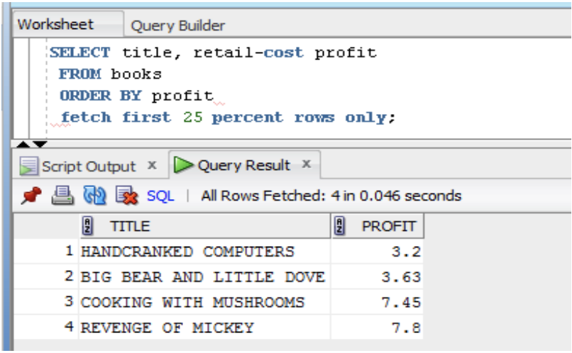
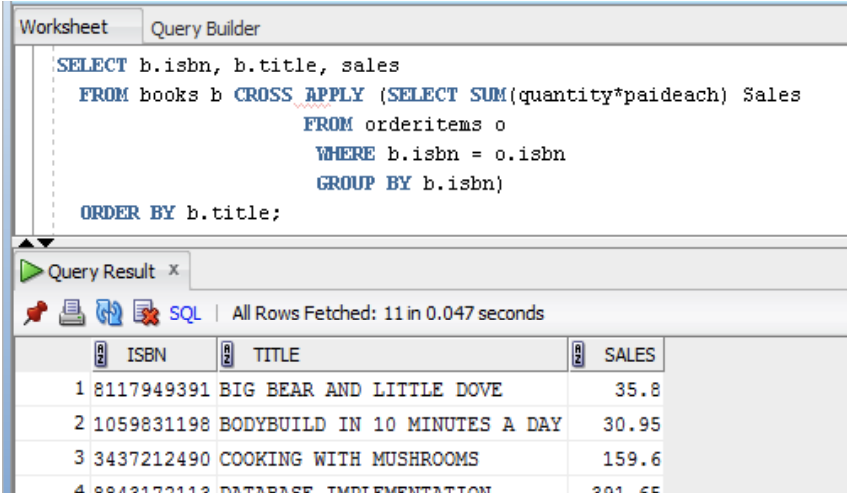
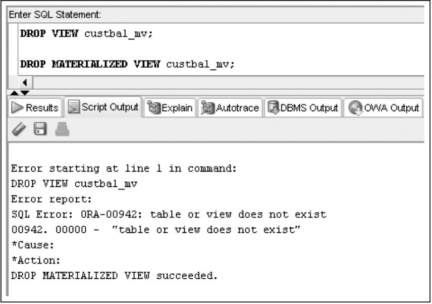



📋 This is my note-taking from what I learned in the class "Advanced Database Concepts"


<div class="notice--danger">{{ notice-2 | markdownify }}</div>

<!-- 📋 This is my note-taking from what I learned in the LinkedIn Learning course "Explore a Career in SQL Development"
{: .notice--danger} -->

<br>

# Objective

- Create a view by using CREATE VIEW command or the CREATE OR REPLACE VIEW command
- Employ the FORCE and NOFORCE options
- State the purpose of the WITH CHECK OPTION constraint
- Explain the effect of the WITH READ ONLY option
- Update a record in a simple view
- Re-create a view
- Explain the implication of an expression in a view for DML operations
- Update a record in a complex view
- Identify problems associated with adding records to a complex view
- Identify the key-preserved table underlying a complex view
- Drop a view
- Explain inline views and the use of ROWNUM to perform a "TOP-N" analysis
- Create a materialized view to replicate data

<br>

# Views

- Permanent objects that store no data
- Store a query
- Two purposes
  : - Reduce complex query requirements
  : - Restrict users' access to sensitive data

<br>

# Types of Views

- Simple view
  : A view based upon a sub-query that only references one table and does not include any group functions, expressions, or a `GROUP BY` clause
- Complex view
  : A view based upon a sub-query that retrieves or derives data from one or more tables - and may also contain functions or grouped data
- Inline view
  : A sub-query used in the `FROM` clause of a `SELECT` statement to create a "temporary" table that can be referenced by the `SELECT` and `WHERE` clauses of the outer statement
- Materialized view
  : A view that replicates data by physically storing the results of the view query

<br>

# Creating a View

- You use the `CREATE VIEW` keywords to create a view
- Use `OR REPLACE` if the view already exists
- Use `FORCE` if the underlying table does not exist at the time of creation
- Provide new column names if necessary

```
CREATE [OR REPLACE] [FORCE|NOFORCE] VIEW
    viewname (columnname, ...)
  AS SELECT statement
  [WITH CHECK OPTION [CONSTRAINT constraintname]]
  [WITH READ ONLY];
```

- `WITH CHECK OPTION` constraint - if used, prevents data changes that will make the data subsequently inaccessible to the view
- `WITH READ ONLY` - prevents DML operations

<br>

# Creating a Simple View

- Only references one table - no group functions, `GROUP BY` clause, or expressions

```
CREATE VIEW inventory
  AS SELECT isbn, title, retail_price
      FROM books
  WITH READ ONLY;
```

<br>

# DML Operations on a Simple View

- Any DML operations are allowed through simple views unless created with `WITH READ ONLY` option
- DML operations that violate constraints on the underlying table are not allowed

<br>

# Creating a Complex View

- A complex view may contain data from multiple tables or data created with the `GROUP BY` clause, functions, or expressions
- Type of DML operations allowed depends on various factors

```
CREATE VIEW prices
  AS SELECT isbn, title, cost, retail, retail-cost profit
      FROM books;
```

<br>

# DML Operations on a Complex View with an Arithmetic Expression



<br>

# DML Operations on a Complex View Containing Data from Multiple Tables

- DML Operations cannot be performed on non-key-preserved tables, but they are permitted on key-preserved tables

```
CREATE OR REPLACE VIEW prices
  AS SELECT isbn, title, cost, retail, retail-cost profit, name
      FROM books JOIN publisher USING(pubid);

-- CREATE OR REPLACE VIEW succeeded.
```

```
UPDATE prices
  SET name = 'PRINT IS US'
  WHERE title LIKE '%BEAR%';
```



<br>

# DML Operations on a Complex View Containing Functions or Grouped Data

- DML operations are not permitted if the view includes a group function or a `GROUP BY` clause

```
CREATE VIEW balancedue
  AS SELECT customer#, order#, SUM(quantity*retail) AS Amtdue
      FROM customers
            JOIN orders USING(customer#)
            JOIN orderitems USING(order#)
            JOIN books USING(isbn)
      GROUP BY customer#, order#;
```

```
DELETE FROM balancedue
  WHERE customer# = 1010;
```



<br>

# DML Operations on a Complex View Containing DISTINCT or ROWNUM

- DML operations on a view that contains the `DISTINCT` keyword or `ROWNUM` are not permitted

<br>

# Dropping a View

- Use `DROP VIEW` command

```
DROP VIEW prices;

-- DROP VIEW prices succeeded.
```

<br>

# Creating an Inline View

- An inline view is a temporary table created by using a sub-query in the `FROM` clause
- It can only be referenced while the command is being executed
- Most common usage - `TOP-N` analysis

<br>

# `TOP-N` Analysis

- `ORDER BY` included to identify top values:
  : - Describing for highest values
  : - Ascending for lowest values
- Extract data based on `ROWNUM`

```
SELECT title, profit
  FROM (SELECT title, retail-cost profit
        FROM books
        ORDER BY retail-cost DESC)
  WHERE ROWNUM <= 5;
```





- Oracle 12c introduces a new row limiting clause (# rows)



- Oracle 12c introduces a new row limiting clause (percent of rows)

<br>

# Cross & Outer Apply Joins

- A column of the joining table may be used to product the result set of the inline view

```
SELECT b.isbn, b.title, sales
  FROM books b CROSS APPLY (SELECT SUM(quantity*paideach) Sales
                      FROM orderitems o
                        WHERE b.isbn = o.isbn
                        GROUP BY b.isbn)
  ORDER BY b.title;
```



<br>

# Materialized Views

- Replicate data
- Store data retrieved from view query
- Referred to as "snapshots"

```
CREATE MATERIALIZED VIEW custbal_mv
  REFRESH COMPLETE
  START WITH SYSDATE NEXT SYSDATE+7
  AS SELECT customer#, city, state, order#, SUM(quantity*retail) AS Amtdue
      FROM customers JOIN orders USING(order#)
            JOIN orderitems USING(order#)
            JOIN books USING(isbn)
      GROUP BY customer#, city, state, order#;

-- CREATE MATERIALIZED succeeded.
```



<br>

# Summary

- A view is a temporary or virtual table that is used to retrieve data that exists in the underlying database tables
- The view query must be executed each time the view is used
- A view can be used to simplify queries or to restrict access to sensitive data
- A view is created with the CREATE VIEW command
- A view cannot be modified; to change a view, it must be dropped and then re-created, or the CREATE OR REPLACE VIEW command must be used
- Any DML operation can be performed on a simple query if it does not violate a constraint
- A view that contains expressions or functions, or that joins multiple tables, is considered a complex view
- A complex view can be used to update only one table; the table must be a key-preserved table
- Data cannot be added to a view column that contains an expression
- DML operations are not permitted on non-key-preserved tables
- DML operations are not permitted on views that include group functions, a GROUP BY clause, the ROWNUM pseudocolumn, or the DISTINCT keyword
- Oracle 12c assigns a row number to every row in a table to indicate its position in the table; the row number can be referenced by the keyword ROWNUM
- A view can be dropped with the DROPVIEW command; the data is not affected, because it exists in the original tables
- An inline view can be used only by the current statement and can include an ORDER BY clause
- "TOP-N" analysis uses the row number of sorted data to determine a range of top values
- Materialized views physically store view query results

<br>

---

<br>

    🖋️ This is my self-taught blog! Feel free to let me know
    if there are some errors or wrong parts 😆

[Back to Top](#){: .btn .btn--primary }{: .align-right}
