

📋 This is my note-taking from what I learned in the class "Advanced Database Concepts"


<div class="notice--danger">{{ notice-2 | markdownify }}</div>

<!-- 📋 This is my note-taking from what I learned in the LinkedIn Learning course "Explore a Career in SQL Development"
{: .notice--danger} -->

<br>

# Objective

- Determine when using a sub-query is appropriate
- Identify which clauses can contain sub-queries
- Distinguish between an outer query and a sub-query
- Use a single-row sub-query in a WHERE clause
- Use a single-row sub-query in a HAVING clause
- Use a single-row sub-query in a SELECT clause
- Distinguish between single-row and multiple-row comparison operators
- Use a multiple-row sub-query in a WHERE clause
- Use a multiple-row sub-query in a HAVING clause
- Use a multiple-column sub-query in a WHERE clause
- Create an inline view using a multiple-column sub-query in a FROM clause
- Compensate for NULL values in sub-queries
- Distinguish between correlated and uncorrelated sub-queries
- Nest a sub-query inside another sub-query
- Use a sub-query in a DML action
- Process multiple DML actions with a MERGE statement

<br>

# Sub-Queries and Their Uses

- Sub-query: A query nested inside another query
- Used when a query is based on an unknown value
- Requires SELECT and FROM clauses
- Must be enclosed in parentheses
- Place on right side of comparison operator

<br>

# Types of Sub-Queries

| Sub-Query                 | Description                                                                                              |
| :------------------------ | :------------------------------------------------------------------------------------------------------- |
| Single-row sub-query      | Returns to the outer query one row of results that consists of one column                                |
| Multiple-row sub-query    | Returns to the outer query more than one row of results                                                  |
| Multiple-column sub-query | Returns to the outer query more than one column of results                                               |
| Correlated sub-query      | References a column in the outer query, and executes the sub-query once for every row in the outer query |
| Uncorrelated sub-query    | Executes the sub-query first and passes the value to the outer query                                     |

<br>

# Single-Row Sub-Queries

- Can only return one result to the outer query
- Operators include `=`, `>`, `<`, `>=`, `<=`, `< >`

## Single-Row Sub-Query in a WHERE Clause

- Used for comparison against individual data

```
SELECT category, title, cost
  FROM books
  WHERE cost >
        (SELECT cost
        FROM books
        WHERE title = 'DATABASE IMPLEMENTATION')
    AND category = 'COMPUTER';
```

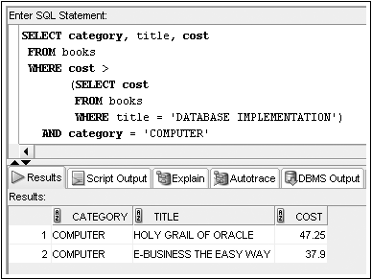

## Single-Row Sub-Query in a HAVING Clause

- Required when returned value is compared to grouped data

```
SELECT category, AVG(retail-cost) "Average Profit"
  FROM books
  GROUP BY category
  HAVING AVG(retail-cost) > (SELECT AVG(retail-cost)
                              FROM books
                              WHERE category = 'LITERATURE');
```

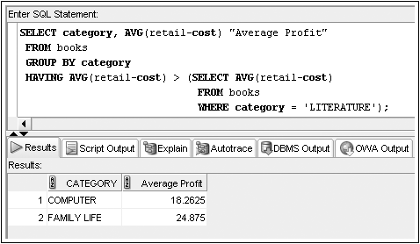

## Single-Row Sub-Query in a SELECT Clause

- Replicates sub-query value for each row displayed

```
SELECT title, retail
              (SELECT TO_CHAR(AVG(retail),999.99)
                FROM books) "Overall Average"
  FROM books;
```

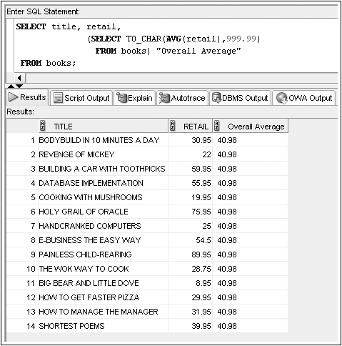

<br>

# Multiple-Row Sub-Queries

- Return more than one row of results
- Require use of IN, ANY, ALL, or EXISTS operators

## ANY and ALL Operators

- Combine with arithmetic operators

| Operator | Description                                               |
| :------- | :-------------------------------------------------------- |
| `>ALL`   | More than the highest value returned by the sub-query     |
| `<ALL`   | Less than the lowest value returned by the sub-query      |
| `<ANY`   | Less than the highest value returned by the sub-query     |
| `>ANY`   | More than the lowest value returned by the sub-query      |
| `=ANY`   | Equal to any value returned by the sub-query (same as IN) |

## Multiple-Row Sub-Query in a WHERE Clause

```
SELECT title, retail, category
  FROM books
  WHERE retail IN (SELECT MAX(retail)
                    FROM books
                    GROUP BY category)
  ORDER BY category;
```

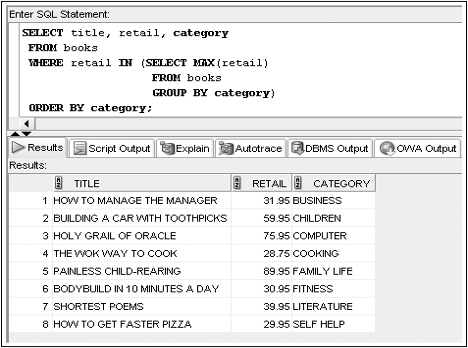

```
SELECT title, retail
  FROM books
  WHERE retail <ANY (SELECT retail
                      FROM books
                      WHERE category = 'COOKING');
```

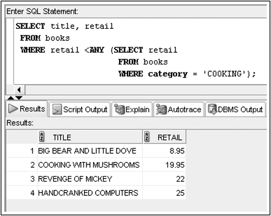

## Multiple-Row Sub-Query in a HAVING Clause

```
SELECT order#, SUM(quantity*paideach)
  FROM orderitems
  HAVING SUM(quantity*paideach) >ALL (SELECT SUM(quantity*paideach)
                                      FROM customers JOIN orders USING (customer#)
                                        JOIN orderitems USING (order#)
                                      WHERE state = 'FL'
                                      GROUP BY order#)
  GROUP BY order#;
```

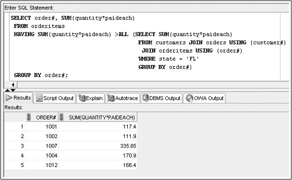

<br>

# Multiple-Column Sub-Queries

- Return more than one column in results
- Can return more than one row
- Column list on the left side of operator must be in parentheses
- Use the IN operator for WHERE and HAVING clauses

## Multiple-Column Sub-Query in a FROM Clause

- Creates a temporary table

```
SELECT b.title, b.retail, a.category, a.cataverage
  FROM books b, (SELECT category, AVG(retail) cataverage
                  FROM books
                  GROUP BY category) a
  WHERE b.category = a.category
    AND b.retail > a.cataverage;
```

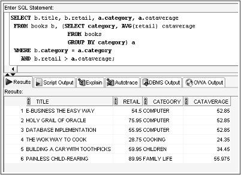

## Multiple-Column Sub-Query in a WHERE Clause

- Returns multiple columns for evaluation

```
SELECT title, retail, category
  FROM books
  WHERE (category, retail) IN (SELECT category, MAX(retail)
                                FROM books
                                GROUP BY category)
  ORDER BY category;
```

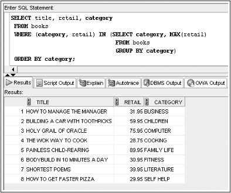

## NULL Values

- When a sub-query might return NULL values, use NVL function

```
SELECT customer#
  FROM customers
  WHERE NVL(referred, 0) = (SELECT NVL(referred, 0)
                            FROM customers
                            WHERE customer# = 1005);
```

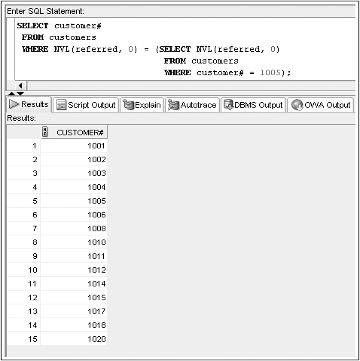

<br>

# Uncorrelated Sub-Queries

- Processing sequence
  : - Inner query is executed first
  : - Result is passed to outer query
  : - Outer query is executed

<br>

# Correlated Sub-Queries

- Inner query is executed once for each row processed by the outer query
- Inner query references the row contained in the outer query

```
SELECT title
  FROM books
  WHERE EXISTS (SELECT isbn
                FROM orderitems
                WHERE books.isbn = orderitems.isbn);
```

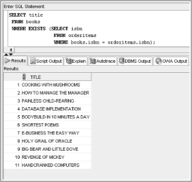

<br>

# Nested Sub-Queries

- Maximum of 255 sub-queries if nested in the WHERE clause
- No limit if nested in the FROM clause
- Innermost sub-query is resolved first, then the next level, etc

- Innermost is resolved first(A), then the second level(B), then the outer query(C)

```
SELECT customer#, lastname, firstname
  FROM customers JOIN orders USING(customer#)
  WHERE order# IN (SELECT order#
                    FROM orderitems
                    GROUP BY order#
                    HAVING COUNT(*) = (SELECT MAX(COUNT(*))
                      FROM orderitems
                      GROUP BY order#));
```

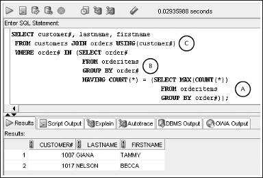

<br>

# Sub-Query Factoring Clause

<br>

# Summary

<br>

---

<br>

    🖋️ This is my self-taught blog! Feel free to let me know
    if there are some errors or wrong parts 😆

[Back to Top](#){: .btn .btn--primary }{: .align-right}
