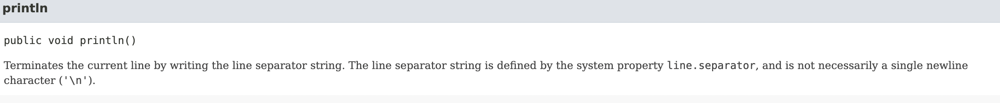

<br />

[acmicpc.net/problem/10718]()

---

<br />

kriii님 군대가시나보다 ...  ㅋㅋㅋㅋㅋㅋ 

앞 포스팅과 같이 4개의 풀이로 진행하겠다 ..! 

앞 포스팅이 궁금하시다면 (아주 자세한 풀이를 가지고 있음 !! ) [여기클릭] 👍🏻

[여기클릭]:https://yangjenniee.github.io/baekjoon/boj1/

<br/>

<br />

---


# 풀이1 (println)

<br />
<br />

```java
import java.io.BufferedWriter;
import java.io.IOException;
import java.io.OutputStreamWriter;

public class Main {

public static void main(String[] args) {
    System.out.println("강한친구 대한육군");
    System.out.println("강한친구 대한육군");

// System.out.printf("%s","강한친구 대한육군\n강한친구 대한육군");
// System.out.printf("%s\n%s", "강한친구 대한육군","강한친구 대한육군");
// System.out.printf("강한친구 대한육군\n강한친구 대한육군");

}
}
```

제일 편한 방법 ! 주석처리한 printf의 경우 한 줄씩 실행하면 잘 된다 

printf의 경우 지시자를 통해 변수의 값을 여러 가지 형식으로 변환하여 출력할 수 있다. 정수형이나 문자열을 섞어쓸때 유용하게 쓴다. 혹은 특정 순서에 개행할때도 잘 쓰인다.

# 풀이 2 (BufferedWriter)

<br />

```java
import java.io.BufferedWriter;
import java.io.IOException;
import java.io.OutputStreamWriter; 

public class Main {

    public static void main(String[] args) throws IOException {
        BufferedWriter bw = new BufferedWriter(new OutputStreamWriter(System.out));
        bw.write("강한친구 대한육군");
        bw.newLine();
        bw.write("강한친구 대한육군");
        bw.flush();
        bw.close();
    }

}
```

<br />

버퍼가 무엇인지부터 알아야할텐데 이건 임시 메모리 영역이다. 데이터가 이동하기 전 잠시 여기에 저장된다. 목적지까지 도착하기 전에 차에 짐을 실을텐데 이 차의 역할 !! 잠시 맡아준다는 느낌..ㅎ 

즉 ~ BufferedWriter는 시스템의 버퍼를 이용하여 출력하는 문자 스트림이라는 것

그럼 OutputStreamWriter은 무엇인가

일단 Stream 이란 한 지점에서 데이터를 단일 방향으로 목표지점까지 도착하게 하는 중간매체 또는 흐름이다 

이때 운영체제 방식에 따라서 기본 인코딩 방식이 다른데 이를 알아서 변경해준다

mac은 유닉스라서 UTF-8 윈도우는 따로 설정하지 않으면 MS949 방식으로 인코딩한다. 따라서 가끔 윈도우에서 쓴 문서가 맥으로 보면 깨지는 이유가 바로 이것! 

뭐 여튼 OutputStreamWriter은 음료에 꽃힌 빨대처럼 음료를 쌓아서 내 입으로 전달 해주는 것 

BufferdWriter은 문자 스트림이고 OutputStreamWriter은 문자 바이트를 바이트 스트림으로 변환해주는 것 

다 모르겠으면 이렇게 간략하게 정리 !! 

**OutputStreamWriter은 2byte처리가 가능하다 BufferedWriter은 개행문자를 처리해준다**

bw. newLine()이 추가 되었는데 이것은 메소드를 개행시켜주는 것 

**n\과 같은 역할이지만 같은 것은 아니다 !**
API 문서를 뒤적거려보았다 

<br />

<br />


줄 구분자를 씁니다. 줄 구분자 문자열은 시스템 속성 line.separator에 의해 정의되며 반드시 단일 줄 바꿈('\n')일 필요는 없습니다. 

<br />



줄 구분자 문자열을 작성하여 현재 줄을 종료합니다. 줄 구분자 문자열은 시스템 속성 line.separator에 의해 정의되며 반드시 단일 줄 바꿈 문자('\n')일 필요는 없습니다.

이후 **bw.flush()** 로 스트림의 데이터를 비워준다!(남아있는 데이터를 모두 출력)  그리고 꼭 bw.close()로 스트림을 닫아준다.
<br />
<br />

# 풀이3 (StringBuilder)

<br />

```java
public class Main {

    public static void main(String[] args) {
        StringBuilder sb = new StringBuilder();
        sb.append("강한친구 대한육군\n");
        sb.append("강한친구 대한육군");

        System.out.print(sb);

    }

}
```

<br />
문자열을 이어붙이는 것 따라서 ("강한친구 대한육군\n강한친구 대한육군")을 이어붙인 것이다 
<br />
<br />

# 풀이4 (StringBuffer)

<br />
```java
public class Main {

    public static void main(String[] args) {
        StringBuffer sb = new StringBuffer();
        sb.append("강한친구 대한육군\n");
        sb.append("강한친구 대한육군");
    
        System.out.print(sb);
    
    }

}

```
<br />
<br />

풀이3의 StringBuilder과 똑같은 방식이다 
<br />
---
<br />
<br />


# 마무리하며
<br />
BufferedWriter OutputStreamWriter이랑 StringBuilder은 백준에서 많이 쓰인다고 하니 손에 익혀두는 것이 좋겠다
```
