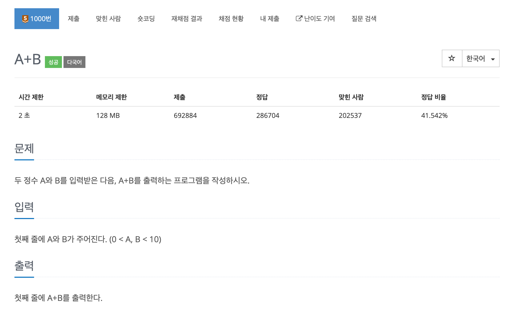
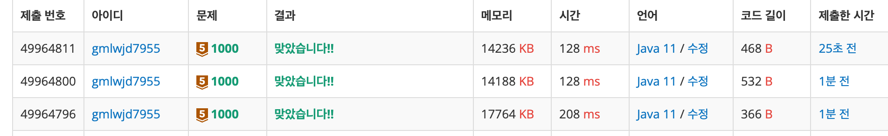

<br/>

<https://www.acmicpc.net/problem/1000> 

<br/>

  ---

<br/>



<br/>

공백으로 입력을 구분하는 것에 유의

<br/>

---

<br/>

앞에선 System.out.print(ln), BufferedReader,StringBuilder,StringBuffer 를 이용해왔다

입력에도 당연히 여러가지 방법이 있을 것

<br/>

---

# <br/>

# 방법1(Scanner)

<br/>

가장 기초적인 방법이다. 

<br/>

```java
import java.io.BufferedReader;
import java.io.IOException;
import java.io.InputStreamReader;
import java.util.Scanner;
import java.util.StringTokenizer;

public class Main {

    public static void main(String[] args)  {
        Scanner sc = new Scanner(System.in);
        int a = sc.nextInt();
        int b = sc.nextInt();
        System.out.print(a+b);

    }

}
```

<br/>

scanner을 사용하기 위해선 java.util 클래스를 import 해주어야하는데 import java.util.*;로 모든 클래스를 import할 수 있지만 그 방법은 그닥 추천하지 않는다고 한다. 그래서 일단 지금 쓰이는  Scanner클래스를 Import 해준다 ! 

```java
import java.util.Scanner;
```

객체를 생성하기 위해선 

Scanner sc = new Scanner(System.in);

**System.in은 입력한 값을 byte단위로 읽는 것을 뜻**한다. 객체명은 자유롭게 선언하는데 제일 많이 쓰이는건 in, scan, sc 이다. 

그리고 입력을 받으면 된다. 

입력 형태는 아래를 참고 

<br/>

```java
 // 입력방식

//Reference Type

String 문자열+space = sc.next();

String 문자열+enter = sc.nextLine();

//primitive Type(Boolean~float)

Boolean 불 = sc.nextBoolean();

//Numeric(Integer)

Byte 바이트 = sc.nextByte();

Short 쇼트 = sc.nextShort();

int 인트 = sc.nextInt();

Long 롱 = sc.nextLong();

//floating point type

double 더블 = sc.nextDouble();

float 플롯 = sc.nextFloat();
```

<br/>

형식이 다르거나 자료형 범위를 넘어나면 에러가 난다.

Exception in thread "main" java.util.InputMismatchException 

String 입력 방법엔 next()와 nextLine()이 있다

- next() : 문자열 입력 시 공백만 받음 .

- nextLine(): 문자열 입력 시 Enter 입력 전 까지 받음 . 

상황에 잘 맞게 사용하면 되지만 next()는 에러 case가 많다. 대부분 문제는 행 단위로 입력하니 nextLine()을 애용하면 된다 ! 

<br/>

---

<br/>

# 방법2(BufferedReader)

<br/>

BufferedWriter과 방법이 유사하다.

Scanner와 BufferedReader의 입력방법은 추후에 포스팅 예정이다.

<br/>

## Scanner와 BufferedReader의 입력방법 차이

<br/>

BufferedReader의 경우 문자열을 입력받는 방법엔 2가지가 있다. readLine(),read()이다.

readLine()은 한 문장씩 읽어오고, read()는 한 문자씩 읽어온다.

굳이 read()를 쓰지않고 **대부분 readLine()을 쓴다** 

위 설명에서 주의해야 할 점인 **read()는 한 문자씩 읽어온다.**

( 는 추후 포스팅할 예정 ) ...

**그리고 공백도 문자이다**

이 두 에피소드로 인해 BufferedReader을 쓸 땐 readLine()을 쓴다. 

readLine()은 한 행을 전부 읽는다 따라서 문자열을 공백단위로 끊어준다.

문자열 분리 방법엔 2가지가 있다

- StringTokenizer 클래스 이용 

- split()

성능면에서는 StringTokenizer가 우수하다. StringTokenizer("문자열",구분자)로 사용하면 된다. 구분된 변수를 꺼내기 위해선 nextToken(); 메서드를 사용하면 된다. 근데 반환되는 타입이 **문자열**이다 

그래서 Integer.parseInt()로 int 형으로 반환시킨다.

<br/>

```java
import java.io.BufferedReader;
import java.io.IOException;
import java.io.InputStreamReader;
import java.util.StringTokenizer;

public class Main {

    public static void main(String[] args) throws IOException {
        BufferedReader br = new BufferedReader(new InputStreamReader(System.in));
        String str = br.readLine();
        StringTokenizer st = new StringTokenizer(str," ");
        int a = Integer.parseInt(st.nextToken());
        int b = Integer.parseInt(st.nextToken());

        System.out.println(a+b);
    }

}
```

<br/>

혹은 str을 굳이 변수 생성하지 않고, 입력과 동시에 구분자로 구별시켜준다.

<br/>

```java
package bak;
import java.io.BufferedReader;
import java.io.IOException;
import java.io.InputStreamReader;
import java.util.StringTokenizer;

public class Main {

    public static void main(String[] args) throws IOException {
        BufferedReader br = new BufferedReader(new InputStreamReader(System.in));
        StringTokenizer st = new StringTokenizer(br.readLine()," ");
        int a = Integer.parseInt(st.nextToken());
        int b = Integer.parseInt(st.nextToken());

        System.out.println(a+b);    

    }

}
```

<br/>

---

<br/>

두 번째는 br.readLine()으로 읽은 것을 spilit(" ")을 하여 나눠준 뒤 String 배열에 넣는 것이다. 

이 방법은 전 방법보다 쉬워보이지만 문자열과 데이터양이 많아지면 StringTokenizer보다 성능이 낮아 수행시간에 차이가 난다.

<br/>

```java
import java.io.BufferedReader;
import java.io.IOException;
import java.io.InputStreamReader;
import java.util.StringTokenizer;

public class Main {

    public static void main(String[] args) throws IOException {
        BufferedReader br = new BufferedReader(new InputStreamReader(System.in));
        String[] str = br.readLine().split(" ");
        int a = Integer.parseInt(str[0]);
        int b = Integer.parseInt(str[1]);
        System.out.print(a+b);

    }

}
```

<br/>

---

# <br/>

# 성능차이

<br/>

위에서 StringTokenizer가 더 빠르다 ! BufferedReader가 더 빠르다 라고 백날 설명해봤자 정말 돌려서 체감하는 것이 가장 효과적이라고 생각한다

<br/>



<br/>

- 제출번호 49964796 : Scanner 사용 / 시간 208ms 

- 제출번호 49964800 : BufferedReader & StringTokenizer 사용 / 시간 128ms

- 제출번호 49964811 : BufferedReader & Spilit() 사용 / 시간 128ms

<br/>

시간 차이를 보면 Scanner와 BufferedReader의 시간 차이를 보면 대략 80초나 차이난다.. 

문자열의 경우 문자열 데이터가 많지 않아 그렇게 차이가 나지 않는다.

언젠간 시간 차이가 더 많이 나는 문제를 풀게 되겠지 후훗

<br/>

---

<br/>

# 정리

<br/>

시간 단축에 초점을 두는 방법을 많이 알아봤는데 이게 꼭 빛을 내는 시간이 얼릉 왔으면 ....... 

간단한 문제에 이렇게 시간을 많이 들일 줄이야 ㅠㅠ 
