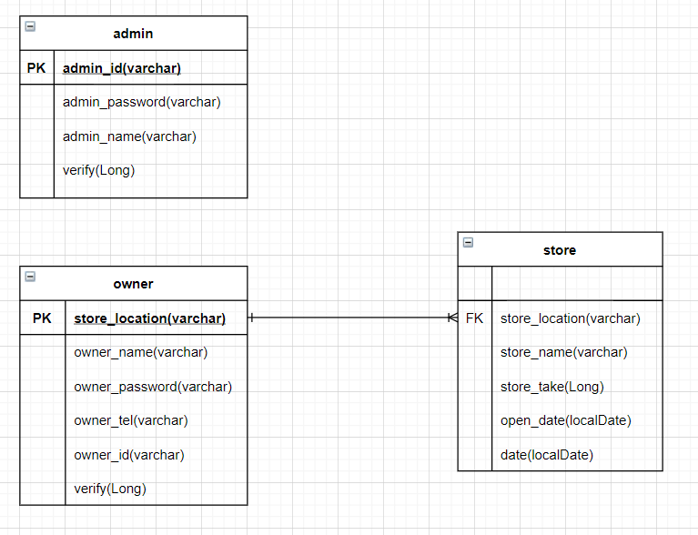

## 직무 부트 캠프 1주차

#### 과제

- 어제에 이어서 이번에는 DB를 설계와 어떤 프레임 워크를 사용할 것인지를 결정하겠다

#####  DataBase 설계

- DB ERD는 위와 같이 만들었다. admin 계정과 owner 계정을 따로 잡아 admin 계정으로 로그인 시 매출 총액을, owner 계정으로 로그인 시에는 매출 등록 및 총액 조회를 할 수 있게 만들어볼 생각이다.
- 또한 owner 테이블에서 store_location을 PK로 두고 store 테이블에 FK를 두어 매핑하도록 만들었다
- 1명의 점주가 다수의 매장을 운영 할수도 있기에 1대 다의 관계를 맺어 주었다.

##### 프레임워크

- 사용할 프레임워크는 스프링이다. 스프링 부트를 사용할 예정인데 이유는 프로젝트의 기간이 짧다보니 빠르게 세팅이 가능한 스프링 부트를 이용하는게 좋겠다는 생각을 해서이다.
- 이외의 사용할 것들은 스프링 시큐리티, HTML , CSS, JS 등이 있을 것으로 예상한다.

{: width="33%", height="auto"}{: width="33%", height="auto"}{: width="33%", height="auto"}
