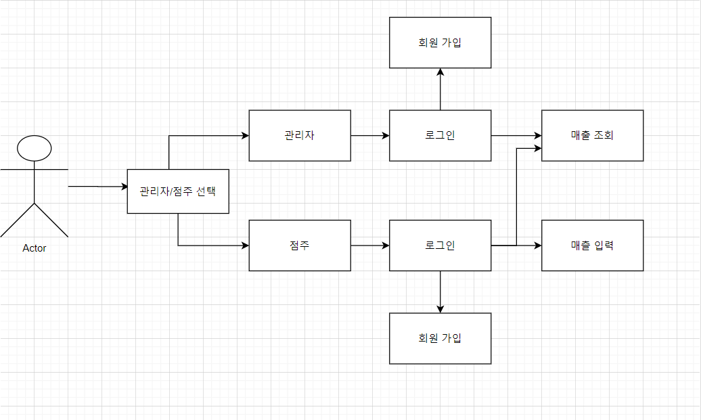
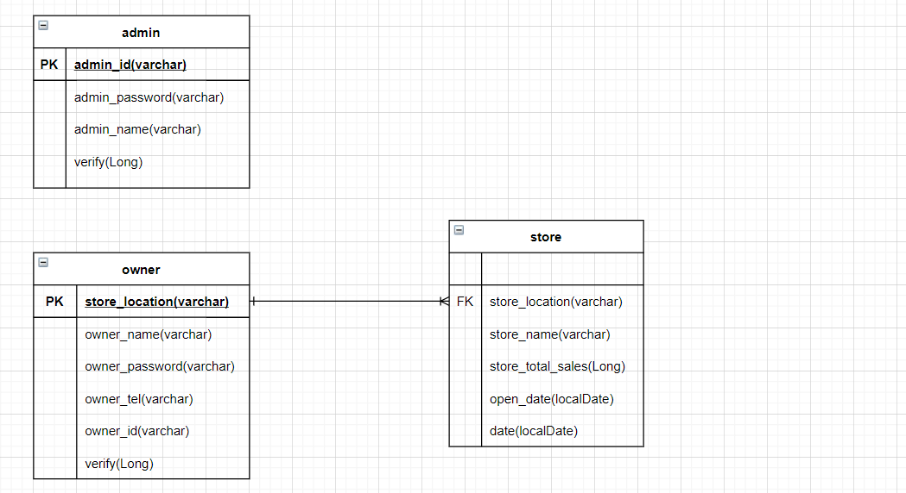
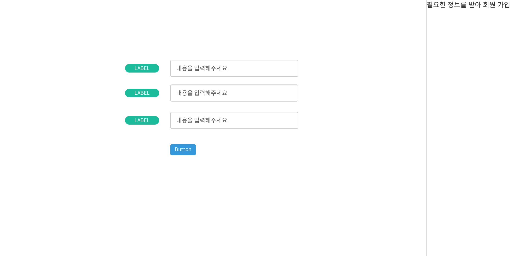
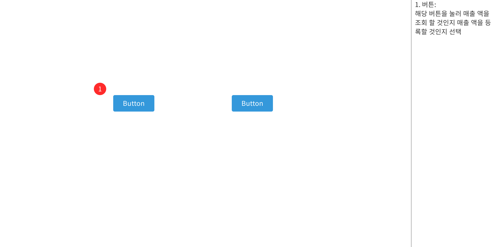

## 직무 부트 캠프 1주차

#### 과제

- 클래스 다이어그램을 만들어보려고 했지만 아직 실력이 부족해 틀을 만들고 프로그래밍을 하는 것에 어려움이 느껴진다. 그래서 클래스 다이어그램은 포기하고 오늘은 전체적인 정리 및 수정하는 작업을 진행 할 것이다.

------------

# 기술 스택

- FrontEnd

- BackEnd

{: width="33%", height="auto"}{: width="33%", height="auto"}

- DataBase

# 프로세스

# DB 설계

# 화면 정의서

