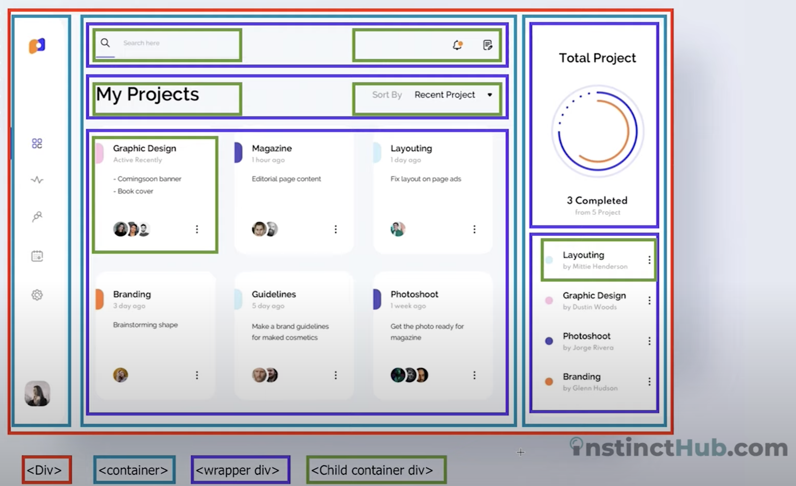



📋 This is the coding-practice archives to help me keep track of what I am studying!

- Reference tutorial link: <https://www.youtube.com/watch?v=r9WbK9K6dIc&list=PL5za36oGZGH2admgk87KCCdSSmc9Jsov9>
  

{{ notice-2 | markdownify }}

# Watching Lecture

## How to Structure HTML Containers

### Entire container &rarr; Div

- Column 1: Toggle bar &rarr; Container
- Column 2: Main dashboard &rarr; Container
  - Row 1: Top bar &rarr; Wrapper div
    - Search &rarr; Child container div
    - Icons &rarr; Child container div
  - Row 2: Title &rarr; Wrapper div
    - Dashboard title &rarr; Child container div
    - Filter &rarr; Child container div
  - Row 3: Dashboard content &rarr; Wrapper div
    - Content boxes &rarr; Child container div
- Column 3: Side project info &rarr; Container
  - Row 1: Total Project &rarr; Wrapper div
  - Row 2: Project title &rarr; Wrapper div
    - Project title boxes &rarr; Child container div

 

---

 

    🖋️ This is my self-taught blog! Feel free to let me know
    if there are some errors or wrong parts 😆

[Back to Top](#){: .btn .btn--primary }{: .align-right}
