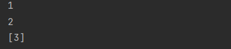

# 자료구조 - Queue

## 큐의 구조

- 큐는 가장 먼저 들어간 데이터가 가장 먼저 나올 수 있는 구조이다. 이를 FIFO구조라고 한다.(First in First Out)
- 큐는 멀티 태스킹을 위한 프로세스 스케줄링 방식을 구현하기 위해 많이 사용한다. 운영체제를 공부하자!
  - Enqueue: 큐에 데이터를 넣는 기능, add 또는 offer 메서드를 제공
  - Dequeue: 큐에서 데이터를 꺼내는 기능, poll 또는 remove 메서드를 제공


## 큐의 사용

- 큐의 경우 LinkedList 클래스를 사용해서 만들어야 한다.

```java
Queue<String> queue = new LinkedList<String>();
```

- 큐의 Enqueue에는 add , offer 메서드가 있는데 offer의 경우 삽입 실패시 false를 반환한다는 차이가 있다. add의 경우 예와(Exception)를 발생시킨다.

```java
//데이터 추가
queue.add("1");
queue.offer("2");

System.out.println(queue);
```


- 큐의 Dequeue에는 poll, remove 메서드가 있는데 맨 처음 들어온 값 순서대로 리턴하고 값을 삭제 합니다.

```java
//데이터 반환 후 삭제
queue.add("3");
System.out.println(queue.remove());
System.out.println(queue.poll());


System.out.println(queue);
```



## 연습

- ArrayList로 Queue의 삽입/삭제를 구현해 보시오

