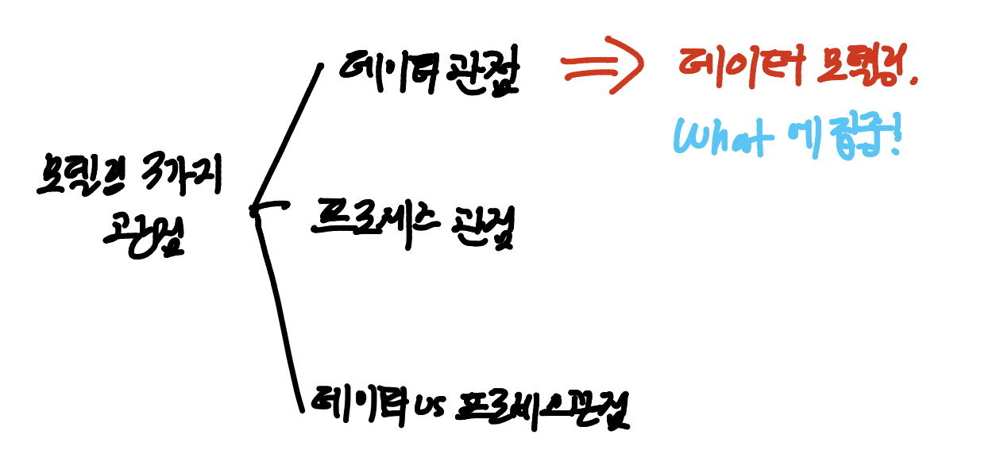
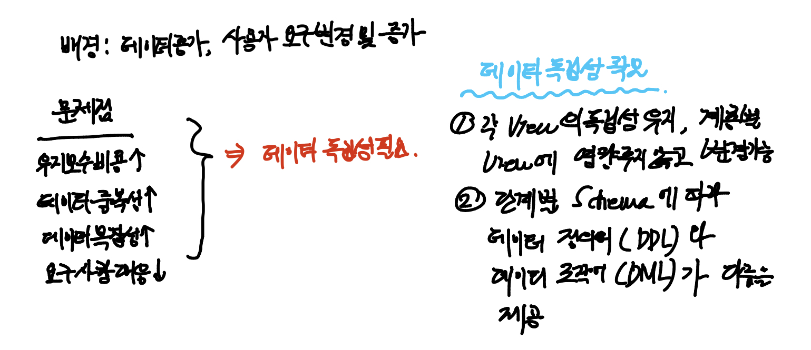
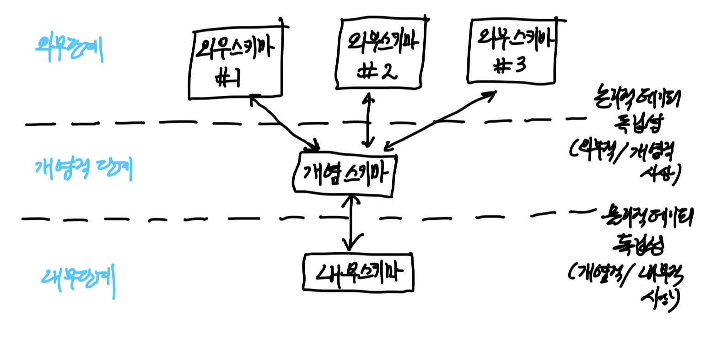

# 데이터 모델링

> SQLD를 준비하면서 공부한 내용입니다.
>
> 해당 내용은 '이경오의 SQL+SQLD 비밀노트'를 정리한 내용입니다.
>
> 이번 내용은 조금 추상적일 수 있습니다.
>
> 방법론적인 내용이자, 규범, 규칙같은 내용이기 때문입니다.
>
> 결국, ERD를 만들어나가고 이를 통해서 물리적 데이터 베이스를 구축하는데에 목표가 있습니다.
>
> "ERD"를 검색해서 모양을 확인하고, 어떻게 활용될지 먼저 확인한 후,
>
> 아래의 정리 내용이 그러한 ERD를 만들어나감에 있어서 최선의 방법을 정리한 것으로 이해해주시면 좋을 것 같습니다.
>
> **혹시 틀린 내용이 있다면, 지적해주시면 정말 감사드리겠습니다.
>
> **책에 있는 내용에 필자의 생각을 더하여, 본인의 이해와 이 글을 읽는 독자분의 이해를 돕는데에 의의를 둔 글입니다.

### 모델링

> 데이터 모델링에 대해서 공부하기 전에, 먼저 **모델링**이 무엇인지, 그 특징은 무엇이 있는지 이해해보는 것이 좋습니다.

#### 모델링의 정의

* 현실 세계에 존재하는 사물이나 사건에 관한 관점 및 양상을 연관된 주체(사람 혹은 그룹)를 위하여 명확하게 하는 것.

  ex) 특정 업무를 모델링하고자 할 때, 업무를 바라볼 때, 무엇을 알고 싶은지에 따라서 찾아보는 정보가 있을 것이고, 어떤 정보들이 있는지, 이들은 어떻게 분류가 될 것인지, 그리고 어떤 관계가 있는지 명확하게 지정하는 것입니다.

#### 모델링의 특징

**추상화** : 복잡한 현실 세계를 <u>*일정한 형식에 맞게 표현*</u>한다는 의미

**단순화** : 복잡한 현실 세계를 서로가 <u>*약속한 규약을 준수하는 표기법이나 언어로 표현*</u>한다는 의미

**명확화** : 모델을 보는 여러 이해 관계자가 이해하기 쉽게 <u>*애매모호함을 제거하여 표현*</u>하는 것

> 즉, 모델링이란 복잡한 현실세계를 추상화, 단순화, 명확화하기 위해서 일정한 표기법으로 모델을 표현하는 기법입니다.

#### 모델링의 3가지 관점

IT시스템의 대상이 되는 업무(비즈니스)를 분석하여 정보시스템으로 구성하는 과정에서 업무의 내용과 IT 시스템의 모습을 적절한 표기법으로 표현한 것을 모델링이라고 합니다.

이러한 모델링을 바라보는 3가지 관점이 있습니다.

**데이터 관점(Data, What)**

* 비즈니스와 관련되는 데이터는 무엇인지
* 데이터간의 관계는 무엇인지

**프로세스 관점(Process, How)**

* 해당 비즈니스로 인해 일어나는 일은 무엇인지

**상관 관점(Data vs Process)**

* 데이터 관점과 프로세스 관점 간 서로 어떠한 영향을 받는지

---

> 우리는 위에서, 모델링을 바라보는 3가지 관점을 확인했습니다.
>
> 이 중에서, 데이터의 관점에서 모델링을 진행하는 데이터 모델링에 대해서 알아보겠습니다.

### 데이터 모델링

#### 데이터 모델링의 정의

* 현실 세계의 비즈니스를 IT 시스템을 구현하기 위해 *<u>데이터 관점으로</u>* 업무를 분석하는 기법 => 모델링의 여러 관점 중, 비즈니스와 관련된 데이터는 무엇인지, 그리고 해당 데이터들의 관계에 집중하는 것!(**What**에 집중!)

* 현실 세계의 비즈니스를 약속된 표기법으로 표현하는 과정
* IT 시스템의 근간이 되는 <u>데이터베이스를 구축하기 위한 분석 및 설계의 과정</u>
  * 대부분의 IT 시스템은 RDBMS(관계형 데이터 베이스)를 기반으로 구축
  * 데이터 모델링을 통해 만들어진 데이터 모델을 바탕으로 물리적인 데이터 베이스가 구축된다.
  * 이 후, SQL문을 활용하여 데이터의 입력, 수정, 삭제, 조회가 이루어진다.

---

#### 데이터 모델이 중요한 이유

**파급효과(Leverage)**

* 데이터 설계 과정에서 비효율적인 데이터 설계 및 업무 요건을 충족하지 못하는 데이터 설계를 한다면 개발/테스트/오픈/운영, 즉 설계 이후의 과정에 걸쳐서 엄청난 비용이 든다.

* 따라서, 데이터 모델링 과정에서 제대로 설계해야 그 비용을 줄일 수 있다. 

  => *즉, 성능을 미리 따질 수록 앞으로의 운영 과정에서 비용이 낮아진다는 것이다.*

**복잡한 정보 요구사항의 간결한 표현(Conciseness)**

* 좋은 데이터 모델 설계를 통해 IT시스템에서 구현해야 할 정보 요구사항을 명확하고, 간결하게 표현할 수 있다.

**데이터 품질(Data Quality)**

* 데이터 모델의 잘못된 설계로 인해 <u>*데이터 중복, 비유연성, 비일관성*</u>이 발생할 수 있다.

* 이는 데이터 품질을 저하할 수 있고, 운영과정에서의 큰 비용을 일으킬 수 있다.

  => 데이터 중복, 비유연성, 비일관성은 데이터 모델링 시 나타나지 않도록 유의해야할 점이다.

---

#### 데이터 모델링의 3단계

* 데이터 모델링은 3단계로 진행된다.
* 개념적 데이터 모델링 > 논리적 데이터 모델링 > 물리적 데이터 모델링
* (현실세계부터 물리구조에 이어지는 그림)
* 물리적 데이터 모델링으로부터 데이터베이스가 구축되고, 이 데이터베이스에 접속하여 SQL문으로 DBMS에 명령을 내릴 수 있다.

**개념적 데이터 모델링**

* IT 시스템에서 구현하고자 하는 대상에 대해 포괄적 수준의 데이터 모델링 진행
* *<u>전사적 데이터 모델링 시 많이 사용</u>*하는 단계

**논리적 데이터 모델링**

* IT 시스템에서 구현하고자 하는 비즈니스를 만족하기 위한 <u>*기본키, 속성, 관계, 외래키*</u> <u>*등을 명확하게 표현*</u>하는 단계

**물리적 데이터 모델링**

* 논리 데이터 모델을 기반으로 실제 물리 DB 구축을 위해 성능, 저장공간 등의 물리적인 특성을 고려하여 설계하는 단계

---

#### 프로젝트 생명 주기에서의 데이터 모델링

* 그렇다면 프로젝트 과정에서 데이터 모델링은 언제하는 것일까?
* 대부분의 IT 시스템 구축은 아래와 같은 생명 주기를 갖는다.
  * 정보전략계획 -> 분석 -> 설계 -> 개발 -> 테스트 -> 전환/이행(운영)
  * 정보전략계획 - 개념적 데이터 모델링
  * 분석 - 개념적 데이터 모델링, 논리적 데이터 모델링
  * 설계 - 물리적 데이터 모델링

---

#### 데이터 모델이 제공하는 기능 

* ERD : 데이터 모델

**가시화** : IT 시스템의 모습을 가시화 하는 기능

**명세화** : IT 시스템의 구조와 발생하는 동작을 명세화하는 기능

**구조화된 틀 제공**

**문서화** : IT 시스템 구축 시, 산출물(기록물)로 사용되는 문서를 제공

**다양한 관점 제공** : 다른 영역의 세부사항을 숨김으로써 다양한 영역에 집중할 수 있는 관점을 제공

**상세 수준의 표현 방법 제공** : 원하는 목표에 따라 구체화된 상세 수준의 표현 방법을 제공

---

#### 데이터 독립성

* 데이터 독립성은 하위 단계의 데이터 구조가 변경되더라도, 상위 단계에는 영향을 미치지 않는 속성을 의미합니다.

* 데이터 구조가 변경되더라도, 응용 프로그램 단에는 아무런 영향을 끼치지 않도록 하는 것

* 데이터 독립성이 출현하게 된 배경(끊임없는 데이터 증가, 사용자의 요구 변화 및 증가)

  * ex) 기업의 CS팀, 국민 신문고, 매일 증가하는 날씨 데이터
  * 보유한 데이터의 복잡성을 낮추고 중복된 데이터를 줄여서 <u>*시간의 흐름에 따라 증가하는 IT 시스템의 유지보수 비용을 절감*</u>하는 데에 그 목적이 있다.
  * 사용자의 요구사항은 지속적으로 신규/수정/삭제가 발생하며, 그에 따른 <u>*화면과 물리 DB 간 서로 독립성을 유지하기 위해*</u> 데이터 독립성이라는 개념이 출현

  => 사용자의 요구가 바뀌거나 데이터가 계속 증가한다고, 기반이 되는 내부 데이터 설계가 계속해서 바뀐다? 이건 말이 안된다. 이러한 독립성을 보장하기 위해서 만든 구조가 아래의 3단계 구조이다.

---

#### 데이터베이스 3단계 구조

* ANSI/SPARC 3단계 구성의 데이터 독립성 모델은 외부 단계와 개념적 단계, 내부적 단계로 구성된, 서로 간섭하지 않는 모델을 제시합니다.

  

**외부 스키마(External Schema) - 사용자 관점**

* <u>각각의 사용자가 보는 DB 스키마(화면)</u>

  ex) 보험사 - 사용자A가 가입된 보험 내용

* 개인 사용자 혹은 응용 프로그램 개발자가 접근하는 DB 스키마

* 실세계에 존재하는 데이터들을 <u>*어떤 형식,구조 배치 화면*</u>을 통해 사용자에게 보여줄 것인가.

**개념 스키마(Conceptual Schema) - 통합 관점**

* 모든 사용자의 관점을 하나로 통합한 비즈니스 전체의 DB를 기술한 스키마
* <u>응용 프로그램 및 사용자들이 필요한 데이터를 통합한 전체 DB를 기술한 것으로, 실제 DB에 저장되는 데이터와 응용프로그램 및 사용자들 간의 관계를 표현한 스키마</u>
  * 개체간의 관계와 제약조건 명시
  * 데이터 베이스 접근 권한 보안 및 무결성 규칙에 관한 명세를 정의
  * 단순한 스키마 -> 개념 스키마를 의미
* 데이터베이스 관리자(DBA)에 의해 구성
* DB의 스키마란, 여기서 말하는 개념스키마
* <u>데이터베이스 당 하나만 존재</u>

**내부 스키마(Internal Schema) - 물리적 관점**

* DB가 물리적으로 저장된 형식을 표현한 스키마

* <u>물리적 하드웨어 장치에 데이터가 실제로 저장되는 방법을 표현한 스키마</u>

  * 디스크에는 어떤 구조로 저장될 것인가.
  * 데이터의 실제 저장방법을 기술

* 시스템 프로그래머나 시스템 설계자가 보는 관점의 스키마

  ex) DB에 주민번호가 저장되어 있을 때는 암호화되어 있는데(내부스키마), 사용자가 볼 때에는 'YYYYMMDD'꼴로 되어있음(외부스키마)

  * 즉, 개념스키마를 디스크 기억장치에 물리적으로 구현하기 위한 방법을 기술한 것으로, 주된 내용은 실제로 저장될 내부레코드 형식, 내부레코드의 물리적 순서, 인덱스의 유/무에 관한 것

**논리적 데이터 독립성**

* 개념 스키마가 변경되어도 외부 스키마에는 영향을 미치지 않도록 지원하는 것
* 논리적 구조가 변경되어도 응용 프로그램에 영향을 미치지 않음
* 사용자의 특징에 따라 변경이 가능
* 통합 구조의 변경이 가능하다

​	=> 즉, 외부 스키마와 개념 스키마 사이에 독립성을 유지하는 것

**물리적 데이터 독립성**

* 내부 스키마가 변경되어도 외부/개념 스키마는 영향을 받지 않도록 지원하는 것
* 저장 장치의 구조 변경은 응용 프로그램/개념 스키마에 영향을 미치지 않음
* 물리 구조에 영향 없이 논리 구조의 변경이 가능하다
* 개념 구조의 영향 없이 물리 구조의 변경이 가능하다.

​	=> 즉, 개념 스키마와 물리 스키마 사이에 독립성을 유지하는 것 

**외부적/개념적 사상(논리적 사상)**

* 외부적 뷰와 개념적 뷰의 상호 호환성을 정의하는 사상
* 사용자가 접근하는 형식에 따라 다른 타입의 필드를 가질 수 있다. 이러한 경우 개념적 뷰의 필드 타입은 변화가 없다.

**개념적/내부적 사상(물리적 사상)**

* 개념적 뷰와 저장된 데이터베이스의 상호 관련성을 정의하는 사상
* 저장된 데이터베이스 구조가 바뀐다면 개념적/내부적 사상이 바뀌어야 한다. 그래야 개념적 스키마가 그대로 남아있게 된다.

> 외부적/개념적 사상은 논리적 데이터 독립성을 보장하기 위한 사상이고, 개념적/내부적 사상은 물리적 데이터 독립성을 보장하기 위한 사상입니다.

---

#### 데이터 모델링의 3가지 요소

* 데이터 모델링의 3가지 요소는 아래와 같다.

* 클래스는 집합적인 개념이고 인스턴스는 클래스에 속한 하나의 개별의 개념이다.

  ex) '사원(클래스)'이라는 클래스에 속하는 '홍길동(인스턴스)' 

  >  자세한 내용은 OOP(객체지향 프로그램) 개념을 참고해주세요,

**업무가 관여하는 어떤 것(Things)** : 엔티티 타입(클래스), 엔티티(클래스, 인스턴스)

**어떤 것이 가지는 성격(Attributes)** : 속성(클래스), 속성값(인스턴스)

**어떤 것 간의 관계(Relationships)** : 관계(클래스), 페어링(인스턴스)

---

#### ERD를 그리는 순서

* ERD(Entity Relationship Diagram)는 데이터 모델을 표기하는 표기법입니다.
* ERD를 그린다 == 데이터 모델링 작업을 하는 것

1. 비즈니스에 필요한 엔티티를 그린다.
2. 그린 엔티티를 적절하게 배치한다.**(중요한 것 : 왼쪽 위)**
3. 각 엔티티 간의 관계를 설정
4. 설정한 관계의 관계명(Membership)을 기술
5. 설정한 관계의 참여도(Cardinality)를 기술
6. 설정한 관계의 필수여부(Optionality)를 기술

---

#### 좋은 데이터 모델의 요소

**완전성** : 업무에 필요한 데이터가 모두 정의되어 있어야 함

**중복 배제** : 동일한 사실은 단 한번만 저장(정규화를 통해서 이룬다.)

**업무 규칙** : 데이터 모델 분석만으로도 비즈니스 로직이 이해가야함

* 데이터 모델링은 ERD 그리는 것 뿐만 아니라, 자체로 비즈니스 로직을 표현하는 것

**데이터 재사용** : 데이터 통합성과 독립성을 고려하여 재사용이 가능해야함

**의사소통** : 데이터 모델을 보고 이해당사자들끼리 의사소통이 이루어질 수 있어야함

**통합성** : 동일 데이터는 유일하게 정의해서 다른 영역에서 참조해야함

* 이해관계자 : 프로젝트 개발자, DBA, 전문 모델러, 현업 업무 전문가

### Reference

* 이경오의 SQL+SQLD 비밀노트 - 이경오 저
* https://jwprogramming.tistory.com/47