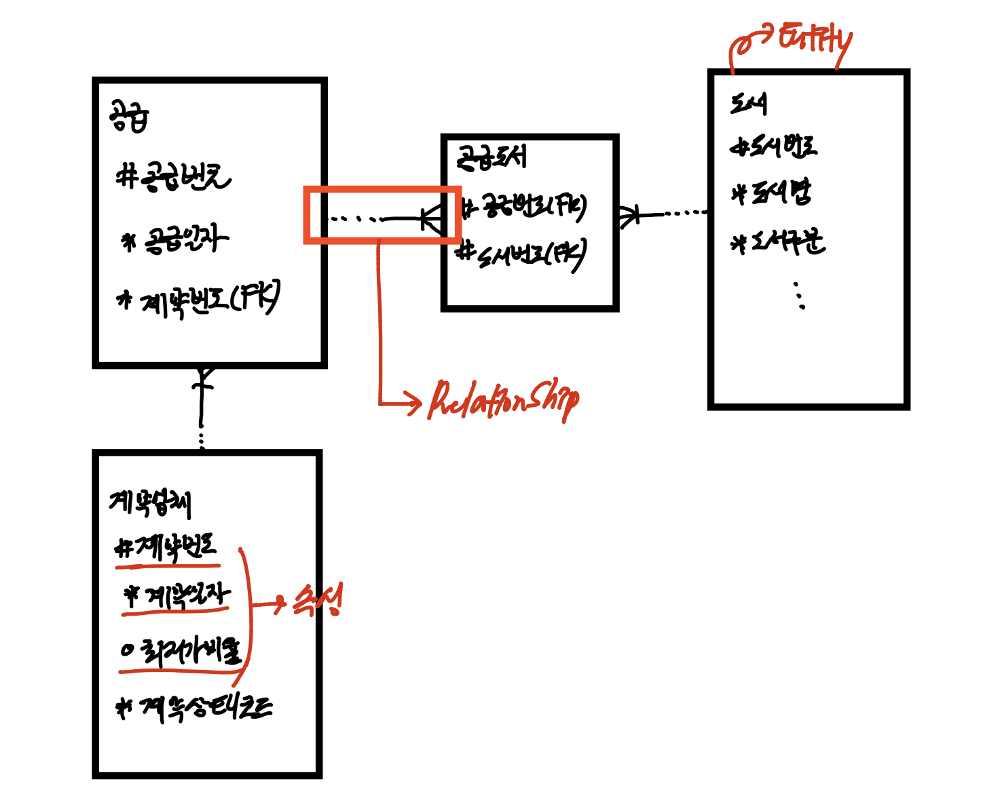
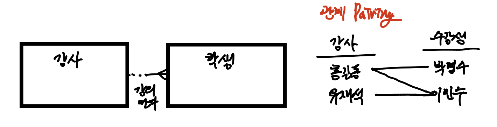
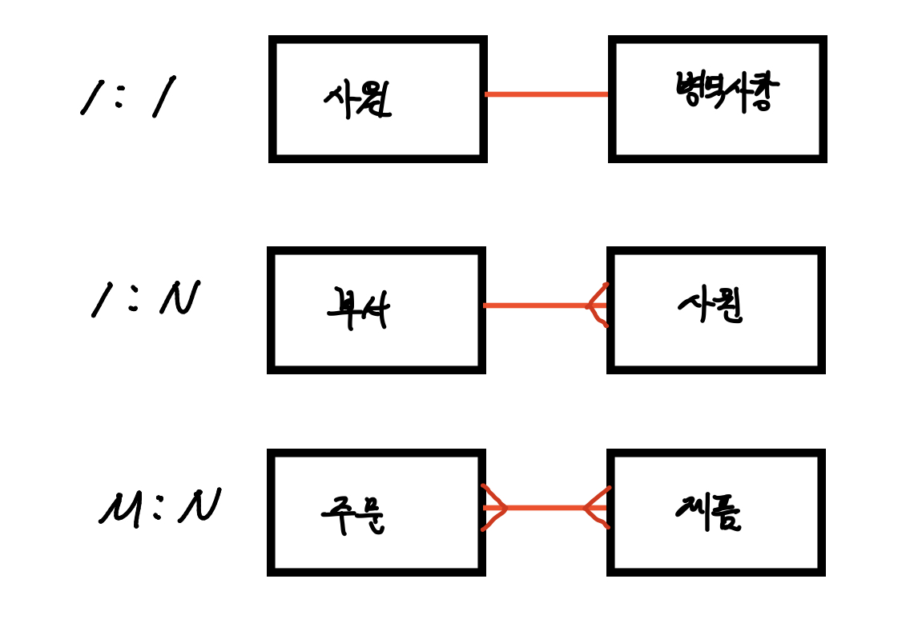

> 이번 포스팅에선, 관계에 대해서 알아보겠습니다.
>
> 데이터 모델의 3대 요쇼, Things, Attributes, Relationships 중 Relationships
>
> 이 글은 '이경오의 SQL + SQLD 비밀노트'를 정리한 내용입니다.
>
> 관계의 표기법과 관계를 이루는 3대요소(관계명, 관계차수, 선택사양)을 집중적으로 봐주세요.
>
> 추가적으로, ERD를 표시하는 여러 모형이 있습니다. 해당 모형에 대해선 차후 포스팅을 하도록 하겠습니다.
>
> **혹시 틀린 내용이 있다면, 지적해주시면 감사드리겠습니다.

# 관계(Relationship)

### 관계의 정의

* 엔티티끼리 상호 연관성이 있는 상태
* 엔티티 간 논리적인 연관성
* 관계는 존재에 의한 관계와 행위에 의한 관계가 있다.
  * 존재에 의한 관계 : 부서 - 사원
  * 행위에 의한 관계 : 고객 - 주문

### 관계의 페어링

* 엔티티 내의 인스턴스가 개별적으로 관계가지는 것을 '관계의 페어링'이라고 함

* 페어링의 집합이 관계

  

### 관계의 표기법

* 관계의 표기시에는 3가지를 명확하게 해야한다.(관계명, 관계차수, 선택사양)

**관계명(Membership)** : 관계의 이름

**관계차수(Cardinality)**

* 2개의 엔티티 간에 관계 참여자 수, 1:1, 1:N, M:N

  

**선택사양(Optionality)**

* 필수참여관계, 선택참여관계

  ex) 고객은 주문을 안해도 존재할 수 있음, 반대로 주문은 고객이 존재해야만 존재가능

* 필수참여관계
* 선택참여관계

### 관계정의 시 체크 사항

* 엔티티 간의 관계를 정의할 때는 아래의 사항을 만족하는지 확인해야한다.

1. 2개의 엔티티 사이에 *<u>관심 있는 연관 규칙이 존재</u>*하는가?
2. 2개의 엔티티 사이에 *<u>정보의 조합이 발생</u>*되는가?
3. 업무기술서, 장표에 관계연결에 대한 규칙이 서술되어 있는가?
4. 업무기술서, 장표에 관계연결을 가능하게 하는 *<u>동사(Verb)</u>*가 있는가.
   * 명사(Noun) -> 엔티티였음을 기억하자.

### 관계 읽기

* 아래와 같은 고객/주문 엔티티가 존재한다.

  

* 해당 ERD의 주문한다라는 관계를 읽는 방법은 아래와 같다.

  | 각각의 혹은 하나의 | 기준 엔티티 | 관계 차수 | 대상 엔티티 | 필수/선택 | 관계명   |
  | ------------------ | ----------- | --------- | ----------- | --------- | -------- |
  | 각각의             | 고객은      | 여러 개의 | 주문을      | 때때로    | 주문한다 |
  | 하나의             | 주문은      | 한 명의   | 고객을      | 반드시    | 가진다   |

### Reference

* 이경오의 SQL+SQLD 비밀노트 - 이경오 저