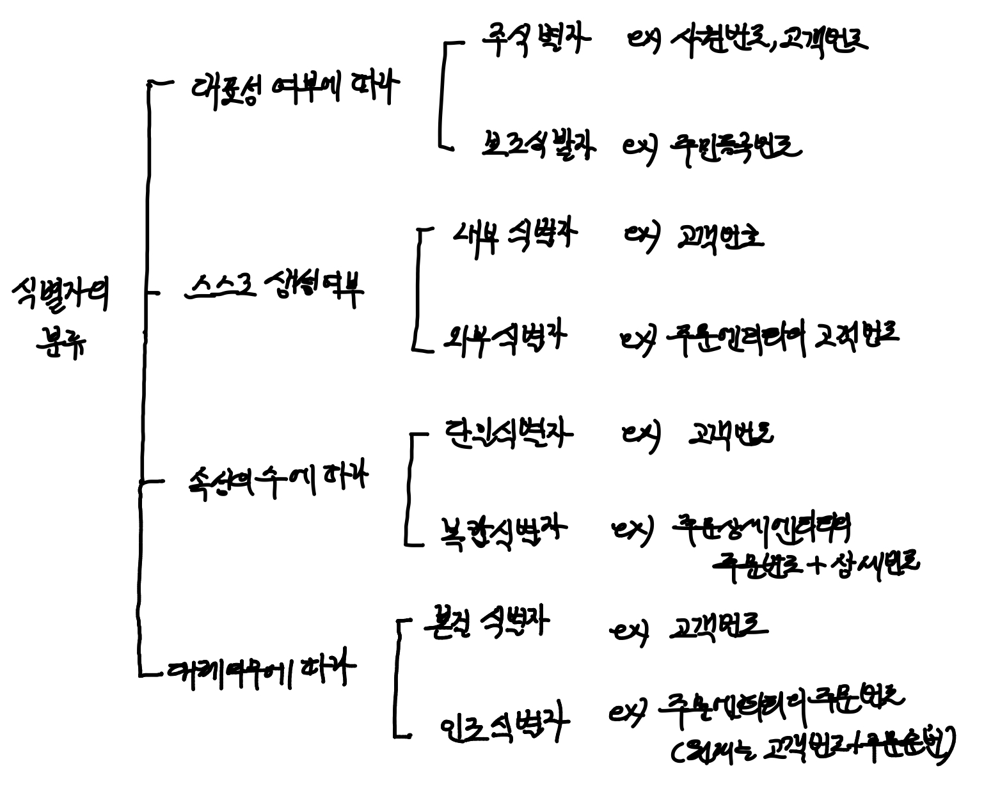

> 이번 포스팅에선, 엔티티 속 각각의 인스턴스를 식별할 수 있는 '논리적인 이름'인, 식별자에 대해서 알아보겠습니다.
>
> 이 글은 '이경오의 SQL + SQLD 비밀노트'를 정리한 내용입니다.
>
> 식별자란 무엇인지, 그 특징과 분류에 대해서 알아봅시다.
>
> 더해서, 식별자 관계, 비식별자 관계 개념을 알기위한 선행지식임을 인지한채로 공부합시다.

# 식별자

### 식별자의 개념

* 엔티티의 각 인스턴스를 개별적으로 식별하기 위해 사용되는 하나의 속성 혹은 속성의 조합

* 엔티티에는 여러개의 인스턴스가 있다. 따라서 이들 중 하나를 구별해 낼 수 있는 '논리적인 이름'이 필요하고, 이 구분자가 바로 식별자(Identifier)이다.

  ex) 고객 - 고객번호, 사원 - 사원번호, 주문 - 주문번호, 상품 - 상품번호

### 식별자의 특징

**유일성**

* 엔티티 내에 존재하는 각각의 인스턴스 집합은 주식별자에 의해 유일하게 구분되어야 한다.

  ex) 사원 엔티티의 사원번호 속성은 주식별자이다. 사원번호는 모든 직원들에 대해 개인별로 고유하게 부여된다.

**최소성**

* 유일성이 만족한다면 주식별자를 구성하는 속성의 수는 최소한의 수로 이루어져야 한다.

  ex) 사원번호만으로도 고유한 구조인데, 사원분류코드+사원번호 조합으로 식별자가 구성될 경우 부적절한 주식별자 구조이다.

**불변성**

* 엔티티 내 특정 인스턴스에 주식별자가 한번 정해지면 그 값은 변하지 말아야 한다.

  ex) 한번 정해진 사원번호 값은 다른 값으로 변경되지 말아야 한다.

  ex) 한번 부여된 주민등록번호는 바뀌지 않는다.

**존재성**

* 주식별자가 지정되면 반드시 데이터 값이 존재해야한다.(NOT NULL)

* 주식별자로 정해진 속성은 반드시 데이터 값이 존재해야한다. 주식별자는 NULL을 허용하지 않는다.(NOT NULL)

  ex) 사원번호가 없는 회사 직원은 있을 수 없다. 	

### 식별자의 분류

#### 대표성 여부에 따라

**주식별자**

* 엔티티 내에서 각각의 행을 구분할 수 있는 구분자

* 다른 엔터티와의 참조관계를 가질 때 연결할 수 있는 식별자

  ex) 사원번호, 고객번호

**보조식별자**

* 엔터티 내에서 각각의 행을 구분할 수 있음

* 하지만 *<u>주식별자가 아니라 대표성을 가지지는 못함</u>* -> 다른 엔터티와 참조관계를 가질 때 연결할 수 없음

  ex) 주민등록번호(사원의 엔티티 내에서 주민등록번호는 대표성을 가지지 못함)

#### 스스로 생성 여부에 따라

**내부 식별자**

* 엔티티 내부에서 스스로 만들어지는 식별자 

  ex) 고객번호

**외부 식별자**

* 다른 엔티티와의 관계를 통해 다른 엔티티로부터 받아오는 식별자

  ex) 주문 엔티티의 고객번호

#### 속성의 수에 따라

**단일 식별자**

* 하나의 속성으로 구성된 식별자

  ex) 고객 엔티티의 고객번호

**복합 식별자**

* 둘 이상의 속성으루 구성된 식별자

  ex) 주문상세 엔티티의 주문번호+상세순번

#### 대체 여부에 따라

**본질 식별자** 

* 비즈니스에 의해 만들어지는 식별자

  ex) 고객번호

**인조 식별자**

* 비즈니스적으로 만들어지지는 않았지만, 본질 식별자가 복합한 구성을 가지고 있어서 인위적으로 만든 식별자

  ex) 주문엔티티의 주문번호(원래는 고객번호 + 주문순번)

### 식별자 도출 기준

* 비즈니스에서 자주 이용되는 속성을 주식별자로 지정한다.

* *<u>명칭, 장소와 같이 이름으로 기술되는 속성은 가능하면 주식별자로 하지 않는다.</u>*

* 주식별자를 복합식별자로 할 경우, 지나치게 많은 속성이 포함되지 않도록 한다.

  => WHERE 절로 조회시, 너무 많은 AND구문이 나옴. -> 인조식별자 추가해서 구분하자

### Reference

* 이경오의 SQL+SQLD 비밀노트 - 이경오 저
* SQL 자격검정 실전문제 - 한국데이터산업진흥원
