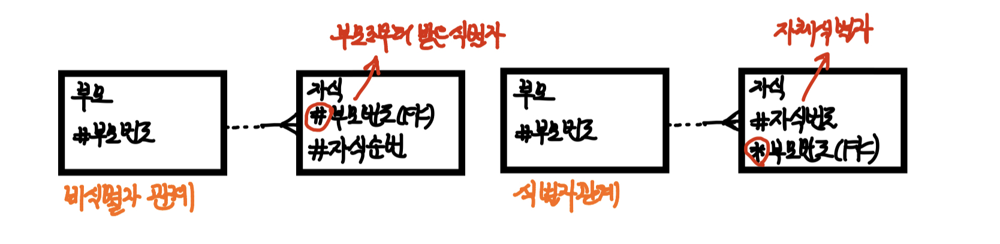
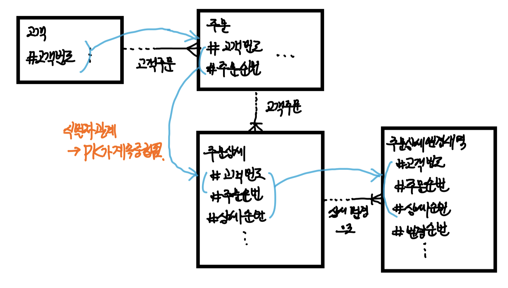
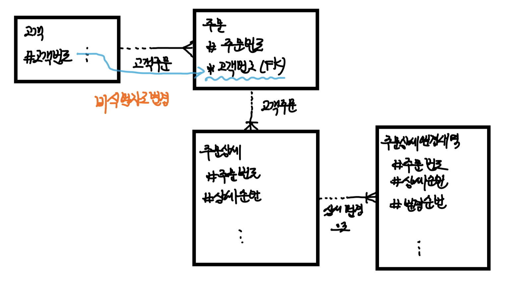
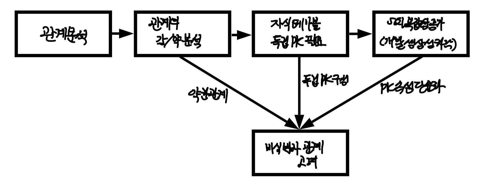

> 이번 포스팅에선, 식별자에 이어 식별자 관계와 비식별자 관계에 대해서 정리해보도록 하겠습니다.
>
> 데이터 모델링 시, 하나의 엔티티의 식별자를 그 자체의 식별자로 둘지, 아니면 부모 엔티티에서 받아온 비식별자로 둘지는 설계의 영역입니다.
>
> 따라서, 기준과 상황에 따른 판단이 중요합니다.
>
> 몇 가지 예들과 기준을 공부해보도록 하겠습니다.
>
> 물론, 실무에서 연습이 많이 필요합니다.

# 식별자관계와 비식별자 관계

### 식별자 관계와 비식별자 관계의 결정

* 외부식별자는 자기 자신의 엔티티에서 필요한 속성이 아니라 다른 엔티티와의 관계를 통해 자식쪽 엔티티에 생성되는 속성을 말한다. DB 생성 시에 외래키(FK) 역할을 한다.
* 자식 엔티티에서 부모 엔티티로부터 받은 외부식별자를 주식별자로 이용할지 여부를 결정해야함
  * 외부식별자를 주식별자로 이용 => **식별자 관계**
  * 외부식별자를 물려받았지만 일반적인 속성으로 사용하는 경우 => **비식별자 관계**
  * 업무 특징, 자식 엔티티의 주식별자 구성, SQL 작성 전략에 의해 결정

* 식별자 관계의 경우, 반드시 부모 엔티티가 생성되어야 자식 엔티티가 생성된다.
  * 주식별자는 NULL값을 허용하지 않기 때문에
* 비식별자 관계의 경우, 부모 없는 자식이 생성될 수 있다.(FK가 필수가 아니기 때문에)

  

* 식별자 관계를 비식별자 관계로 변환한 모습 - 엔티티 통합

  

### 식별자 관계로만 설정할 경우의 문제점

* 위의 그림은 식별자 관계로만 각각의 엔티티 간의 관계를 정의한 데이터 모델이다.

* 엔티티간의 관계가 추가될 때마다 PK 속성의 수가 지속적으로 증가하게 된다.

  => SQL 개발 시, 필연적으로 테이블 간의 조인을 하게 되며, 조인에 참여하는 식별자 속성의 개수가 많은 경우 *<u>SQL 복잡도가 올라</u>*가면서 *<u>조인 조건을 누락하는 실수가</u>* 발견되기도 한다.

* 아래와 같이 고객/주문 관계를 비식별자 관계로 설정하면, SQL 작성시 복잡성, 오류 가능성을 낮출 수 있다.

  

### 식별자 관계 VS 비식별자 관계

> 앞서 언급했듯이 데이터 모델링 작업에서 식별자 관계와 비식별자 관계를 취사 선택하여 연결하는 것은 높은 수준의 내공을 필요로 하는 데이터 모델링 기술이다.
>
> 방법론적인 접근이 있다.
>
> 모든 관계를 식별자 관계로 연결하고, 아래 조건에 해당할 경우 비식별자 관계로 조정하는 것이다.

* 비식별자 관계/식별자 관계 연결 고려사항

  | 항목               | 식별자 관계                                                  | 비식별자 관계                                                |
  | ------------------ | ------------------------------------------------------------ | ------------------------------------------------------------ |
  | 목적               | 강한 연결관계를 표현                                         | 약한 연결관계를 표현                                         |
  | 자식 주식별자 영향 | 부모 엔티티의 주식별자가 자식 엔티티의 주식별자 구성에 포함된 | 부모 엔티티의 주식별자가 자식 엔티티의 일반 속성에 포함됨 (그냥 FK로만 존재) |
  | 표기법             | 실선 표현                                                    | 점선 표현                                                    |
  | 연결 고려사항      | - 반드시 부모 엔티티에 종속 (부모 엔티팅없으면 자식엔티티 생성X) - 자식 주식별자구성에 부모 주식별자포함 필요 - 상속받은 주식별자속성을 타엔티티에 이전이 필요할 경우 사용 | - 부모/자식 간 약한 종속 관계에서 사용 - 자식 주식별자구성을 독립적으로 구성한다. - 부모 엔티티로부터 상속받은 주식별자 속성을 타 엔티티에게 이전하지 않도록 차단이 필요한 경우 사용 - 부모쪽의 관계참여가 선택관계 (부모가 없이도 자식이 독립적으로 생성될 수 있음) |

### Reference

* 이경오의 SQL+SQLD 비밀노트 - 이경오 저

* SQL 자격검정 실전문제 - 한국데이터산업진흥원
