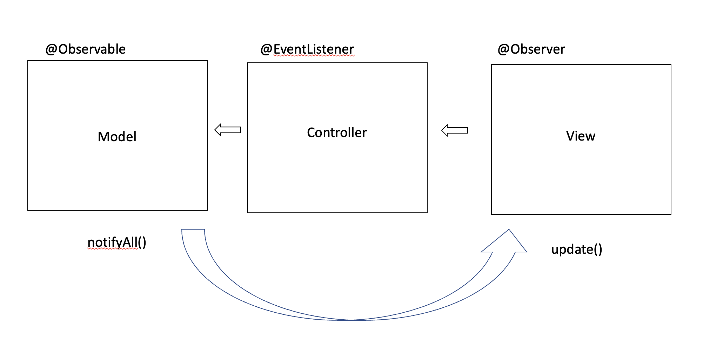

<br>

<br>

---

<br>

<br>

# 옵저버 패턴이란?

<br>

<br>

옵저버 패턴(Observer Pattern)은 주체가 어떤 객체(subject)의 상태 변화를 관찰 하다가 상태 변화가 있을 때마다 메서드 등을 통해 옵저버 목록에 있는 옵저버들에게 변화를 알려주는 디자인 패턴이다.

스타크래프트의 옵저버랑 비슷하다..!

case1 : 객체와 주체가 분리되어 있는 옵저버 패턴

주체란 객체의 상태 변화를 보고 있는 관찰자 이며 

옵저버란 이 객체의 상태 변화에 따라 전달되는 메서드 등을 기반으로 '추가 변화 사항'이 생기는 객체들을 의미한다.

case2: 객체와 주체가 분리안된 옵저버 패턴

주체와 객체를 따로 두지 않고 상태가 변경되는 객체를 기반으로 구축하기도 한다.

옵저버의 예로는 트위터나 인스타그램이 있다.

ex ) 내가 어떤 사람 주체를 팔로우 했다면 주체가 포스팅을 올리게 되면 알림이 팔로워한테 가야한다.(새로운 트윗을 옵저버들에게 알려준다.)

<br>

<br>

# 옵저버 패턴 구조

<br>

<br>

 

<br>

<br>

옵저버 패턴은 주로 이벤트 기반 시스템에 사용하며 MVC(Model-View-Controller) 패턴에도 사용된다.

주체라고 할 수 있는 모델(Model)에 변경 사항이 생겨 update() 메서드로 옵저버인 뷰에 알려주고 이를 기반으로 컨트롤러(controller) 등이 작동하는 것이다. 

<br>

<br>

# 옵저버 패턴 예시 - 자바

<br>

<br>

```java
import java.util.ArrayList;
import java.util.List;

interface Subject {
    public void register(Observer obj);
    public void unregister(Observer obj);
    public void notifyObservers();
    public Object getUpdate(Observer obj);
}

interface Observer {
    public void update();
}

class Topic implements Subject {
    private List<Observer> observers;
    private String message;

    public Topic() {
        this.observers = new ArrayList<>();
        this.message = "";
    }

    @Override 
    public void register(Observer obj) {
        if(!observers.contains(obj)) observers.add(obj);
    }
    @Override
    public void unregister(Observer obj) {
        observers.remove(obj);
    }
    @Override
    public void notifyObservers() {
        this.observers.forEach(Observer::update);
    }
    @Override
    public Object getUpdate(Observer obj) {
        return this.message;
    }

    public void postMessage(String msg) {
        System.out.println("Message sended to Topic:) : " +msg);
        this.message = msg;
        notifyObservers();
    }


}

class subscriber implements Observer {
    private String name;
    private Subject topic;

    public subscriber(String name,Subject topic) {
        this.name = name ;
        this.topic = topic;
    }

    @Override
    public void update() {
        String msg = (String) topic.getUpdate(this);
        System.out.println(name + " :: gotcha news >> " + msg );
    }


}

public class ObserverPrac {

    public static void main(String[] args) {
        Topic topic = new Topic();
        Observer a = new subscriber("a",topic);
        Observer b = new subscriber("b",topic);
        Observer c = new subscriber("c",topic);
        topic.register(a);
        topic.register(b);
        topic.register(c);

        topic.postMessage("무야호");

    }

}
```

<br>

<br>

topic은 주체이자 객체이다. class Topic implements Subject를 통해 Subject interface를 구현했고, Observer a = new subscriber("a",topic); 을 이용하여 옵저버를 선언할 때, 이름과 어떠한 주체(객체)의 옵저버가 될 것인지 정했다.

<br>

<br>

<sub>출처 : 면접을 위한 CS 전공지식 노트</sub>
