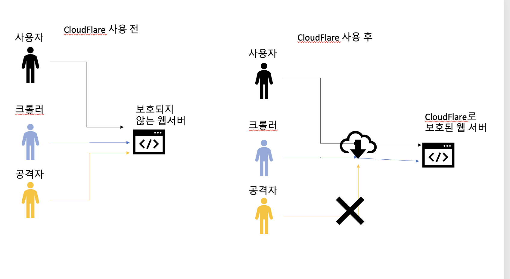
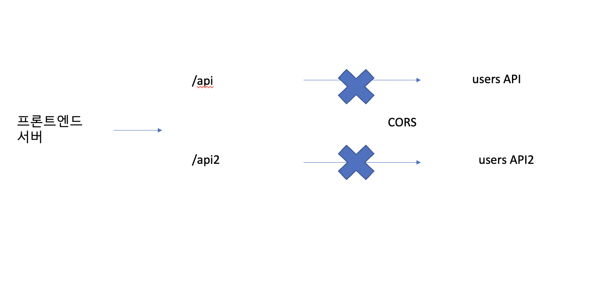
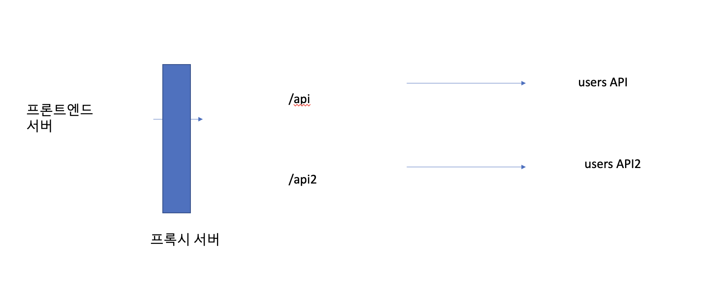

 

 

---

 

 

# 프록시 객체란

 

 

프록시(proxy) 객체는 어떠한 대상의 기본적인 동작(속성 접근, 할당, 순회, 열거, 함수 호출 등)의 작업을 가로챌 수 있는 객체를 뜻한다. 

 

 

# 프록시 패턴이란

 

 

프록시 패턴(proxy pattern)은 대상 객체(subject)에 접근하기 전 그 접근에 대한 흐름을 가로채 대상 객체 앞단의 인터페이스 역할을 하는 디자인 패턴

이를 통해 객체의 속성, 변화 등을 보완하며 보안, 데이터 검증, 캐싱, 로깅에 사용한다.

이는 앞서 설명한 프록시 객체로 쓰이기도 하지만, 프록시 서버로도 활용된다.

 프록시 서버에서의 캐싱 

캐시 안에 정보를 담아두고, 캐시 안에 있는 정보를 요구하는 요청에 대해 다시 저 멀리 원격 서버에 요청하지 않고 캐시 안에 있는 데이터를 활용하는 것을 말한다. 이를 통해 불필요하게 외부와 연결하지 않기 때문에 트래픽을 줄일 수 있다.

 
 

# 프록시 서버란

 

 

프록시 서버(proxy server)는 서버와 클라이언트 사이에 클라이언트가 자신을 통해 다른 네트워크 서비스를 간접적으로 접속할 수 있게 해주는 컴퓨터 시스템이나 응용 프로그램을 가르킨다.

 

 

# 프록시 서버 - CloudFlare

 

 

CloudFlare는 전 세계적으로 분산된 서버가 있고 이를 통해 어떠한 시스템의 콘텐츠 전달을 빠르게 할 수 있는 CDN 서비스다.

CDN 말고도 DDos 공격 방어, HTTPS 구축등의 장점이 있다. 이 모든 것은 웹 서버 앞단에 '프록시 서버'를 사용하기 때문이다.

CDN : Content Delivery Network, 각 사용자가 인터넷에 접속하는 곳과 가까운 곳에서 콘텐츠를 캐싱 또는 배포하는 서버 네트워크를 말한다. 이를 통해 사용자가 웹 서버로부터 콘텐츠를 다운로드하는 시간을 줄일 수 있다.

 

 

 

 

 
위의 그림처럼 사용자, 크롤러, 공격자가 자신의 웹 사이트에 접속하게 될 때, CloudFlare를

통해 공격자로부터 보호 가능.

 

 

## DDOS 공격 방어

 

 

DDos는 짧은 기간 동안 네트워크에 많은 요청을 보내 네트워크를 마비시켜 웹 사이트의 가용성을 방해하는 사이버 공격 유형이다. CloudFlare는 의심스러운 트래픽, 특히 사용자가 접속하는 것이 아닌 시스템을 통해 오는 트래픽을 자동으로 차단해서 DDOS 공격으로 부터 보호한다. CloudFlare의 거대한 네트워크 용량과 캐싱 전략으로 소규모 DDOS 공격은 쉽게 막아 낼 수 있으며 이러한 공격에 대한 방화벽 대시보드도 제공함.

 

 

## HTTPS 구축

 

 

서버에서 HTTPS를 구축 할 때 인증서를 기반으로 구축할 수도 있다. 하지만 CloudFlare를 사용하면 별도의 인증서 설치 없이 좀 더 손쉽게 HTTPS를 구축할 수 있다.

 

 

# CORS와 프론트엔드의 프록시 서버

 

 

CORS(Cross-Origin Resource Sharing)는 서버가 웹 브라우저에서 리소스를 로드할 때 다른 오리진을 통해 로드하지 못하게 하는 HTTP 헤더 기반 메커니즘이다.

 오리진 : 프로토콜과 호스트 이름, 포트의 조합을 뜻함. https://myblog.com:4040/hi 라는 주소에서 오리진은 https://myblog.com:4040을 뜻한다.

 

 

 

 

 

프론트엔드 개발 시 프론트엔드 서버를 만들어서 백엔드 서버와 통신할 때 주로 CORS 에러를 마주치는데, 이를 해결하기 위해 프론트엔드에서 프록시 서버를 만들기도 한다.

예를 들어 프론트엔드 테스팅 서버는 127.0.0.1:3000 이라면, 백엔드 서버는 127.0.0.1:12010이라면 포트 번호가 다르기 때문에 CORS 에러가 나타난다. 이 때 프록시 서버를 둬서 프론트엔드 서버에서 요청되는 오리진을 127.0.0.1:12020으로 바꾸는 것이다.

127.0.0.1은 루프백 IP, 본인 PC의 IP를 뜻한다. localhost나 127.0.0.1을 입력하면 DNS를 타지 않고 바로 본인 PC로 연결된다.

 

 

 

 

 

위처럼 프론트엔드 서버 앞단에 프록시 서버를 놓아 /api 요청은 usersAPI, /api2 요청은 users API2에 요청할 수 있다. 자연스레 CORS 해결도 하며, API 서버와 통신도 매끄럽게 할 수 있는 것.

API : Application programming Interface, 프로그램들이 서로 상호작용할 수 있도록 하는 매개체

---

 

 

출처:면접을 위한 CS 전공지식 노트
